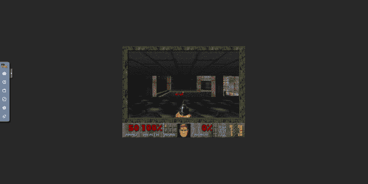

# 生活在 Kairos 项目的(不可改变的)边缘

> 原文：<https://thenewstack.io/livin-kubernetes-on-the-immutable-edge-with-kairos-project/>

如果你到了一定的年龄，你会非常熟悉史密斯飞船 1993 年的热门歌曲“生活在边缘”。它的口号很简单:生活在边缘，你根本无法控制自己。

嗯，如今，当我们谈论生活在边缘时，我们谈论的是 Kubernetes——我们从未有过更多的技术可以帮助我们自己。

研究显示[，边缘是目前围绕 Kubernetes 的热门话题。大大小小的公司都在推动 Kubernetes 的采用到最后一英里(是的，甚至可能是上图中史密斯飞船视频中的火车头)，并用](https://thenewstack.io/new-research-shows-the-future-is-bright-for-edge-kubernetes/)[裸机](https://thenewstack.io/defining-the-modern-bare-metal-cloud/)取代典型的虚拟机(VM)基础设施。

大量发行版涌现出来，以满足在边缘管理容器化裸机 Kubernetes 的需求，包括像 [FlatCar Linux](https://flatcar-linux.org/) 和 [Talos](https://www.talos.dev/) 这样的项目，所有这些都旨在通过“原子”升级为边缘提供轻量级的、“不可变的”操作系统。但是这有什么关系呢？

## 不变性是超越配置管理的下一步

不可变操作系统是一个精心设计的系统，它以受限的、无权限的模式启动，其中系统的某些路径是不可写的。

例如，安装后，不可能在系统中安装额外的软件包，并且任何配置更改都会在重新启动后被丢弃。这减少了恶意攻击者的活动范围，这在边缘是至关重要的，在那里设备可能[物理上可用于篡改](https://www.spectrocloud.com/blog/lets-address-the-elephant-at-the-edge-security/)。同时，它确保每个节点运行特定版本的软件堆栈，从而降低基础架构漂移的风险。

这种方法完全是关于规模的。在云原生之前的日子里，我们的每台服务器都是一片雪花或“宠物”，在第一次安装操作系统的基础上，通过补丁、更新和配置更改保持运行，使每台服务器成为一个独特依赖关系的结。像 Ansible、Salt 和 [Puppet](https://puppet.com/?utm_content=inline-mention) 这样的工具经常被用来处理系统的每个微小细节，并尽可能地减少[基础设施漂移](https://thenewstack.io/how-drift-detection-and-iac-help-maintain-a-secure-infrastructure/)。

相反,“牛”方法是将节点视为可互换的系统。如果系统出现问题，我们不是在生产中调试它或“实时”采取纠正措施，而是删除故障节点，并创建一个新的相同节点来替换它。这就是[不可变的](https://thenewstack.io/3-immutable-operating-systems-bottlerocket-flatcar-and-talos-linux/)操作系统真正得到回报的地方，因为当你知道操作系统自构建以来没有被修改过，你就知道替换的将是一个精确的克隆，并且工作负载的行为将是可预测的。不变性使得配置管理在中央目录之外几乎过时。

在不可变的基础架构中升级系统是通过使用新版本的操作系统创建新的映像，并使用您选择的升级策略将其推送到您的节点来完成的，蓝/绿部署变得很容易，因为它们是“原子”的，并且没有小的软件包和漂移需要处理和维护。

拥有一个不可变的操作系统并不一定意味着拥有一个管理平台——当它涉及到云原生世界中的边缘规模时，我们希望在 Kubernetes 中管理我们的节点，相反，我们应该像对待应用程序一样自由地对待节点——只是简单的容器，我们根据我们定义的策略发布和滚动升级到这些容器。

这将是一个强大的组合，允许我们利用容器生态系统工具来解决现实世界中的问题，如自动安全扫描，使用管道有选择地升级节点，以及使用 Kubernetes 的完全托管节点。

## 不变性:一次一个分布

这就是[凯罗斯](https://kairos.io/)的用武之地。Kairos 是一个新的开源项目，旨在解决不变性和原子升级的需求。在这个意义上，它就像我们上面讨论的 Talos、FlatCar 和 K3OS。

但是有非常重要的区别:Kairos 是发行版不可知的，基于 **(** OCI)和[云初始化](https://cloud-init.io/)的开放容器倡议。让我们看看这意味着什么

不可知发行版:与 K3OS 不同，Kairos 不是 Linux 发行版。这是一个元 Linux 发行版，这意味着它使您能够用自己选择的 Linux 发行版构建一个不可变的 Kubernetes 集群。Kairos 的设计与发行版无关，支持将现有发行版从容器映像转换为“基于 Kairos”的发行版。这些自动继承的特点，如 A/B 原子升级，不变性，活分层和所有的 Kairos 功能集。重要的是，内核和 [initramfs](https://wiki.ubuntu.com/Initramfs) 是静态的，并且与映像一起提供，这实际上意味着对整个系统栈的原子升级。

在撰写本文时，Kairos 的版本是 1.3，支持基于 openSUSE、Alpine 和 Ubuntu 的发行版，这些发行版可以直接从发布的资产中下载，并将在下面的示例中使用。

**OCI:**OCI 意味着凯罗斯使用容器图像。操作系统本身只是一个单独的映像容器，在主机上本地运行，没有任何容器引擎，它被 overlayFS 覆盖在引导系统中。升级是通过 A/B 模式和自动回退自动处理的。

因为 Kairos 只是一个 OCI 映像，你可以在 quay 存储库中找到容器映像，它可以用来将[iso](https://en.wikipedia.org/wiki/Optical_disc_image)刻录到 u 盘或其他介质。ISOs 和部分版本一样可用，所以我们不必担心，我们可以在发布的资产中选择我们喜欢的发行版。

**Cloud-init first:**Kairos 的唯一配置机制是通过 Cloud-init 执行的。作为事实的单一来源，它用于配置集群中的一个或所有节点。这是为了大规模增强用户维护和配置，减少管理节点所需的复杂配置基础架构的影响。

管理可以选择交给特定的 Kubernetes 组件，这些组件在引导之后管理节点的生命周期。

## 与凯罗斯一起动手

让我们仔细看看 Kairos，并使用它来部署带有 MetalLB 的 K3s 集群。在下面的示例中，我将使用裸机主机在我的本地网络中为 Kairos 节点配置 K3s，并部署 [Kubedoom](https://github.com/storax/kubedoom) ，但类似地，您也可以通过使用不同的图表、清单和设置遵循[官方快速入门](https://kairos.io/docs/getting-started/)来为节点配置 VM。

### 步骤 1:下载一个版本，并将其闪存到 u 盘中

由于 Kairos 有不同的风格，我们可以在我们选择的基础发行版和 K3s 版本之间进行选择。Kairos 在一个单独的存储库中发布包含 K3s 的工件，包括[发布工件](https://github.com/kairos-io/provider-kairos/releases)。这是因为在运行时可以安装额外的扩展。但是在这种情况下，我们需要 K3s，所以我们只使用内部带有 K3s 的图像。我们将需要一个. ISO 文件，因为我们将在裸机启动的情况下将其闪存到 u 盘；否则，我们只需在虚拟机管理程序设置中加载它。

在本文中，我们将使用 openSUSE 映像，并且我们将选择最新的 K3s 可用版本。Kairos 最近增加了对 Ubuntu 和 Fedora 的支持，其他发行版也可以使用，但 openSUSE 版本经过了很好的测试，从早期版本开始就可以使用。

我们现在将使用一台机器将图像闪存到 u 盘:

```
```
wget https://github.com/kairos-io/provider-kairos/releases/download/v1.3.0/kairos-opensuse-v1.3.0-k3sv1.23.14+k3s1.iso
```

```

并将其闪存到 USB 驱动器(在我的例子中是 */dev/sda* ):

```
```
dd if=kairos-opensuse-v1.3.0-k3sv1.23.14+k3s1.iso of=/dev/sda oflag=sync status=progress
```

```

### 步骤 2:安装并引导节点

现在我们可以使用 u 盘作为 Kairos 安装程序。如果它是一个虚拟机，我们可以只加载 ISO。

一个 Kairos 节点需要一个配置，在本文中我们将安装 MetalLB 和 [Kubedoom](https://github.com/storax/kubedoom) ，因此它看起来将类似于[https://gist . github . com/mud ler/bde 499 f 156513 bbfe 2030587295 adfca](https://gist.github.com/mudler/bde499f156513bbfe2030587295adfca):

```
#cloud-config

hostname:  kubedoom-{{  trunc  4  .MachineID  }}
users:
-  name:  kairos
  # Change to your pass here
  passwd:  kairos
  ssh_authorized_keys:
  # Add your github user here!
  -  github:mudler

k3s:
  enabled:  true
  args:
  -  --disable=traefik,servicelb

# Additional manifests that are applied by k3s on boot
write_files:
-  path:  /var/lib/rancher/k3s/server/manifests/metallb.yaml
  permissions:  "0644"
  content:  |
        apiVersion:  v1
        kind:  Namespace
        metadata:
          name:  metallb-system
        ---
        apiVersion:  helm.cattle.io/v1
        kind:  HelmChart
        metadata:
          name:  metallb
          namespace:  metallb-system
        spec:
          chart:  https://github.com/metallb/metallb/releases/download/metallb-chart-0.13.7/metallb-0.13.7.tgz
-  path:  /var/lib/rancher/k3s/server/manifests/kubedoom.yaml
  permissions:  "0644"
  content:  |
        apiVersion:  v1
        kind:  Namespace
        metadata:
          name:  kubedoom
        ---
        apiVersion:  helm.cattle.io/v1
        kind:  HelmChart
        metadata:
          name:  kubedoom
          namespace:  kubedoom
        spec:
          chart:  https://github.com/spectrocloud-labs/kubedoom-chart/releases/download/kubedoom-helmchart-0.0.1/kubedoom-helmchart-0.0.1.tgz
          set:
            kubedoom_namespace:  "kube-system"
-  path:  /var/lib/rancher/k3s/server/manifests/addresspool.yaml
  permissions:  "0644"
  content:  |
        apiVersion:  metallb.io/v1beta1
        kind:  IPAddressPool
        metadata:
          name:  default
          namespace:  metallb-system
        spec:
          addresses:
          -  192.168.1.10-192.168.1.20
        ---
        apiVersion:  metallb.io/v1beta1
        kind:  L2Advertisement
        metadata:
          name:  default
          namespace:  metallb-system
        spec:
          ipAddressPools:
          -  default

```

**注:**

*   我们禁用了 Traefik 和 K3s 附带的默认负载平衡器，转而使用 MetalLB。一个`IPAddressPool`被配置为使用 IPs，一个`L2Advertisement`与之相关联。
*   确保将`IPAddressPool`中的`192.168.1.10-192.168.1.20`替换为网络中可用的 IP 范围。该服务将自动获取该范围内的一个 IP，之后我们将使用该 IP 连接到 Kubedoom。
*   将 GitHub 用户名(`github:mudler`)替换为您的用户名，以便使用您的密钥通过 SSH 自动登录(仅当您已经将您的 SSH 公共密钥上传到 GitHub 时才有效)。如果您没有，我们还将`kairos/kairos`设置为用户名和密码，这样您也可以通过密码提示登录。
*   如果在虚拟机中运行，网络接口需要连接到您的本地网络，以便正确连接到 Kubedoom。
*   [如果您需要添加任何其他设置或额外的用户逻辑，请查阅文档](https://kairos.io/docs/reference/configuration/)了解配置文件中可用字段的更多信息。

让我们现在启动 ISO 并从控制台选择手动模式。因为我们是通过 LAN 运行的，所以我们将通过 SSH 连接到该节点并手动运行安装。然而，默认情况下，Kairos 将启动并显示一个 QR 码，可以使用 CLI 来驱动安装过程，而不必远程 SSH。如果您想使用二维码，请查看[官方快速入门。](https://kairos.io/docs/getting-started/)

一旦节点启动，我们可以使用`kairos`用户 SSH 到它，并且我们可以使用`kairos`密码登录。让我们成为根用户并运行安装:

```
```
scp config.yaml kairos@<IP>:./
ssh kairos@<IP>
sudo kairos-agent manual-install  --reboot  --device auto config.yaml
```

```

### 步骤 3:登录并检查您是否可以运行您的工作负载

安装结束后，节点将重新启动。第一次引导可能需要一些时间来脱离集群，但最终我们应该能够通过 SSH 和 kairos/kairos 登录，也可以通过控制台登录:

请注意，节点完全启动后，用户配置可能需要一段时间才能生效。

我们现在可以检查 K3s 是否正在运行，节点是否准备好服务工作负载:

```
```
sudo systemctl status k3s
sudo k3s kubectl get nodes  -A
```

```

我们还可以检查该服务是否正在运行，以及是否使用 MetalLB:
为其分配了 IP

```
```
testcluster-3646:~  # kubectl get svc -o wide -n kubedoom
NAME TYPE CLUSTER-IP EXTERNAL-IP PORT(S) AGE SELECTOR
kubedoom-kubedoom-helmchart-kubedoom ClusterIP 10.43.152.192 <none> 5900/TCP 68m app=kubedoom
kubedoom-kubedoom-helmchart-novnc LoadBalancer 10.43.46.202  192.168.1.10 6080:30966/TCP 68m app=novnc
```

```

在我的情况下，从该范围获取的 IP 是 192.168.1.10，我现在可以从 http://192 . 168 . 1 . 10:6080/VNC . html 访问 NoVNC web UI。你将被显示到 NoVNC 仪表板，它将要求输入密码以通过 Kubedoom 实例进行连接(默认密码是“*id looke”*)，然后*瞧，*我们的末日游戏就在



Kubedoom 的作弊代码和说明可在[这里](https://github.com/storax/kubedoom#attaching-a-vnc-client)获得。🙂

要升级节点并在安装后对其进行管理，我们可以手动[或使用](https://kairos.io/docs/upgrade/manual/) [Kubernetes](https://kairos.io/docs/upgrade/kubernetes/) 来完成。所有细节都在 Kairos 文档中。

## 结论:我们在边缘生活需要什么

从云的简单抽象，我们正在过渡到边缘裸机的有形硬现实。没有人能够假装知道每个边缘场景的需求，因此理想的操作系统需要足够灵活，能够考虑到对堆栈的任何定制，并使更改和升级变得容易，就像我们在 Kubernetes 上部署应用程序时一样自信。这一点至关重要，因为它有助于在向边缘供应节点时可能出现的各种使用情形中使用同一框架进行横向扩展。

当谈到在群集上安装什么操作系统时，我们必须考虑节点将如何升级，现有的备用系统是什么，以及我们是否能够以熟悉的方式处理自动化。在云原生时代，这意味着在 Kubernetes 中管理 Kubernetes！

这就是不可变操作系统越来越受欢迎的原因——它们非常适合运行 Kubernetes 工作负载，因为它们是静态操作系统，可以(通常)自动运行和升级。

在本文中，我们分析了使不变性对采用者来说很重要的方面，尤其是不可变基础设施可以在边缘带来的引人注目的属性。Kairos 以云为中心、基于容器的方法通过单一的原子升级在边缘实现了操作系统的版本控制，该升级可以滚动到集群节点，类似于使用您选择的 Linux 发行版进行应用程序升级。

当史密斯飞船演唱时，

*说说你对自己处境的看法* *复杂化、恶化* *对你来说，耶*

有了像 Kairos 这样的工具，我们的目标是用不变性的力量让*生活在边缘*不那么复杂，不那么恼人。你可以在 [kairos.io](http://kairos.io) 找到更多关于 Kairos 的信息。我们欢迎任何反馈和贡献🤗！

<svg xmlns:xlink="http://www.w3.org/1999/xlink" viewBox="0 0 68 31" version="1.1"><title>Group</title> <desc>Created with Sketch.</desc></svg>