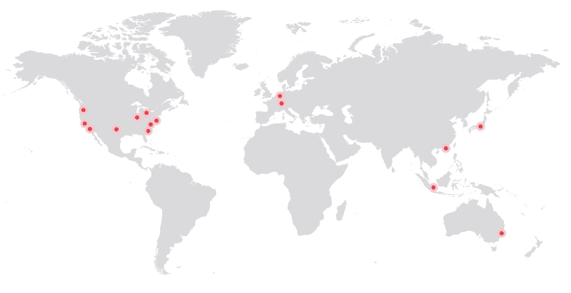

# Packet 将边缘计算服务扩展到 11 个地点，增加了一个现货市场

> 原文：<https://thenewstack.io/living-edge-packet/>

“边缘计算将成为今年的流行语”， [Packet](https://www.packet.com/) 的首席执行官[扎克·史密斯](https://www.linkedin.com/in/zsmith/)断言道。很自然，他会说，因为他的公司刚刚推出了一项新的边缘计算服务。这项服务已经扩大到 11 个新的全球地点；史密斯所说的“足球城市”——尽管巴黎、伦敦、圣保罗要到今年晚些时候才能建成。该公司现在在三大洲有 15 个分支机构。

新的 Packet [边缘计算](https://www.packet.net/edge/)位置采用单服务器，部署基于英特尔 SkyLake 处理器的" [Type 1E](https://www.packet.net/bare-metal/servers/type-1e/) "实例，以及 Packet 的基础设施自动化套件。Packet 为开发人员提供了与各种软件平台的集成。

公司正转向边缘网络，以减少向用户提供服务的延迟。虽然[内容交付网络](http://www.webopedia.com/TERM/C/CDN.html) (CDN)公司倾向于通过缓存来改善本地交付，但该技术存在局限性，特别是到达公共云(如 AWS)所需的距离，当距离以数百英里衡量时，总是会有障碍。

分析师们一致认为，边缘计算的时代已经到来。根据 Bryan Betts,[free form Dynamics](http://www.freeformdynamics.com/)的分析师的说法，这个想法已经酝酿了一段时间，但随着云计算的日益普及，它获得了新的生命——这也带来了一些问题。“云计算的整个理念——在实践中，如果不是在理论上，在很大程度上是基于虚拟机和分布式访问——仍然不足以应对任何延迟敏感的情况。在物联网等领域，这是相当多的，”他说。

因此，在公共网络边缘提供裸机服务器的包方法很有意义，Betts 说，“现在使其可行的是供应和编排工具已经足够成熟。”

## 数据包速度

Packet 正从这种增长中获利。史密斯说，需要更大带宽的公司将开始寻找可用的带宽。“首席信息官会说，我需要购买最接近我的网络用户的产品。但是接下来事情变得非常复杂:例如，当你有 200 个或 500 个位置时，会发生什么？边缘计算是解决这个问题的一种方法，”他补充道。

> 从销售给 IT 人员到销售给开发人员的转变改变了这一局面。

与推出新的分组服务相关的是引入一个新的现货市场，使公司能够使用需求驱动的定价以更低的价格购买云实例。与 AWS 的现场服务类似的[服务将为客户提供更大的灵活性。在接下来的几个月里，T4 期货市场的推出将会促进这一趋势，该市场将会提供更高的灵活性。](http://docs.aws.amazon.com/AWSEC2/latest/UserGuide/how-spot-instances-work.html)

在过去的几年里，我们已经看到提供商销售服务的方式发生了转变，从销售给 IT 人员到销售给开发人员的转变已经改变了格局，Smith 说，“过去，这是关于硬件的:但是开发人员对硬件不感兴趣，他们甚至不知道他们的 MacBooks 中使用的是什么处理器。

“我们已经看到了基础设施的演变，从开发商而不是基础设施团队购买基础设施:这是我父亲喝麦克斯韦尔和 22 岁喝单一有机酿造的浓缩咖啡之间的巨大差异，”他说。

AWS、谷歌、微软已经明确找到了向这个开发者市场销售的方法。“寻找专有锁定，以便客户最终从该提供商那里购买大量服务:开发者必须回答的问题是:‘你会把自己锁定在一个专有的封闭系统中吗？’"

史密斯说，当然，现在已经有了云的开源版本—[open stack](https://www.openstack.org/)——但是，他说，这对于云用户来说可能不是一个合适的选择。“我不相信 OpenStack，因为我不认为这是前进的方向。它建立得太晚了——接近人们需要虚拟化的末期——就在容器化出现的时候。另一个问题是供应商没有操作这些平台。难的不是启动服务器，而是运行它。”

Packet 提供的是裸机边缘计算，这意味着这个开发者市场不会被错综复杂的硬件所束缚。

Packet 的首批客户之一是 DNS 流量管理公司 [NS1](https://ns1.com/) 。创始人兼首席执行官[克里斯·比弗斯](https://www.linkedin.com/in/beevek/)解释了公司转向 packet 的原因。“虽然我们有自己的物理网络来提供 DNS，但我们使用数据包来提供 API 和统计系统。”

Packet 对 Beevers 和他的团队的吸引力在于它提供了其他公司无法比拟的速度。“主机代管提供商的动作不够快:跨提供商同步域不是一件容易的事情，但我们可以通过数据包和自动化的方式来完成这一切。他还提到全球分销网络对此次交付尤为重要。

“这将创造一个神奇的世界，”史密斯说。“我们将在全球范围内提供低延迟基础设施，这将是很少有人能够创造的东西。”

[OpenStack Foundation](https://www.openstack.org/) 和 [Packet](https://www.packet.com/) 是新堆栈的赞助商。

特征图片:照片由 Khara Woods 在 Unsplash 上拍摄。

<svg xmlns:xlink="http://www.w3.org/1999/xlink" viewBox="0 0 68 31" version="1.1"><title>Group</title> <desc>Created with Sketch.</desc></svg>