# 与 Kubernetes 一起生活:调试工作负载的 12 个命令

> 原文：<https://thenewstack.io/living-with-kubernetes-12-commands-to-debug-your-workloads/>

贾斯汀·加里森(Justin Garrison)

贾斯汀是亚马逊网络服务公司(Amazon Web Services)的高级开发人员。

在我的上一篇文章中，我向您展示了如何用八个命令来[调试 Kubernetes 集群。现在，我们需要看看当您的工作负载不像您预期的那样工作时会发生什么。](https://thenewstack.io/living-with-kubernetes-debug-clusters-in-8-commands/)

如果您遇到可怕的故障回送或其他故障，也没关系。这里的命令将帮助您缩小工作负载问题的范围，以便您可以修复它们。我们将坚持使用可以在任何集群中工作的命令，无论您在哪里运行它。我们也不会假设除了安装一个[度量服务器](https://github.com/kubernetes-sigs/metrics-server)之外，您有集中的度量或日志记录。

大多数命令将使用`kubectl`命令或插件，你可以通过 [krew](https://krew.sigs.k8s.io/docs/user-guide/setup/install/) 安装。如果你不想使用插件，你通常可以从`kubectl`获得相同的信息，但是插件会格式化数据，以便于调试。

我们将假设您的代码工作正常，并且您知道哪个应用程序坏了，它在哪里运行。Kubernetes 不能修复损坏的代码。但是如果您的容器无法启动或者应用程序出现间歇性错误，您可以从这里开始。我们将跳过具体细节，例如查找应用程序正在运行的集群、区域或名称空间，或者哪个版本是当前版本，因为这些都是您的环境所特有的。

工作负载错误有不同的类型，因此我们将它分为三个故障排除阶段:

*   工作负载不会运行
*   无法访问工作负荷
*   调试特定的 pod

示例命令和屏幕截图使用了一个名为“spider”的虚拟工作负载，因此每当您在命令中看到`spider*`、`$LABEL`或`$POD`时，您应该用您的工作负载名称来替换它。

## **工作负载不会运行**

```
kubectl get events  --field-selector type=Warning  --all-namespaces
kubectl get nodes  -o  wide  --label-columns topology.kubernetes.io/zone
kubectl resource-capacity  --pods  --util  --sort cpu.util
kubectl  get  all  --show-labels
kubectl  lineage  pod  ${POD}
kail  -l  ${LABEL}

```

第一类错误适用于集群中的所有工作负载。不管是部署、DaemonSet 还是 cron 作业。在每种情况下，在您的节点上运行的是一组称为 pod 的容器。Pods 是 Kubernetes 中最小的工作单元，所以我们需要查看 pods 来修复应用程序问题也就不足为奇了。

就像集群故障排除一样，您应该从广度优先的方法开始，并缩小特定问题的范围。应用程序可能并不是在所有地方都失败，所以我们应该首先看看它在哪里失败，发生了什么变化，以及有什么不同。

我们将使用的示例命令将只查看默认名称空间，但是您应该为您的特定工作负载添加`-n $NAMESPACE`。所有这些命令的最终目的是让您看到日志行或错误消息，说明为什么某些东西没有运行。这可能来自您的基础设施提供商、Kubernetes 控制器或您的应用程序。

### **1。kubectl get events–field-selector type = Warning–all-namespaces**

[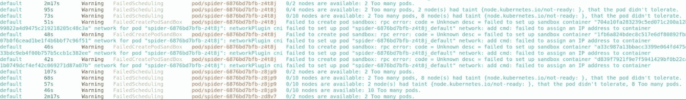](https://cdn.thenewstack.io/media/2021/11/fb0be88e-image13.jpg)

首先，我们应该在集群中尽可能广泛地开始。根据集群中工作负载的大小和数量，该命令可能会有大量输出。在较小的集群中，它可能足以指出一些明显的问题，说明为什么工作负载不工作。

您可能会在这个命令中看到控制器和 Kubernetes 组件的错误，这可能会向您显示失败的原因或位置。在我们的示例截图中，您可以看到有警告，因为我们无法为 pod 分配 IP 地址。我们可能会在 kubelet 日志中看到这些相同的错误，但是查看集群中的所有警告将向我们展示错误如何级联到不同的控制器中。

### **2。kubectl get nodes-o wide-label-columns topology.kubernetes.io/zone**

[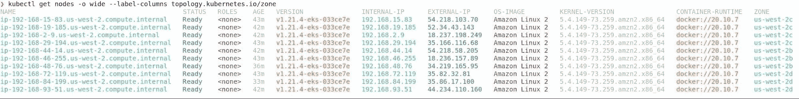](https://cdn.thenewstack.io/media/2021/11/d00ab37c-image16.jpg)

这个输出对于任何调试过程都是相当常见的。您应该能够快速识别出任何不处于“就绪”状态的节点，或者可能具有不同版本的 kubelet 或不同的容器运行时的节点。通过添加拓扑区域输出，您还可以查看是否有任何节点问题与特定区域相关，该区域可能有其他问题，如网络分区或相关服务不可用。

### **3。ku bectl resource-capacity–pods–util–sort CPU . util**

【T2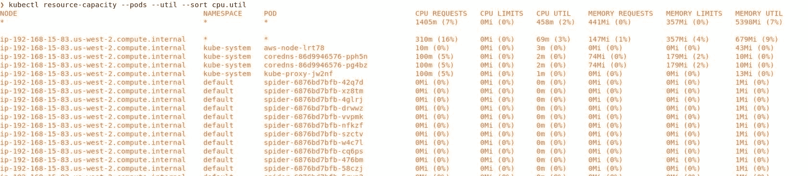

即使在容器的世界中，您仍然必须处理 CPU 和内存资源。 [resource-capacity](https://github.com/robscott/kube-capacity) 插件可以帮你节省很多命令来判断一个节点是如何被使用的，以及哪些 pod 可能使用了比它们应该使用的更多的资源。可以用`kubectl krew install resource-capacity`安装插件。

值得注意的是:这个插件要求您在集群中安装了 [metrics-server](https://github.com/kubernetes-sigs/metrics-server) 。一旦您运行了它，您应该能够使用这个命令来发现潜在的问题，其中资源是有限的或者 pods 没有设置限制。

### **4。kubectl 获取所有显示标签**

[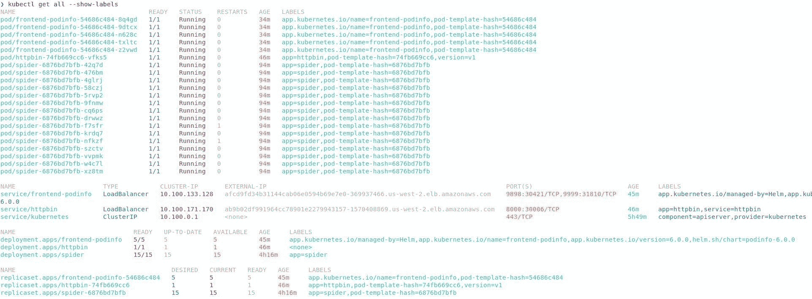](https://cdn.thenewstack.io/media/2021/11/4c381693-image8.jpg)

这个命令不会显示所有内容，但是我们真正关心的是部署、pod 和服务。通过包含每个工作负载的标签，我们可以看到类似于`pod-template-hash`标签的内容，这将为我们提供一个哈希值，您可以在我们的部署和 pod 之间进行匹配。如果有任何 pod 没有运行，我们知道下一步去哪里找。

此时，最好也看看服务，看看它是什么类型。如果是负载平衡器类型，那么您应该确保已经提供了负载平衡器。如果所有的 pod 都在运行，那么应用程序问题可能不是来自 pod。为了以防万一，我们应该获取一个 pod 名称，以便在接下来的几个命令中对其进行更多的检查。

### **5。kubectl 世系 pod ${POD}**

[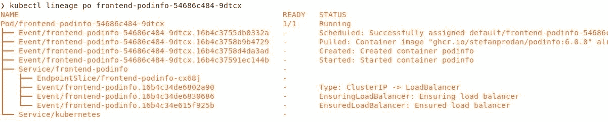](https://cdn.thenewstack.io/media/2021/11/540fb8ce-image3.jpg)

[lineage](https://github.com/tohjustin/kube-lineage) 命令是另一个`kubectl`插件，它可以显示在 Kubernetes 中创建了什么资源以及依赖于什么资源。如果你曾经使用过`kubectl tree`，你会对血统很熟悉，但是血统有一些额外的特性。可以用`kubectl krew install lineage`安装`lineage`插件。

我最喜欢这个命令的一个特性是，它不仅显示了 Kubernetes 资源，如集群中的复制集和服务，还显示了事件、RBAC(基于角色的访问控制)、节点，并具有本机 helm 支持。默认情况下，该命令将显示依赖项，但是通过`--dependencies`标志，您可以看到什么依赖于某个资源。

出于好玩，您可以查看 metrics-server 之类的服务，并查看服务背后的所有 ClusterRoleBindings 以及 pod 和节点。

[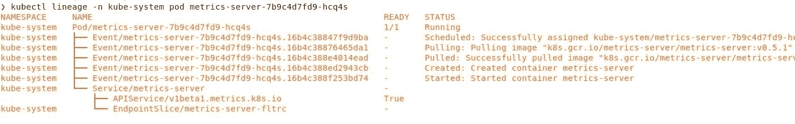](https://cdn.thenewstack.io/media/2021/11/acbb00b5-image1.jpg)

### **6。凯尔-l ${LABEL}**

[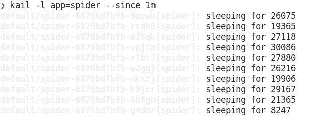](https://cdn.thenewstack.io/media/2021/11/a6fb40b8-image12.jpg)

我们的最后一个工作负载故障排除命令将根据标签显示工作负载的所有日志。 [kail](https://github.com/boz/kail) 是一个独立的工具，不是`kubectl`插件，可以和`brew install boz/repo/kail`一起安装。使它独立的好处是它可以做一些通常用一个`kubectl`命令很难做到的事情。

例如，您可以使用`--ns`获取特定名称空间的所有日志，或者使用`--ing`获取入口规则后面的所有 pod。

[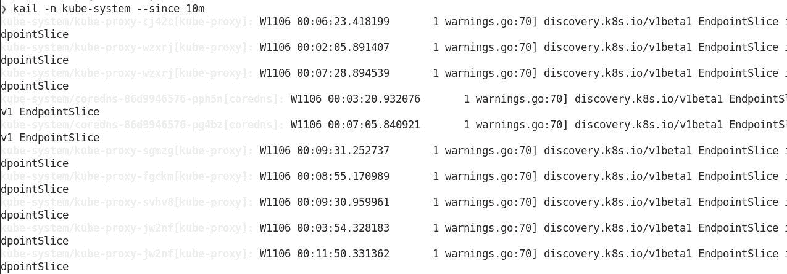](https://cdn.thenewstack.io/media/2021/11/45e23617-image2.jpg)

## **无法访问工作负载**

```
kubectl get service  -o  wide
kubectl get endpointslices  -o  wide
kubectl port-forward deploy  $DEPLOYMENT  $LOCAL_PORT:$POD_PORT

```

### 7。kubectl get service -o wide

[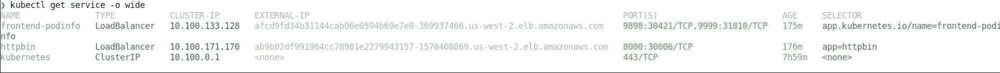](https://cdn.thenewstack.io/media/2021/11/273bf2c2-image14.jpg)

首先，您应该查看集群中的服务，因为这是流量进出集群的主要方式。如果您使用 ingress 进行流量路由，那么您还会想要使用`kubectl get ingress -o wide`。重要的是要检查它是什么类型的服务，是否有外部 IP 地址或负载平衡器，以及使用了什么标签。

根据我们之前从工作负载列表中收集的数据，我们应该能够将 pod 上使用的标签与服务上的匹配标签进行比较。如果它们不匹配，它们就不是 EndpointSlice 的一部分。

### **8。ku bectl get endpoint slices-o wide**

[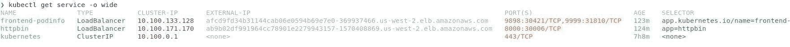](https://cdn.thenewstack.io/media/2021/11/4b4a9ccb-image15.jpg)

接下来我们要看的是端点切片。这将向我们显示名称空间中的每个服务，以及哪些 pod IP 地址与该服务相关联。如果您看到没有任何端点的服务，那么您需要验证 pod 是否准备好以及标签是否匹配。

### **9。ku bectl PORT-forward deploy/$ DEPLOYMENT $ LOCAL _ PORT:$ POD _ PORT**

[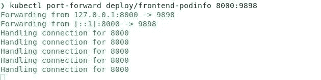](https://cdn.thenewstack.io/media/2021/11/eac23046-image6.jpg)

该命令将让我们绕过负载平衡器或入口控制器，看看是否可以将流量直接发送到部署中的一个单元。如果您怀疑某个 pod 有问题，也可以将流量直接转发到该 pod。这将帮助我们排除服务、负载平衡器和一些网络配置的错误，因为您的连接是通过 Kubernetes API 服务器进行的。

## **调试特定吊舱**

```
kubectl debug  -it  --image=debian  $POD
kubectl label pod  $POD app-
kubectl blame pod

```

如果我们已经走了这么远，仍然没有解决问题，我们可以使用一些额外的命令来查看特定的 pod，看看我们是否能够识别正在发生的事情。

### **10。kubectl debug POD–it–image = debian＄POD**

[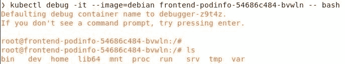](https://cdn.thenewstack.io/media/2021/11/6750ac4a-image7.jpg)

debug 命令要求在集群上启用[临时容器](https://kubernetes.io/docs/concepts/workloads/pods/ephemeral-containers/)。目前这是 Kubernetes 1.22 的一个 alpha 特性，所以它可能还不能在您的集群中使用。

有时候解决问题的最快方法是使用交互式 shell。有几种不同的方法可以让你在跑步舱里得到一个贝壳，但是`debug`是我最喜欢的。`debug`命令与`exec`不同，因为`exec`要求您的 pod 已经安装了调试工具。然而，`debug`命令会让你指定一个新的容器，你可以“安装”到正在运行的容器上，然后带上你自己的工具。

你可以为你的`--image`提供任何你想要的容器和工具；不同的错误可能需要不同的工具。我通常有一个预装工具的专用调试容器，但是如果你身边没有，你可以使用你熟悉的完整发行版来安装你需要的任何工具。使用临时容器调试东西的一个很酷的事情是，它也适用于构建于`FROM scratch`并且没有其他文件或包管理器的静态二进制容器。

`debug`命令也可以用来获得节点上的交互式 shell。这类似于进入节点，但是 debug 命令在安装了工具的情况下以特权模式运行容器。如果您使用的是最小容器操作系统或者没有在节点上配置 SSH 访问，这一点尤其有用。

在 Kubernetes 文档中有更多关于让一个交互式 shell 进入 pod 的选项。

### **11。kubectl 标签 pod $POD 应用-**

[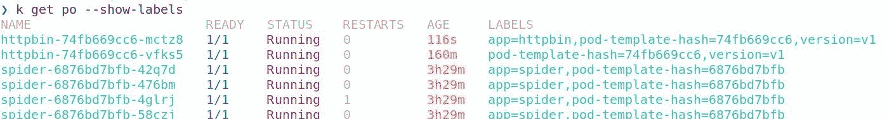](https://cdn.thenewstack.io/media/2021/11/7a0e57df-image5.jpg)

这是我在 Kubernetes 中最喜欢的调试命令之一。默认情况下，部署会向您的 pod 添加一个标签，例如`app=nginx`。当您使用服务公开部署时，它也与该标签相匹配。通过运行这个命令，您将从 pod 中删除`app`标签。

因为复制控制器和服务对象匹配标签，所以一旦您移除应用标签，新的 pod 将替换您移除标签的 pod，但它将保持您的 pod 运行。现在，您有了一个可以进行故障排除的单元，而不必担心向其发送生产流量或单元从水平单元自动缩放器放大或缩小。当您移除标签时，pod 实际上不会被跟踪。

在截图中，您可以看到我从 httpbin pod 中删除了`app`标签，这导致一个新的 pod 在 ReplicaSet 中替换了它，并留下了旧的 pod 供我调试。

### **12。kubectl 责备 pod $POD**

[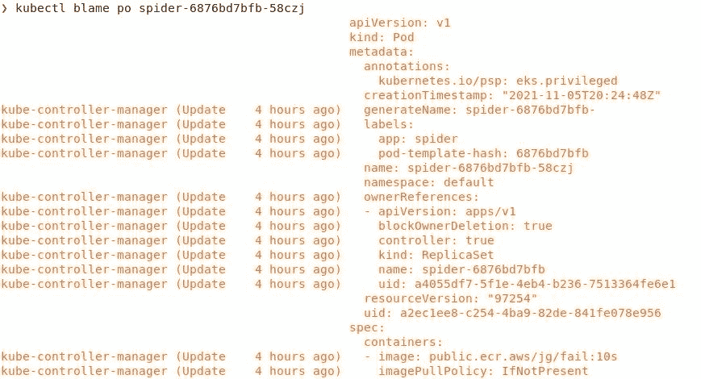](https://cdn.thenewstack.io/media/2021/11/dfce47e0-image10.jpg)

[责备](https://github.com/knight42/kubectl-blame)命令是一个很棒的插件，您可以使用它来查看 pod 清单的哪些部分发生了更改，以及是谁或什么更改了它们。可以用`kubectl krew install blame`安装。有了这个输出，您可以很快找出是哪些控制器修改了清单，并可能查看那些组件以了解他们为什么要修改它。

这里的输出并不完美；它不会显示对清单的所有修改。由于 webhooks 或默认值的原因，有些字段在存储到 etcd 之前会被修改。但是知道一个字段改变的频率以及哪个控制器正在修改清单中的哪个字段仍然是非常强大的。

## **优秀奖**

还有一些其他插件可以更深入地研究工作负载，但其中一些插件需要集群中的特定功能或节点上的附加守护进程。两个值得一提的是 [inspecktor-gadget](https://github.com/kinvolk/inspektor-gadget) ，它可以与`kubectl krew install gadget`一起安装，以及 [kubectl-capture](https://github.com/sysdiglabs/kubectl-capture) ，它创建了您可以使用 [sysdig-inspect](https://github.com/draios/sysdig-inspect) 等工具重放的捕获文件。

这两个插件都要求您在节点上安装 DaemonSets，但是如果您需要深入研究工作负载的问题，它们会非常强大。它们都使用内核级应用程序，使用 [eBPF](https://ebpf.io/) 来理解发生的一切。

## **调试工作负载的 UI 选项**

所有这些命令对您的起步都很有帮助。您应该能够更多地了解您的工作负载，并找出问题所在。还有其他值得一提的故障排除选项。在某些情况下，这些 ui 可以在同一个屏幕上组合来自多个命令的信息。

第一个要提的是 k9s。该工具作为终端用户界面(TUI)在您的终端中运行，使您更容易浏览资源和查看附加信息。您可以从 GitHub repo 安装 k9s，并开始将其用于任何 Kubernetes 集群。

[https://github.com/derailed/k9s](https://github.com/derailed/k9s)

【T2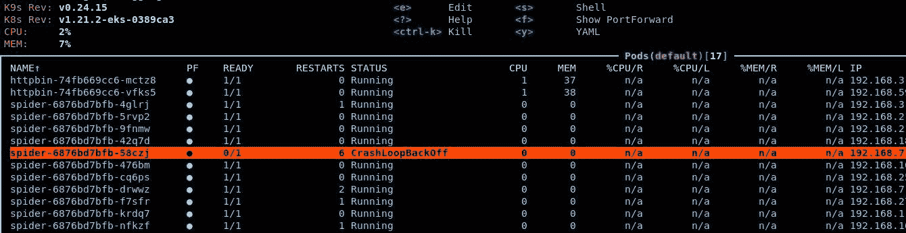

另一个选择是米兰蒂斯的镜头。Lens 是一个独立的应用程序，能够快速切换 Kubernetes 集群，并为您正在进行的故障诊断提供大量附加信息。如果你想要一个功能更全的 Kubernetes UI，Lens 是一个很好的选择。你可以从[https://k8slens.dev/](https://k8slens.dev/)安装。

[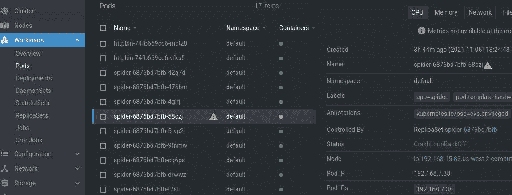](https://cdn.thenewstack.io/media/2021/11/952c96c3-image9.jpg)

<svg xmlns:xlink="http://www.w3.org/1999/xlink" viewBox="0 0 68 31" version="1.1"><title>Group</title> <desc>Created with Sketch.</desc></svg>