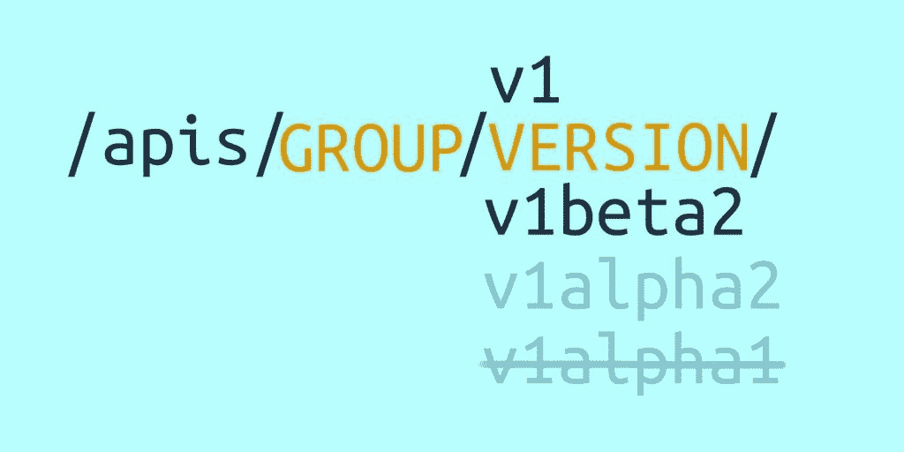
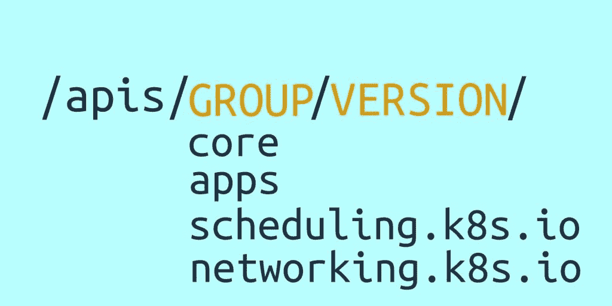
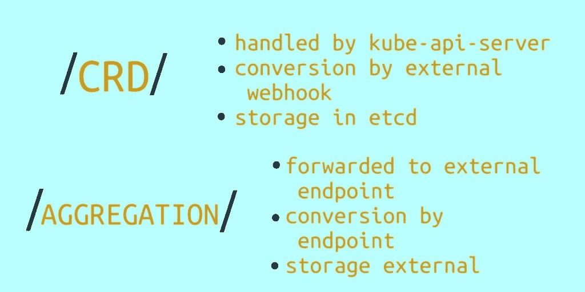
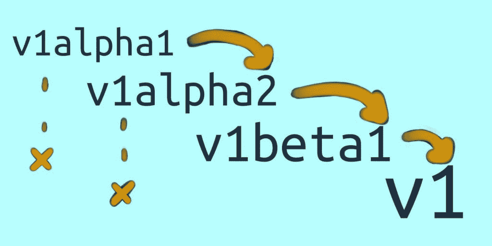
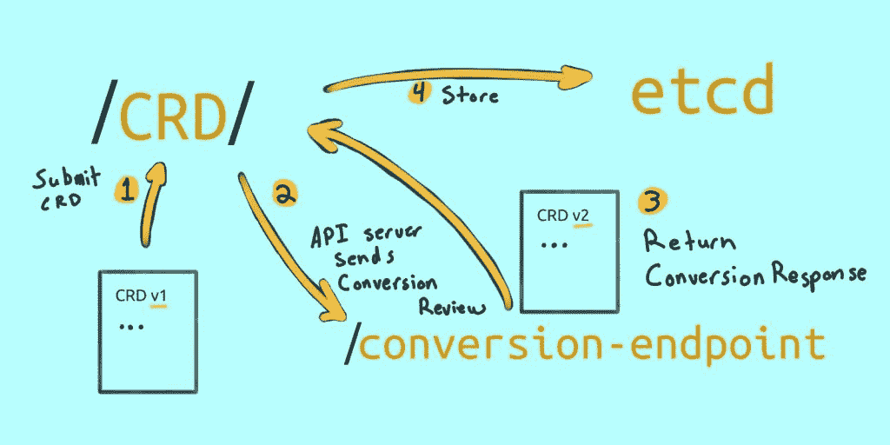

# 与 Kubernetes 一起生活:API 生命周期和你

> 原文：<https://thenewstack.io/living-with-kubernetes-api-lifecycles-and-you/>

[](https://www.linkedin.com/in/justingarrison/)

 [贾斯汀·加里森

贾斯汀是亚马逊网络服务(AWS)的高级开发人员。](https://www.linkedin.com/in/justingarrison/) [](https://www.linkedin.com/in/justingarrison/)

欢迎来到*与 Kubernetes* 一起生活。在本系列中，我们将讨论使用 Kubernetes 需要做些什么——除了创建集群和部署应用程序。我们将看看如何安全地升级您的集群，探索可以帮助您管理多个集群的工具，并讨论长期使用 Kubernetes 的其他注意事项。

这篇文章是关于 Kubernetes API 的:它的优点是什么，如何用自定义资源(CR)扩展它，以及当它的一部分被废弃时意味着什么。

[](https://cdn.thenewstack.io/media/2021/02/a0b39b4a-image4.jpg)

Kubernetes API 是 Kubernetes 最强大的部分。它为您的基础设施和应用程序提供了可预测、可扩展的 API。这种可预测性来自设计良好的使用模式和强大的稳定性契约。有了这些东西，API 总是易于扩展和经常更改。

最终结果是，您可以依靠最少的声明性数据来驱动复杂的控制循环。这些控制循环是一切的关键，从 Kubernetes 调度程序到 GitOps。他们是 Kubernetes 拥有可靠和可伸缩应用的核心和灵魂。

这种模式如此可靠，以至于业界已经采用了比最初想象的更多的用途。无论您是使用 Kubernetes 通过 [Cluster-API](https://github.com/kubernetes-sigs/cluster-api) 进行部署，还是通过 [Vitess](https://vitess.io/) 运行大规模数据库，或者使用 [cruster-api](https://github.com/rudoi/cruster-api) 订购披萨，都没有关系。您可以使用相同的 Kubernetes 原语来解决业务需求——或者饥饿需求。

是什么让 Kubernetes API 如此强大，随着 API 的变化，成为消费者的最佳方式是什么？让我们看看 API 是如何变化的，以及随着 Kubernetes 成为基础设施的重要组成部分，它会对您产生怎样的影响。

## **API 组和扩展**

Kubernetes API 由[不同的团体](https://kubernetes.io/docs/reference/generated/kubernetes-api/v1.20/#-strong-api-groups-strong-)组成。这些团体允许

*   可预测的 API 模式
*   用户对功能的逐步采用
*   独立定义资源范围和成熟度
*   针对特定使用情形的独特 API 路径(例如 pod/日志)

[](https://cdn.thenewstack.io/media/2021/02/7019416b-image5.jpg)

最初，Kubernetes API 没有组。这个功能后来被命名为核心组(有时称为“遗留”)。由于资源和版本号之间的紧密耦合，核心组中的资源很难成熟。由于所有资源都在一个`/apis/$VERSION/`路径下，用户很难使用不同版本的资源并保持控制器之间的兼容性。开发 API 需要更多版本的成熟资源，并且在添加第三方资源(TPR)之前，扩展 API 是不可能的。随着客户和供应商开始采用 TPR，各种缺点得到了解决，TPR 被替换为[customresourceditions](https://kubernetes.io/docs/tasks/extend-kubernetes/custom-resources/custom-resource-definitions/)(CRD)。

CRD 是如此成功，以至于核心组中的资源正慢慢地被转移到更具体的 API 组中。一些 API 组包括应用、扩展和`scheduling.k8s.io`。您将在您的规范文件中看到这些组，它们是`apiVersion`字段的一部分。

```
# batch is the group and v1 is the versionapiVersion: batch/v1

```

其他 Kubernetes 资源可以被分离到名称空间中。这在 API 中显示为`namespaces/$NAMESPACE`，如下例所示:

```
/apis/$GROUP/$VERSION/namespaces/$NAMESPACE/$RESOURCES/$RESOURCE

```

这种方法意味着我们可以对资源执行可预测的操作，比如用`GET HTTP`动词:
读取“todo-list”名称空间中的所有部署

```
GET  /apis/apps/v1/namespaces/todo-list/deployments

```

或者，我们可以用:
在 todo-list 名称空间中读取名为“frontend”的特定部署

```
GET  /apis/apps/v1/namespaces/todo-list/deployments/frontend

```

这种模式使得用新的资源类型和组来扩展 API 变得非常容易。

您可以使用 apiextensions.k8s.io 组来创建您自己的[自定义资源](https://kubernetes.io/docs/concepts/extend-kubernetes/api-extension/custom-resources/) (CRs)，这将创建全新的组来使用。下面是一个最小的例子，创建一个 mine.k8s.io 组，版本为 v1alpha1，资源类型为 sock。

```
apiVersion:  apiextensions.k8s.io/v1kind:  CustomResourceDefinitionmetadata:  name:  socks.mine.k8s.iospec:  group:  mine.k8s.io  versions:  v1alpha1  names:    kind:  Sock    plural:  socks  scope:  Namespaced

```

通过向 Kubernetes API 提交少量数据，您将获得以下 API:

```
/apis/mine.k8s.io/v1alpha1/namespaces/$NAMESPACE/socks/$SOCK

```

通过`kubectl get socks --all-namespaces`，我们可以立即查看我们有哪些袜子资源。

这些构造使 API 足够灵活，可以针对未知用例进行扩展，并且足够简单，易于理解和接近。

### **CRD 与聚合**

需要指出的一点是，定制资源允许 Kubernetes API 识别定制资源，API 路径是 kubernetes-api 主流程的一部分。您还可以用一个[聚合 API](https://kubernetes.io/docs/concepts/extend-kubernetes/api-extension/apiserver-aggregation/) 服务器来扩展 Kubernetes API，以声明一个特定的路径(例如`/apis/socks.mine.co/v1`)。

主要区别在于，聚合 API 将请求代理到 Kubernetes 服务端点。这意味着您需要在集群中运行一个服务，负责状态存储和版本生命周期。我们不会专门讨论[聚合 API](https://kubernetes.io/docs/tasks/extend-kubernetes/configure-aggregation-layer/)，但是在扩展 API 时知道它们的区别是很重要的。

[](https://cdn.thenewstack.io/media/2021/02/af9a47ef-image3.jpg)

熟悉这些概念很重要。在本文中，我们关注的不是如何使用这些东西，而是如何与它们共存。Kubernetes 如何采用和发展 API 是通过关于如何对组进行版本控制的严格合同来实现的。

## **版本和生命周期**

版本跟在组名后面作为 URL 路径的一部分——或者在核心组的情况下跟在/apis/后面——并且有[定义的关于如何从一个版本到另一个版本变化的指导方针](https://kubernetes.io/docs/reference/using-api/#api-versioning)。这些版本将出现在您的 yaml 文件中 apiVersion 中的组名之后。

[](https://cdn.thenewstack.io/media/2021/02/7a78bc31-image2.jpg)

Kubernetes 遵循 alpha → beta → stable 的成熟度进展，并有一些额外的版本控制，因此资源可以迭代，而不需要进展到下一个成熟度级别。

一个 alpha 资源可以从 v1alpha1 开始，迭代到 v1alpha2，或者，如果有突破性的变化，可能是 v2alpha1。beta API 可能与 alpha API 具有相同的规范，但是成熟度和与用户的合同会有所不同。

*   阿尔法 API 是实验性的。它们可能有错误和向后不兼容的变更。它们在默认情况下是不启用的，应该尽量少用。
*   默认情况下，测试版 API 经过了良好的测试和启用。未来的功能可以依赖它们，但它们的实现可能会根据用户反馈或可伸缩性等约束而改变。
*   稳定的 API 没有“beta”或“alpha”名称。它们用一个版本(例如，v1)来表示，并且在不改变版本号的情况下，它们的实现不应该有重大改变。

当一个 Kubernetes API 被弃用时，通常意味着它的某个版本不再可用。绝大多数的贬值是因为:

*   资源方案改变(例如，v1beta1 → v1beta2)。
*   API 变得更加稳定(如 v1α2→v1β1)。
*   组名已更改(例如，入口从 extensions/v1beta1 移动到 networking.k8s.io/v1beta1)。

弃用意味着某个版本的 API 已经被删除，您需要在清单和资源中验证您使用的是正确版本的 API。在某些情况下，您可能需要更改资源域来更新资源的新方案。

如果一个 API 同时有多个版本，Kubernetes API 可以[悄悄地为你](https://github.com/kubernetes/kubernetes/issues/58131#issuecomment-356823588)升级其中一些版本。然而，您仍然应该确保您有正确的资源方案——特别是因为随着 alpha APIs 的成熟，方案可能会在版本之间发生变化。

这些版本很重要，因为当您想要升级 Kubernetes API 服务器时，您需要确保您的资源——存储在 etcd 和静态清单中——与服务器中的可用资源相匹配。当您在多个集群或环境中有版本偏差时，这个过程变得非常棘手。

这一步对于您的定制资源也很关键。即使您不更新您的 Kubernetes 版本，如果您不确保将控制器和组版本匹配或一起迁移，您仍然可以在它们之间进行重大更改。

## **升级 Kubernetes 并验证清单**

您可以使用命令 kubectl `api-versions`从正在运行的集群中获得 API 组和版本的列表。对正在运行的集群这样做的最大好处是，您还可以看到您拥有的定制资源和聚合 API 组。

如果您没有正在运行的集群，您可以在 [API 参考文档](https://kubernetes.io/docs/reference/generated/kubernetes-api/v1.20/#-strong-api-groups-strong-)中看到默认的组和版本。在 URL 中将 API 版本更改为您的目标版本。

如果您想根据特定的 Kubernetes API 版本验证您的静态清单文件，请查看 [pluto](https://github.com/FairwindsOps/pluto) 。您可以使用像 [velero](https://github.com/vmware-tanzu/velero) 这样的工具从正在运行的集群中备份静态清单，或者您可以在存储部署清单的任何地方运行 pluto。

Pluto 可以读取文件目录，并让您知道是否有针对特定 Kubernetes 版本的反对意见。

```
pluto detect-files  -d  ./  --target-versions k8s=v1.20.0NAME                                KIND VERSION                        REPLACEMENT REMOVED DEPRECATED  targetgroupbindings.elbv2.k8s.aws CustomResourceDefinition apiextensions.k8s.io/v1beta1 apiextensions.k8s.io/v1 true      true        echo                                Ingress                    extensions/v1beta1 networking.k8s.io/v1beta1 false true        echo                                Ingress                    extensions/v1beta1 networking.k8s.io/v1beta1 false true

```

Pluto 还可以帮助默认资源类型，但不能帮助来自 CRD 或聚合 API 的自定义 API 组。在更新 API 服务器之前，或者在将现有清单部署到新集群之前，运行 Pluto 是一个很好的验证配置的冒烟测试。

Pluto 可以帮助默认组和版本，但是如何升级您的自定义资源呢？如果你正在通过 helm 使用或创建 CRD，你可以查看[的文档](https://helm.sh/docs/chart_best_practices/custom_resource_definitions/)，了解如何最好地使用它们。如果您使用第三方供应商的 CRD，您应该查看他们关于如何处理升级的文档。

如果您想比较开源项目中不同版本的 CRD，请查看 [docs.crds.dev](https://doc.crds.dev/) 。它将帮助您快速查看项目中包含了哪些 CRDs 包括什么 API 组和版本。

如果你需要验证的不仅仅是 API 版本差异，你还应该看看 [kubeval](https://www.kubeval.com/) 和 [conftest](https://github.com/open-policy-agent/conftest) 。这些工具可以帮助验证基于方案文档或开放策略代理的清单文件。

## **自定义资源**

对于您创建的自定义资源，以下是处理升级和弃用的方法。测试您的 CR 升级是很重要的，这样可以确保您的控制器能够与自定义资源和 Kubernetes API 组和版本一起正常工作。当您为方案和 API 版本更改更新控制器时，可能需要也可能不需要更新 CR 定义。

在其规范中可以定义多个版本。这种方法允许 Kubernetes API 同时服务多个版本。

使用我们之前的 socks 例子，如果我们想要提供一个 v1beta1 版本的 API，我们可以用:
来定义

```
apiVersion:  apiextensions.k8s.io/v1kind:  CustomResourceDefinitionmetadata:  name:  socks.mine.k8s.iospec:  group:  mine.k8s.io  versions:    -  v1alpha1      served:  true      storage:  false      schema:  ...    -  v1beta1      served:  true      storage:  true      schema:  ...  names:    kind:  Sock    plural:  socks  scope:  Namespaced

```

该规范意味着`/apsi/mine.k8s.io/v1alpha1/`和`/apis/mine.k8s.io/v1beta1/`都将由 API 提供服务。当创建一个新的“sock”对象时，它将作为 v1beta1 存储在 etcd 中，因为在 v1beta1 版本下 storage: true。etcd 中只能存储一个版本。

如果您的版本有方案变更，那么在提交给 API 时，您需要修改资源。该步骤通过[转换 webhook](https://kubernetes.io/docs/tasks/extend-kubernetes/custom-resources/custom-resource-definition-versioning/) 处理。webhook 负责读取资源，将方案转换为不同的版本，并将其发送回 API 服务器。

您可以将转换 webhook 规范添加到您的 CR 中，如下所示:

```
conversion:  strategy:  Webhook webhook:  clientConfig:  url: "https://socks.converter.example/convert-me"

```

每当在 Kubernetes API 服务器中创建一个 sock 资源时，它的规范将被发送到指定的 URL 进行转换。conversion webhook 应该对资源做任何必要的事情，并将其作为 ConversionReview 对象发送回 API 服务器。

使用 webhooks 进行转换可以非常灵活地管理 CR 生命周期，并让您根据需要从一个版本慢慢迁移到另一个版本。



带有转换 webhook 的 CR 需要与聚合 API 相同数量的组件，但是使用 CRs，您可以利用`etcd`来存储您的对象。另外，默认的 API 模式可以简化您需要维护的内容。

更新完所有资源后，您可以在 CR 定义版本中使用 deprecated: true 来弃用旧版本。API 仍将提供不赞成使用的版本，但是当使用不赞成使用的版本将资源提交给 API 服务器时，它们会打印一条警告。

## **结论**

Kubernetes API 旨在改变。它的核心优势之一是在任何环境下都很灵活。为了确保他们的资源与当前的 Kubernetes API 兼容，用户有责任知道您的资源正在使用哪些组和版本。

在许多情况下，资源可以被透明地修改并存储为较新的资源，而无需任何用户操作。这种能力允许用户对 API 升级更有信心，并允许逐步改变方案。

无论您是使用 pluto 这样的工具静态地验证您的资源，还是使用 conversion webhook 自动转换您的资源，确保您能够安全地将您的资源从一个版本迁移到另一个版本是非常重要的。在你长期使用 Kubernetes 时，尽早添加这些测试将有助于增强你的信心。

<svg xmlns:xlink="http://www.w3.org/1999/xlink" viewBox="0 0 68 31" version="1.1"><title>Group</title> <desc>Created with Sketch.</desc></svg>