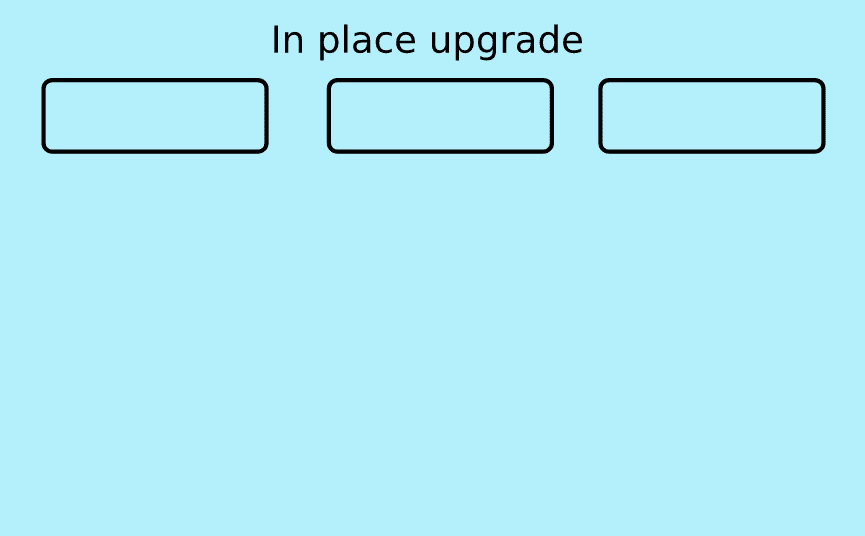
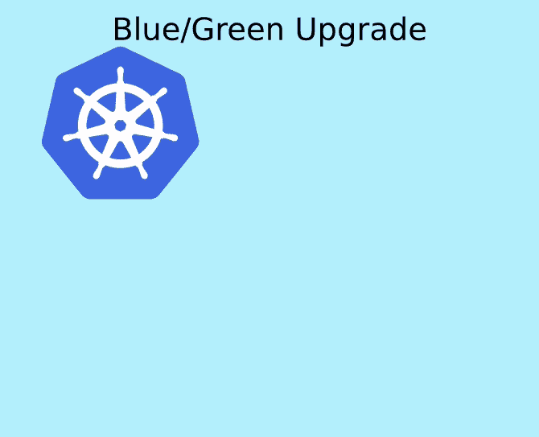
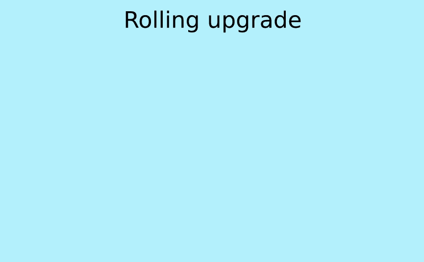
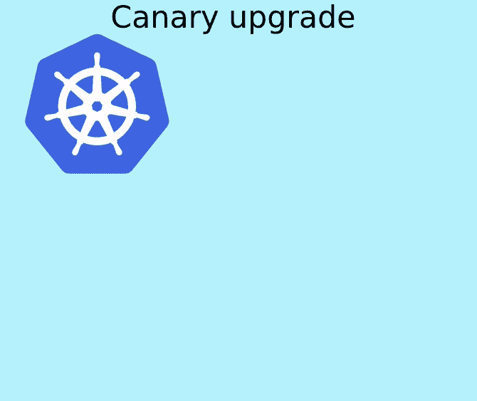

# 与 Kubernetes 一起生活:集群升级

> 原文：<https://thenewstack.io/living-with-kubernetes-cluster-upgrades/>

 [贾斯汀·加里森

贾斯汀是亚马逊网络服务(AWS)的高级开发人员。](https://www.linkedin.com/in/justingarrison/) 

如果你使用 Kubernetes 已经有一段时间了，你需要计划定期升级。从 Kubernetes 1.19 开始，每个开源版本都提供一年的补丁。您需要升级到最新的可用次要版本或补丁版本，以获得安全和错误修复。但是，如何在不停机的情况下升级基础架构的关键部分呢？本文将指导您在任何环境中升级 Kubernetes 时要考虑的常见模式。

我们不会深入研究执行升级的所有工具和注意事项。如果您正在使用集群管理工具或托管的 Kubernetes 服务，那么您应该查阅您的文档以获得最适合您的环境的选项。您还需要注意，一些工作负载和环境可能会限制您选择的升级策略。

我们将讨论一些集群升级的高级模式:

*   适当的
*   蓝色/绿色
*   旋转
*   金丝雀

这些模式类似于应用程序升级选项，由于其潜在的爆炸半径，有一些独特的考虑因素。升级基础架构可能会产生相当大的成本，这取决于升级需要多长时间以及您的环境有多大。

## **控制平面组件**

Kubernetes 控制平面由 Kubernetes API 服务器、etcd 数据库、控制器管理器、调度程序和您的环境中可能有的任何附加控制器(如 cloud 或 ingress)组成。升级 API 服务器是升级集群的第一步。Kubernetes 将状态存储在 etcd 中，对于任何重大的应用程序升级，您都需要确保您至少有一个备份，并且您已经验证该备份可以恢复。在某些情况下，API 服务器升级可能也需要 etcd 升级，但是[我们不会在这篇文章](https://etcd.io/docs/v3.4/upgrades/)中讨论这个问题。

## **数据平面组件**

Kubernetes 数据层由 kubelet、一个容器运行时以及您在集群工作负载中使用的任何网络、日志或存储驱动程序组成。对于许多集群来说，这至少需要一个 kube-proxy 和 CNI 插件更新。您的数据层组件必须与您的 API 服务器版本相同，或者比它低一个次要版本。理想情况下，您的主机操作系统、容器运行时和数据层组件可以彼此独立升级。分离这些组件将确保您可以在有错误修复、新功能或安全补丁时快速升级。

## **Kubernetes 托管服务**

如果您使用托管的 Kubernetes 服务，如[亚马逊弹性 Kubernetes 服务(EKS)](https://aws.amazon.com/eks/) ，控制平面升级会为您处理。如果您使用托管数据平面服务，如托管节点组(MNG)，您的数据平面升级也应由您的提供商自动处理。

即使使用托管服务，您仍然有责任验证您在集群中安装的工作负载、附加控制器和第三方插件(如 CNI)。在测试或开发环境中升级集群之前，应该测试这些组件的 API 兼容性。在之前的博客文章中，我们谈到了确保您的[工作负载和控制器与不同的 Kubernetes API 版本](https://thenewstack.io/living-with-kubernetes-api-lifecycles-and-you/)兼容。

在所有这些升级策略中，您应该避免在集群升级期间升级应用程序。如果可能的话，让您的工作负载保持相同的版本，以最大限度地减少可能错误地归因于 Kubernetes 升级的故障。还要尽量减少其他潜在的问题，比如方案升级或应用程序 API 兼容性。

对于任何 Kubernetes 升级，您都应该按照以下顺序升级组件:

1.  制导机
2.  数据平面和节点
3.  附加组件
4.  工作量

这些升级模式将帮助您决定如何升级最适合您的集群和环境的组件。

### **就地升级**

执行就地升级时，您必须格外小心，确保组件保持正常运行，因为您正在当前为生产流量提供服务的集群上执行工作。就地升级可以包括包更新(如 yum、apt)、配置管理自动化(如 Ansible、Chef)或虚拟机/容器映像更改。理想情况下，您的升级将是脚本化和自动化的，包括回滚，但如果这是您第一次升级，在开发或测试环境中手动升级可能会有所帮助。

就地升级意味着所有组件将大致同时升级。如果您使用配置管理更改了所需的 API 服务器版本，并推送了新的配置，则所有 API 服务器在收到新配置后都会升级。这不同于我们稍后讨论的滚动升级。

就地升级的主要好处是:

*   它在任何规模下都是最快的。
*   如果手动完成，可以更好地控制组件和升级过程。
*   它非常适合多种环境(本地或云)。
*   从基础设施成本的角度来看，这是最便宜的。

根据您的流程、规模和工具，就地升级可能是能够编写脚本和推出的最直接的方法。可以在本地或开发集群中测试脚本，而无需重新配置集群管理员团队可能无法访问的资源，例如负载平衡器或 DNS。

如果要使用就地升级方法进行升级，还需要考虑以下限制:

*   如果所有 API 服务器或控制器同时升级，可能会导致停机。
*   如果您想从 Kubernetes 1.16 升级到 1.20，您必须将整个集群升级四次到每个次要版本。
*   验证每个步骤可能是一个手动过程，这会增加额外的时间和出错的机会。
*   您应该测试回滚计划以防失败，因为有些升级不容易恢复。(例如，方案变更)。

### **蓝/绿升级**

蓝/绿集群升级将要求您使用新版本的 Kubernetes 创建第二个集群。您需要部署新的控制平面和数据平面，然后在将流量从旧集群切换到新集群之前，将所有工作负载复制到新集群。您*可以*使用蓝色/绿色来更新集群的每个组件，但是整体集群升级更容易部署和回滚。

好消息是，设置新集群通常比就地升级集群更容易。对于如何将工作负载部署到新集群，您有多种选择。如果您的工作负载已经是 GitOps 或连续交付的一部分，您可以在升级之前或升级过程中，将部署同时转移到新集群和旧集群。如果您没有自动部署，您可以使用像 [Velero](https://velero.io/) 这样的工具来备份您现有的工作负载，并将它们部署到新的集群。

创建一个新的“绿色”集群可以给你很大的信心，让你相信新版本会像你期望的那样工作，并且让你在切换版本时有控制权。新的集群还可以用于验证自动化工具，如 Terraform 模块或 GitOps repos。您可以随时通过 DNS 或负载平衡器进行更改，甚至可以在维护窗口或低利用率时间进行更改。

蓝/绿升级的主要优势是:

*   在发送流量之前，预先验证所有组件是否正常。
*   您可以一次升级多个版本(例如，从 1.16 直接升级到 1.20)。
*   您可以更改基础架构中可能难以测试的其他部分(例如，切换区域、添加区域、更改实例类型)。
*   回滚是最安全最容易的。

蓝/绿部署要考虑的缺点包括:

*   这是基础架构成本中最昂贵的策略，因为在迁移期间，您必须运行两倍的计算容量。
*   如果您有数千个工作节点，您可能无法获得运行完整的第二个集群所需的所有计算能力。
*   如果您有多个并发集群升级，这种策略很难扩展到几十或几百个集群。
*   如果没有虚拟化，蓝/绿不容易在内部实现，除非您有备用服务器。
*   如果您有许多端点需要更新，一次交换所有流量可能并不容易。负载平衡器可能需要预先扩展，缓存需要预热。小心 DNS 生存时间(TTL ),它可能会也可能不会分散负载。
*   一次交换所有集群流量需要跨团队协调才能迁移到新的集群；以及验证工作负载规模是否正确的工程周期。

当集群数量较少或者工作节点少于几百个时，蓝/绿可能是一个很好的策略。它允许您跳过版本，对于回滚来说是安全的，但是要注意它可能会花费您多少基础设施开销和协调时间。

### **滚动升级**

如果你熟悉 Kubernetes 的部署策略，你就会熟悉滚动升级。滚动升级将部署组件的一个新副本，然后缩减一个旧副本。它将继续这种模式，直到所有的旧组件都被删除。滚动升级的增量性质比就地升级和蓝/绿策略有一些优势。

与就地升级类似，您需要一次升级一个次要版本的 Kubernetes。当需要升级多个版本时，这可能是额外的工作，但这是唯一支持的选项。根据您要升级的组件，您可以使用不同的工具来升级每个组件。

对于像控制平面这样的资源，您可能希望向控制平面添加一个带有升级的 API 服务器的新服务器，然后关闭一个旧服务器。如果您在 AWS 中，您可以更改自动扩展组启动配置 AMI 并一次替换一个实例。其他控制平面组件(如调度程序)可能作为容器在集群中运行，因此您可以使用标准 Kubernetes 滚动部署升级来升级这些组件。

与蓝/绿相比，滚动升级的关键区别在于，您的外部流量路由(DNS 和负载平衡器)将保持指向同一个位置。在升级生产集群之前，您需要确保在不同的集群或环境中测试所有附加组件和工作负载。

注意， [AWS 管理的节点组](https://docs.aws.amazon.com/eks/latest/userguide/managed-node-update-behavior.html)、 [kOps](https://kops.sigs.k8s.io/operations/updates_and_upgrades/) 、 [Cluster-API](https://cluster-api.sigs.k8s.io/tasks/upgrading-clusters.html) 和许多其他 Kubernetes 集群管理工具使用滚动升级策略。好处包括:

*   与就地升级相比，推出和回滚更安全。
*   比蓝/绿成本更低，也不太可能耗尽资源。
*   如果出现故障，可以在升级过程中暂停。
*   可以适应内部环境。

滚动升级是自动化工具中最常见的。它们在速度和成本之间有一个很好的平衡，即使它们不是完全不可变的，它们在正确的领域仍然是不可变的，以减少手工工作和风险。

升级生产集群时，仍将部署所有现有工作负载；只要你测试了它们的兼容性，你的升级应该是自动的。

使用滚动升级时的其他注意事项包括:

*   根据您的规模，滚动升级可能会很慢。
*   在部署期间，您可能需要协调控制器、daemonset 或插件升级。
*   您可能无法进行群集范围的更改，例如添加可用性区域或更改体系结构。

### **金丝雀升级**

Canary 应用程序部署每次为新版本的应用程序提供少量增量流量。金丝雀升级可以被认为是具有蓝/绿优势的滚动升级。

通过 canary 升级，您将使用想要部署的版本创建一个新的 Kubernetes 集群。然后添加一个小型数据平台，并将您现有的较小规模的应用程序部署到新的集群中。通过负载平衡器配置、DNS 循环或服务网格将新的集群工作负载添加到现有的生产流量中。

现在，您可以监控流向新集群的流量，慢慢扩大新集群中的工作负载，缩小旧集群中的工作负载。你可以一次做一个工作负荷，慢一点或快一点都可以。如果任何单个工作负载开始出错，您可以缩减新集群中的单个工作负载，使其自动使用旧集群。

canary 集群升级的优势包括:

*   新的集群更容易创建和验证。
*   您可以在升级期间跳过次要的 Kubernetes 版本(例如，从 1.16 到 1.20)。
*   应用程序部署可以在每个团队的基础上选择加入。
*   由于流量使用增加，错误的影响最小。
*   您可以在升级过程中对基础架构进行大规模更改。
*   集群开始时规模很小，可以扩展，因此基础架构成本较低，并且您可以在扩展时预热缓存和负载平衡器。

如果您想要进行大的改变(比如改变架构)或者想要添加一个额外的可用性区域，那么 canary 是一个很好的选择。通过从小规模启动集群并根据工作负载进行扩展，您可以确保在新实例效率更高或工作负载请求和限制发生变化的情况下，不会过度调配基础架构。

和任何事情一样，都有取舍。使用 canary 部署时，您应该注意以下一些问题:

*   回滚应用程序可能需要手动干预来更改负载平衡器或缩减新集群。
*   随着应用程序的缓慢部署和扩展，旧集群的使用时间可能会超出您的预期。
*   调试应用程序可能会更加困难，因为您需要知道发生了哪些集群错误。
*   如果您有几十个或几百个集群，随着集群的升级，您的集群数量可能会增加 50%或更多。
*   Canary 是最复杂的升级策略，但它受益于自动化部署、运行状况检查和性能监控。

## **结论**

无论你选择哪种升级策略，重要的是要知道它们是如何工作的，以及随着你的 Kubernetes 使用量的增加可能会出现的问题。你需要有一个升级策略，因为 Kubernetes 有频繁的发布和(像任何软件一样)偶尔的 bug。

保持最新版本是基础设施安全流程的重要组成部分，它将使应用程序能够快速利用新功能。如果您部署了 Kubernetes 并迁移了所有工作负载，却没有考虑如何升级，那么现在是开始规划的最佳时机。

如果您没有运行自己的 Kubernetes 集群的业务需求，我强烈建议您使用现有的托管 Kubernetes 选项之一。选择托管控制平面和数据平面每年可以为您节省数天或数周的规划和升级时间。每个托管选项执行升级的方式可能不同，但它们都允许您专注于工作负载和业务价值，而不是控制平面高可用性或数据平面兼容性。

<svg xmlns:xlink="http://www.w3.org/1999/xlink" viewBox="0 0 68 31" version="1.1"><title>Group</title> <desc>Created with Sketch.</desc></svg>