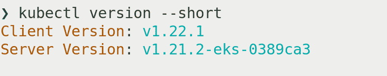
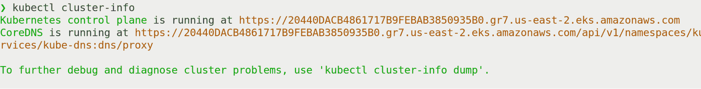
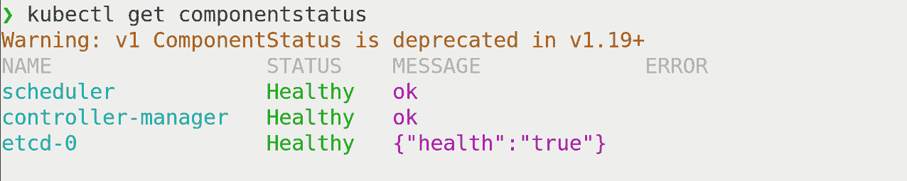
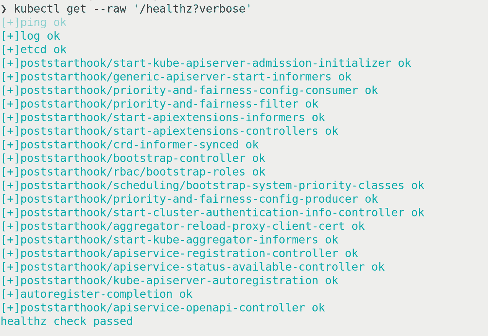
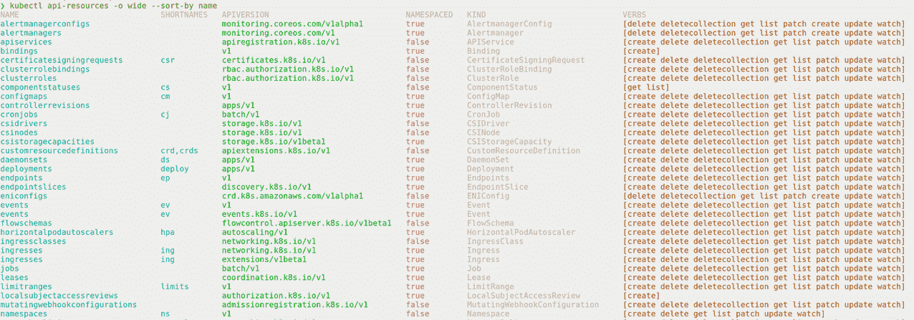
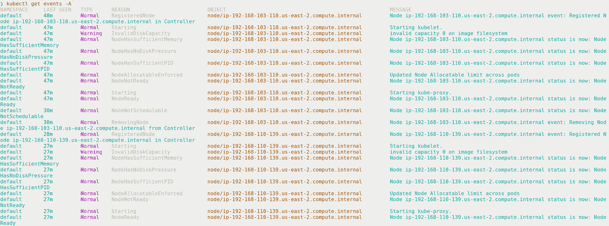
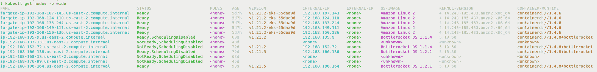
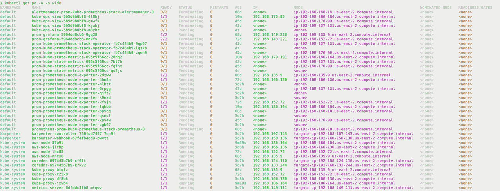
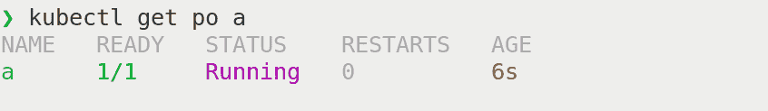
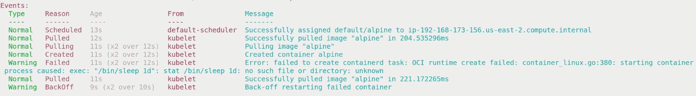

# 与 Kubernetes 一起生活:用 8 个命令调试集群

> 原文：<https://thenewstack.io/living-with-kubernetes-debug-clusters-in-8-commands/>

[](https://www.linkedin.com/in/justingarrison/)

 [贾斯汀·加里森

贾斯汀是亚马逊网络服务(AWS)的高级开发人员。](https://www.linkedin.com/in/justingarrison/) [](https://www.linkedin.com/in/justingarrison/)

如果你已经和任何一个系统相处了足够长的时间，你肯定会调试它。Kubernetes 也不例外。它是一个分布式系统，有许多移动的部分，有时这些部分需要人类理解。在本帖中，我们将看看您可以运行的八个命令来开始调试任何 Kubernetes 集群。

集群中有许多可选组件，但我们不会在这里全部关注它们。我们将在以后的文章中讨论工作负载故障排除。这篇文章将关注集群操作。它将帮助您了解集群，并确保核心功能 running pods 可用。

这篇文章假设你有集群的管理员权限。我们将假设您收到了一个可以访问集群的 kubeconfig 文件，并被告知集群已损坏。你从哪里开始？

下面是要运行的八个命令:

```
kubectl version  --short
kubectl cluster-info
kubectl get componentstatus
kubectl api-resources  -o  wide  --sort-by name
kubectl get events  -A
kubectl get nodes  -o  wide
kubectl get pods  -A  -o  wide
kubectl run  a  --image alpine  --command  --  /bin/sleep  1d

```

让我们分解每个命令，了解它的重要性以及您应该寻找什么。对于集群调试，在深入研究工作负载之前，我们将采用广度优先的方法来了解集群中的内容。

## **1。kubectl 版本–短**



使用这个命令，我们可以查看 API 服务器正在运行哪个版本。当我们对特定错误进行故障排除时，这为我们提供了重要的信息，并且知道我们是否在像 1.16 这样的旧集群上是非常有用的。

了解版本也可以帮助我们查找错误和阅读变更日志。可能存在需要版本升级的已知问题或新引入的错误。不同组件之间有时会存在版本兼容性问题，了解运行的版本是第一步。

## **2。kubectl 集群信息**



接下来，我们应该了解集群在哪里运行，以及 CoreDNS 是否在运行。您可以解析控制平面 URL，以了解您是否正在处理托管集群或内部部署的东西。

在这个示例输出中，我们可以看出我们正在 us-east-2 地区运行一个[亚马逊弹性 Kubernetes 服务](https://aws.amazon.com/eks/)(亚马逊 EKS)集群。此信息也有助于查找您的提供商当前是否有服务中断。您可以查看您的提供商的[服务健康仪表板](https://status.aws.amazon.com/)，以了解当前的问题是与您的集群有关还是在集群之外。

这还可以提示您集群是否需要额外的身份认证。可能存在 AWS 身份和访问管理(IAM)权限问题，或者您可能需要安装一个认证插件，如 [aws-iam-authenticator](https://docs.aws.amazon.com/eks/latest/userguide/install-aws-iam-authenticator.html) 。

## **3。kubectl 获取组件状态**



该命令将是发现您的调度程序、控制器管理器和 etcd 节点是否正常的最简单方法。这些都是运行你的吊舱的关键控制平面组件。您应该查找没有显示“正常”状态的任何组件，并查找任何错误。

如果您正在使用带有受管控制平面的集群(例如亚马逊 EKS)，您可能无法直接访问调度器或控制器管理器。能够从这个输出中看到它们的状态可能是知道 etcd 或另一个组件是否有问题的最简单的方法。

同样值得注意的是，`componentstatus`命令在 CLI 中[已被弃用，但尚未被删除。这个命令目前没有替代品，但是在从 CLI 中删除它之前，它是可以安全使用并且非常有用的。根据您的集群，可能需要多个命令来获得类似的输出。此命令存在设计限制，这也是它被弃用的原因。](https://github.com/kubernetes/enhancements/issues/553)

查看其他健康终点(包括 etcd)的另一个选项是`kubectl get --raw '/healthz?verbose'`:


虽然这个命令没有显示调度器或控制器管理器的输出，但是它增加了许多额外的检查，如果出现问题，这些检查可能是有价值的。

## **4。kubectl API-resources-o wide-按名称排序**



这是第一个包含大量信息的命令。我们已经知道我们的集群运行的版本和位置。此时，我们应该知道控制平面是否正常，现在我们需要查看集群内部的一些资源。

为了保持一致，我喜欢按名称列出所有的资源。按字母顺序浏览资源对我来说更容易。添加`-o wide`将显示每个资源上可用的动词。这可能很重要，因为有些资源比其他资源做得更多。了解哪些动词可用，哪些不可用，将有助于缩小您应该查找错误的范围。

使用这个命令将告诉您集群中安装了哪些 CRD(自定义资源定义),以及每个资源的 API 版本。这可以让您对查看控制器上的日志或工作负载定义有所了解。您的工作负载可能使用旧的 alpha 或 beta API 版本，但是集群可能只使用 v1 或 apps/v1。

## **5。kubectl get 事件-A**



既然我们对集群中正在运行的东西有了一个概念，我们应该看看发生了什么。如果最近发生了故障，您可以查看集群事件，了解故障前后发生了什么。如果您知道只有某个特定的名称空间有问题，那么您可以将事件过滤到该名称空间，并屏蔽掉一些来自健康服务的额外干扰。

有了这个输出，你应该关注输出的类型、原因和对象。有了这三条信息，您可以缩小要查找的错误范围，以及哪个组件可能配置错误。

## **6。kubectl get nodes -o wide**



节点是 Kubernetes 内部的一级资源，是 pods 运行的基础。使用`-o wide`选项将告诉我们更多的细节，如操作系统(OS)、IP 地址和容器运行时间。你首先应该寻找的是地位。如果节点没有显示“就绪”，您可能有问题，但并不总是如此。

查看节点的年龄，看看状态和年龄之间是否有任何关联。可能只有新节点有问题，因为节点映像中的某些内容发生了变化。该版本将帮助您快速了解 kubelets 上是否存在版本偏差，以及由于 kube lets 和 API 服务器之间的不同版本而可能存在的已知错误。

如果您看到子网外的 IP 地址，内部 IP 可能会有用。可能某个节点以不正确的静态 IP 地址开始，您的 CNI 无法将流量路由到工作负载。

操作系统映像、内核版本和容器运行时都是导致问题的可能差异的重要指标。您可能只在特定的操作系统或运行时遇到问题。这些信息将帮助您快速锁定一个潜在的问题，并知道在哪里可以更深入地查看日志。

## **7。kubectl 获得 pod-A-o 宽**



最后，我们最后的信息收集命令。与列表节点一样，您应该首先查看 status 列并查找错误。“就绪”栏将显示需要多少个单元以及有多少个单元正在运行。

使用-A 将列出所有名称空间中的 pod，而`-o wide`将显示 IP 地址、节点以及 pod 的命名位置。使用列表节点中的信息，您可以查看哪些 pod 在哪些节点上出现故障。将这些信息与操作系统、内核和容器运行时等细节相关联，可能会让您获得修复集群所需的洞察力。

## **8。kubectl run a–image alpine–command—/bin/sleep 1d**

有时候，调试的最好方法是从最简单的例子开始。这个命令没有任何直接输出，但是您应该从中看到一个名为“a”的运行 pod。

如果我不与其他人一起调试某个东西，我喜欢用单个字母命名我的调试容器，因为这样打字更快，而且容易迭代(例如 b，c，d)。我经常喜欢在调试时保留旧的容器，因为有时看到与以前的容器有什么不同会很有帮助，并且让它们运行或崩溃比搜索我的终端输出历史更容易。



如果由于某种原因，您没有从这个命令中看到一个正在运行的 pod，那么使用`kubectl describe po a`是您的下一个最佳选择。查看事件，找出可能出错的错误。



## **从任何集群开始**

使用这些命令，您应该能够开始使用任何集群，并知道它是否足够健康，可以运行一个工作负载。还需要考虑其他因素，如核心 DNS 扩展、负载平衡、卷以及中央日志和指标。这里的命令应该在云中或本地运行。

如果您需要对节点或外部资源(例如负载平衡器)进行故障排除，那么您应该查看控制器和 API 服务器日志中的错误。取决于什么是坏的，你可能需要看看 kube-proxy，CNI 插件或服务网格 sidecar 容器日志。

希望这八个命令能够帮助您缩小集群中可能出现问题的范围。如果你不知道问题是什么，那么从广度优先搜索开始是最好的方法。注意不匹配的版本和不同的节点或设置的异常。如果您寻找发生了什么变化，它可以为您指出正确的方向，从而快速找到并解决问题。我们将在以后的文章中讨论如何调试集群中的工作负载。

<svg xmlns:xlink="http://www.w3.org/1999/xlink" viewBox="0 0 68 31" version="1.1"><title>Group</title> <desc>Created with Sketch.</desc></svg>