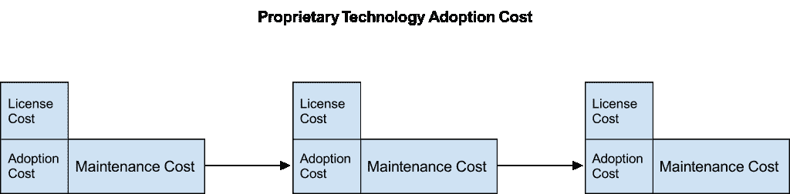
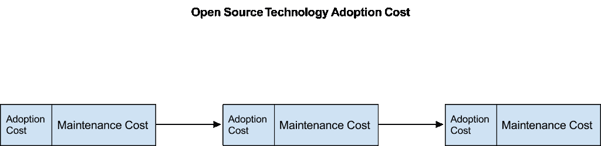
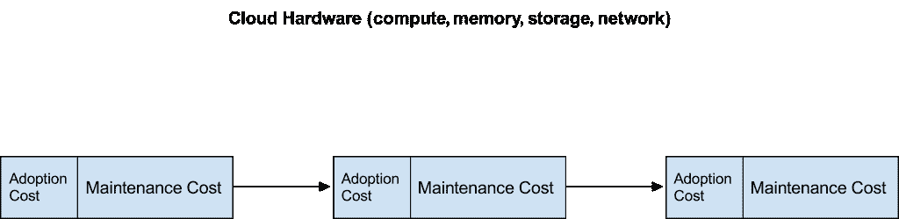
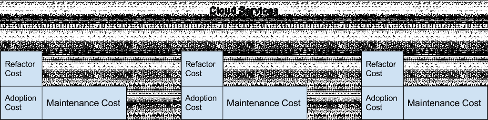
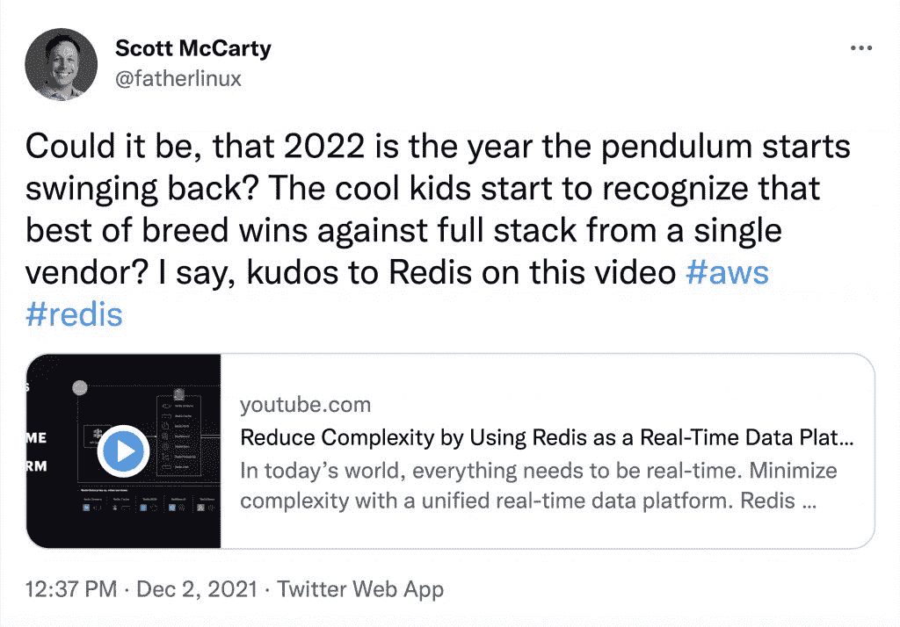

# 云计算和开源时代的锁定

> 原文：<https://thenewstack.io/lock-in-in-the-age-of-cloud-and-open-source/>

我们喜欢讨论锁定问题。什么是供应商锁定？还有其他类型的锁定吗？云能保护你不被锁定吗？开源解决方案会产生锁定吗？

答案很标准:视情况而定。

每一个技术选择都是零和游戏。重复地说，花费在学习和部署一种技术上的资源不能用于另一种技术。但是锁定就不一样了。

客户喜欢谈论锁定。既然客户喜欢谈论它，供应商也是如此。好吧，让我们来分析一下供应商锁定的问题！

## **开始时**

 [斯科特·麦卡蒂

Scott 是 RHEL 服务器公司的高级产品经理。他帮助 IT 专业人员、客户和合作伙伴了解 Linux 容器的所有方面，从组织转型到技术实现，并致力于推动 Red Hat 围绕容器和相关技术的上市战略。他还与工程团队保持联系，通过使用来自 Red Hat 客户和合作伙伴的反馈来帮助推动创新。](https://twitter.com/fatherlinux) 

从历史上看，所有技术都是专有的，因此技术选择是供应商的选择，供应商的选择也是技术的选择。他们是同一个人。你有两个选择，自己开发技术或者花许可费从供应商那里购买。

一旦你产生了许可费用，你就有了技术甚至不能正常工作的风险。如果你想换一种不同的技术，你可以，但是你必须支付从新的供应商那里获得新的许可的费用，以及采用新技术的费用。采用一项新技术有三个组成成本:许可成本([资本支出](https://www.investopedia.com/terms/c/capitalexpenditure.asp))，采用成本(资本支出)和维护成本([运营支出](https://www.investopedia.com/terms/o/operating_expense.asp))。

对于大多数专有软件，一旦用户购买了许可证，他们就可以永久地继续使用它，只要他们能够忍受缺乏安全更新等。

但是一些专有许可证更加苛刻。有了最严格的专有软件，没有许可证就没有继续使用它的机制，不管买家对供应商有多生气。

有些情况下，专利技术的使用者每年都必须支付使用许可费。句号。当我们稍后讨论云服务时，我们将再次讨论这个主题。

这些成本导致了购买者极端保守的行为。在购买软件许可证之前，客户非常希望确保软件能够如其所声称的那样工作。在技术选择或供应商选择上的任何错误都可能代价高昂，因此买家通过使用白皮书、咨询书面客户参考资料、与其他买家交谈、咨询 Gartner 或 IDC 等分析师以及阅读行业杂志来核实潜在购买。在这个时代，[征求建议书(RFP)](https://www.investopedia.com/terms/r/request-for-proposal.asp) 的概念变得流行起来，以迫使供应商在买家承诺购买软件之前披露尽可能多的信息。

由于许可和技术采用的前期成本比维护成本更高，因此人们自然倾向于长期使用相同的技术组合，并抵制变革。

## **开源的生活方式**

随着开源软件的出现，软件许可成本的减少减少了变革的阻力。有了开源，你仍然有采用和学习新技术的成本，但是还有另一个隐藏的优势。

有了开源软件，供应商就无法锁定买家。买方保留在任何给定时间选择不同供应商的权利。即使只有一家厂商出售对某一特定开源代码的支持，购买者仍然有选择权。买方可以引诱另一个供应商来支持它，自己支持它，付钱给顾问来支持它，甚至在没有支持的情况下运行它。原卖方没有能力强迫买方继续金融关系。从供应商锁定的角度来看，这将改变游戏规则。

实际上，开源把技术选择和供应商选择分开了。你采用哪种技术，你选择从谁那里采用，可以是两种完全不同的选择。此外，这些选择有明显不同的风险和回报。

## **最快的领养方式**

似乎在最近一段时间，人们已经忘记了厂商锁定的历史。他们不记得这一切是如何开始的，所以有一种看法，认为技术采用中几乎所有令人讨厌的事情都是固定的。不是的。

开源技术仍然有采用成本，这就产生了引力，但是引力和锁定是两个截然不同的概念。做任何选择都有引力。做出技术选择甚至更重要。但是当你犯了一个错误时，地心引力并不会阻止你放弃一个决定。采用成本本身并不固定。

例如，假设您做出一个技术决策，使用一个开源项目来解决一个数据存储问题。项目进行到一半时，您意识到该技术无法满足您的需求，因此您不得不去寻找一种替代的开源技术，投入时间学习和部署它，并承担采用这个新项目的另一个风险。

那不是锁定。

不，我的朋友，锁定是一件更阴险的事情。锁定是指只有一家供应商能够提供您所采用的技术解决方案。供应商锁定是指您想保留技术，但摆脱供应商。供应商锁定是指如果你不支付新的许可费用或维护费用，下一年你甚至不能使用该技术。

即使在 2021 年，有时买家也无法避免供应商锁定。有时候，专有解决方案确实是问题的唯一可行解决方案，在这种情况下，供应商锁定是必要的。但是，在这些情况下，我建议使用所有发明的流程来处理:RFP、分析师、客户证明等。

开源改变了 IT 基础设施和网络，但是在许多行业，比如制造业，厂商锁定仍然是厂商和买家之间的默认关系。

## **上云应该能解决一切**

有点是，有点不是。云可以分为三层:基础设施即服务(IaaS)，平台即服务(PaaS)和软件即服务(SaaS)。虽然 IaaS 可以被认为是在云中租用硬件，但 PaaS 和 SaaS 需要以完全不同的方式来考虑([硬件 1.0 与硬件 2.0](http://crunchtools.com/hardware-1-0-vs-hardware-2-0/) )。在 IaaS 的服务之间进行迁移相对简单，购买者可以很好地避免被供应商锁定。更高层次的服务就没那么多了。云提供商是否真的会在软件世界中胜出还有待观察[，但他们肯定会向上爬，就像最初的硬件供应商一样，因为他们想为客户提供更具粘性的解决方案。让我们从供应商锁定的角度来探讨这些较低级和较高级服务之间的区别。](https://erikbern.com/2021/11/30/storm-in-the-stratosphere-how-the-cloud-will-be-reshuffled.html)

在我所谓的硬件 2.0 中，服务器、网络和存储在云中租用，并通过 API 进行配置。从一家云提供商迁移虚拟机的转换成本相当于学习一种新的 API 来进行资源调配。像 Ansible 和 Terraform 这样的工具通过给购买者一个 API 来翻译每个云提供商的底层 API，进一步降低了这些成本。如果架构良好，购买者只需修改几个配置文件就可以在云提供商之间转移(尽管存储仍然有其重要性)。

这给我们留下了与采用开源软件非常相似的成本。当然，有收养费用，但没有许可费。您从每个云提供商那里获得的最终产品在功能上几乎是等同的。对于特定于硬件的东西，如 Arm/x86/Power、GPU 等，存在一些差异。，但这是正常的差异化，类似于硬件供应商多年来的做法。

但是服务不一样。像亚马逊 Kinesis、DynamoDB、ElastiCache、简单队列服务、TimeStream、Lambda 这样的云服务，甚至像 Azure DevOps Pipelines、GitHub Actions 和 AWS Image Builder 这样的东西，都与租用虚拟机完全不同。

这些服务，尤其是部署单个应用程序通常需要的这些服务的复杂组合，只能从一个供应商处获得。更糟糕的是，云服务类似于最苛刻的专有许可证。如果不向云提供商付费，你甚至不能使用它们。通过更高级专有服务的复杂组合进行部署，瞧，我们刚刚将我们的供应商选择和技术选择结合在一起。甚至还有重构成本，类似于过去专有软件的许可成本。

总之，这套复杂的服务相当于典型的供应商锁定。如果您想像这样将您的技术选择和供应商选择内在地联系起来，我鼓励您聘请律师，咨询分析师，并真正与其他客户一起做功课。

## **关于许可的事情是…**

这场哲学辩论正在公开进行，AWS 和 Redis 等供应商之间存在长期不和。该视频将 AWS 的全栈解决方案与 Redis 的全栈解决方案进行了对比，但 Redis 有一个关键的不同之处。尽管 Redis 已经[对许可证进行了修改](https://techcrunch.com/2019/02/21/redis-labs-changes-its-open-source-license-again/)，但仍在使用的许可证保护了买家。如果你对 Redis 感到恼火，你可以自己运营它，或者花钱请一家咨询公司为你运营。

[https://www.youtube.com/embed/PHVESvI9LG0?feature=oembed](https://www.youtube.com/embed/PHVESvI9LG0?feature=oembed)

视频

另一个容易被忽略的细节是，有了 Redis，购买者仍然可以自由构建最佳解决方案。他们可以决定从戴尔购买服务器，从 Red Hat 购买操作系统，从 Redis 购买数据解决方案。或者，如果他们对戴尔、红帽和 Redis 实验室感到恼火，他们可以从谷歌租一台虚拟机，使用 SUSE Linux，并支付一笔咨询费来管理 Redis 层。或者，如果他们不喜欢这样，他们可以在内部使用 VMware，使用 Ubuntu Server 并雇佣程序员来维护 Redis 50 年。你明白了。

我想知道钟摆是否会随着云摆回另一边？或者，我想知道云供应商是否真的在走他们之前的硬件供应商的路，并且会被紧随其后的开源软件创业公司取代？

## **选择的悖论**

糟糕的技术选择和供应商锁定是任何采用技术的人都需要了解的两种不同的风险，但它们不是一回事。糟糕的技术选择是进门时的风险，供应商锁定是出门时的风险。

如果你为了获得冒险的回报而快速采用技术，你会做出一些糟糕的技术选择。糟糕的技术选择是一项核心竞争力——快速失败。你会从这些糟糕的选择中幸存下来，并从中吸取教训，更善于做出新的选择。这是对成为软件驱动型公司所必需的核心竞争力的战略投资。

糟糕的供应商锁定选择不是战略投资。由于绝大多数创新都来自开源，采用将你锁定在单一供应商的技术几乎没有风险或回报。我会为你做出尽可能多的错误决定的权利而斗争，但我会恳求你有策略地做出决定，心中有目标！

来推特上和我聊聊:@父亲

<svg xmlns:xlink="http://www.w3.org/1999/xlink" viewBox="0 0 68 31" version="1.1"><title>Group</title> <desc>Created with Sketch.</desc></svg>