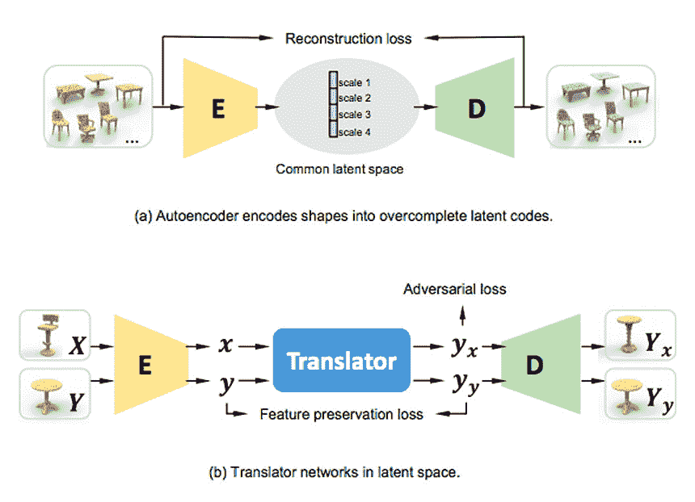
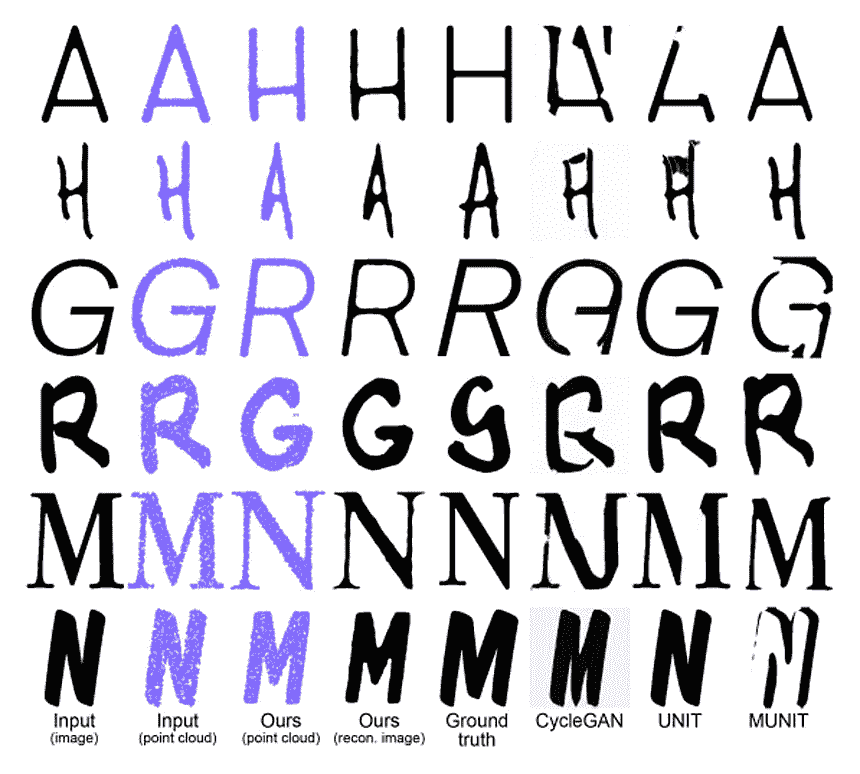
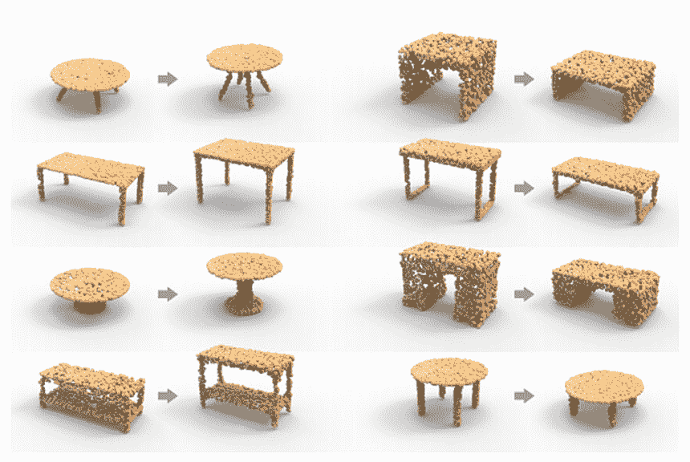
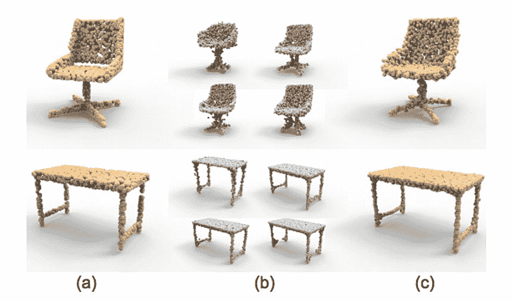

# LOGAN 是一个深度学习人工智能，可以无缝转换 3D 形状

> 原文：<https://thenewstack.io/logan-is-a-deep-learning-ai-that-transforms-3d-shapes-seamlessly/>

你可能听说过最近围绕着[生成敌对网络](https://en.wikipedia.org/wiki/Generative_adversarial_network) (GANs)的讨论——一种机器学习技术，它使得创建令人难以置信的[“深度伪造”视频](/deep-learning-ai-generates-convincing-deepfake-videos-of-mona-lisa/)，或者作为一种“去识别”工具，[匿名化照片以保护个人隐私](/deepprivacy-ai-uses-deepfake-tech-to-anonymize-faces-and-protect-privacy/)，或者作为一种方式[在视频游戏中生成逼真的城市景观](/deep-learning-ai-generates-realistic-game-graphics-by-learning-from-videos/)。GANs 是无监督的深度学习算法，其工作原理是将一个“生成器”神经网络与一个“鉴别器”神经网络相比较——“生成器”的目标是一遍又一遍地产生图像，直到它产生一个最终欺骗“鉴别器”网络的图像，从而产生一个有说服力的假图像。

正如人们所看到的那样，生成敌对网络非常通用，现在一个来自西蒙弗雷泽大学、深圳大学和特拉维夫大学的研究小组正在将 GANs 作为一种变换形状的工具——例如，将球体无缝变形为金字塔——这在计算机图形学和几何建模领域将非常有用。

他们的[作品](https://arxiv.org/abs/1903.10170)将于今年晚些时候在 SIGGRAPH Asia 上展示，其特点是一个深度神经网络，可以自动学习如何将一个“源”对象的形状转换为另一个“目标”对象的形状。这种深度神经网络——被称为 LOGAN(“潜在过完全 GAN”的缩写)——能够进行这样的形状转换，而无需接受中间步骤可能是什么样子的培训，从而产生一种工具，可以对物体进行更自然的和通用的转换。虽然这听起来似乎没什么大不了的，但这里有一点很重要:与其他模型相比，LOGAN 可以在两个“不成对”的对象之间执行转换，这意味着该模型不一定需要手动输入如何转换特定对象对的数据，例如，一把特定的椅子转换成一张特定的桌子，它可以进行更广泛的推广，这意味着它可以以无人监督的方式将任何椅子转换成任何桌子。

“在现实世界中，配对数据集并不总是可用的，”西蒙弗雷泽大学博士生兼主要作者康雪尹解释说。“例如，很难从一套椅子和一套桌子中找到一对一配对关系。此外，人类捕捉的室内场景的真实 3D 扫描和艺术家创作的 3D 场景是两个不能很好配对的数据集。”

## 一个“共同的潜在空间”

洛根的网络架构图。

为了创造洛根，该团队首先训练一个神经网络作为“自动编码器”，计算从两个对立形状中获取的数据，并将这些数据编码到团队所谓的“公共潜在空间”，由源对象和目标对象共享。不同于在输入形状上直接发生形状转换(如在图像的相应像素到像素转换的情况下),这里的转换发生在这个公共潜在空间中，提供了其他传统形状转换模型所提供的类似对应。

“编码允许我们把所有的形状放入一个共同的空间，提供了对应关系，”尹说。“一般来说，自动编码器被训练来重建形状。我们的自动编码器学习的代码是过完备的，这意味着我们不需要完整的代码来重建形状；有些部分代码也可以做很好的重构。”

为了确保该算法实现正确的重建，以便清楚地看到目标形状是从源形状演变而来的，它还加入了一个基于生成对抗网络(GANs)的“翻译”网络，允许它执行团队所说的“特征保留损失”，这意味着源对象和目标对象共有的一些特征被保留，而其他特征则根据给定的形状而改变。

由 LOGAN 和其他现存的 GANs 完成的保持原始字母(第一行)风格的变换的比较。

LOGAN 将桌子从较低的高度改造成较高的高度。

LOGAN 的 autoencoder 从表单中获取数据，并将这些数据编码成“点云”。

该团队指出，像 LOGAN 这样的工具可以应用于许多不同的领域。例如，无论是设计字体还是设计家具，网络都可以被赋予一个字母或一件以特定风格制作的家具，然后它会产生一个相同风格的新字母或家具。正如人们可能预期的那样，LOGAN 只是开发真正通用的形状变换算法的许多步骤中的第一步——目前，需要一些技术改进，以便类似的系统有一天能够更智能地理解形式之间的更深层关系，以便进一步扩展[几何深度学习](https://medium.com/@flawnsontong1/what-is-geometric-deep-learning-b2adb662d91d)的边界。

图片:西蒙·弗雷泽大学、深圳大学和特拉维夫大学

<svg xmlns:xlink="http://www.w3.org/1999/xlink" viewBox="0 0 68 31" version="1.1"><title>Group</title> <desc>Created with Sketch.</desc></svg>