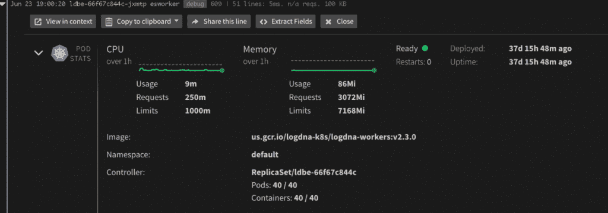
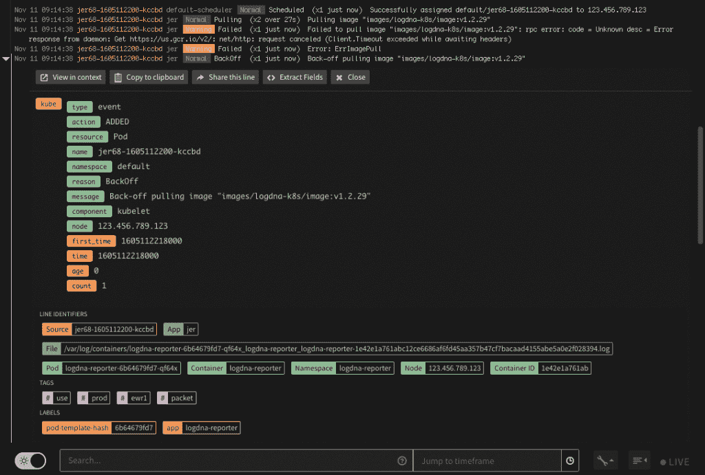

# log DNA“Kubernetes 富集”:自动化和简化的可观测性

> 原文：<https://thenewstack.io/logdna-kubernetes-enrichment-automated-and-simplified-observability/>

[Honeycomb](https://www.honeycomb.io/) 正在赞助新 Stack 对 Kubecon+CloudNativeCon 北美 2020 的报道。

不久前，当测试更容易显示代码是否工作时，应用程序日志数据和指标当然更容易访问。当然，虽然应用程序错误和安全漏洞会在以后显现出来，但与当今的多云端原生环境相比，开发人员和运营团队评估内部整体应用程序性能的工作通常没有那么复杂。

Kubernetes 环境的高度分布式世界已经让许多开发人员彻底改变了可观察性。一旦应用程序在众多的多云环境中发布，检测和修复由坏代码导致的应用程序性能滞后就变得异常困难。

为了解决必须手动解析通常多余的 Kubernetes 事件数据的困境，日志管理软件提供商 [LogDNA](https://logdna.com/) 推出了一个“Kubernetes Enrichment”平台，作为一个单一面板，用于观察 Kubernetes 环境的相关事件和资源指标，包括基础设施和部署的应用程序。

当他和他的团队创建 Kubernetes Enrichment 时，LogDNA 联合创始人兼首席技术官[刘辉](https://www.linkedin.com/in/leeliu/)说，他试图回答 DevOps 团队在 Kubernetes 环境中部署应用程序时经常遇到的以下问题:

*   两天前记录此事件时，群集、节点和单元的状态是什么？
*   CPU 峰值是多少？是否发生了内存不足(OOM)事件？
*   50 个豆荚里只有 40 个吗？是否发生了 [CrashLoopBackOff](https://sysdig.com/blog/debug-kubernetes-crashloopbackoff/) ？
*   部署在哪个图像标签上运行？

“像这样找到度量标准历史并不是不可能的。我们的 SRE 团队会梳理 Sysdig，并按照时间戳将事件与我们的日志进行排列，但是，这是一个非常耗时的手动过程。如果 LogDNA 可以自动捕获这些指标，并以一种易于理解的上下文方式呈现出来，自动按照时间戳排列，会怎么样？，”刘对新摞说。“当我们向一位早期客户演示 Kubernetes Enrichment 时，他们说得最好:“这就像拥有了所有的拼图，解决了 12 小时前的谋杀之谜。"

LogDNA 产品经理 Michael Shi 在本周的 [KubeCon + CloudNativeCon](https://events.linuxfoundation.org/kubecon-cloudnativecon-europe/) 上发表了关于 Kubernetes 浓缩的演讲。Shi 说，一个可观察性工具不应该包括一个陡峭的入门学习曲线，DevOps 团队成员也不应该是一个基础设施专家，以解释和应用什么指标和日志数据可能揭示的应用程序性能。他描述了 Kubernetes observability 应该是如何“完成你的工作，而不需要做大量的上下文切换或切换工具，只是为了获得你需要的信息，”他说。

一个可观察性工具“必须易于设置和开始——我们都知道，从字面上来说，没有一个工程师希望只是为了开始使用一个新工具而坐在那里参加培训会议，如果设置太难，即使是最强大的工具也不会对你有用，”施说。“我们都知道你不会把所有的时间都花在可观察性上。因此，很明显，易用性和易于设置对于实现有效的可观察性也至关重要。”

随着 Kubernetes environments 构建越来越复杂的应用程序，例如高基数数据或人工智能，Shi 表示，开发团队的客户已经表达了“关于确保他们的可观测性工具能够使他们的微服务团队能够解决他们的应用程序问题”的担忧

为此，施表示，Kubernetes 的丰富有助于确保“服务所有者在解决他们的问题时不会遇到瓶颈，或者不依赖于其他团队来解决他们特定的微服务问题。”

<svg xmlns:xlink="http://www.w3.org/1999/xlink" viewBox="0 0 68 31" version="1.1"><title>Group</title> <desc>Created with Sketch.</desc></svg>