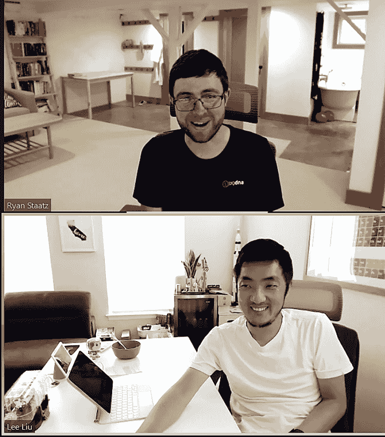

# LogDNA:可观察性支持 DevOps

> 原文：<https://thenewstack.io/logdnas-experts-tell-how-observability-enables-devops/>

对于 LogDNA 的员工来说，DevOps 完全是关于同理心，超越“烫手山芋”的思维定势，不担心某些事情，因为这不是你的问题，而是让整个团队一起努力应对共同的挑战。LogDNA 的根源在于解决了一个传统日志管理软件无法解决的问题——接收非结构化日志并对其进行结构化，这样开发人员或管理员就不必手工操作了。

该公司在自己的产品中采用了这种整体方法，构建了一个平台，使开发人员和现场可靠性工程师(SRE)都可以访问构建和维护软件所需的信息。

《新堆栈》采访了资深 LogDNA 系统架构师[瑞安·斯塔茨](https://www.linkedin.com/in/rcstaatz/)，以及公司联合创始人[刘辉](https://www.linkedin.com/in/leeliu/)，讲述了一家公司如何在大幅扩大规模的同时采用 DevOps 最佳实践，以及可观察性对 DevOps 的重要性，以及如何为多种类型的用户制作最佳可观察性工具。

LogDNA 的瑞安·斯塔茨和刘辉说，全栈可观测性有助于防止团队成员像处理“烫手山芋”一样处理问题

为了简洁明了，采访经过了编辑。

**新堆栈:您对开发运维的定义是什么？**

DevOps 是一个模糊的术语。它介于开发者和运营者之间。如果你看一下[维基百科](https://en.wikipedia.org/wiki/DevOps)，它会说这是一套非常具体的方法和实践，这是正式的定义。但是像大多数事情一样，一旦这个行业掌握了它，它就有了自己的定义。

而且，至少对我来说，DevOps 正在弄清楚如何为应用程序的生命周期构建内聚的生命周期，从代码开发到测试，再到将其推向生产，并获得反馈，整个循环。我觉得很多循环都有缺口，这取决于您的组织处于哪个成熟阶段。

当你真的很小，只有几个人的时候，让一两个人拥有整个生命周期并不困难。交流真的很快。随着你的成长，你有更多的团队和更多的人可以让你跑得更快。但是你现在有了这些间隙，它们开始出现在你的生命周期中，在那里一个应用可能在开发者交付之后，或者它可能在发布之间，或者你可能没有一个发布团队。

DevOps 的理念是，你拥有这些差距，你希望整个生命周期都工作。这种想法认为，虽然开发和运营在很大程度上被视为独立的实体，做着独立的事情，但它们有一些相同的目标。所以，我们应该团结一致。

**在许多组织中，开发人员和运营人员之间有哪些差距？**

**Staatz:** 我听到的关于开发和运营团队的抱怨由来已久，就是这个烫手山芋总是被扔出围墙。这是你想要避免的不健康的互动。在 DevOps，你有一个共同的目标，你正在努力。

你会在一些地方看到这样的态度，“我如何让这不是我的问题？”我认为，在一家可能没有预留所有资源或者可能没有所有正确流程的公司，这只是不幸的一部分。没有一家公司是完美的。

有些是因为随着公司的成长，你有了更严格定义的角色。当你到达一些共享的区域时，基本上很难说，“好吧，谁拥有它？”嗯，答案是，没有人真的。

没有神奇的解决方法，你知道吗？通常更多的是鼓励人们思考其他团队在做什么，思考他们为什么这样做。了解他们的目标，也许看看他们的工具。老实说，这需要一点努力。

刘:当开发和运营团队不一致时，我们看到的挑战之一是逆境风险。在航空业，你可以看到这个问题在几十年间加剧了。你往驾驶舱里看，你会看到一些很旧的东西，比如那台看起来像是我爸爸桌子上的电脑，对吗？飞机的其他一切都非常现代，比如座椅靠背电视等等。但实际技术似乎真的很老了。

我认为这可能是风险逆境带来的后果之一，因为运营团队遭受了太多次的损失。所以现在有了这些年发展起来的创伤后应激障碍。而运营团队就像这样，“只要不要做太多大的改变，然后事情就会更稳定。”

航空业面临的是当飞机坠毁时，有人死亡。所以，他们并不急于改变软件。软件可能从 1990 年就开始使用了，但它不需要改变。它会驾驶飞机，也会让飞机着陆。这就是它需要做的一切。它不需要现代化。

最终发生的是现在[你]使用 20 年前的技术，我不认为这是软件创业公司的正确方法。当然，部署新代码总是有风险的。但是这取决于我们使用工具——尤其是可观察性工具——来帮助促进当问题发生时，我们知道如何修复它们。

**可观测性能给 DevOps 带来什么？**

整个生命周期的一部分是找出问题出在哪里，对吗？反过来说，在这个生命周期中，我可以在哪里改进事情，使事情不会崩溃？

在一天结束时，可观察性就是获得周围正在发生的事情的细节。

有很多不同的工具可以帮助做不同的事情，而且通常是在生命周期的不同部分。它可能特定于基础架构的某个部分。它可能来自您的应用程序代码中正在向某个地方发送数据的内容。你可以拥有可以被记录的东西。它可以是度量标准。它可能是一种关注你的环境状态的东西。

> “你能做的最好的事情之一就是对那些开发代码或维护你的代码的人做一个乐善好施的人。”
> 
> **—Ryan Staatz，系统架构师，LogDNA**

因此，就出现了这种有趣的交集，就像我们之前谈到的，不同的团队在某些空间重叠，在这些空间中谁拥有什么变得不清楚。如果您有可观察性工具来帮助这两个团队实现他们的目标，并且希望他们的目标在某种程度上是一致的，那么这将是一个巨大的帮助。

我们开发了一个叫做 [Kubernetes Enrichment](https://docs.logdna.com/docs/kubernetes-enrichment) 的产品功能。它显示与该应用程序中的日志线相关的 Kubernetes 集群的状态信息，让您知道此时环境中是否出现了问题。看到这些信息对两个不同的团队非常有帮助，这是开发和基础设施人员的重叠。因此，它有助于澄清一个有些模糊的领域:在那个时间点可能会发生什么。

**如果没有 Kubernetes 浓缩产品，人们会怎么做？他们如何获得他们的 Kubernetes 日志？他们能接触到这些信息吗？**

**Staatz:** 我之前提到的差距加剧了一些复杂情况，其中有许多环境，尤其是生产环境，许多开发人员可能不允许访问，因此获取有关这些 pod 的信息可能需要登录到另一个工具，假设您有这样的设置。在我们的例子中，类似于 [Sysdig](https://sysdig.com/) 。但是它在对开发人员有用的度量标准的类型上是有限的。

你通常不需要任何工具就能做的是，你只是简单地说，“嘿，SRE 朋友，你能帮我看看环境吗？”到那个时候，想弄清楚发生了什么可能已经太晚了。因此，跨团队需要采取很多步骤，这通常会很困难。

这就涉及到了这样一个问题:如果你有其他工具，开发人员知道如何使用它吗？如果它没有被开发人员普遍使用，这又回到了同样的问题，有多少是个人动机——“我真的需要深入挖掘并做更多的事情”——这些组织过程有多少，有多少只是选择正确的工具？

**开发人员的可观测性需求与系统管理员或站点可靠性工程师(SREs)的需求有什么不同？**

【】刘:我会说，至少从日志的角度来说，我们尽量做一个双方都能用的工具。从来都不是完美的。所以，你只能迎合不同的观众，因为他们从根本上寻找不同的东西，他们理解不同的背景。

开发者其实并不关心别人的 app。他们关心的是自己编写的程序和需要调试的程序。他们对自己的应用程序的了解比他们对系统上运行的其他东西的了解要多得多，这些东西困扰着运行他们的应用程序的系统。

系统管理员和 sre 希望确保系统整体稳定。这更像是宏观和微观的对比。为了实现这一点，一切都需要表现得有凝聚力。

我们可以建立的工具可以尝试拥有不同的东西，这样每个人都有他们正在寻找的数据。但是拥有对双方都有效的工具绝对是一个挑战。

【Kubernetes 在可观测性方面面临哪些挑战？

Kubernetes 做了很多很酷的东西，很多内置工具，很多很棒的 CLI 东西，甚至是一个你可以使用的仪表盘。也就是说，跟踪运行在数百个节点上的微服务的指标和日志可能非常困难，即使你是一个 Kubernetes wiz，你知道所有的标签选择器和日志。

Kubernetes 是相当新的，它将随着时间的推移而成熟，但它可能很难追踪一切。即使是技术性的，也不是每个人都想一直使用命令行界面工具。Kubectl 很棒，但是在某一点上，你想要一个更加用户友好的工具。

**Lee，是什么技术问题促使你和** **Chris Nguyen 将重点放在** **LogDNA 的日志记录上？其他测井工具的哪些方面让您感到沮丧？**

**刘:**我们在 [Elasticsearch](https://www.elastic.co/) 上建立了我们的整个后端。我不喜欢 Elasticsearch 的一点——尽管它实际上不是 Elasticsearch 本身——是摄取部分。橡皮筋用 [Logstash](https://www.elastic.co/logstash/) 摄取原木。Logstash 的问题是，你需要告诉它你正在接收什么类型的日志，这样它就可以进行正则表达式过滤，丰富数据等等。

如果你有一个应用程序，这并不难，对不对？但是如果你也使用 [Mongo](https://www.mongodb.com/cloud/atlas?utm_content=logo-sponsorpage&utm_source=thenewstack&utm_medium=website&utm_campaign=platform) 或者 [Redis](https://redis.com/) ，Logstash 会变得有点难以维护，因为你有不同的日志源。因此，我们编写了自己的 ingestor，它基本上会接收日志传入的数据，并自动检测它是什么类型的文件，并自动解析它。

我发送给它的是什么样的日志并不重要，它会一般性地处理一些事情，而一些事情是非常具体的。如果它检测到一个博客，它会为博客做这些事情。如果它看起来像一个 MongoDB 日志，它会做这些与 MongoDB 相关的事情。

我们采访的一些其他公司谈到了 Elasticsearch，这是他们的问题，缺乏自动检测。他们必须手动完成所有这些事情。他们不想手动操作。

**当一家公司没有专门的 DevOps 人员或 DevOps 团队时，为什么跨团队的同理心如此重要？日志对此有什么帮助呢？**

**Staatz:** 我现在面临的一些挑战与其说是解决技术问题，不如说是从组织上解决这个技术问题。这是一系列不同的问题，因为我不能简单地进去修复产品。事情不是这样的。所以，很大程度上是要弄清楚是哪个团队在做这件事。

当你开始进入这种状态时，你会进入这种例行公事的询问，“嘿，你们在做什么？”当你试图完成你的工作时，你会不经意地对这些不同的团队产生共鸣，因为，你知道，在这一点上，这项工作可能包含不止一个团队。

生产是一个巨大而可怕的地方，你只是把你的应用程序运送到那里，对吗？你会说，“哦，我的应用程序在那里。我希望它有用。魔法吧？”这不是魔法。在电话的另一端，有人必须收拾你的烂摊子，或者如果有问题，让你收拾你的烂摊子。我知道，这是一种消极的思考方式。但是你能做的最好的事情之一就是对那些开发代码或者维护你的代码的人做一个乐善好施的人。

随着您作为开发人员变得更有经验，您会开始考虑一些基础设施每天都要处理的事情。因此，拥有涵盖这两个方面的日志和可观察性，并且两者可以合作，可以走很长的路。任何有助于建立这些桥梁、有助于建立信任并让人们保持一致的东西都很棒。

<svg xmlns:xlink="http://www.w3.org/1999/xlink" viewBox="0 0 68 31" version="1.1"><title>Group</title> <desc>Created with Sketch.</desc></svg>