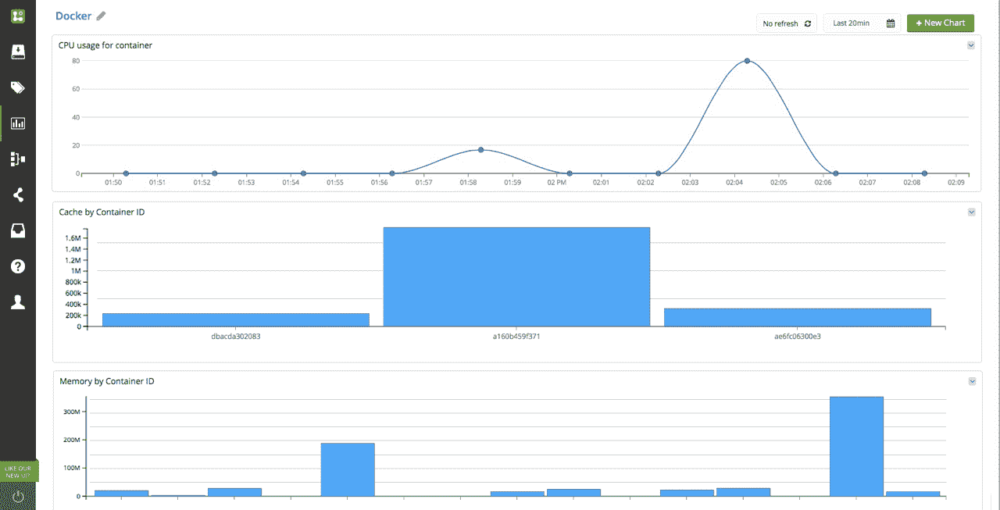

# Logentries 将 Docker 用于新的日志容器服务

> 原文：<https://thenewstack.io/logentries-pulls-performance-business-intell-data-docker-environments/>

日志和分析服务 [Logentries](https://logentries.com/) 已经推出了一个日志容器服务，该服务是使用通过[Docker 1.5 版本](https://thenewstack.io/docker-1-5-new-features-seen-markedly-improving-security-performance-amongst-docker-community/)提供的新功能专门构建的，包括新的 [Docker Stats API](https://docs.docker.com/articles/runmetrics/) 。

虽然 Docker 用户可以直接访问 Stats API 端点，但 Logentries 认为他们的新产品，包括 Logentries 容器和一个预配置(和可定制)搜索、标记和可视化的社区包，将使 DevOps 团队更容易更快地将日志功能编排到他们的整体 Docker 应用程序部署环境中。

“我们的 Docker Logentries 容器将监听所有其他 Docker 容器，”Logentries 的联合创始人兼首席科学家 Trevor Parsons 说。“有些事情我们想做:

*   使生产环境中的日志记录更容易，并且
*   利用 Stats API 来监控和理解容器环境中发生的事情。"

Parsons 发现越来越多的 Docker 用户在寻找不仅仅是监控和故障排除的日志解决方案，他们还使用统计数据来提供对应用程序用例的更深入的见解。

“人们通常会记录响应时间或价格计划的价值、应用程序性能、一些计时活动等信息，然后他们会将这些信息与 CPU 和内存相关联，以排除故障并了解他们应用程序的用户体验。通常你需要大量的信息来源:来自应用程序和 Docker 容器本身。

“但我们看到日志越来越多地用于分析方法和业务指标，以了解用户活动，并超越 IT 故障排除用例。应用程序开发人员希望跟踪动态变化时会发生什么。”

## 登录 Docker 的挫败感

日志功能的缺乏让许多 Docker 用户感到沮丧。2013 年底，Docker 的杰罗姆·佩塔佐尼在谷歌小组讨论中提出了这个问题。他指出，需要找到潜在的解决方案来改进捕获更多的日志源，并改进日志条目的使用方式。自去年 7 月中旬以来，该问题被转移到 GitHub 上的[公开提案中，有近 20，000 人对该问题感兴趣，超过 1600 人积极关注关于如何最好地记录 Docker 环境中的活动的讨论的更新。](https://github.com/docker/docker/issues/7195)

就在几周前，开发者布伦丹·杰温[寻求服务器故障](http://serverfault.com/questions/664021/neo4j-docker-coreos-logging-everything-to-the-console)的答案，以便更好地记录他的 Docker 环境。“我正在 Docker 中设置 Neo4j，以便在 CoreOS 集群中使用。该容器正在运行 Neo4j 控制台，我希望所有日志记录都转到控制台…这样我就可以使用 systemd journaling 从那里处理它。”

## 登陆 Docker 的六百万种方法？

Parsons 说，像 Jerwin 这样的开发人员面临的问题是“登录 Docker 没有标准和定义的方式。我们遇到很多人开始在生产中使用 Docker，并且有不同的方法。”Parsons 指出了从 Docker 登录的三种不同方式:

*   来自 Docker 容器本身的日志
*   来自主机的日志(这种方法不符合 Docker 的容器化原则)
*   创建一个标准化的 Docker 容器来为您记录日志(Logentries、[开源项目如 Fluentd](http://www.fluentd.org/guides/recipes/docker-logging) 和其他服务如 [Loggly](https://www.loggly.com/blog/centralize-logs-docker-containers/) 所采用的方法)。

去年 12 月，[Sumo Logic](https://www.sumologic.com/)——一种云原生日志分析服务——的首席技术官和联合创始人 Christian Beedgen 分享了[600 万种登录 Docker](http://www.slideshare.net/raychaser/6-million-ways-to-log-in-docker-nyc-docker-meetup-12172014) 的方法(好吧，幻灯片中实际上列出了 10 种)。与 Parsons 关于没有标准的评论类似，Beedgen 发现客户希望使用更复杂的日志记录实践来匹配各种用例，包括在一个容器中运行多个进程的情况下，当客户希望将日志写入 stdout 时，或者当他们在主机上运行 Sumo Logic 的收集器时，以及直接从应用程序进行日志记录时。

Beedgen 解释说:“所以基本上诀窍是——你如何获得数据，以便你可以收集它？如果您有一个基于文件的收集器，您需要首先将其转储到一个文件中。这可以编写脚本，但是脚本需要跟踪每个进出的容器，为每个容器调用 Stats API，并写入文件。这是可行的，但是对于脚本来说有点太复杂了。

“如果您的收集器支持 syslog，您还可以 netcat 到收集器正在侦听的本地 syslog 端口。好不了多少，但节省了编写和跟踪文件。

更好的选择是如果收集机制本身理解 Docker API。这实际上是我所理解的 Logentries 方法。基本上，有一个程序(在他们的例子中是基于 Node.js 的)知道如何跟踪容器的进出，对于每个新容器，调用 Stats API，然后将结果流式传输到收集点。

“这种方法也适用于通过 stdout 发出的容器日志——这基本上就是 [Logspout](https://github.com/gliderlabs/logspout "Logspout open source tool") 所做的事情。就我个人而言，我只会扩展 Logspout，在它已经支持的 stdout API 之上了解 Stats API。”

Beedgen 对 Docker 1.5 中 Stats API 的可用性印象深刻，并正在考虑如何将其功能添加到 Docker Hub 上已经可用的[相扑逻辑图像中。“我们基本上必须向收藏家添加 Docker 来源’的概念。我们已经有了本地文件、远程文件、系统日志、Windows 事件日志等源类型，因此收集器本身在这个意义上是模块化的。我们“只”需要添加一个 Docker 模块，该模块将基本上与 Docker 守护程序对话，跟踪进出的容器，附加到它们的 stdout 以作为日志传送，然后使用 Stats API 获取指标，最后，使用 Docker 守护程序事件流本身。”](https://registry.hub.docker.com/u/sumologic/collector/ "Sumo Logic on DockerHub")

Logentries 的 Parsons 相信，正是这种实际操作的配置将使他们的社区包具有通用工具和预配置的可视化和搜索功能，吸引那些希望能够在 Docker 生产环境中快速应用日志记录功能的 Docker 客户。“Docker 让他们的系统变得非常动态，拥有许多快速运转的短暂服务器。拥有一个集中的地方来收集这些信息对人们来说变得非常重要。”

图片**通过** Flickr 知识共享。

<svg xmlns:xlink="http://www.w3.org/1999/xlink" viewBox="0 0 68 31" version="1.1"><title>Group</title> <desc>Created with Sketch.</desc></svg>