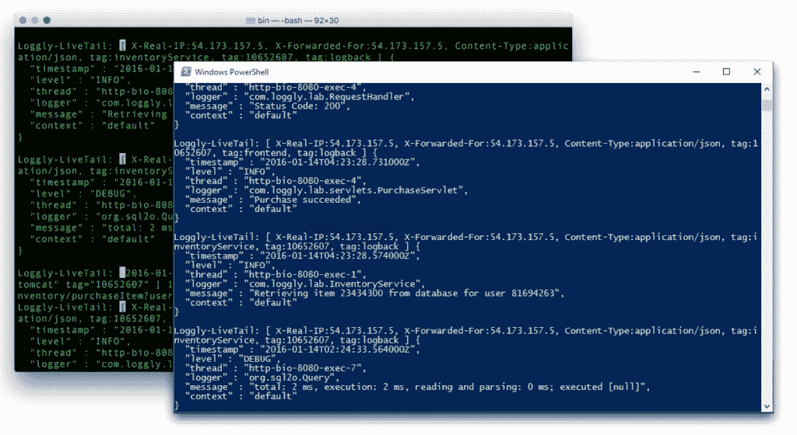
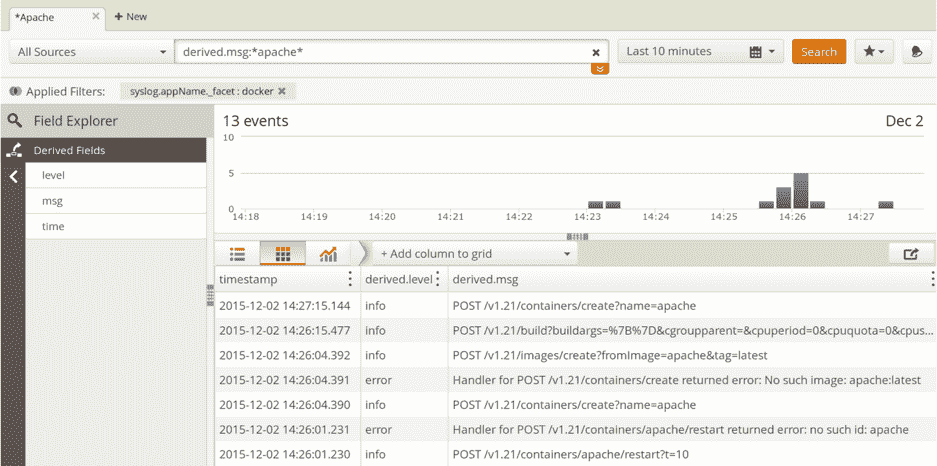
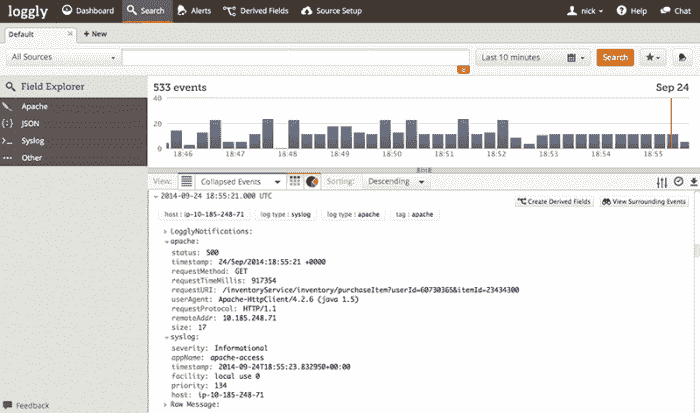

# Loggly 的 Live Tail 将所有事件整合到一个流中

> 原文：<https://thenewstack.io/loggly-wants-press-start-log-management-gdc-2016/>

日志管理服务提供商 Loggly 没有错过聚会的机会，而是来到了本周举行的旧金山[游戏开发者大会](http://www.gdconf.com/) (GDC)的会场。Loggly 将展示其技术如何惠及游戏开发者。

当人们想到开发人员时，他们最常想到的不是游戏的移动或基于云的平台的应用程序或软件。然而，Loggly 报告称，其许多用户实际上来自游戏行业。

当今许多大型游戏依赖于前端和后端技术，这些技术不仅收集大量用户数据，而且必须以近乎完美的正常运行时间比率可用。随着生成的日志数据量呈指数级增长，能够匹配现有堆栈复杂性的端到端可视化需求对于长期成功至关重要。

Loggly 产品营销高级总监[斯文·杜默](https://www.linkedin.com/in/svendummer)说:“只监控一个组件或一个子集就像操作一辆只配备了温度计的救护车。”。

如果你能在 GDC 2305 号展位停下来，Loggly 将展示其最近推出的 [Live Tail](https://www.loggly.com/blog/loggly-live-tail/) 产品及其数据记录功能。Live Tail 是该公司日志软件的企业订阅的一部分，是一个实时 CLI 工具，它将用户的所有日志整合到一个流中。

Live Tail 类似于 Unix 的 **tail -f** 命令，同时也为开发人员提供了在浏览器中工作的能力[，允许他们过滤、突出显示和分配用户权限。](https://www.loggly.com/blog/tail-f-revolutions-loggly-live-tail-enters-your-browser/)

在 Windows PowerShell 和 OSX 终端上运行

基于云的 SaaS 和 PaaS 解决方案使企业能够在弹性虚拟服务器上部署日益复杂的应用程序，其规模一度仅限于大型数据中心或财富 500 强企业。在具有不同应用程序组件的系统上运行数百甚至数万个单独的服务，会增加其中一个服务出现故障的可能性。

> 端到端监控的优势集中在提供一致的运行状况监控、发现安全问题、故障排除、调试和优化方面

## 容器、数据和您

Loggly 对容器监控采取了令人惊讶的深思熟虑的方法。Dummer 指出，大规模的容器监控取决于企业解决两个关键点:容器内部及其系统基础设施发生了什么，以及解决容器内部运行的服务的短期性质。容器是短暂的，终止时会带走有价值的日志数据。如果用户不采取预防措施从他们的容器中实时收集数据，这些数据将无法用于以后的分析。Dummer 指出，容器、单核和微服务是开发更加模块化、分布式和弹性系统的合理的下一步。

Loggly Docker 后台程序事件仪表板

Loggly 平台还为其用户提供了一种跨整个系统的数据收集方法——即使最终可能只监控选定的几个问题。

仅仅关注正在发生的事情是不够的，您的解决方案还需要让您能够分析为什么会发生这种情况。因此，Loggly 用户可以聚合和分析来自任何来源的日志数据，无论是基于云的、容器化的、系统、应用程序还是任何可以写入日志文件的连接组件。

日志文件在开发期间进行调试时特别有用，尽管它们在生产中也有助于错误监控和分析、性能调优和业务度量。Loggly 主要专注于深度日志数据分析，许多用例将其与高级监控平台(如 New Relic)结合使用。

## 展望未来:

数据记录、深入系统分析和端到端可视化的兴起没有显示出放缓的迹象。Loggly 目前报告称，自 2013 年以来，年增长率超过 450%，拥有 9，000 多名客户和 32，000 个活跃用户账户。

Loggly:事件解析仪表板

首次设置 Loggly 时，用户可以选择多种方式从其应用程序或系统发送日志数据，而无需安装任何辅助代理软件。Dummer 指出，Loggly 平台支持许多传输日志数据的方式，如 [Syslog 协议](https://tools.ietf.org/html/rfc5424)，同时为所有主要的编程框架、操作系统和服务提供库和集成，如 [AWS](https://aws.amazon.com/) 和 [Heroku](https://www.heroku.com/) 。

Loggly 试用用户或当前企业用户可以通过点击他们的 Loggly 菜单栏来查看 Live Tail。那些有幸参加 GDC 2016 的人可以通过玩自己的[短视频游戏](https://www.loggly.com/blog/game-developers-conference-2016/)来观看 Loggly 的活动。虽然这可能不是一个谈论数据监控的传统场所，但 Loggly 为信奉“只工作不玩耍会让一天变得无聊”这一口号设立了很高的标准

Docker 和 New Relic 是新堆栈的赞助商。

通过 Pixabay 的特征图像。

<svg xmlns:xlink="http://www.w3.org/1999/xlink" viewBox="0 0 68 31" version="1.1"><title>Group</title> <desc>Created with Sketch.</desc></svg>