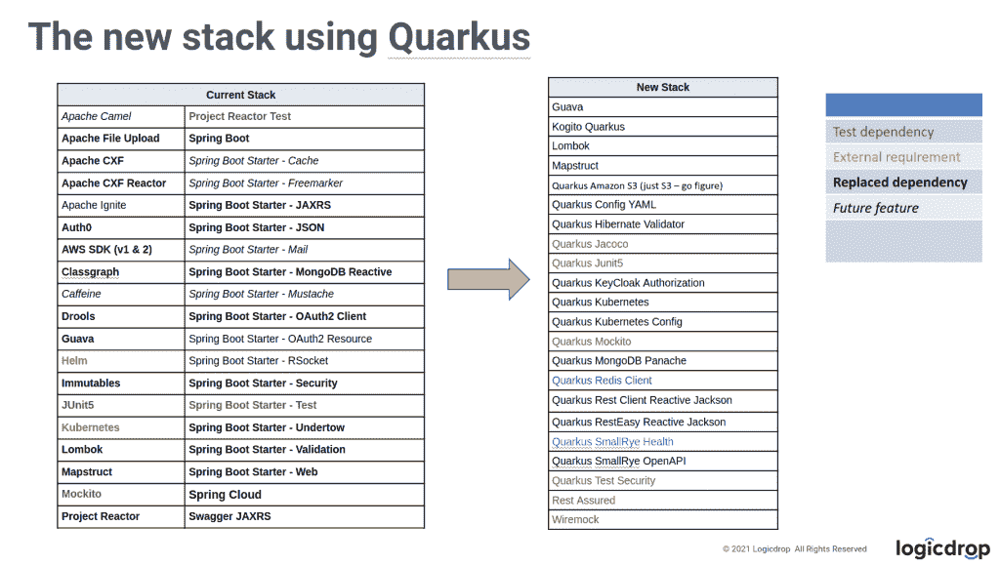
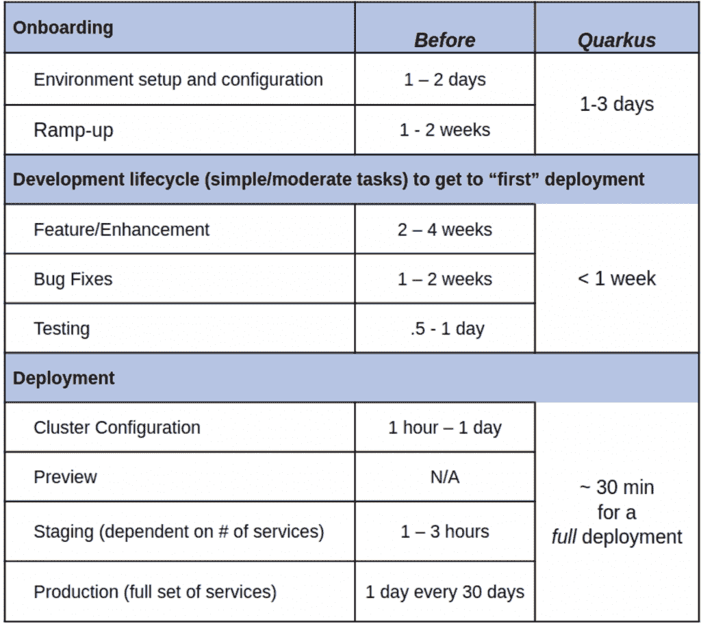

# Logicdrop，vaa din Tout Cloud Native Java Runtime quar kus

> 原文：<https://thenewstack.io/logicdrop-vaadin-tout-cloud-native-java-runtime-quarkus/>

当云开始接管企业应用程序托管时，许多开发人员也发现他们需要新的技术、语言和数据库来完成这项工作，因此出现了 JavaScript、NoSQL 和 Kubernetes。

 [亚历克斯·汉迪

亚历克斯是红帽公司的技术营销经理。在他之前的生活中，他报道了第一台 iMac 的发布，然后开始了 20 多年的科技记者生涯。](https://www.linkedin.com/in/alhandy/) 

既然云已经成为企业开发车间中的固定设备，那么将遗留应用程序带到云上是再自然不过的事情了。但是对于许多团队来说，决定如何做仍然是一个争论和讨论的问题。

对于在其环境中有大量 Java 应用程序的企业来说，Spring Boot 一直是企业 Java 用户通向云的必经之路。但是在 2021 年期间，Kubernetes-native 纯 Java 堆栈, [Quarkus](https://quarkus.io/) 开始成为 Java 应用程序通向云的替代途径。

现在，在 2022 年，这种增长促使 Quarkus 成为 Java 开发人员最热门的话题之一。它还允许公司采用新的堆栈。

这包括像金·约翰·奎因这样的开发者，他是 [Logicdrop](https://logicdrop.com/) 的联合创始人。他的公司开发了一个业务自动化平台，从用户那里抽象出复杂性，创建了一个在云中构建业务规则的低代码平台。

奎恩说，他的公司自 2010 年成立以来就一直使用 Java。他说他和他的团队被 Quarkus 提供的生产力和时间节省所吸引。

Logicdrops 的旧堆栈及其基于 Quarkus 的新堆栈。(注意，当前堆栈不包括其他“起始”或传递依赖项。)

奎恩说，不到一年前， [Logicdrop](https://quarkus.io/blog/logicdrop-customer-story/) 的团队采用了 Quarkus。“在六个月的时间里，我们将几乎 70%的平台移植给了 Quarkus，由两名工程师完成大部分工作。”

## 转移到夸库斯

Logicdrop 通过 CI/CD 指标跟踪 Quarkus 节省的时间。

Quinn 现在完全相信 Quarkus，并开始通过其镜头规划该公司 Java 应用的未来。

“我们曾经认真考虑过用其他语言来取代我们现有的大部分基于 Spring Boot 的平台，现在我们认为 Quarkus 是未来的发展方向，并且已经将其作为我们的主要平台进行了标准化。Quarkus 让我们使用我们都知道和喜爱的 Java 以及公认的标准 API。我们有一个更具凝聚力的微服务环境，任何技能的开发人员都可以在其中轻松工作，它非常适合我们的 CI/CD 流程，配置简单明了，开发人员工具也很可靠。锦上添花的是，我们获得了与 Node、Python 或 C#等其他替代产品相当的本机可执行文件。Quarkus 是一个令人耳目一新的变化，它确实让用 Java 开发又变得有趣了。”

Quinn 说:“Java 世界充满了各有千秋的框架和 API。“对于任何开发人员来说，这种过多的选择可能会让人不知所措，尤其是在构建一个需要高性能、可维护和灵活的产品时。Spring 几乎总是显而易见的首选，因为它的库非常丰富，它已经存在了很长时间，并且许多开发人员对它非常熟悉，但这正是我们寻找替代方案的原因。…我们既想要 Google Guice for DI/IoC 的简单性，又想要一个具有足够支持库的健壮平台，以更传统的 Java 方式满足我们的需求。夸库斯拥有我们需要的一切。”

由于 Spring Boot 有丰富的久经考验的生态系统支持它，该公司希望它能丰富开发流程，简化与各种 Java 和云技术的集成，使之更快更容易。

“最终，随着我们平台的增长，对配置的固执己见、注入魔法以及很少关于如何执行日常任务的明确答案的结合，我们发现自己正在处理一个越来越复杂和臃肿的系统，”奎因说。

“我们的核心产品，最初基于 Spring Boot，在 Quarkus 和 Kogito 公开之前就已经让 Drools 屈从了我们的意志。后来，我们增加了新技术，如反应流、Camel 集成和消息传递，”他说。

“尽管如此，我们平台的很大一部分，可能像许多其他平台一样，依赖于常见的安全、MVC(模型-视图-控制器)和 CRUD 的锅炉板方法。从我们需要什么，我们使用什么，我们如何使用它的角度来看，Spring 是多余的。更复杂的是，我们正面采用了 Kubernetes 和 Knative。使用 Spring Boot，我们的容器大小和启动时间太长，无法在我们的环境中很好地运行。”

奎因说，这是搬到夸尔库斯的主要胜利之一。

“当我们跳跃到 Quarkus 时，它极大地改变了我们的工作方式，并与 Kubernetes 和 Knative 一起开箱即用。我们需要的一切，甚至更多，在夸基星域都可以得到，而且在很短的时间内，我们就可以原型化一些通常需要我们花费很长时间才能完成的功能。”奎恩说。

Quinn 说，Quarkus 现在是该公司核心应用程序和其他一些项目的基础。

“我们转向 Quarkus，甚至在我们的早期实验中，我们就开始看到一切都有了显著的改善。我们从一到两周的第一次合并周期缩短到几个小时。直到今天，我们还在几个小时内推出产品。功能以闪电般的速度飞进飞出，我们已经能够让以前是节点开发人员和 Python 开发人员的开发人员加入进来，而且我们在整个 Quarkus 平台上每个人都有一个共同的理解。生产力是全面的。Quarkus 让我们专注于我们需要做什么，而不是如何先到达那里，”奎因说。

Quinn 特别喜欢 Quarkus 的工作方式，Java 开发人员不一定熟悉这种方式。

“安装没有问题。来自 Spring Boot 的东西把我们推上了顶峰:我们采用了 OpenID Connect 扩展，把它挂在 Keycloak 上，它工作了。举个例子，我们说‘让我们把它扔进 Auth0，看看会发生什么。’我们确信它会爆炸。我们发送了它，我得到了一个 401 HTTP 错误。这正是我想要的。我们说‘让我们得到一个令牌’，它就登录并执行了。当单个属性发生变化时，我们在 Keycloak 和 Auth0 之间来回切换，一切都运行起来，”Quinn 说，并解释了将 Quarkus 景观与 Kubernetes 认证过程联系起来是多么容易。

## 从社区项目到官方支持的整合

[Vaadin](https://vaadin.com/) 的高级开发人员马蒂·塔沃宁说，Quarkus 也提高了其开发人员的生产率。该公司为 Java 应用程序提供了一个 web 框架，使现代浏览器能够进行现代 UX 开发，同时仍然在幕后使用 Java。

因为 Vaadin 为 Java 开发人员提供了一个 UI 框架，他们可以很容易地看到其中的趋势，它看到 Quarkus 正在获得动力。

迄今为止，Spring Boot 与 Vaadin 的集成是最深的，因为 Spring Boot 是许多 Java 开发人员最受欢迎的云之路。Vaadin 在 Java EE 服务器上也有很多用户，还有一些公司希望在普通 servlet 容器上构建自己的栈。塔沃宁说，最近也有对夸库的需求。

但是，Vaadin 现在为 Quarkus 提供官方集成的原因不仅仅是因为客户要求这样做——该公司已经选择与 Quarkus 一起构建其大型产品。事实上，在 Vaadin 有机会构建自己的社区集成工具之前，一些客户已经为 Vaadin 和 Quarkus 构建了社区集成工具。塔沃宁说，需求是存在的。

他看到的转向 Quarkus 的客户大多来自 Java EE 服务器。

“所以，如果他们过去一直使用 JBoss，现在他们正在寻找 Quarkus 作为 Spring Boot 的替代品，因为 Spring Boot 已经完全改变了人们打包和部署他们的应用程序的方式，Quarkus 正在做类似的事情，所以服务器是应用程序的一部分，而不是相反，”他说。

Quarkus 是纯 Java，就像 Vaadin 一样，这是 Tahvonen 和他的团队喜欢的另一点。

“夸尔库斯和瓦丁是一个伟大的组合，”塔沃宁说。“Vaadin 是纯 Java，只有 Java。没有 XML，没有 HTML，没有 CSS，除非你想得到更低的抽象层次。你可以用一种语言工作。Vaadin 最大的好处就是不需要在语言和执行平台之间做上下文切换。”

## 向前迈进

虽然 Java 可能被视为一种更古老的语言，但 Quarkus 正在帮助世界各地的公司实现其核心应用程序的现代化，以进行云部署。迪卡侬能够在一周内从 Spring Boot 到达夸尔库斯。[神符使用 Quarkus](https://quarkus.io/blog/abraxas-customer-story/) 为瑞士政府税务机构构建其新税务解决方案的主干。[沃达丰希腊](https://quarkus.io/blog/vodafone-greece-replaces-spring-boot/)在 Spring Boot 迁移了几十个应用程序并提高了性能。

Quarkus 为企业 Java 开发人员提供了许多现代奢侈品。从更快的启动和休眠响应时间，到更小的内存占用，Quarkus 可以在容器中使用，而不会让主机服务器承受过多的普通和传统的 Java 开销。而且它是开源的，所以如果开发者想回馈社区，他们可以为它做出贡献。

<svg xmlns:xlink="http://www.w3.org/1999/xlink" viewBox="0 0 68 31" version="1.1"><title>Group</title> <desc>Created with Sketch.</desc></svg>