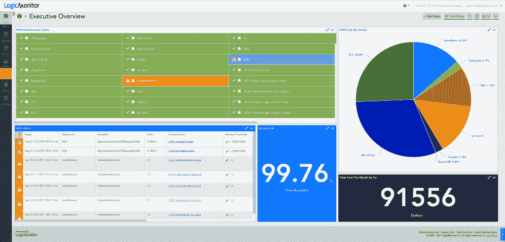
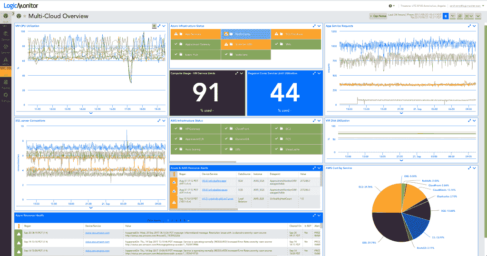

# LogicMonitor 扩展到与云无关的监控领域

> 原文：<https://thenewstack.io/logicmonitor-adds-cloud-agnostic-monitoring/>

提供托管性能监控的 LogicMonitor 发布了 [LM Cloud](https://www.logicmonitor.com/lmcloud) ，这是其专门为云服务定制的监控套件的扩展。

该公司专注于支持复杂的混合 IT 基础架构，认为帮助客户过渡到云需要一种与云无关的监控解决方案。LM Cloud 加入了该公司旨在监控网络、服务器、应用程序和网站的工具组合。并且增加了与 [Azure](https://azure.microsoft.com/en-us/?v=17.14) 的集成；该服务的上一次迭代只针对亚马逊网络服务。

在对领先的云行业分析师、媒体、顾问和供应商策略师的持续调查中，LogicMonitor 发现 73%的受访者也认为 Azure 将在未来三年内在 AWS 上取得进展。

LM Cloud 由三个组件组成:资源性能监控、ROI 分析和云提供商可用性监控。它建立在一些现有功能的基础上。

“我们能够引入[AWS] [CloudWatch](https://aws.amazon.com/cloudwatch) 指标，这是资源监控的一个组成部分。我们将它们存储在我们的时间序列数据库中，这意味着您可以保留两年，而不是亚马逊的[较短]保留期。但我们没有一种简单的方法来将 CloudWatch 指标与相同设备的集体指标结合起来，”LogicMonitor 创始人兼首席传播者[史蒂夫·佛朗西斯](https://www.linkedin.com/in/francissteve/)说。“你可以做到这一点，但不是那么容易。我们现在给你一个更加统一的视图——即使是像 [RDS 系统](https://aws.amazon.com/rds/)上的内存使用情况或 [EC2 系统](https://aws.amazon.com/ec2/)上的磁盘空间这样的事情，CloudWatch 也不会告诉你。”

在带有 LM Cloud 的云中运行 LogicMonitor 收集器提供了一个统一的视图。如果您在 EC2 实例或 Tomcat 上运行 NGINX 或 MySQL，它会提供垃圾收集指标和趋势、查询缓存利用率等信息。他说，以前是可以的，但明显需要更多的手动操作。

现在，您可以获取事件数据，并将其覆盖在您的性能图表上。它提供了实例失效消息，检测所有保留的实例，以便在到期时间即将到来时向您发出警告，这样您就可以更新它们或者让它们到期并关闭它们。它增加了云提供商监控组件，包括 Amazon 和 Azure 性能更新。

LM Cloud 还提供了云提供商服务从您自己的数据中心的可达性指标。

下周，在亚马逊的云计算大会 AWS re:Invent 上，该公司计划推出额外的 LM Cloud 自动计费仪表板功能，这些功能有望准确分解 AWS 服务从地区到服务到运营的消费方式。

## 迁移到云

LogicMonitor 的客户主要分为三类:软件即服务公司，该产品是为其设计的；托管服务提供商和企业。

“迁移到云的客户几乎总是在他们自己的数据中心运行他们自己的基础架构，因此如果他们正在访问云组件，我们可以进行测量，例如 API 调用的响应时间等。，展示他们的服务器是如何运行的。这才是对[服务提供商]真正重要的，可达性和性能，”弗朗西斯说。

该服务还取消了在职限制。Amazon 和 AWS 提供的服务中，一个帐户将允许用户运行 100 个 EC2 实例。很多客户并没有意识到这一点。LogicMonitor 的服务纳入了亚马逊和微软在所有地区实施的所有服务限制，并跟踪与它们相关的实际使用情况。

Francis 讲述了一个客户，他重新设计了软件以利用动态伸缩，打开了服务并了解到这是超出其限制的两个 EC2 实例。该公司不知道有一个极限，也不知道它离极限那么近。如果出现需求高峰，在遇到硬停止或请求更多实例之前，只能再运行两个实例。

他说，LM Cloud 是其基本监控服务的附加产品，提供所有的仪表板、预测和报告，因此客户可能会使用较小的基本产品部署和较大的 LM Cloud 部署。

“从内部基础架构过渡到基于云的基础架构可能会导致不稳定的可见性差距。因此，混合就绪监控已成为该流程的绝对关键任务。LogicMonitor 总裁兼首席执行官 [Kevin McGibben](https://www.linkedin.com/in/kevin-mcgibben-aa45a8/) 表示:“LM Cloud 能够更好地洞察云部署，从而提高控制力并降低风险。

弗朗西斯解释说，复杂的混合技术是它的强项。“在任何有多个数据中心和云的情况下，这就是我们努力超越的地方，”弗朗西斯说。

T2 公司整合了来自 1000 多家供应商的技术。它在八月增加了 [Kubernetes](https://www.logicmonitor.com/blog/introducing-kubernetes-monitoring-by-logicmonitor/) 监测。客户包括金融服务公司[施罗德](http://www.schroders.com/)、[贝宝](https://www.paypal.com/us/home)和 [eTrade](https://us.etrade.com/home) 。

在 SaaS 基础设施监控领域，LogicMonitor 与 Datadog 等公司竞争；在服务提供商领域，这更像是[科学逻辑](https://www.sciencelogic.com/)，尽管这涉及现场监控硬件，Francis 表示，随着公司缩小数据中心的规模，他们希望避免这种情况。

根据 BigPanda 的[监控状态](http://start.bigpanda.io/state-of-monitoring-report-2017)报告，关于监控的期望正在改变，[注意到](https://thenewstack.io/parity-check-expectations-around-monitoring-changed/)新的 Stack 分析师 [Lawrence Hecht](https://thenewstack.io/blockchain-hot-react-js-top/) 。这不仅仅是为了快速预防和修复服务中断，也是为了提高敏捷性。与此同时，需要监测的事件数量增加了。

微软是这一新技术的赞助商。

通过 Pixabay 的特征图像。

<svg xmlns:xlink="http://www.w3.org/1999/xlink" viewBox="0 0 68 31" version="1.1"><title>Group</title> <desc>Created with Sketch.</desc></svg>