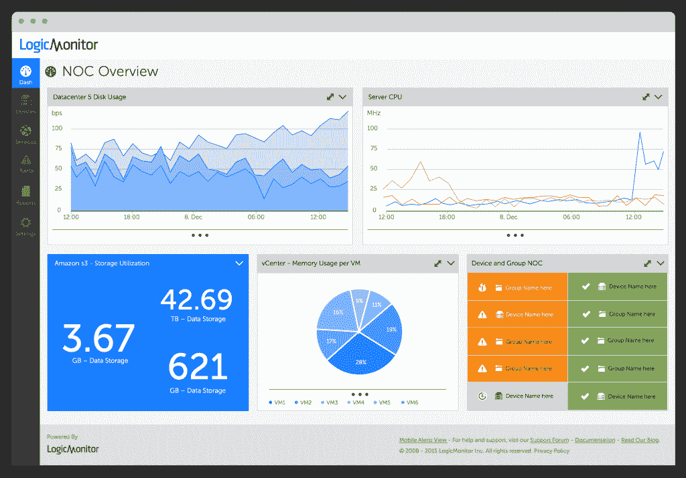
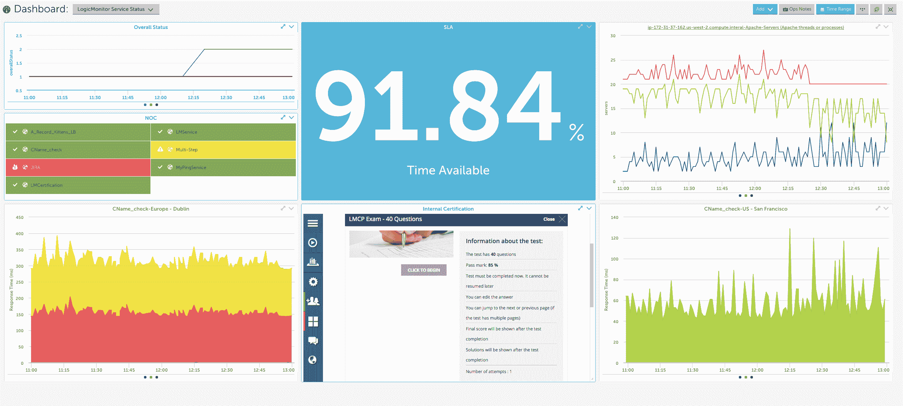
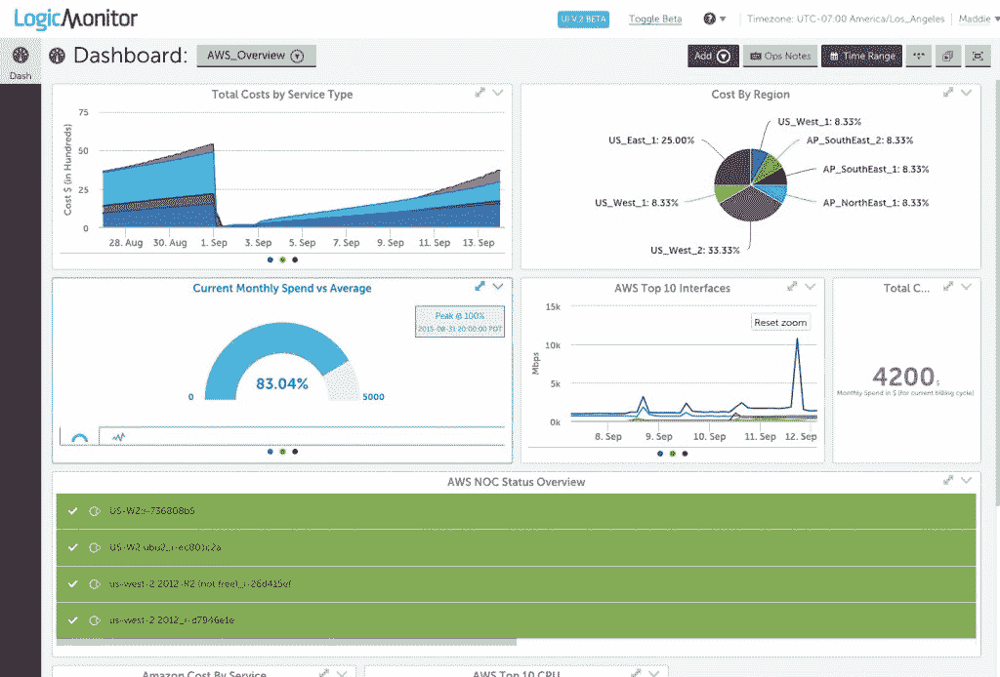

# “这是我一个人的事吗，”LogicMonitor 可能有答案

> 原文：<https://thenewstack.io/logicmonitor-brings-visibility-needed/>

随着企业继续在其应用架构中转向基于云的解决方案，获取运营性能信息对于成功至关重要。企业需要了解其组织的各个部分是如何结合起来形成一个有凝聚力的整体的。这就是 LogicMonitor 介入的地方，它为公司提供了一种方式，不仅可以监控其底层基础设施，还可以查看整个数字森林，而不仅仅是一行树。

该公司提供单一服务，可以监控最新的容器和最老的遗留应用程序。

“刚刚推出的工具只是进行集装箱监控，却遗漏了 99%的信息。容器不会自己运行。LogicMonitor 创始人兼首席产品官史蒂夫·佛朗西斯说:“我们有 40 年的应用程序不会消失。

LogicMonitor 提供了一项服务，可以消除为获得系统概览而摆弄多个产品的需要。LogicMonitor 的客户范围广泛，从那些仍在试验容器并转向基于云的解决方案(如 AWS 或 Azure)的客户，到那些拥有大型内部数据中心、运行传统应用程序的客户。

LogicMonitor 的产品管理总监 Annie Dunham 指出，最初，该公司出于整合工具蔓延的需要，而不是为那些局限于内部解决方案的产品提供服务。将这些工具集中在一起，而不是使用单独的组件来实现虚拟化、网络存储或容器健康，可以节省时间和金钱。

“将这些信息都放在一个地方意味着出现问题时可以减少相互指责。LogicMonitor 首席执行官凯文·麦吉本(Kevin McGibben)说:“没有这些，‘嗯，我的所有*部门都在工作。*

 LogicMonitor 为 DevOps 和 IT 运营团队描绘了一幅独特的画面，允许用户不仅监控他们在 Amazon AWS 上运行的应用程序，还可以监控内部和通过其他基于云的提供商运行的应用程序。

它允许用户从多个位置监控他们的 web 服务，而不必考虑企业可能使用的物理硬件。

“你可以运行 PDP 11 或旧的 Solaris 系统——我们仍然可以提供一张图片，”弗朗西斯说。

LogicMonitor 由运行在 Amazon Web Services 上的 Java 的 Tomcat 提供支持。亚马逊的简单队列服务( [SQS](https://aws.amazon.com/sqs/) )处理组件间的消息传递。这种设置与 AWS 监控相吻合，后者通过 AWS 的 [CloudWatch](https://aws.amazon.com/cloudwatch/) 获取信息。

LogicMonitor 河床钢头 WAN 设备监控

对于那些在 Docker 中工作的人来说，LogicMonitor 通过其容器服务从 Docker 的角度监视实例。JMX 指标也很容易获得，在未来的更新中还将集成容器编排。

如果用户有静态容器，或者只想知道他们的容器是向上还是向下，他们现在可以在 LogicMonitor 中这样做。

紧随其后的是增加更多的服务功能，LogicMonitor 将于下周在澳大利亚开设一个新的测试点。

## 避免“这只是为了我吗？”

企业网站宕机，钱就没了。LogicMonitor 除了提供网站 ping 监控、数据/跟踪路由等功能外，还提供外部功能检查。无论一个企业是基于媒体的公司，出版，或电子商务，登陆页面和购物车页面必须是功能性的。

“没有人想去一个网站或网上购物车，并得到一个错误。弗朗西斯说:“他们会想，‘哦，太好了——他们甚至不能确保他们的网站正常工作。

LogicMonitor 使用自己的内部技术。在检查登录页面正常运行时间时，该公司注意到营销系统上的中断，而这些系统本应获得 100%的正常运行时间。抓住这一点不仅可以节省时间，还可以在发生重大客户流失之前留住客户并收回成本。

通过 Pixabay 的特征图像

<svg xmlns:xlink="http://www.w3.org/1999/xlink" viewBox="0 0 68 31" version="1.1"><title>Group</title> <desc>Created with Sketch.</desc></svg>