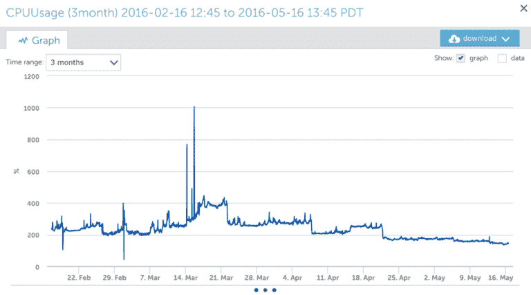
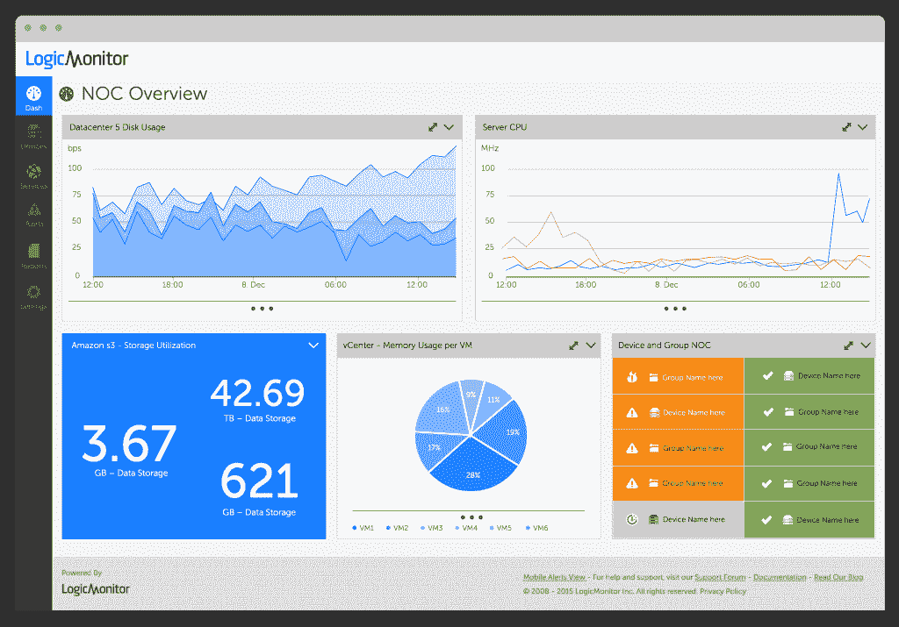

# LogicMonitor 滚动时间序列数据库以获得更精细的报告

> 原文：<https://thenewstack.io/logicmonitor-debuts-time-series-database/>

随着应用程序监控软件不断发展，可以处理越来越多的数据点，以及数据查询、存储、访问、传输和维护方式的变化。 [LogicMonitor](http://www.logicmonitor.com/) 开发并发布了用于其基础设施监控服务的时序数据库(TSDB ),而不是利用今天可用的许多面向流的数据库系统中的一个来处理如此混乱的工作负载。

问题是:为什么？

LogicMonitor 联合创始人兼首席技术官[宋杰](https://www.linkedin.com/in/jie-song-3018101)给出了这一选择背后的三个主要原因。

首先是性能。通过添加自己的 TSDB，LogicMonitor 现在可以在单个节点上支持每秒 800，000 次插入。该数据库还支持多变量时间序列，例如，LogicMonitor 报告称，这将允许用户以平均每秒 600 万个指标运行潜在的多达 7.5 个指标。

" [OpenTSDB](http://opentsdb.net/) 和 Sensu 不支持无损压缩。我们使用自适应压缩技术，对于浮点数，我们得到 10:1 的压缩比，对于其他数据类型，我们得到更高的压缩比，”宋说。自适应压缩技术根据被压缩数据的类型来改变压缩算法，从而更有效地利用系统资源。

LogicMonitor TSDB: CPU 使用情况图表

Logic Monitor 的时序数据库的第二个好处是它的数据模型兼容性。虽然 Logic Monitor 从一开始就有一个多变量时间序列模型，但这种方法允许用户轻松完成模式级操作。

Song 指出，LogicMonitor 希望通过研究时间序列关联、预测和基于流的分析等功能，为 TSDB 技术在监控领域的未来铺平道路。

虽然它在 TSDB 的新作品令人兴奋，但 LogicMonitor 在这样做的同时也面临着挑战。其中包括在将客户数据从一个 pod 迁移到另一个 pod 时，如何最好地使用基于 pod 的体系结构，大规模的模式更改，以及查询性能的改进。

## 获取更详细的信息

LogicMonitor 从上传数据到传统的[循环数据库](https://jawnsy.wordpress.com/2010/01/08/round-robin-databases/) (RRD)的转变令人惊讶。十多年来，监控平台一直将 RRD 作为处理大量数据的首选方法。虽然一些公司也热衷于使用 SQL 和 NoSQL 数据库，但 LogicMonitor 联合创始人兼首席产品官史蒂夫·佛朗西斯解释说，与 RRD 大规模合作并不总是阳光和玫瑰。

“RRD 系统通常设置为在一天后整合原始数据，现在图表只能显示整合后的样本。现在，开发人员和管理员不再关注 CPU、每秒请求数、API 调用延迟、一分钟内的网络流量，而是关注 15 分钟间隔的整合数据。这使得我们无法确定在事件开始时什么是第一位的，”弗朗西斯说。

LogicMonitor 仪表板

LogicMonitor 的 TSDB 是使用 Java 开发的，它的垃圾收集抢了数据密集型应用程序的风头。“当发生完全垃圾收集时，整个应用程序可能会挂起几十秒钟。我们做了大量工作来处理这种情况，实现了我们自己的 slab 分配，使用 cuckoo hash 来存储大型数据集、对象池和参数调优。现在，系统每三个月触发一次完整的垃圾收集，”宋解释道。

处理未聚合的数据为当今的监控提供了多种选择。Francis 预测 TSDB 技术的未来是光明的，LogicMonitor 希望为该技术的未来发展铺平道路。阈值指导、识别与单个用户问题相关的时间序列流和粒度算法重放功能只是 LogicMonitor 新的 TSDB 驱动数据集的一部分，开发者可以期待这些功能。

LogicMonitor 没有立即将数据库软件作为开源软件发布的计划。

通过 Pixabay 的特征图像。

<svg xmlns:xlink="http://www.w3.org/1999/xlink" viewBox="0 0 68 31" version="1.1"><title>Group</title> <desc>Created with Sketch.</desc></svg>