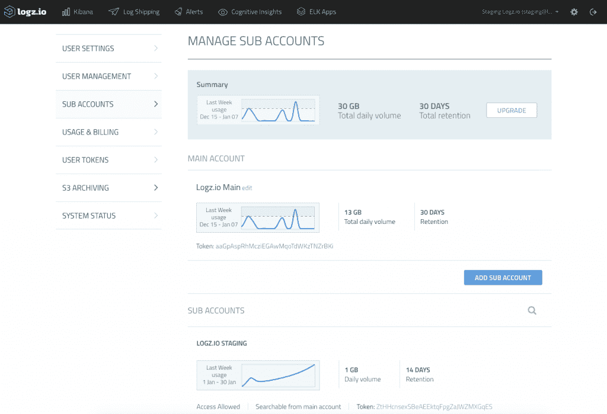

# Logz.io 添加了成千上万的 Cast 来帮助日志分析

> 原文：<https://thenewstack.io/logz-adds-cast-thousands-help-log-analysis/>

在一系列采用[机器学习](/category/machine-learning/)的新云日志供应商中， [Logz.io](http://logz.io/) 将众包加入其中。

“我不会为了找到三个有问题的日志行而在一天之内检查 1tb 的数据。我不打算手动操作，但系统可以。Logz.io 的联合创始人兼产品副总裁[阿萨夫·伊加尔](https://twitter.com/asafyigal)解释道:“我们会说，‘你应该看看你的数据中的三行，这是你应该看看的原因。’

然后，该软件将引导你在线讨论该问题，并通过监控你对其建议的反应，调整其算法，以学习在未来提供更好的见解。

众所周知，It 运营和安全团队被其监控和日志记录解决方案中产生的大量数据所淹没。云访问安全中介 [Skyhigh Networks](http://info.skyhighnetworks.com/IT-Security-in-the-Age-of-Cloud-Survey-Report.html?Source=website&LSource=website) 的一项调查发现，平均每个月企业处理 27 亿次云事件，但其中只有 2500 次事件构成“异常”，其中只有 23 次是实际的安全事件。

云日志市场已经挤满了新进入者，包括收购了 Logentries 的 [Sumo Logic](https://www.sumologic.com/) 、[rapid 7](https://www.rapid7.com/)； [Graylog，](https://www.graylog.org/) Loggly， [Papertrail](https://papertrailapp.com/) ，被网络安全管理软件产品收购； [LogDNA](https://logdna.com/) ， [Anodot](http://www.anodot.com/) ， [MoogSoft](https://www.moogsoft.com/) 和 [Sematext](https://thenewstack.io/sematext-monitoring-logs-together/) 。

大多数人已经加入了机器学习的潮流，[fix fix IO](http://fixate.io/)分析师 [Chris Riley](https://twitter.com/HoardingInfo) 此前告诉 The New Stack，尽管大多数[机器学习能力](https://thenewstack.io/logdna-aims-make-logging-predictive-machine-learning/)仅仅是智能统计。

Yigal 对监控异常的整个方法持有异议。

“[这种方法说]如果我的负载在增加，这是一种异常，我应该对此发出警报。如果 CPU 正在增加，我应该发出警报。如果我看到一个我从未见过的异常，我应该关心它并得到一个关于它的警报。这种方法的问题是 IT 环境是一个巨大的异常，”他说。

“负载可以增加，因为我有更多的客户，这是一件好事。问题可能是因为每天凌晨 4 点运行的测试，这是一件好事。仅仅因为某些东西是异常的，并不意味着它是一个问题。问题并不总是表现为异常，所以这种方法无助于解决问题。”

其核心产品是托管的 [ELK stack](https://www.elastic.co/videos/introduction-to-the-elk-stack) (Elasticsearch、Logstash 和 Kibana)，具有基于角色的访问、多因素身份验证和 SOC 2 合规性认证等企业级功能。它还提供了一套[免费麋鹿应用](https://app.logz.io/#/apps)，如 S3 桶访问，MySQL-monitor，Nagios 关键警报可视化等等。

8 月，它增加了其专有的认知洞察层，结合了[监督的机器学习](http://logz.io/blog/machine-learning-log-analytics/)和人类与数据的互动。它说，它的工作方式类似于谷歌的 PageRank 算法和亚马逊对日志数据的产品推荐。

[https://www.youtube.com/embed/ozGg-mvoI14?feature=oembed](https://www.youtube.com/embed/ozGg-mvoI14?feature=oembed)

视频

Yigal 说:“我们认为，解决 IT 环境数据过载问题的方法是将人类智能与机器能力结合起来，人类智能知道如何从一开始就提出问题，机器能力可以处理世界各地数以百万计的线程，并理解它们的上下文——它指的是哪种产品，它有多重要，等等。”

“我们有来自不同系统的大约 30，000 个不同的见解，例如某个安全见解正在用安全签名搜索一堆网站，以及来自不同产品的 IT 操作，如 SQL Server、Elasticsearch 和所有知名的 web 服务器……”

该系统从用户论坛、谷歌群组、GitHub 和其他讨论中收集信息，并实时将它们与你日志中的内容进行匹配。

“[例如]我们一直在您的日志中搜索所有可能的 SQL 异常；一旦有事情发生，我们会告诉你这是你应该知道的事情，这里有一些关于这个问题的讨论。你可以问任何你想知道的事情。…我们正在做的是实时询问所有人曾经问过的关于你的数据的所有问题，并给你关于你的数据中什么应该是有趣的见解，”他说。

该系统还在学习人们实际上是如何与洞察力互动的。因此，如果系统说‘这很重要’，而对你来说，它真的不重要，那么算法就会相应地调整。但是，如果你设置了关于它的提醒，或者转发了洞察力，它会得到积极的强化，并继续在那个洞察力上工作。

Logz.io 用户可以在主账户下创建多个子账户。

Logz 的工程团队于 2014 年底由以色列人[Tomer Levy](https://github.com/tlevy)和 Yigal 成立，虽然它在波士顿有一个营销和销售办公室，但仍留在特拉维夫。

Logz 坚持认为，它可以帮助客户从日志数据中发现并减轻问题，以免它们成为影响生产的问题。

它的客户包括电子艺界、英国航空公司和互联网性能管理公司 Dyn，该公司认为 Logz.io 帮助它处理了 10 月份的 [DDoS 攻击](http://dyn.com/blog/dyn-analysis-summary-of-friday-october-21-attack/)，该攻击暂时关闭或减缓了许多热门网站，如 Twitter、Spotify、Reddit 等。

Dyn 的执行主席[吉姆·鲍姆](https://www.linkedin.com/in/jimbaum/)在一份准备好的声明中说:“积极参与 Dyn 的工作，我亲眼看到 Logz.io 在我们快速响应和缓解我们最近经历的前所未有的 DDoS 攻击的能力中发挥了多么重要的作用，帮助我们评估来源、目标和使用的协议。”。鲍姆也是 Logz 的董事会成员。

在一个案例研究中，Dyn 解释了它如何整合一直用于监控日志文件的手动流程，并且现在已经与该公司一起扩展，该公司现在有 130 多名用户监管其 18 个全球数据中心。

安全公司 [Malwarebytes](https://logz.io/case-studies/) 使用 Kibana 来可视化来自其后端 Ruby、Golang 和 JavaScript 应用程序的数据，但再也不能花时间培训开发人员来解析和处理日志。它引用了自动解析和易用性作为决定使用 Logz.io 的核心，并报告了改进的解决时间。

家具公司 [Rent-A-Center](https://logz.io/case-studies/rent-center-uses-logz-ios-cognitive-insights-tackle-irregularities-log-data/) 创建了两个不同的 ELK 堆栈，一个在内部，一个在云中。它每天接收超过 100GB 的数据，并努力优化性能和可靠性。在试运行阶段，Logz 提醒该公司注意多次失败的 root 登录尝试，这些尝试是 Rent-A-Center 以前没有检测到的，这增强了该公司对新供应商的信心。

通过 Pixabay 的特征图像。

<svg xmlns:xlink="http://www.w3.org/1999/xlink" viewBox="0 0 68 31" version="1.1"><title>Group</title> <desc>Created with Sketch.</desc></svg>