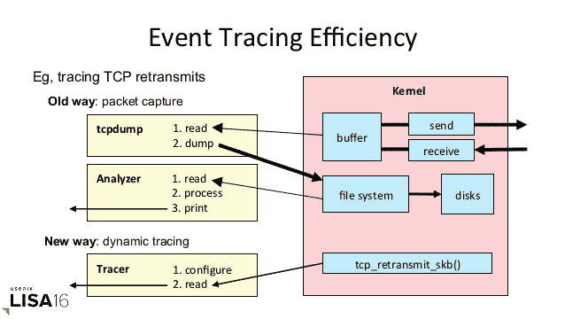
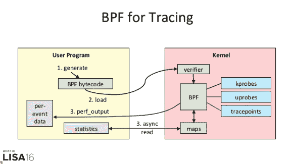

# 最终，Linux 获得了动态跟踪

> 原文：<https://thenewstack.io/long-last-linux-gets-dynamic-tracing/>

当 [Linux 内核](https://www.kernel.org/)版本 4.9 将于下周发布[时，它将提供一些期待已久的动态线程跟踪功能所需的最后几个部分。](http://www.phoronix.com/scan.php?page=news_item&px=Linux-4.9-rc8-Kernel)

随着监控和调试软件的管理员开始使用这些新的内核调用，其中一些是在过去两年中添加到 Linux 内核中的，他们将能够提供更加细致入微、更易于部署的系统性能工具，网飞性能系统工程师、 [DTrace Tools、](http://www.brendangregg.com/dtrace.html)的作者 [Brendan Gregg](http://www.brendangregg.com/) 在本周于波士顿举行的 [USENIX LISA 2016](https://www.usenix.org/conference/lisa16) 会议上发表演讲时指出。

有了这项工作，即使是备受宣传的动态跟踪工具 [DTrace](http://dtrace.org/blogs/about/) 也可以完全移植到 Linux 上，这是 Linux 内核黑客们长久以来的梦想。

在过去的几年中，最初的 Unix 性能系统软件供应商(通常是专有的)提供的系统指标不完整。“我们这些做性能分析的人变得非常擅长阅读茶叶，”Gregg 说。

“通过动态追踪，我们获得了水晶球的可观测性，”Gregg 说。"我可以填补所有的空白和缺失的部分."

Linux 已经提供了许多跟踪工具。静态 **[跟踪点](https://www.kernel.org/doc/Documentation/trace/tracepoints.txt)** 为内核开发人员提供了一种在代码中添加探针来帮助调试的方法。但是这些并不是到处都可以用的。性能监视计数器(PMC)适合对 CPU 进行低级跟踪。也有许多动态跟踪工具，其中最著名的是 **[kprobes](https://www.kernel.org/doc/Documentation/kprobes.txt)** 、 [**ftrace**](https://www.kernel.org/doc/Documentation/trace/ftrace.txt) 、 **[SystemTap](https://access.redhat.com/documentation/en-US/Red_Hat_Enterprise_Linux/6/html/SystemTap_Beginners_Guide/)** ，尽管它们的潜在应用受到了限制，并且大多数都被设计为从内核外部操作，这带来了性能和可用性方面的损失。

动态跟踪对于监控可视化和 GUI 工作来说也是一个福音。在这里，Gregg 自己开创了一种绘制延迟图表的新的可视化技术，称为[热图](http://cacm.acm.org/magazines/2010/7/95062-visualizing-system-latency/fulltext)，网飞计划使用这种跟踪功能来构建一个自助式热图 GUI，工程师可以使用它来快速评估延迟问题。

这些工具将提供多种方式来理解线程被阻塞的原因。“我们可以正式跟踪调度程序，而在此之前有很多开销，”Gregg 说。

## 去来源:BPF

这些新功能的秘密很大程度上来自于 20 世纪 90 年代早期建立的技术，即 [BSD 包过滤](http://www.tcpdump.org/papers/bpf-usenix93.pdf) (BPF)，该技术旨在使 **TCPdump** 过滤器高效地处理大量数据包。

他说，正是 BPF“提供了程序可追溯性的最后一部分”。"内核现在可以做任何我们想让它做的事情."

[英特尔的 Matthew Brender 讨论了遥测技术和英特尔 Snap 工具](https://thenewstack.simplecast.com/episodes/intels-matthew-brender-discusses-telemetry-and-the-intel-snap-tool)

BPF 实际上运行在内核中的一个小型虚拟机上，在过去的十年中，它已经被改进为更通用的功能。“如果你运行 Linux，你会得到 BPF，”Gregg 说。在 Linux 的 4.x 系列中增加了一些功能，BPF 将完全出现在 Linux 4.9 中。

BPF 的工作由脸书的 Alexei Starovoitov 领导，也可以用于入侵检测、虚拟网络和程序追踪。

为 Linux 内核编写动态跟踪代码的过程。

程序员可以通过多种方式与 BPF 交互。一种是通过 BPF 议会，但不建议这样做，因为很难理解这种语言。幸运的是，C 编程语言(C/BPF)也有一个前端。另一个选择是 [BPF 编译器集合](https://github.com/iovisor/bcc) (BCC)，它提供了 Python 和 Lua 前端。

鉴于其复杂性，BPF 不会是人们用来分析性能的第一个工具，它确实提供了许多其他地方没有的功能，或者提供了开销少得多的功能。命令包括 **opensnoop (** 显示系统中所有打开的文件)、 **biolatency** (用于跟踪块设备 I/O)、以及 **runqlat** (用于测量运行队列延迟)。

Gregg 提供了一个用 **tcpretrans** 命令跟踪 TCP 重新传输的例子。在动态跟踪之前，捕获的数据包必须通过 [**tcpdump**](http://www.tcpdump.org/tcpdump_man.html) 写入文件进行分析。使用 **tcpretrans** ，跟踪器可以直接链接到**TCP _ retrans _ skb**内核函数。

“我感觉很多人会从命令行使用 BPF，”Gregg 说。Gregg 的演示幻灯片在这里:

<svg xmlns:xlink="http://www.w3.org/1999/xlink" viewBox="0 0 68 31" version="1.1"><title>Group</title> <desc>Created with Sketch.</desc></svg>