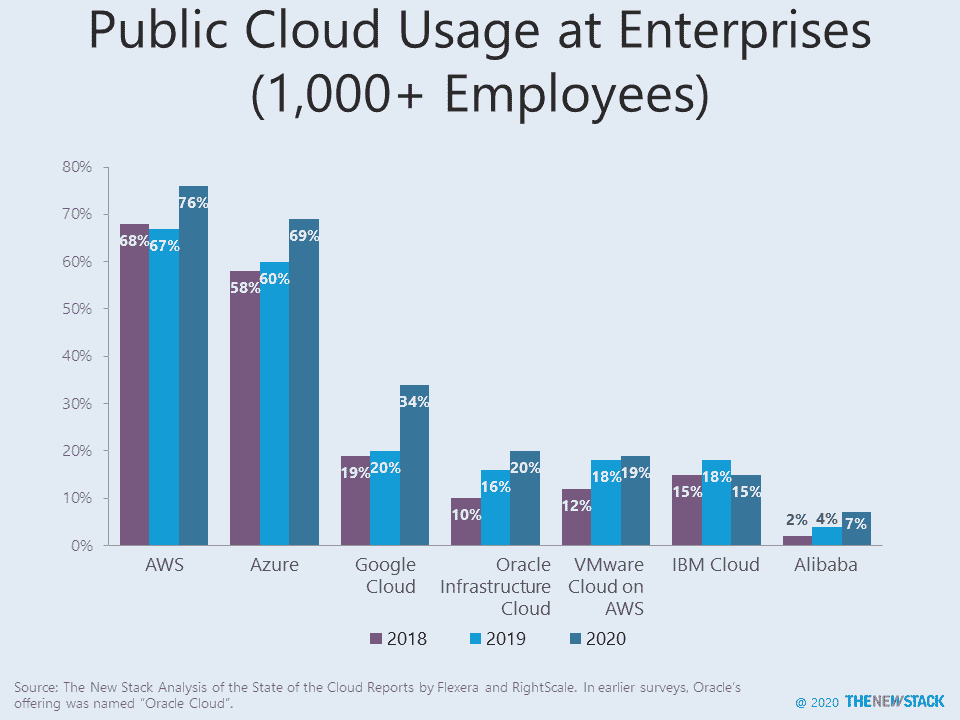
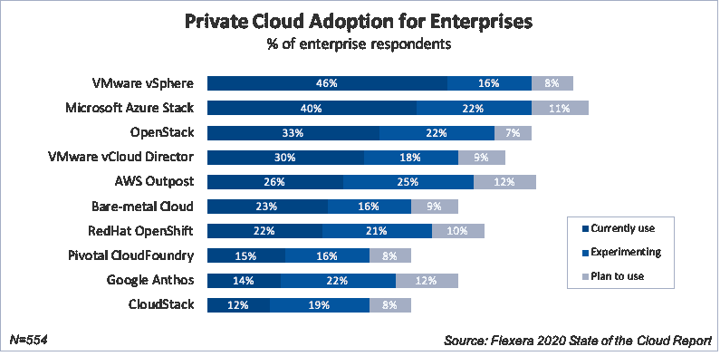

# 长期研究发现 Azure、AWS 和 GCP 采用私有云

> 原文：<https://thenewstack.io/long-running-study-finds-uptake-of-private-clouds-from-azure-aws-and-gcp/>

先是 RightScale，现在是 [Flexera](https://www.flexera.com/) ，已经连续八年发布了[云状态报告](https://info.flexera.com/SLO-CM-REPORT-State-of-the-Cloud-2020)。在此期间，有些事情没有改变:公共云的增长预计在 2013 年和 2020 年，亚马逊网络服务(AWS)当时和现在都是领导者。公共云和私有云之间的适当组合仍然存在争议，但公共云供应商提供的私有云产品已经变得更加突出。

另一个变化是数据收集的方式。2020 年，使用第三方小组，而不是通过内部电子邮件列表进行招聘。尽管我们试图根据云成熟度来维持类似的参与者分布，但方法上的差异要求我们考虑观察到的趋势如何受到变化的影响。

一个立竿见影的变化是，企业(> 1000 名员工)的数量从 2014 年的 24%增长到 2019 年的 58%和 2020 年的 74%。为了进行准确的比较，我们只看企业结果。从这个角度来看，Rackspace 已经从人们的视野中消失，微软的 Azure 已经崛起，在某些情况下与 AWS 直接竞争，76%的受访企业使用 AWS，69%的企业使用 Azure。谷歌云和阿里巴巴今年的增幅最大。

高采用率很难让人了解使用的深度，而大多数公司在其收益报告中都对此讳莫如深。Flexera 报告提供了一些详细信息，显示了使用超过 100 台虚拟机的企业所占的百分比以及公共云提供商的虚拟机数量。除了虚拟机之外，这三家提供商也越来越多地采用容器即服务。AWS (40%)和 Azure (36%)拥有最多每年在公共云上花费至少 120 万美元的客户。谷歌以 18%的份额远远落后于第三。

从某种意义上来说，工作负载向公共云迁移的速度明显加快了。在去年的研究中，只有 33%的工作负载位于公共云中，而如今这一数字为 57%。这一巨大的跳跃很可能是由于抽样方法的改变，它本身不应该被认为与云服务的采用直接相关。在衡量公共云采用的增加时，考虑工作负载是来自私有云还是非云环境也很重要。

Flexera 的研究没有推测公共云工作负载在多大程度上被转移到私有云，但它显示了私有云采用新浪潮的一些线索。2013 年，53%的受访企业使用至少一个私有云和一个公共云，该研究将其定义为混合云。这个数字一直相对稳定，直到今年，这个数字跃升至 87%。部分上升可能是由于采样方法的变化，但去年微软 Azure Stack (28%至 40%)和 AWS outbound(14%至 26%)有明显上升。红帽 OpenShift (22%)和谷歌 Anthos (14%)也加入了调查。尽管有报道称 OpenStack 即将寿终正寝，但它的采用率只下降了一点点(36%到 33%)。降幅最大的是在裸机基础上采用私有云以及使用 VMware vSphere。

我们预计将发布 Flexera 2020 云状态报告的更多分析。敬请期待！

亚马逊网络服务、Red Hat 和 VMware 是新堆栈的赞助商。

通过 Pixabay 的特征图像。

<svg xmlns:xlink="http://www.w3.org/1999/xlink" viewBox="0 0 68 31" version="1.1"><title>Group</title> <desc>Created with Sketch.</desc></svg>