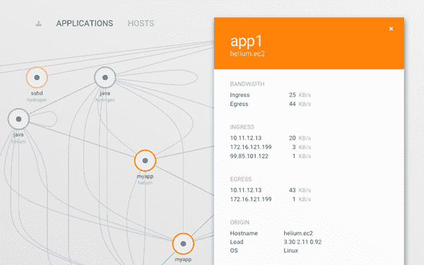

# 集装箱监控内部观察

> 原文：<https://thenewstack.io/look-inside-container-monitoring/>

随着组织在生产中部署越来越大的容器化服务，了解这些容器的健康状况变得比以往任何时候都更加重要。无论是在 Docker、Kubernetes、亚马逊容器服务，还是另一个容器平台工作，这种需求都是一样的。这不仅需要了解容器是否健康，还需要了解它们的性能、依赖状态、错误警报以及系统范围内的资源使用情况。

随着微服务继续进入应用程序开发领域，理解部署单个服务的多个容器如何相互通信是关键。从数百个大规模操作的容器中收集数据已被证明是容器监控人员的一个重大痛点，尽管有一些解决方案，如 [Kubernetes](http://kubernetes.io/) 旨在减轻大规模使用容器的痛苦。

当企业将 Kubernetes 容器与诸如 [Mesos](http://mesos.apache.org/) 之类的调度程序配对时，添加诸如[weaver works](http://www.weave.works/)、 [Sysdig Cloud](https://sysdig.com/) 或 [New Relic](http://newrelic.com/) 之类的容器监控服务可以汇集关于个人基础设施的宝贵见解。

## 深入监控容器

由于微服务在一组容器上运行，隔离影响服务性能的问题至关重要。部署监控平台时，有多种 SaaS 产品可供选择。

历史上，在容器内工作时的服务发现需要开发人员编写代码来确保这些容器可以被查看并彼此交互。虽然一些容器监控软件需要复杂且耗时的设置，但 WeaveWorks 已经摒弃了安装库或复杂内核设置的传统方法。

新遗迹仪表板，服务器利用率

“在主机上编写容器，无需安装库或内核模块，就可以实时收集所有信息。WeaveWorks 首席运营官马修·洛奇(Matthew Lodge)指出:“对客户来说，设置通常是一项挑战，他们不想这么做。

为了充分利用任何集装箱监控平台，必须考虑他们将如何使用所获得的信息。随着数据的收集，如果没有可操作的项目，数据就变得微不足道。

公司可能会以类似于单个服务器的模式运行容器，目的是让它们永远在线，收集数据并发送到数据库进行长期分析，或在以后完善其管道。

其他人可能全天部署数百个较小的、短命的微服务，当客户访问他们的 web 应用程序的特定部分时，这些微服务就会启动。

New Relic 的首席云架构师和倡导者 Lee Atchison 指出，理解如何在组织中使用容器是理解如何监控生产中运行的高可伸缩性应用程序的关键。

New Relic 不仅在基本级别上监控容器，还为用户提供 Docker 图像级别的监控汇总。“这允许您查看特定 Docker 映像的使用模式，而不管该映像有多少实例正在运行或已经运行。这为执行某些类型的操作(如容器升级和容器版本控制)的影响提供了一个独特的视角。它还提供了短期容器使用模式的视角，”艾奇逊说。

编织范围:容器映射细节

尽管容器带来了革命，但它们仍然难以大规模监控。

Sysdig 首席执行官洛里斯·德吉奥安尼说:“缺乏可见性使得很难以有意义的方式连接和解释来自容器的指标。”

在更深层次上监控容器会导致系统变慢，在大规模部署和有效利用收集的数据时会出现复杂情况。

Sysdig 利用容器视觉技术，允许用户从外部看到容器内部，从而在生产操作中实现更好的可扩展性和性能。

除了它的开源平台，Sysdig 还提供了一个企业级的容器监控套件，为那些在分布式环境中工作的人提供端到端的监控。Degioanni 说:“容器自然有助于编排，尤其是 Kubernetes，它被设计成可以在任意基础设施上大规模运行。

## 适合这项工作的工具

在引擎盖下，许多容器监控平台差别很小。然而，有些人已经开始以这样一种方式编写他们的软件代码，使得最终消费者可以很容易地感受到这些好处。

织范围是用 Go 写的。Lodge 指出，为容器监控软件使用编译语言会带来很大的不同，因为用户编写自己的微服务和集成会简单得多。Go 是一种敏捷语言，它有一个庞大的支持库来巩固它已经令人印象深刻的记录。

Degioanni 说，Sysdig 依赖于用 C 编写的 Linux 内核模块、用 C++编译的强大的库、广泛的数据库技术、基于 SVG 的虚拟化和“一切事物的一部分”来支持其容器监控产品。艾奇逊指出，New Relic 是一款 SaaS 产品，依靠多租户软件来更好地利用系统级资源。这使得服务器的利用率更高，可扩展性更强，允许 New Relic 在不中断客户服务的情况下扩展其服务。

Sysdig 云警报

收集数据时，投资回报很重要。如果没有可操作的项目，数据可能会闲置在异地数据中心，这需要公司花费时间和金钱来维护。

设置和配置容器监控服务必须更加简单，允许用户获得易于理解、实现和操作的数据，同时还具有大规模运行的能力。

对整个基础设施的容器的可见性使开发人员不仅可以改进他们的代码，还可以了解他们编写代码的方式如何影响大规模运行微服务的容器的性能。

Lodge 强调了容器监控的三个改进领域，包括拥抱开源而不使其成为“DIY Lego set”，从单一主机过渡，以及使容器监控系统简单易用。

公司继续转向容器，以更好地简化他们的应用程序，创建微服务，并重组他们的操作。Degioanni 指出，许多公司不仅使用容器来隔离单个工作负载，还通过使用 Kubernetes、Docker Swarm 或 Mesos 来将基于容器的服务编排到快速扩展的基础架构中。

随着越来越多使用容器的公司也采用容器编排来大规模工作，监控这些庞大的微服务网络和独立、长期运行的实例带来了挑战，这种挑战将持续到新的一年。如果没有大小容器设置之间的准确、高层次的可见性，企业就无法有效地利用其中的数据。为了将容器监控技术进一步锤炼成一个稳定的、可扩展的解决方案，用于监控生产中部署的大量容器，必须围绕这一激动人心的新技术所面临的问题进行持续的讨论。

Docker、New Relic 和 Weaveworks 是新堆栈的赞助商。

通过 Pixabay 的特征图像，根据 CC0 授权。

<svg xmlns:xlink="http://www.w3.org/1999/xlink" viewBox="0 0 68 31" version="1.1"><title>Group</title> <desc>Created with Sketch.</desc></svg>