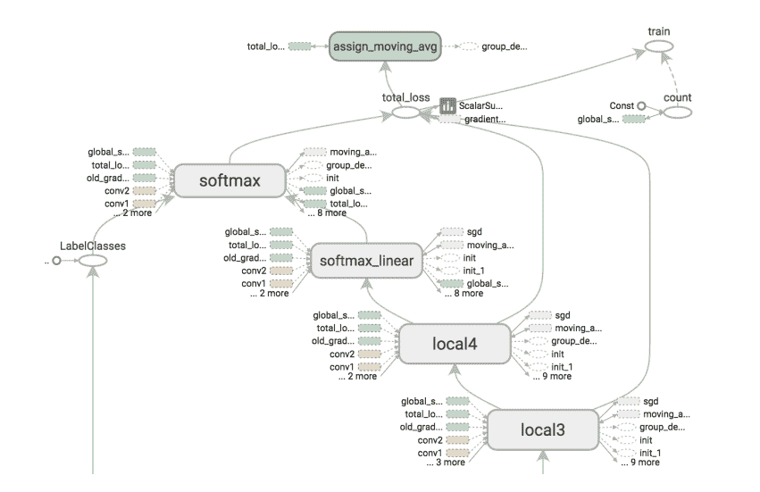
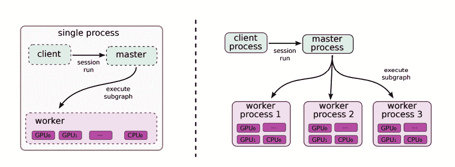
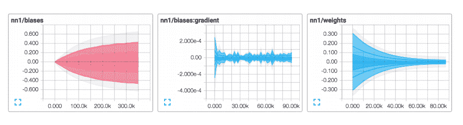

# 深入了解谷歌开源深度学习框架 TensorFlow

> 原文：<https://thenewstack.io/look-inside-tensorflow-googles-open-source-deep-learning-framework/>

本月早些时候，谷歌大张旗鼓地开源了其第二代人工智能引擎 [TensorFlow](http://www.tensorflow.org/) ，让世界更加接近用户友好的机器学习(ML)。

TensorFlow 是用于计算的机器学习(ML)代码的健壮的应用级软件库，提供 Python 和 C/C++ API 来链接到开发人员的程序中。谷歌希望新兴的 ML 社区将最终用其他语言如 Go、Java 和 JavaScript 进一步扩展该工具，为程序员构建应用程序提供更多选择。

尽管在学术界研究了几十年，但由于廉价云计算和海量数据的激增，ML 正越来越多地进入企业计算使用。大致基于大脑如何处理信息，ML 超越了基本的计算数据分析，因为它为计算机提供了一个框架，让计算机在给定一组数据的情况下猜测未来会发生什么。预测过程通过反馈循环或神经网络进行完善，允许算法通过重复的测试迭代进行自我完善。

微软在其 Azure 云计算服务上提供了一个 [ML 服务](https://azure.microsoft.com/en-us/services/machine-learning/)，并且正在培育一个社区，在这个社区中，数据科学家可以分享和购买各种算法，从语音识别到突出显示一前一后购买的产品组。IBM 在其[沃森分析](https://www.ibm.com/marketplace/cloud/watson-analytics/us/en-us)平台上提供了一套基于 ML 的预测分析服务。Watson 的目标是尽可能简化 ML 界面，允许用户只需输入一个问题并上传数据，这项服务将提供探索数据甚至推断数据以预测未来结果的手段。

随着 TensorFlow 在 Apache 2.0 许可下的发布，开发人员和研究人员可以在他们的项目和产品中使用它，教授他们的系统任务，如识别图像或翻译语音。但这不仅仅是为了机器学习；它还可以用来处理任何大型复杂数据集。特别是，TensorFlow 将允许深度学习研究人员更容易地构建、训练和部署深度学习神经网络，它只是研究人员已经可以使用的许多[深度学习框架](http://venturebeat.com/2015/11/14/deep-learning-frameworks/)中的一个，如 [Theano](https://github.com/Theano/Theano) 、 [Torch](https://github.com/torch/torch7) 、 [Caffe](https://github.com/BVLC/caffe) 、 [Neon](https://github.com/NervanaSystems/neon) 、、 H2O 和等。

新的谷歌平台取代了该公司内部的机器学习基础设施 dist faith，该基础设施于 2011 年首次开发，负责训练深度学习神经网络，这些网络是谷歌照片、谷歌翻译、YouTube 等熟悉服务的基础，也是像 [DeepDream](https://thenewstack.io/deep-learning-neural-networks-google-deep-dream/) 这样的实验项目。

但是 DistBelief 有其局限性:它不是非常用户友好，并且不是开源的候选，因为它与谷歌的内部基础设施联系太紧密。根据[公司](http://googleresearch.blogspot.ca/2015/11/tensorflow-googles-latest-machine_9.html)的说法，TensorFlow 比其之前的系统更智能、更灵活、速度“快两倍”，并且高度可扩展，从单个智能手机到拥有数千台计算机的大规模分布式系统。与 dist faith 相反，TensorFlow 也是为其他类型的人工智能学习设计的，如[强化学习](https://en.wikipedia.org/wiki/Reinforcement_learning)和[逻辑回归](https://en.wikipedia.org/wiki/Logistic_regression)。

[https://www.youtube.com/embed/oZikw5k_2FM?feature=oembed](https://www.youtube.com/embed/oZikw5k_2FM?feature=oembed)

视频

但在深度学习爱好者深入研究之前，值得注意的是，谷歌并没有免费赠送一切。现在可用的版本[只在单台计算机上运行](http://www.wired.com/2015/11/google-open-sources-its-artificial-intelligence-engine/)，因此大规模分析数据的能力有限，尽管这在未来可能会改变，因此，至少在短期内，TensorFlow 不能作为 Hadoop 或 Spark 等大数据平台的替代品，甚至是附属品。

此外，对于张量，还需要大量数据来充分训练神经网络。因此，尽管谷歌可能开源软件，但它仍通过不开放其数据和训练有素的神经网络模型来保持其竞争优势。

## 在后台

TensorFlow 中的计算被表示为[有状态](https://en.wikipedia.org/wiki/State_(computer_science) "State (computer science)") [数据流](https://en.wikipedia.org/wiki/Dataflow_programming "Dataflow programming") [图](https://en.wikipedia.org/wiki/Directed_graph "Directed graph")，这允许模型跨分布式系统中的不同设备部署，而不必重写模型。这里的节点代表操作(“ops”)，边作为“张量”，或多维数组。数据流图描述了“会话”期间发生的计算，可以在各种设备上异构执行，从单个或多个 CPU 到超加速的 GPU 环境，显然无需对代码进行太多更改。

卷积神经网络模型的张量板可视化图形

根据野外的一些 [TensorFlow 测试人员](https://indico.io/blog/indico-tensorflow/)的说法，这里有一些俏皮的特性。首先，资源分配以一种复杂的方式进行了优化，最大限度地减少了设备间的数据通信开销，使其特别适合跨分布式系统进行扩展。它还具有“队列”的特性，允许图形的各个部分异步执行，因此可以在处理前一批数据的同时从磁盘文件中预取输入数据。队列还可以用于根据类型或效率对其他类型的数据进行分组。

单机系统结构与分布式系统结构

另一个优势是 TensorBoard，该平台的可视化工具，用于计算图形结构和汇总统计。TensorBoard 的算法会将节点折叠成高级别块，并突出显示具有相同结构的组，同时还会分离出高级别节点。TensorBoard 也是交互式的:用户可以平移、放大、展开和折叠节点。一些用于训练复杂模型的计算图——如谷歌的 Inception 模型——可能有数万个节点，因此拥有一种清晰直观的视觉组织方法是必不可少的，以确保开发过程能够顺利进行，并且性能能够更容易地检查。

显示模型汇总统计数据的张量板图

最终，TensorFlow 是一个灵活且适应性强的系统，将允许研究人员和开发人员更加无缝地合作，无论是为了训练深度神经网络模型进行研究，还是为了开发语音识别、计算机视觉、自然语言处理、机器人技术的应用程序，甚至是研究药物如何与蛋白质等复杂系统相互作用的[。由于它在开源版本中并没有完全的特色，一些人](http://wavefunction.fieldofscience.com/2011/11/future-of-computation-in-drug-discovery.html)[指出](http://www.kdnuggets.com/2015/11/google-tensorflow-deep-learning-disappoints.html)这可能会在开源领域阻碍它的发展。但是 TensorFlow 的这个可用版本仍然有许多吸引人的元素，可能值得那些好奇和倾向于查看它的人使用。

要了解更多信息，请阅读谷歌的[白皮书](http://download.tensorflow.org/paper/whitepaper2015.pdf)，尝试[教程](http://www.tensorflow.org/tutorials/index.html)或查看示例模型架构。

<svg xmlns:xlink="http://www.w3.org/1999/xlink" viewBox="0 0 68 31" version="1.1"><title>Group</title> <desc>Created with Sketch.</desc></svg>