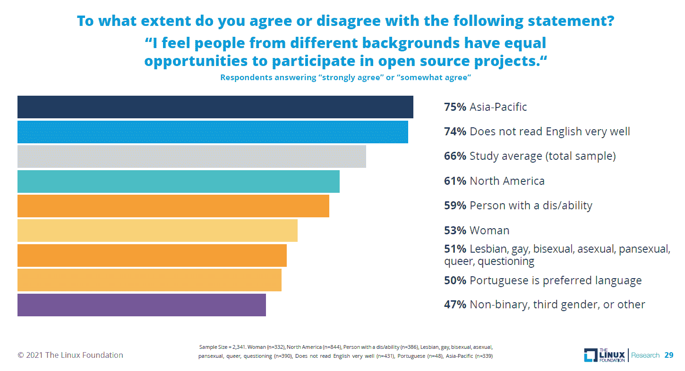
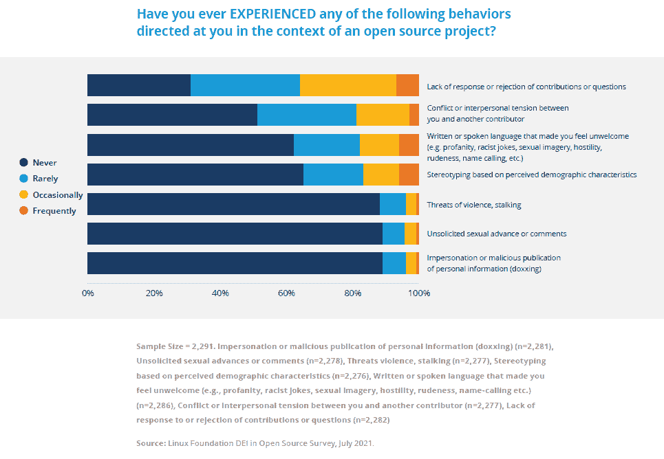
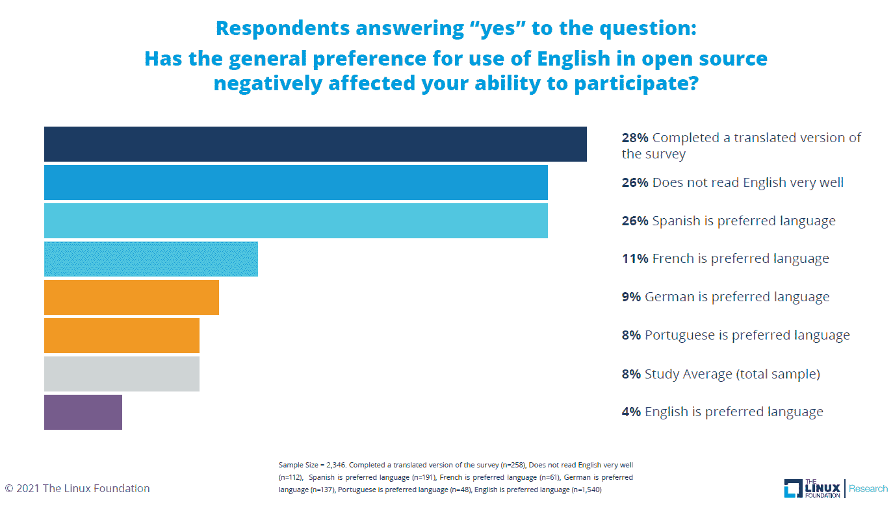
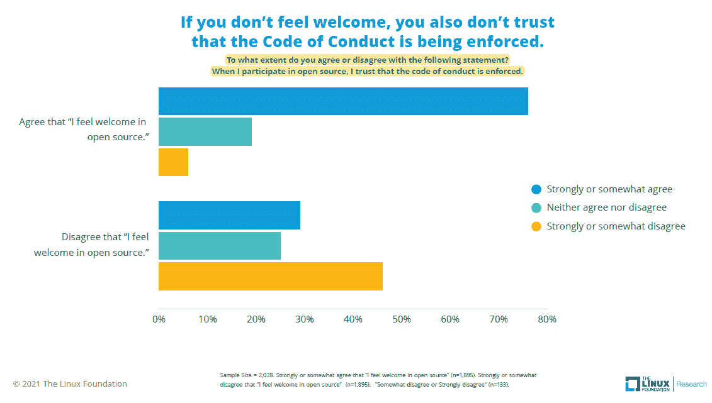
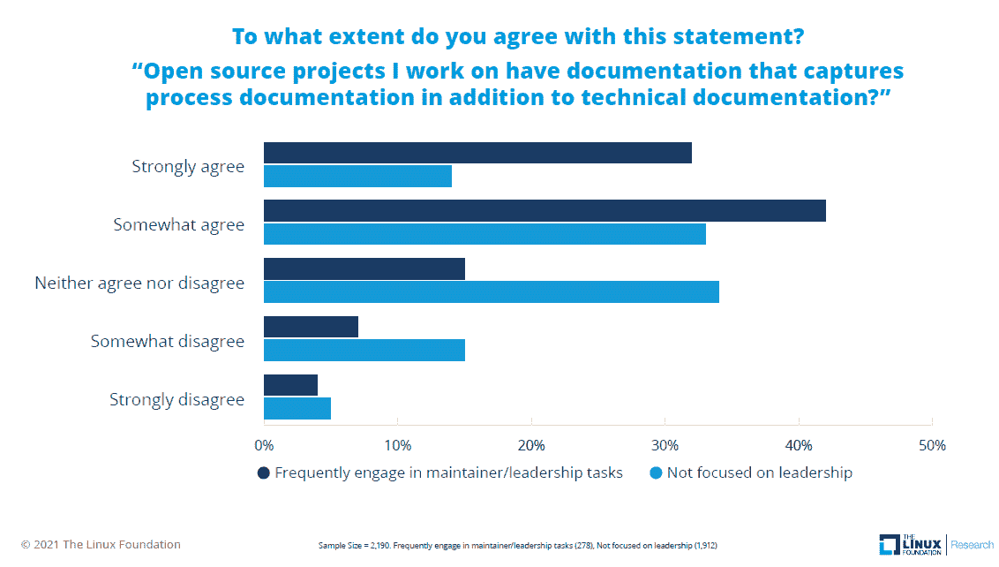
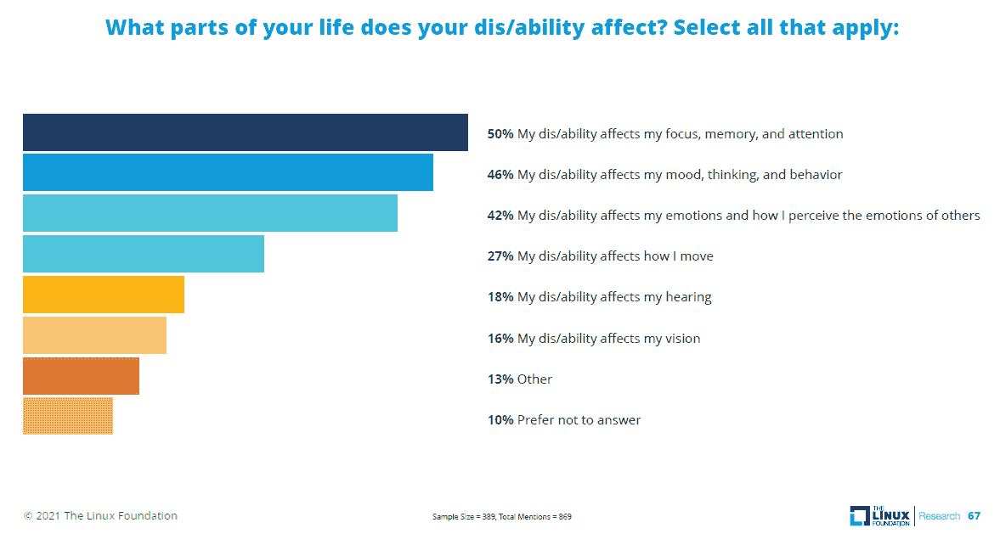

# 看看过去的兄弟，对开源包容的担忧仍然存在

> 原文：<https://thenewstack.io/look-past-the-bros-and-concerns-about-open-source-inclusion-remain/>

一周又一周，我们被问及 GitHub 的 2017 年[开源调查](https://opensourcesurvey.org/2017/)是否是关于开源社区及其多样性的最新数据来源。现在，情况变得更糟了。 [Linux 基金会](https://training.linuxfoundation.org/training/course-catalog/?utm_content=inline-mention)的 2021 年“[关于开源中的多样性、公平性和包容性的报告](https://www.linuxfoundation.org/tools/the-2021-linux-foundation-report-on-diversity-equity-and-inclusion-in-open-source/)”提供了一些最新的正面和负面答案。

根据对全球 2000 多人的调查，只有 66%的开源社区至少在某种程度上同意来自不同背景的人有机会参与开源项目。当被问及他们面临的与多样性相关的障碍时，来自亚洲的受访者和许多年轻男性往往说不出任何障碍，而是描述他们在文档方面遇到的技术问题或挑战。

这是正在进行的关于增加技术社区参与的最佳方式的辩论的核心。如果这么多开发人员和技术人员相信精英管理，技术和面向过程的解决方案能有多大帮助？

这项研究是基于对 2350 份完整回复的调查以及行业分析师[杰西卡·格罗普曼](https://www.linkedin.com/in/jessicagroopman/)和 Linux 基金会研究的[希拉里·卡特](https://www.linkedin.com/in/hilarycartermsc/)进行的深度访谈。我个人通过提供包含在[演示文稿](https://www.linuxfoundation.org/wp-content/uploads/LFResearch_DEISurvey_ResultsDeck_121321.pdf)中的数据分析来协助该项目。Groopman 和 Carter 共同撰写了一份 64 页的报告，其中包括考虑到当前和未来 DEI 工作的有效性和局限性的建议。

该报告引用了我们的文章“我如何帮助开源社区的多样性”作为原始资料。新书库[的詹尼弗·里金斯](https://thenewstack.io/author/jennifer-riggins/)的老读者了解所有面对开源社区的[文化](https://thenewstack.io/category/culture/)问题，以及他们可能的解决方案。自成立以来，TNS 一直致力于多元化和包容性，但我们也承认，技术在许多方面也可以平等竞争。以下是詹妮弗最近报道的一部分:

大多数开源社区认为这是一个受欢迎的地方，但来自比例失调的群体的人更有可能有不同的感觉。这项研究考察了北美的种族，黑人、土著人和太平洋岛民以及来自非洲和中东的受访者不成比例地提到种族是一种多样性，平等和包容是一种障碍。然而，在世界的其他地方，宗教、语言和其他特征最能说明一个人的背景。

如上所述，三分之二的研究人员认为他们的背景不会损害他们参与开源项目的能力，但对于其他人应该做些什么呢？残疾人、女性、非二元身份者和说葡萄牙语的人(大多数是巴西人)都比平均水平更有可能说他们的背景是一种负担。我们上个月写了GitHub 调查的 47%的人支持努力确保每个人都有平等的机会成为开发者。对于补救措施可能没有一致意见，但许多人认为有必要创造公平的竞争环境。

一位受访者写道，“当我用西班牙语使用我的真名时，我没有被认真对待。当我使用别名时，情况会有很大的不同。”这听起来与许多女性或少数民族的经历非常相似。总的来说，36%的研究对象经历过某种基于感知的人口统计特征的刻板行为。在许多代表性不足的群体中，这种和其他类型的不良行为更为常见。例如，在 114 名被确定为非二元或第三性别的受访者中，54%的人经常或偶尔经历过让他们感到不受欢迎的书面或口头语言，相比之下，女性为 34%，男性为 14%。

当然，有些人可能会说棍子和骨头可能会打断你的骨头，但语言永远不会伤害你，但让我们现实点吧。该报告的另一个发现是，在开源项目的背景下，女性、非二元、LGBTQ+和残疾人遭受暴力威胁的可能性是男性的两倍。变性受访者偶尔或经常受到暴力或跟踪威胁的可能性是正常人的三倍。3%的男性经历过偶尔或经常的威胁，而 9%的女性和 18%的跨性别受访者经历过。

## 

## 与其他研究的比较

乐观主义者会注意到，调查中只有 82%的人认为自己是男性，这比 2021 年 Stack Overflow 调查中的 92%和 GitHub 调查中的 91%要好。愤世嫉俗者反驳说，这项研究并不代表开源世界的真实情况，因为选择参加关于多样性的在线调查的参与者将不成比例地是妇女和其他传统上代表不足的群体。说实话，这并不重要，因为这项研究中的 332 名女性本身就足以成为自己的样本，可以与其他针对全球科技行业开发人员和员工的研究中发现的女性相媲美。

美国政府报告称，26%的成年人有某种类型的残疾，相比之下，北美调查受访者的这一比例为 21%，全球为 17%。

## 英语技能是公认的障碍

许多研究参与者仍然相信开源是精英管理。最好的想法会胜出。最有才华的人成为领导者。在过去，这被用作为什么多样性如此之少的借口。我们对调查开放式回答的分析提供了非常好的消息，表明这种情况很少发生。然而，同样显而易见的是，新一代的开源社区认为只有技术障碍、缺乏文档和语言技能阻碍了他们的发展。

总的来说，只有 8%的人表示，开源软件对英语的普遍偏好对他们的参与能力产生了负面影响。尽管这种低水平的信息技术对人们的生活产生了个人影响，但在开放式的回答中，语言还是不断地被提到，成为开放源码参与的障碍。许多受访者表示，他们开始参与时不懂英语，但已经克服了这一挑战。

大多数受访者能够很好地阅读和书写英语。仅看那些完成调查翻译版本的人，28%的受访者表示，对开源英语的普遍偏好对他们的参与能力产生了负面影响。即使是接受调查翻译版本的受访者也精通英语，这让我们认为抱怨英语有时是对美国或西方文化更大、更普遍的抱怨的代表。虽然只有 4%的研究对象英语说得不好，但这个小组中有 26%的人认为这是参与的障碍。

## 中性代词的使用不普遍

根据 2021 年皮尤研究中心的调查，46%的美国成年人认识变性人，26%的人认识中性代词。这听起来很准确，因为它差不多是正确的。虽然 Linux 基金会的调查中有 4%的人认为自己是跨性别者，但当被问及“你的代词是什么？”时，只有大约一半的人会写“他们/他们”这样的词一些回答者愿意接受任何代词，其他人有更微妙的答案。

超过三分之二的 Linux 基金会调查用传统方式描述他们的代词，意思是“他/他/他的”或“她/她/她的”的一些表述即使在 Linux 基金会的调查中，有 10%的人认为性别不合规，也只有 45%的人赞成这种方法，只有很少的人回答时故意提到“他们”或“他和/或她”或类似的组合。

## 代码、文件和残疾人代码

下面是另外三个图表，突出了我们将在以后写的重要主题。请注意，在单词“dis/ability”中使用斜线是不标准的，但引用一本关于[残疾研究和关键种族理论](https://www.amazon.com/DisCrit_Disability-Studies-Critical-Education-Disability/dp/0807756679/)的书的作者的话是合理的。

70%的人在参与开源时同意行为准则是强制执行的，而 9%的人不同意。在那些感觉不受欢迎的人中，29%同意，46%不同意。

50%的人同意他们工作的项目过程有文档，而 15%的人不同意。不是每个人都是开源的维护者或领导者，但是这个群体中 74%的人说他们的过程文档是被捕获的。

17%的受访者认为自己是残疾人。就本调查而言，残疾/能力被定义为一种长期的身体、精神、智力或感官障碍，这种障碍与各种态度和环境障碍相互作用，阻碍您在与其他人平等的基础上全面有效地参与社会。

<svg xmlns:xlink="http://www.w3.org/1999/xlink" viewBox="0 0 68 31" version="1.1"><title>Group</title> <desc>Created with Sketch.</desc></svg>