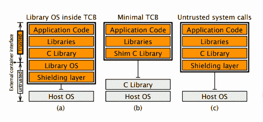

# 看一看 SCONE:使用 SGX 在不可信环境中保护 Linux 容器

> 原文：<https://thenewstack.io/look-scone-secure-containers-linux/>

对于云中敏感的容器化工作负载，良好的安全实践不仅需要防范外来入侵，还需要防范云系统本身的超级用户。您的云提供商有史努比管理员吗？还是马虎的保安？或者只是法规遵从性比你自己的更宽松？

正是这种担忧促使一组研究人员创建了 [SCONE](https://www.usenix.org/system/files/conference/osdi16/osdi16-arnautov.pdf) (英特尔 SGX 上的安全 Linux 容器)[在去年的](https://www.usenix.org/conference/osdi16/technical-sessions/presentation/arnautov) [USENIX 操作系统设计和实现研讨会](https://www.usenix.org/conferences/byname/179)上展示了。该架构提供了一种方法，通过使用内置于该公司基于 [Skylake](https://ark.intel.com/products/codename/37572/Skylake) 架构的芯片中的[英特尔 SGX](https://software.intel.com/en-us/sgx/details) (软件卫士扩展)，在不可信的云服务上运行容器化的可信应用。集装箱本身装有与 SGX 接口的软件。

虽然 SCONE 似乎提供了一个可行的解决方案，但让 SCONE 部署工作并正确工作可能是一项艰巨的任务，仍然不能提供完全的安全保护，微软 Azure 工程师和著名的容器安全专家 Jess Frazelle 最近在纽约市举行的 [Papers We Love](http://paperswelove.org/) 活动中谈到 USENIX 论文时指出。

“在实现这一点的过程中，用户需要处理很多事情，这使得实现起来非常困难。而且很难做好，”弗雷泽勒警告说。

尽管如此，这项技术还是值得一看。上个月，微软 Azure [开始提供](https://azure.microsoft.com/en-us/blog/introducing-azure-confidential-computing/)可信执行环境(TEE)，也称为“飞地”，阻止除授权代码之外的任何人访问数据，包括主机服务器固有的任何超级用户权限。可以想象，在 Azure 上使用 SCONE 进行受保护的操作是可能的。

TEE 通过受 SGX 保护的服务器内存部分来发挥这种魔力。该论文的许多作者指出，SGX 飞地“屏蔽了其他软件对应用程序代码和数据的访问，包括更高权限的软件”。该项目利用的“enclave”是芯片上的 enclave 页面缓存(EPC)，这是一个由 18 条指令控制的内存分区，外部代码无法访问。

当规划 SGX 的“可信计算基础”时，它将在飞地内运行，SCONE 研究人员受到两个主要要求的引导:一是保持代码基础尽可能小，以最小化攻击面。另一种方法是通过不引入额外的延迟来保持性能，这是“飞地”模型中固有的，因为任何对内核的系统调用都需要线程跳到飞地之外，这涉及到所有伴随的内存复制。

“这份报告完全是关于交易几率的，真的，”Frazelle 说。SCONE 的大部分工作是平衡安全性和性能。

最初，研究人员研究了微软的 [Haven 模型](https://www.microsoft.com/en-us/research/publication/shielding-applications-from-an-untrusted-cloud-with-haven/)的安全操作。然而，这种方法需要将大部分操作系统放在容器中，对于所有需要的库来说，这对于 Linux 来说是不可行的。代码库会太大，并且会增加延迟。此外，如果 enclaved 操作系统存在漏洞，整个系统可能会受到损害，“它可能适用于 Windows，但对于 Linux，这不是一件好事，”Frazelle 说。

研究人员还研究了另一个极端，即剥离所有的库用于最小的安装基础，留下少量调用操作系统所需的系统调用。然而，这种方法也有它的问题，因为它会给保护不属于 enclave 权限范围的数据和操作带来更大的负担。

安全容器设计的三种可能性(USENIX 论文)。

他们选定的烤饼做法是两者的结合。大量使用的 [C 标准库](http://www.csse.uwa.edu.au/programming/ansic-library.html)被隔离，消除了许多外部系统调用的需要。SCONE 为 enclave 内外的所有套接字操作提供了一个“网络屏障”，使用来自容器文件系统的私钥和证书为每个连接提供 TLS 握手和加密/解密。

还引入了“异步系统调用机制”。它的实现使用共享内存来传递系统调用参数和返回值，并发出应该执行系统调用的信号。系统调用由运行在 SCONE 内核模块中的独立线程执行。因此，enclave 中的线程在执行系统调用时不必退出，”该论文称。

研究人员认为，这种方法产生了最佳结果。在 SCONE 下，一组应用程序(Apache、Redis、NGINX、memcached)的运行速度大约是本机执行速度的 0.6 到 1.2 倍。由于 Memcache 处理加密的方式有些奇怪，该软件实际上在封闭环境中运行得更快。

## 在每一个梦里，都有心痛

Frazelle 指出，一个迫在眉睫的问题是每个应用程序都能很好地执行。异步系统调用在性能上非常昂贵，因此在 enclave 下，进行大量系统调用的应用程序会受到严重影响。“任何通过系统调用进出超快的东西，用这个都会超慢，”她说。SCONE 提供了多线程机制来减轻这种痛苦，尽管单线程应用程序(如 Redis)的性能会特别糟糕。

内存页面故障也会降低性能，L3 缓存未命中也是如此，从 enclave 来看，其速度会慢 12 倍。“那真是糟糕透了，”弗雷泽勒提醒观众。

“虽然你获得了一个安全的地方来运行容器，但你的性能受到了巨大的打击，”她说，并补充说，她希望随着时间的推移，随着更多的人从事代码库的工作，性能会有更大的提高。

还有其他的权衡。一个是用户方面的投资。

Frazelle 总结道:“当你用这个做什么的时候，有很多事情要考虑。”SCONE 承诺原始应用程序代码可以在 enclave 中不加修改地运行，但是仍然需要大量的工作来装备系统运行 SCONE。

设置 enclave 的所有软件都必须安装在 Docker 容器中。还需要一个 enclave 内核模块来处理系统调用。SCONE 也不支持 **fork** 系统调用，限制了可以使用的应用程序范围。

Frazelle 指出，传递系统调用和进行必要的加密和解密的复杂性增加了额外的攻击面。“如果你在那个飞地放了任何 bug，那你就完了，”她说。

[微软](https://azure.microsoft.com/en-us/?v=17.14)是新堆栈的赞助商。

<svg xmlns:xlink="http://www.w3.org/1999/xlink" viewBox="0 0 68 31" version="1.1"><title>Group</title> <desc>Created with Sketch.</desc></svg>