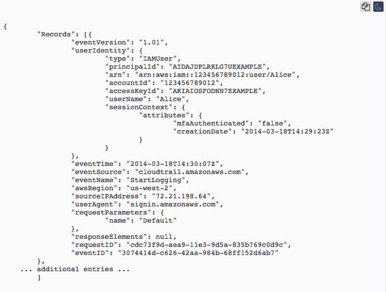

# 爱无服务器，记得安全

> 原文：<https://thenewstack.io/love-serverless-remember-security/>

无服务器通过将服务器托管和管理的成本委托给第三方提供商，提供了节省 IT 资源和资金的绝佳方式。

然而，一旦无服务器数据落入服务提供商之手，设置了安全管理之后就忘记了，这是任何组织都不想做的事情。当一个组织内许多不同来源共享的无服务器平台依赖于多云提供商时，情况尤其如此。

[星座研究](https://www.constellationr.com/)的分析师 [Holger Mueller](https://www.linkedin.com/in/holgermueller) 说，“安全性是任何下一代应用程序的关键问题，不能事后才想到，”尤其是对于无服务器平台，“因此，安全性总是一个挑战，在单一物理系统中已经很难实现。”

## 了解你的服务器

尽管名为无服务器，但它与服务器有着千丝万缕的联系。区别在于第三方为您执行所有相关的管理任务。这些第三方通常提供运行在容器上的“功能即服务”(FaaS)。“后端即服务”(BaaS)也打着无服务器产品的幌子。

在可用的无服务器产品中，亚马逊网络服务(AWS)的[是领先的产品之一。其他备选还有](https://aws.amazon.com/lambda/)[云函数](https://cloud.google.com/functions/)(谷歌)[iron worker](https://www.iron.io/platform/ironworker/)(iron . io)[Manta 函数](https://www.joyent.com/manta)(Joyent)[open whish](https://new-console.ng.bluemix.net/openwhisk/)(IBM)[PubNub BLOCKS](https://www.pubnub.com/)(PubNub)和[server less Docker](https://github.com/bfirsh/serverless-docker)(Docker)。

当将无服务器数据迁移到这些或其他服务提供商的平台时，这当然意味着您组织之外的其他人将管理许多安全任务。第三方负责下载和安装安全补丁和更新。无服务器提供商通常也提供日志和监控服务，作为他们软件包的一部分，这是亚马逊在亚马逊云观察的保护伞下提供的。

好消息是，由于平台的容器化，组织也受益于无状态应用程序提供的保护，这要归功于它们短暂的本质。例如，当容器不在使用中并且应用程序关闭时，恶意代码显然不会运行。当第三方提供的可用容量根据需求自动扩展时，拒绝服务攻击(DoS)尤其难以实施。

然而，归根结底，您仍然必须依靠第三方来进行许多超出您的组织控制范围的安全管理。

“当涉及云和无服务器部署时，安全性变得更加棘手，因为组织必须依赖第三方来提供下一代应用程序所需的安全性。只要无服务器平台的安全功能合适，这甚至可以节省时间和成本。但如果它不适合或必须在未来改变，这一切都将成为一个大问题，”穆勒说。“在新一代应用的多云部署方面，这一挑战变得更加严峻，因为每个云都提供不同的级别、特性和功能来保护数据和应用。多云部署很快就会变成一场噩梦。”

通常由第三方无服务器提供商提供的日志服务显然提供了一些数据保护，但在许多情况下可能是缺乏的。

“没有一个组织可以免受安全漏洞的影响，这使得记录此类问题成为防止灾难的关键，”云学院产品营销经理阿尔伯特·钱说。“但是，尽管软件解决方案确实有能力从源头上消除安全威胁，但这超出了许多无服务器平台的范围，这些平台主要专注于记录更一般的状态变化。”

设置 Amazon CloudWatch 日志服务。

钱说，开发者对他们代码的细粒度访问也与另一个无服务器安全限制相关联。

“无服务器意味着代码粒度的增加，这使得开发人员可以声明允许访问哪些数据。然而，增加控制和用户访问管理成为大规模的障碍，”钱说。“这样的任务耗费劳动时间，而且会占用涉及创新的重要功能。他们还可能根据行业增加此类风险，尤其是在医疗保健和金融服务等领域。”

## 清单

显然，DevOps 团队会认真对待向无服务器平台的迁移，并且该过程总是会涉及降低风险的方法。具体到安全性，有具体的框要勾选。其中， [Aqua Security](https://www.aquasec.com/) 的营销副总裁 [Rani Osnat](https://www.linkedin.com/in/raniosnat/) 建议，一旦迁移到无服务器平台，从一开始就要严密监控潜在的易受攻击代码。

“最好的方法是首先通过扫描已知的漏洞来防止易受攻击的功能，作为管道的一部分，”Osnat 说。“然而，由于新发现的漏洞，已经被认为是安全的和已部署的功能可能变得易受攻击。因此，建议持续扫描它们，例如每天一次，[以便保持最新状态]。”

Osnat 说，实施管道控制以防止部署易受攻击的代码和数据也是一个好主意，或者至少，当检测到漏洞时，通过 Slack 或吉拉等方式向 DevOps 团队发送自动警报。

“为了在运行时环境中阻止功能，你很可能需要将安全控制作为代码注入到你的功能中，因为目前不可能使用云提供商应用程序编程接口(API)来实现这一点，并且围绕 FaaS 运行时没有真正的标准化，”Osnat 说。

Osnat 说，不幸的是，除了上面提到的代码注入之外，商业上还没有标准化的工具可以进行详细的行为监控。然而，奥斯纳特说，有可能“通过对你的功能进行性能监控来防止某些类型的滥用”。这是因为像函数的长期活动(通常运行很短时间)或异常的 CPU 使用率等行为可能表明出现了问题

## 黑客挑战

大批黑客，包括那些想要窃取数据或只是为了测试或娱乐而试图渗透平台的人，总是在寻求发现无服务器数据可能如何被破坏。如上所述，无服务器平台仍在服务器上运行，因此可能存在与本地服务器管理相关的同类漏洞。最终结果是，无服务器安全性解决了许多与新平台(如 Kubernetes)以及在数据中心环境中管理的传统裸机服务器相关的潜在问题。

“现代应用程序的构建方式通常包括对其他库的依赖，这些库也依赖于其他库，”钱说。“服务器库中未知和已知的漏洞[也将总是]吸引黑客，他们将总是寻求造成破坏和伤害，包括数据泄露，”无论是传统服务器还是无服务器平台都暴露在外。

[Aqua Security](https://www.aquasec.com/) 是新堆栈的赞助商。

通过 Pixabay 的特征图像。

<svg xmlns:xlink="http://www.w3.org/1999/xlink" viewBox="0 0 68 31" version="1.1"><title>Group</title> <desc>Created with Sketch.</desc></svg>