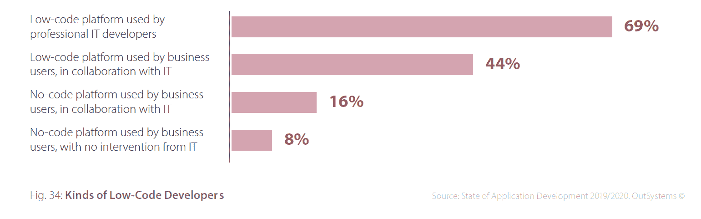
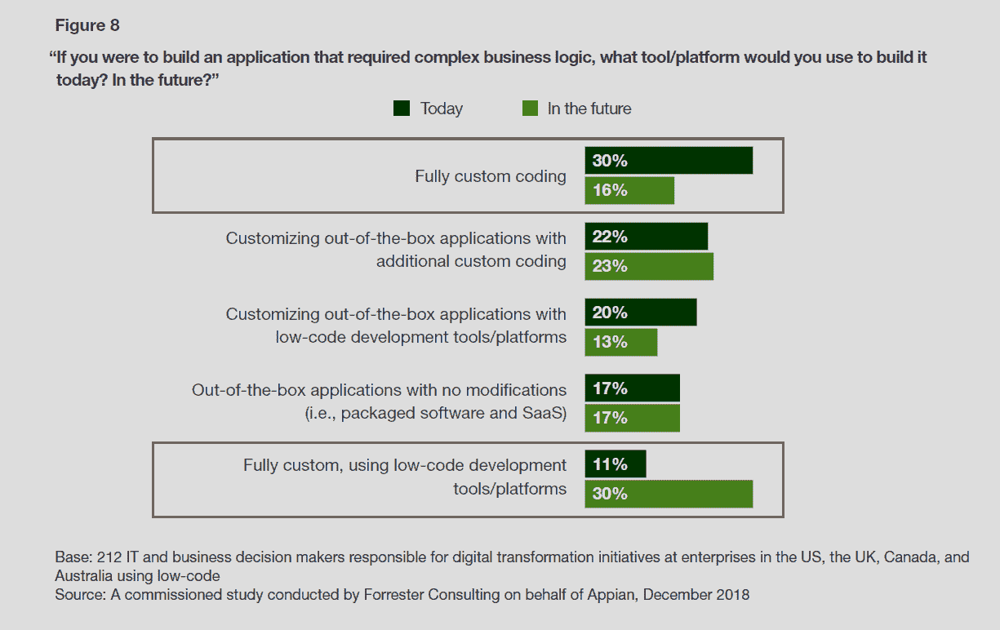
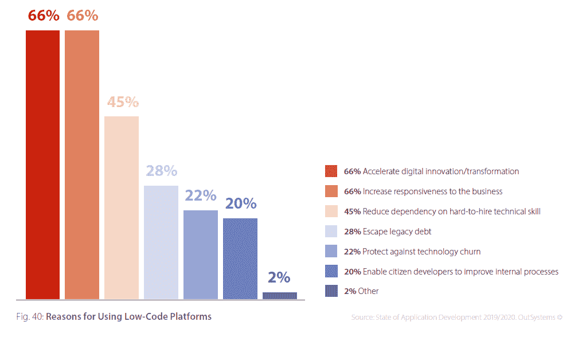
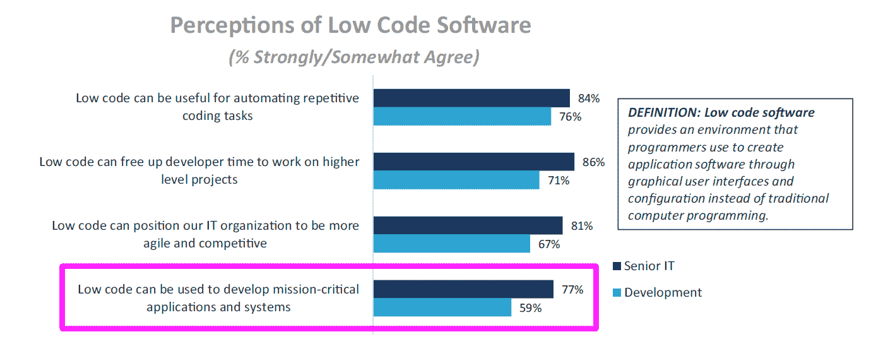

# 数字化转型推动低代码平台的采用

> 原文：<https://thenewstack.io/low-code-platform-adoption-gets-a-boost-from-digital-transformation/>

你对那些承诺不用编码就能交付应用的平台有什么感觉？如果你表达了一些负面情绪，那么你就像去年三分之二接受调查的客户一样。尽管感觉不好，最近的调查显示，低代码平台的使用已经增加，并且在不久的将来还会继续增加。主要原因是这些平台一举两得——它们解决了阻碍全公司数字化转型努力的长期发展挑战。然而，重要的是不要夸大其好处，这些好处主要与提高开发速度有关，而与允许业务部门自己创新和创建代码关系不大。

这些不好的感觉并非孤陋寡闻，因为根据最近的 Evans Data [调查](https://evansdata.com/press/viewRelease.php?pressID=272)，80%的开发人员已经在使用低代码环境，他们使用低代码或无代码的应用程序开发环境。然而，同一调查还发现，只有 9%的开发人员在至少 75%的时间里使用这些环境。随着低代码平台日益成为 IT 战略的一部分，高管们应该记住，虽然这些工具可以使编码民主化，但这些产品的核心受众是持怀疑态度的专业开发人员，他们可能会依赖他们的主要工具来进行日常编码。

## 采用率

根据 2019 年 3 月对 3，300 名 IT 专业人员的调查，OutSystems 的 *[应用程序开发状态报告，2019/2020](https://www.outsystems.com/1/state-app-development-trends/)* 报告称，41%的组织正在使用低代码或无代码平台，高于该公司前一年进行类似调查时的 34%。在使用低代码平台的群体中，69%的人说它是由专业 it 人员使用的。

对该类别成功的评估因低/无代码的定义方式而异。例如，“无代码”通常是用词不当，因为根据 Forrester 的 [John Rymer](https://twitter.com/johnrrymer) 和 [Bill Seguin](http://linkedin.com/in/bill-seguin-783872a8) ，实际上所有的应用程序都需要某种程度的编码，用于 1)集成，2)客户用户界面(UI)，或 3)报告需求。对至少一些编码的需求解释了为什么只有 3%的 OutSystems 调查称业务部门在没有 IT 干预的情况下使用无代码平台。

当在 2018 年 5 月被问及低代码平台时，Forrester 在全球范围内调查的 3228 名开发人员[中只有 23%在使用它们，但另有 22%的人计划在明年这样做。根据最新的 OutSystems 数据，该调查中预测的增长似乎已经实现。Forrester 代表 Appian 对 254 名负责大型企业数字化转型计划的 IT 和业务决策者进行的另一项](https://www.forrester.com/Global+Business+Technographics+Developer+Survey+2018/-/E-sus4351)[调查](https://www.appian.com/resources/forrester-large-enterprises-succeeding-with-low-code/)发现，其中 84%的人已经实施了低代码开发工具或平台来处理部分应用程序开发。虽然这与 Evans 的数据结果接近，但如果只询问没有数字化转型计划的小型公司，采用率可能会更低。

Evans 数据和其他开发者调查之间的巨大差异可能是因为开发者认为“平台”是购买的综合解决方案，而“环境”只是加速开发过程的众多屏幕之一。

对采用率感到困惑的另一个原因是存在非专业开发人员，他们不向 IT 部门报告，而是使用 IT 部门认可的工具进行业务主导的开发。OutSystems 报告发现，49%的组织在其公司中有所谓的公民开发人员，这高于使用低代码或无代码平台的 41%。许多供应商似乎在押注，他们将能够搭上一波采用浪潮，推动技术的整体使用和供应商产品和服务的购买。

来源: OutSystems 公司“ 应用发展状况报告，2019/2020。”该图表基于一个仅向 41%的受访者提出的问题，他们的组织已经在使用低代码/无代码平台。

Forrester/Appian 调查，“大型企业通过低代码取得成功”拥有低代码平台的公司预计该工具的使用将大幅增加，以构建需要复杂业务逻辑的完全定制的应用程序。

## 使用低位代码的原因

根据 OutSystems 的调查，加速数字化转型和提高业务响应能力是低代码平台已经被采用的主要原因。45%的受访者提到了降低雇佣开发人员的难度，逃避技术债务排在第三位，占 28%。只有 22%的人提到让公民开发者改善内部流程。这些发现与 Forrester 关于正在使用或计划使用低代码平台的北美和欧洲开发者的数据一致。在这一群体中，采用的首要原因是支持产品或服务创新，授权部门 IT 交付应用告诉我们他们的公司采用，以及授权 IT 以外的员工交付应用。排在后面的是更快地开发应用程序和改进其他几个以开发者为中心的指标。超过 90%的上述 Forrester 受访者表示，低代码平台至少在一定程度上解决了他们的组织在使用传统编码构建定制应用程序时面临的挑战。

来源:《out systems 2019/2020 年应用发展状况报告》。“28%的低代码平台用户认为逃避技术债务是一种好处。理论上，低代码平台生成的定制代码更少，以后必须对其进行审查。

人们谈论的数字化转型类型主要与提高应用程序开发速度有关。有趣的是，即使没有低代码的公司在软件交付方面也比去年的 OutSystems 报告中更快。尽管如此，低代码/无代码平台用户已经在各种指标上看到了更大的收益。以下是 2019 年的一些对比:

*   **业务对速度更满意:** 37%的低代码使用受访者表示“业务”对软件发布频率满意，比非用户高 11 个百分点。虽然使用低代码的公司更有可能每月发布软件，但是业务可能不需要这种速度。
*   **四个月或更少:** 64%的低代码使用公司在四个月或更少的时间内交付移动应用，相比之下，非低代码公司只有 49%。在拥有低代码平台的组织中，Web 应用程序的交付速度也更快。
*   **积压工作得到改善:** 46%的低代码用户表示，他们的组织积压的 web 和移动开发项目得到了改善，这比不使用低代码平台的组织高出 12 个百分点。这支持了一个假设，即开发者不仅变得更快，而且也不太可能因为延迟产品创新而受到指责。

## 扩张的障碍

另一项由 IDG 进行的 Appian 调查发现，59%的开发者认为低代码平台可以用来开发关键应用和系统。高级 IT 领导更加乐观，79%的人同意这一说法。如前所述，大多数开发人员都接触过低代码软件，但由于担心灵活性有限而选择不广泛使用，而且即使使用了平台，大多数应用程序也需要用代码进行定制。采用的其他障碍是供应商锁定、安全性和可伸缩性问题。

两年前，我们[报道过](https://thenewstack.io/week-numbers-lots-low-code-vendors-already-rejected/)许多低代码供应商已经被评估并拒绝。也许这是因为产品不够成熟。时间会告诉我们，普通开发人员是否会对他们的经理正在采用的当前低代码解决方案有一些积极的评价。

来源:IDG/Appian 调查，“低代码对 IT 满意度的影响”。在 2019 年春天进行的调查中，300 名受访者中有一半是高级 IT 专业人员，而另一半是开发人员、工程师或建筑师。所有受访者都在拥有 1000 多名员工的公司工作。

通过 Pixabay 的特征图像。

<svg xmlns:xlink="http://www.w3.org/1999/xlink" viewBox="0 0 68 31" version="1.1"><title>Group</title> <desc>Created with Sketch.</desc></svg>