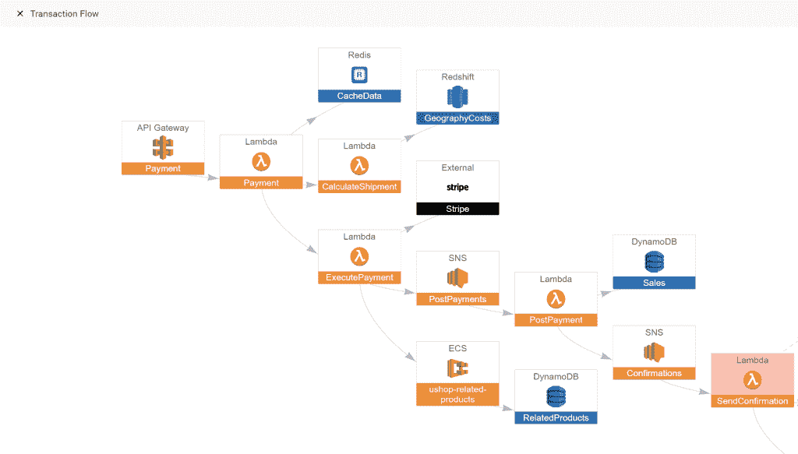

# Lumigo:端到端无服务器监控和故障排除

> 原文：<https://thenewstack.io/lumigo-end-to-end-serverless-monitoring-and-troubleshooting/>

IT 团队花了太多时间来排除环境中的问题。事实上，开发人员、DevOps 团队和 web 产品经理在最近的网络安全管理软件产品调查中报告说，由于花费在日常故障排除上的时间，他们不一定有时间优先考虑业务增长和创新。

无服务器环境使开发人员不必担心基础设施，但也带来了特殊的故障排除挑战，因为当出现问题时，没有服务器可以监控。

前检查站高管 [Erez Berkner](https://www.linkedin.com/in/erezbe/?originalSubdomain=il) 和 [Aviad Mor](https://twitter.com/aviadmor) ，两人都是以色列国防军的前成员，开始着手解决他们位于特拉维夫的初创公司 [Lumigo](https://www.lumigo.io/) 的问题。

云应用程序往往由几十个不同的部分组成。

“甚至超过了微服务。这是纳米服务，”伯克纳说。“我们有一个应用程序，包含 30 或 40 个不同的部分，就像乐高积木一样。了解全局，了解所有这些不同的部分是如何组合在一起的，了解单个请求如何通过所有不同的部分，了解每个组件的输入和输出是故障排除的挑战之一，尤其是在无服务器的情况下。”

Lumigo 提供了环境的可视化地图，并能够跟踪和深入每个请求的每个方面，包括 AWS 上每个请求的成本。

Lumigo 成立于 2018 年 3 月，在该领域面临的竞争对手包括 [IoPipe](https://www.iopipe.com/) 、[桑德拉](https://thenewstack.io/serverless-thundra-adds-observability-to-aws-lambda/)、 [Stackery](https://thenewstack.io/emerging-ops-tooling-serverless-reveals-two-adoption-paths/) 和 [Dashbird](https://dashbird.io/) 。

伯克纳说:“所有进行无服务器监控和故障排除的公司要么专注于服务的功能，专注于 lambdas，让你深入到 lambdas，给你关于 CPU 和内存的具体信息，给你一个非常技术性的问题视图，这是非常需要的。”

“我们的观点更像是一种端到端、以生产、业务逻辑和应用为中心的观点。我们关注的不仅仅是功能，而是容器、无服务器和第三方服务的整个技术体系。”

该平台分析大量数据，了解无服务器应用程序的正常行为，并生成您的架构与所有不同组件以及它们如何相互通信的实时可视化地图。它将在系统中绘制路径，并帮助您了解应该关注哪个错误。

所以你找到了错误，但是你不知道根本原因。它允许你通过这个请求的所有不同的服务来找到它。在问题实际出现的地方，上游可能有许多不同的服务。

“它允许您检查所有的输入和输出，所有通过服务的数据，以了解每个服务都通过了什么。例如，您可以看到，所有的输入都是正常的，但是从这个函数开始就出现了问题。发现这里发生了不正常的事情，你就可以开始深入这个特定的代码片段，找出导致问题的原因，”他说。

在交易屏幕上，Lumigo 连接了系统中的所有事件和所有副作用。它将显示系统中每个请求的故事。

“…我们可以向您展示每个请求的每一部分，例如它是从哪里开始的？发起此请求的用户是谁或什么？对此请求的回应是什么？一路上有什么问题吗？与该事务的平均持续时间相比，所有不同服务的该事务持续时间有多长？它还可以告诉你成本。与平均水平相比，这个特定请求的成本是多少？”他说。

“在软件行业，这是第一次，您可以在特定的请求上加上成本。我可以告诉你相关的服务以及每项服务的费用。…因为我知道时间和资源[我知道成本]。

“我们认为这真的是一个游戏规则改变者，因为它将允许您预测下个月我将有 100 万个请求时的成本。”

Lumigo 会告诉你问题出在哪里，交易中有什么异常，在一个位置显示所有的分布式日志。

就在最近，Lumigo 宣布获得了 800 万美元的种子资金，由 Pitango Venture Capital、Grove Ventures 和 Meron Capital 提供支持。

伯克纳说，到目前为止，该公司只是在 AWS 上，因为那里的需求最大。但它也在尝试谷歌和 Azure，并将能够随着需求的增长快速增加这些服务。

展望未来，该公司将专注于三个领域，他说:额外的云，机器学习以更好地隔离服务中的异常行为，以及成本。

“我们认为未来的成本将与今天的计算大不相同，”他说。“当你收到 AWS 的账单时，很难理解发生了什么。通过了解每笔交易的成本，我们可以帮助您了解发生了什么。”

你可以在这里注册参加 lumi go 2 月 19 日的网络研讨会“无服务器化之前你需要知道的 7 件事”

Stackery 是新堆栈的赞助商。

特征图片:[罗伯特·库斯·贝克](https://www.flickr.com/photos/29233640@N07/)的《我用我的小眼睛窥探》。根据 [CC BY-SA 2.0](https://creativecommons.org/licenses/by/2.0/) 授权。

<svg xmlns:xlink="http://www.w3.org/1999/xlink" viewBox="0 0 68 31" version="1.1"><title>Group</title> <desc>Created with Sketch.</desc></svg>