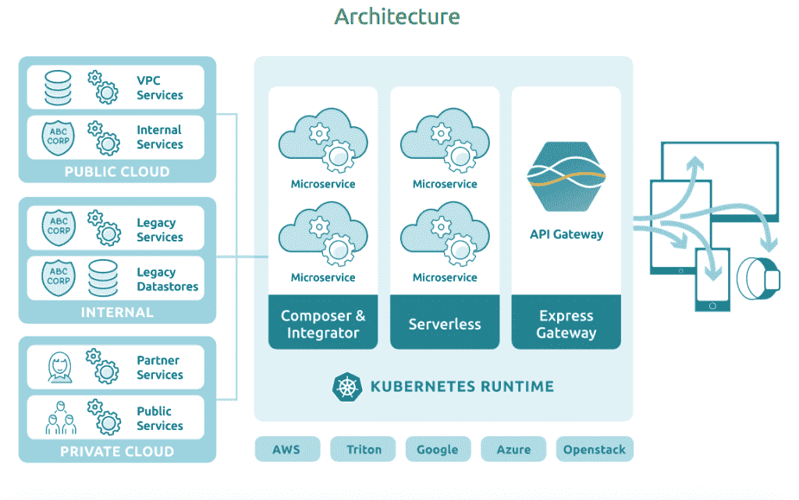

# LunchBadger:微服务，Kubernetes 上的无服务器

> 原文：<https://thenewstack.io/lunchbadger-microservices-serverless-kubernetes/>

首先，有个名字:午餐獾。谁会这么做？

创始人兼首席执行官[A](https://github.com/altsang)[l . Tsang 解释说，这是公司的代号。](https://github.com/altsang)我们的想法是，如果你能消除围绕[微服务](/category/microservices/)的模糊性，你如何构建它们，如何处理遗留代码，如何部署它们，你就能把你的竞争对手当午餐吃掉。

“在实现像微服务这样的现代架构时，除了硅谷开拓者自己所做的以外，没有太多的工具和专业知识，”他说。

该公司开始采用最佳实践、新技术，如容器和开源容器编排软件，以及围绕这些技术标准化的其他工具和服务，来创建一个在云原生基础设施中构建和部署微服务的平台。

该公司的软件包基于[无服务器基础设施](/category/serverless/)和 Kubernetes 运行时。

他说:“我们已经采用了亚马逊很久以前在 Lambda 和 API 网关以及专有运行时方面开创的技术，并表示我们可以在这些技术的基础上构建卓越的体验，这些技术基于开源、云不可知，并提供单一平台，以易于开发人员、开发人员甚至业务人员理解的用户界面来协调这些事情。”

LunchBadger 可视画布允许开发人员构建和管理微服务和 API 的端到端生命周期。您可以组合微服务、与企业数据存储集成、设置安全和治理策略、编写函数、发布外部 API 端点等等。

## 开放源码

Tsang 是 StrongLoop 的联合创始人兼首席技术官，该公司提供了 Node.js 的开源企业版，并在那里创建了领先的企业 API 开源 Node.js 框架 [LoopBack](https://loopback.io/) 。 [IBM 在 2015 年收购了 StrongLoop 的](https://techcrunch.com/2015/09/10/ibm-buys-strongloop-to-add-node-js-app-development-to-its-cloud-platform/)。曾在 2016 年 6 月推出了总部位于旧金山的 LunchBadger。

LunchBadger 平台由 API 网关、组合和集成工具以及编写函数的集成开发环境组成。

他说，开发者不必了解 Kubernetes 的一切，但需要有透明度，因为没有什么比黑盒技术更能激怒开发者了。该平台为部署和编写 YAML 文件等事情提供了自动化，但都是开源的。

在连接数据源和模型驱动开发的后端，它使用 Node.js 框架 [LoopBack](https://loopback.io/) ，他称之为开发微服务并将其作为 API 公开的领先框架，以及能够与 Java 和 Python 等遗留和多语言系统对话的领先集成平台。

该网关建立在由 Node Foundation 和 Joyent 支持的名为 [Express Gateway](https://www.express-gateway.io/) 的[项目](https://medium.com/@nodejs/q-a-with-express-gateway-team-a-microservice-api-gateway-built-on-express-ebb3b18b5bdb)的 [Express.js](https://expressjs.com/) 之上。它是 API 网关领域 [Kong](https://getkong.org/) 、 [Tyk](https://tyk.io/) 和其他传统玩家的竞争对手。

canvas 使用了 [React](https://reactjs.org/) 和 [Redux](https://redux.js.org/) ，具有单页面架构和拖拽界面，可以由第三方，比如客户或集成商进行扩展。

它与 Joyent 合作，为 AWS Lambda 和其他专有的无服务器产品提供了一个与云无关的替代方案。

他说:“无法使用虚拟公共云或公共云，但希望在内部使用，或者希望选择在哪里运行，并保留在多个云中运行的权利的人，需要一个透明的解决方案来实现这一点。”

[https://www.youtube.com/embed/qC7f1eBM1Po?start=20&feature=oembed](https://www.youtube.com/embed/qC7f1eBM1Po?start=20&feature=oembed)

视频

## Joyent 协作

Joyent 在 Docker 兴起之前就已经长期使用容器技术，2014 年[开源](https://thenewstack.io/dockers-popularity-convinces-joyent-to-open-source-its-container-based-orchestration-software/)其技术，2016 年被[三星](https://www.wired.com/2016/06/samsung-snaps-best-kept-secret-cloud-computing/)收购。

收购后，它致力于整合存储，创建了[私有区域](https://www.joyent.com/pricing/private-regions) —在公共云和私有云之间开放和可移植的集中式低成本存储。

“我们为大客户建立了许多这样的区域，但他们真的希望跨云分布计算。Joyent 产品和营销副总裁[舒布拉·卡尔](https://github.com/ShubhraKar)说。

“因此，当客户在各种云上进行 DIY 项目或 Kubernetes 作为托管服务时，这些平台一旦被锁定，就会有许多抽象的依赖关系:你需要绑定到他们的网关，他们的 IAM 供应规则，所有基于事件的服务，你需要绑定到 Lambda 这样的池中来做微服务，所以它在引擎盖下并不真正可移植，”Kar 说。

Joyent 推出了多云 Kubernetes 解决方案，着眼于全球管理计算，这需要跨云监控、跨云 Kubernetes 升级和跨云 Kubernetes 管理。

“我们正在每个云上集成一些原生的 Kubernetes 服务，但客户告诉我们这是一个很好的基础，还不够:我仍然局限于数据库即服务，我仍然局限于 Lambda。我喜欢速度，我喜欢不必运行操作，但我不想被束缚在黑箱技术中，”卡尔说。

客户说，如果 Lambda 能够在 Kubernetes 上运行，能够从一个云移植到另一个云，他们可能会有所收获。

[https://www.youtube.com/embed/6uLpip53PYE?feature=oembed](https://www.youtube.com/embed/6uLpip53PYE?feature=oembed)

视频

“他们没有开始考虑云计算，因为我们一直在演示它，并与许多客户进行概念验证。这种服务层—我们称之为一组开放服务—是正在出现的:数据库即服务，功能即服务，如果您正在构建微服务假设 Kubernetes 将成为计算，您可以在任何地方移植—跨云、回本地、混合。你有那种灵活性和控制力，但同时你也有那种速度，”卡尔说。

他指出，三星有两个使用 LunchBadger 的项目正在进行中，但尚未投入生产:

*   移动设备管理:在三星手机的混合模型中提供基于角色的访问。它将在一个服务网格中包含客户和三星设备 API 以及身份 API 的混搭。
*   [智能助手 Bixby](https://www.samsung.com/us/explore/bixby/) :后台是需要高性能的 API 和微服务。它有很多运行在 GPU 实例上的机器学习来加速计算。它没有在传统的虚拟机上这样做，而是使用 Kubernetes 来实现这一点，并预先与微服务堆栈集成，以服务于三星移动设备。

特征图片:“L0081839 獾木刻。Conrad Gessner，1551“由 Wellcome Images 制作，根据 [CC BY-SA 2.0](https://creativecommons.org/licenses/by/2.0/) 授权。

<svg xmlns:xlink="http://www.w3.org/1999/xlink" viewBox="0 0 68 31" version="1.1"><title>Group</title> <desc>Created with Sketch.</desc></svg>