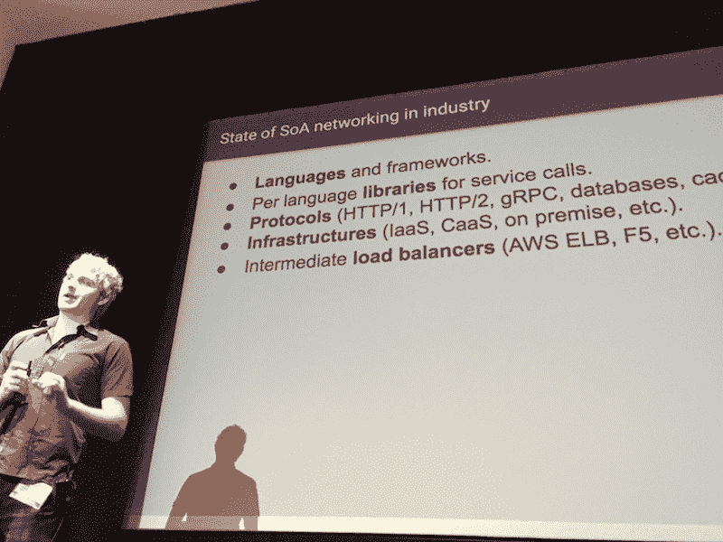
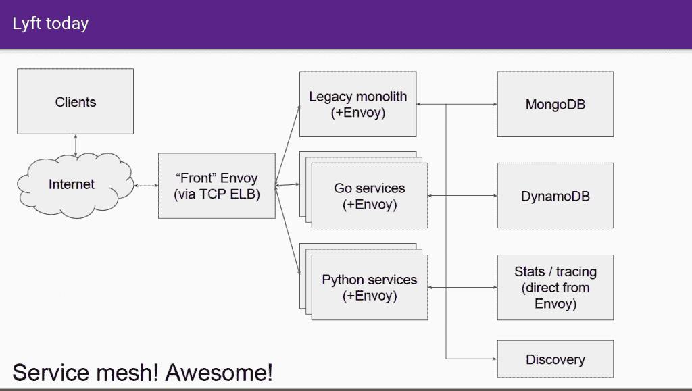
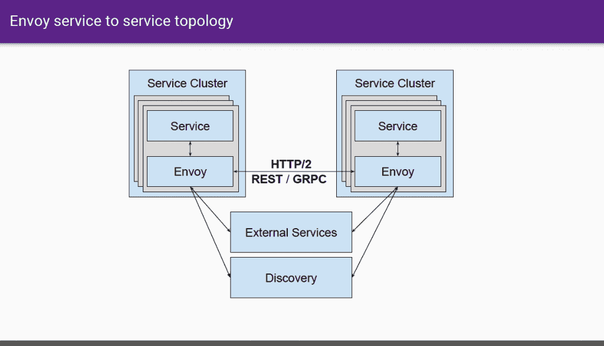

# Lyft 的特使代理服务器帮助该公司转向面向服务的架构

> 原文：<https://thenewstack.io/lyfts-envoy-provides-move-monolith-soa/>

在 1 月 31 日于三藩市举行的[微服务从业者峰会](https://www.microservices.com/summit/)上， [Lyft](https://www.lyft.com/) 的软件“管道工”[马特·克莱恩](https://www.linkedin.com/in/mattklein123/)，深入研究了汽车共享服务如何通过 Envoy(一种自主开发的独立代理服务器和通信总线)将其单片应用程序转移到[面向服务的架构](http://www.service-architecture.com/articles/web-services/service-oriented_architecture_soa_definition.html) (SOA)。Envoy 是去年 9 月开源的，已经有几家公司有兴趣成为贡献者，Lyft 本身也在寻找建立开发者社区的方法。

“当我加入 Lyft 时，人们非常害怕打服务电话，”克莱恩说。他们担心服务调用会失败或带来高延迟，这两者都会降低应用程序的性能。特使就这样诞生了。

代理架构提供了从整体遗留系统到 SOA 的大多数堆栈中缺少的两个关键部分——健壮的可观察性和简单的调试。有了这些工具，开发人员就可以专注于业务逻辑。

Klein 分享了 Envoy 的目的:“网络应该对应用程序透明。当网络和应用程序出现问题时，应该很容易确定问题的根源。”

Lyft 的水管工 Matt Klein 谈论通过 Envoy 进行 SOA 监控

Klein 解释说，如果开发人员不能理解根本原因来自哪里，他们就不会信任系统。直到现在，很难找到好的调试工具。

计划是在一个地方实现许多功能。通过将代理或侧柜放在系统中每个应用程序的旁边，消除了翻译的需要，因此用不同语言编写的几个应用程序都可以使用 Envoy。应用程序与 Envoy 对话，Envoy 处理数据，然后将响应返回给应用程序。

克莱恩说，这种方法听起来很棒，但事实证明非常非常难做到。

## 复杂性=困惑

SOA 的状态:来自 Klein 的幻灯片

想想看:随着技术的进步，公司一直在逐步实施云架构和微服务，留下了服务、语言和框架的大杂烩。

Klein 说，一个典型的系统可能在不同的框架上使用三到五种不同的语言(例如 Java、Go、Scala、PHP、Python)。此外，用于服务调用的库是基于语言的。通常，每种语言都有不同的库来进行调用，并有不同的方式来查看统计数据和可观察性。

因此，随着时间的推移，一个组织可能会拥有大量的协议、大量的数据库和不同的缓存层。这还是在我们谈到基础设施之前，基础设施可以基于虚拟服务器、基础设施服务、容器和负载平衡器。

这导致了混乱的输出，每个系统产生自己的日志和统计数据，从操作的角度来看，很难弄清楚发生了什么。

克莱恩解释说，人们不明白的是，所有这些组件是如何组合在一起的。在 Lyft，开发人员实际上无法理解故障发生在哪里。应用程序里有吗？亚马逊网络服务失败了吗？有网络问题吗？这是不可能的。

毫不奇怪，这种困惑会导致很多痛苦。Klein 说，建立开发者的信任是至关重要的，但在这种环境下几乎是不可能的。

公司知道 SOA 是未来，他解释道，但是在日常生活中，这种变化会带来很多伤害。这种伤害主要与调试有关。

根据 Klein 的说法，最重要的一点是，从分布式系统的角度来看，有许多关于重试、超时、电路中断、速率限制等的最佳实践。但是在这样的零碎系统中，经常发生的是最佳实践的部分实现。

## 输入特使

克莱恩决定从头开始打造特使。虽然有完全一致的服务发现系统可用([动物园管理员](https://zookeeper.apache.org/)，[领事](https://www.consul.io/))，但它们很难大规模运行，大多数使用它们的公司都有一个团队来管理它们。新遗迹提供了可观察性和分析性，但主要集中在可视化方面(绘图、监控、分析等。)

Klein 解释说，Envoy 主要是大型 SOA 的通信总线。它处理诸如速率限制、负载平衡、电路中断、服务发现和主动/被动健康检查等事情。作为副产品，它产生了大量的可观测性数据，这些数据可以输入到像 New Relic 这样的系统中进行可视化。

Envoy 的高级负载平衡非常强大:重试、超时、断路、速率限制、阴影、异常检测等。根据 Klein 的说法，负载平衡是一个经常被忽略的领域，要么人们没有使用它，要么他们没有正确地使用它。

他强调，最重要的是，Envoy 提供了一流的可观察性，可以显示统计数据、日志记录和跟踪。

对于 Envoy 来说，你在系统中的哪个系统并不重要，无论代码在哪里运行，网格都可以工作。因此，无论 Lyft 开发人员是在他们的笔记本电脑上的开发盒上编写代码，还是在舞台上，或者在场景中，在生产中，它都是有效的。

此外，它允许开发人员在开发中解锁有趣的场景，其中服务甚至不知道网络。克莱恩说，这可能是非常非常强大的。

Lyft 今天的 SOA 架构

如果不通过 Envoy 运行，Lyft 堆栈中的任何服务都不会发生。从运营的角度来看，使用单一软件获得完全分布式的跟踪、日志记录和统计数据是有意义的。

Lyft 开发人员质疑为什么他们需要 Envoy 来做一些概念上简单的事情，比如重试，但 Klein 指出重试是让系统从指数级过载中恢复的最佳方式之一。

“在一个复杂的系统中，没有什么是容易的，”他说

Envoy 从一开始就被设计为将服务发现视为有损耗的。该代码假设主机会来来去去，在主动和被动健康检查之上分层。

## 技术故障

特使服务到服务拓扑

特使的每个实例与单个服务位于同一位置。特使实例相互通信，也可以访问外部服务或发现服务。

从服务的角度来看，服务只知道本地特使实例。

由于性能原因，Envoy 是用 C++编写的，是 L3/L4 代理，或面向字节的代理。一个 TCP 代理连接进来，字节被操作推回出去。这个协议可以用于简单的事情，比如一个简单的 HTTP 代理，或者通常用 [MongoDB](https://www.mongodb.com/) 、 [Redis](https://redis.io/) 、 [Stunnel](https://www.stunnel.org/index.html) 或 TCP 速率限制器管理的更复杂的进程。

它最初被编写为 HTTP/2，但它是一个完全透明的代理，包括 gRPC 和一个漂亮的 gRPC HTTP/1.1 桥。HTTP L7 过滤器架构使得插入不同的功能变得容易。

## 在您的系统上部署特使

Klein 建议部署 Envoy 的公司应该采取小步骤。Lyft 本身从小规模起步，逐步推广，用了一年时间才完全部署完毕。

他建议每个内核运行一个线程，称之为“令人尴尬的并行”他解释说，有一种看法认为这非常浪费，但实际上，使用纯文本呼叫进行健康检查并不会消耗大量资源。对于非常、非常、非常大规模的操作，这种方法可能不适合主动健康检查，但对于大多数公司来说，这种用法不是问题。

最终结果是开发人员能够专注于他们最擅长的事情——交付代码。

*要开始使用 Envoy，[请查看来自 Datawire 的本教程](https://www.datawire.io/getting-started-with-lyft-envoy-for-microservices-resilience/)。*

<svg xmlns:xlink="http://www.w3.org/1999/xlink" viewBox="0 0 68 31" version="1.1"><title>Group</title> <desc>Created with Sketch.</desc></svg>