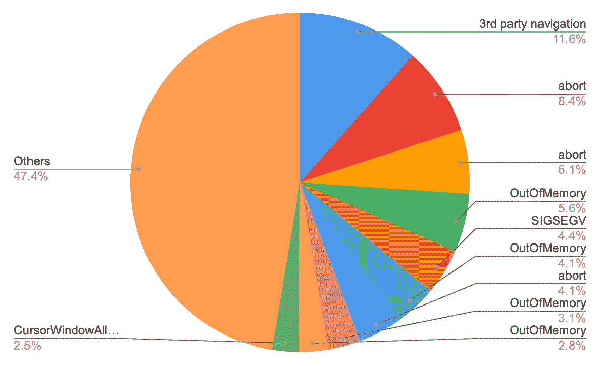
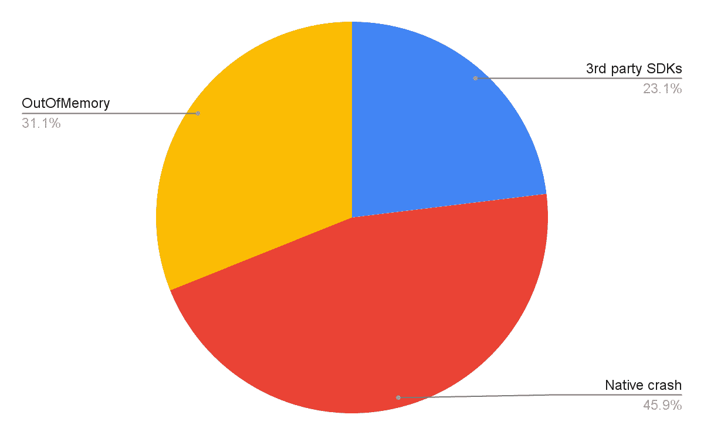

# Lyft 关于避免(软件)崩溃的提示

> 原文：<https://thenewstack.io/lyfts-tips-for-avoiding-software-crashes/>

了解导致应用崩溃的原因是一项艰巨的任务。bug 可能发生在代码库中的任何地方，并且在复杂性和可操作性方面有所不同(第一次改进所需的工程工作)。在某些情况下，深入了解底层系统和框架是导致崩溃的根本原因。

如果你不知道从哪里开始寻找解决方案，潜在入口的数量可能会令人瘫痪。

如果一个应用程序运行速度不够快，或者看起来好像要崩溃了，我会因为打开这个应用程序，双击并向上滑动来关闭它而感到内疚。有罪 AF。

但到目前为止，我一直回避阅读移动性能文章。然而，最近由拼车服务公司 [Lyft](https://www.lyft.com/drive-with-lyft?utm_source=google&utm_medium=cpc&utm_campaign=PAID_DAX_SRCH_US_PRO_WEB_DESK_BRND_LYFT_EXACT&adgroup=lyft_NA_NA&utm_term=lyft&device=c&matchtype=e&targetid=aud-445253257374:kwd-158399963&loc_physical_ms=9004402&loc_interest_ms=&network=g&devicemodel=&adposition=&campaign_id=1447389321&ad_id=511938195020&adgroup_id=54874112525&placement=&ref=&adname=210401_SC_RSA_MMWL_V1&gclid=CjwKCAjw-L-ZBhB4EiwA76YzOdgsYk2iqInXg8u9zRrRKDsOYsr1irNr-_IYTcsAeJ7FrwbBwTcnThoCZ_8QAvD_BwE) 的员工(安卓)工程师[赵文](https://www.linkedin.com/in/wen-zhao-7072685a/)撰写的[博文](https://eng.lyft.com/prioritizing-app-stability-cb7b4cf65d50)引起了我的注意，因为它与数据持久性如何导致应用程序崩溃有很大关系。

**TL；DR** :监控这些读/写操作，尽可能保持低水平，或者至少在一个合理的范围内。不要对磁盘操作使用同步接口。了解这些框架，人们。

*注意:下面概述的策略与平台无关，尽管本文使用了来自 **Android** 的例子来强调它们的执行。*

## 最低挂的水果

赵写道，“从最容易摘到的果子开始很重要。”

应用程序稳定性中最容易实现的是从 Lyft 的内部观察工具、 [Bugsnag](https://www.bugsnag.com/?&utm_source=aw&utm_medium=ppcg&utm_campaign=SEM_Bugsnag_PR_NA_ENG_EXT_Prospecting&utm_term=bugsnag&utm_content=536025543539&&campaignid=14051841305&adgroupid=128124629231&adid=536025543539&gclid=CjwKCAjw-L-ZBhB4EiwA76YzOdb4l1dhZfNztVgjvUX67Q1zP3CAIPvZdzxlgAhYmwEpB7FabmE5CRoCpNEQAvD_BwE&gclsrc=aw.ds) 和 [Google Play 控制台](https://play.google.com/console/about/?utm_source=google&utm_medium=cpc&utm_campaign=Console2020-Branded&utm_term=google%20play%20console%7ce&utm_content=618968067990&gclid=CjwKCAjw-L-ZBhB4EiwA76YzOXjXPU8X0tLD-VRrxF9bltVKaUT2UtiFZVii_d5eiBIej7PwolcrIhoCLIYQAvD_BwE)中收集崩溃数据。以下是我们的发现:

*   Lyft 的内部崩溃率跟踪中不包括本地崩溃。[原生崩溃](https://source.android.com/docs/core/tests/debug/native-crash)发生在 Android 操作系统的原生/ C++层。这些被不同地捕获和报告。Lyft 不会对它们进行任何额外的崩溃报告，因为它们是不可操作的。
*   前 10 大撞车事故占全部撞车事故的 53%。这个信息是出乎意料的，因为有许多种可能的崩溃。下表详细说明了类型和百分比。

图片:Lyft

*   顶级崩溃持续时间长，而且“不可操作”这些头寸保持了至少六个月，因为崩溃需要额外的时间来修复。其中一些随着时间的推移缓慢增加，在标准的分类和随叫随到的职责的雷达下溜走。

最高的崩溃被分为三类。

图片:Lyft

第三方 SKD 桶是不可诉的，因为 Lyft 无法控制第三方 SDK。他们向谷歌地图报告了崩溃(崩溃的原因)，两个团队正在合作解决。我们已经知道，本地崩溃也是不可操作的。这使得 Lyft 与内存不足(OOM)一起崩溃，成为最容易挂掉的果子。Instabug 对这些给出了很好的[解释](https://blog.instabug.com/what-are-oom-crashes/)。

## **瞄准 OOM 崩溃**

**调查** : Lyft 工程师查看了很多 OOM 崩溃栈痕迹，发现了一些他们的共同点——从磁盘同步读取值时，存在对一个 [RxJava2](https://github.com/ReactiveX/RxJava/tree/2.x) 阻塞 API *(例如 blockingGet() )* 的调用。

我们来看看 Lyft 的内部存储解决方案。当它从磁盘读取数据时，它总是通过订阅 IO 调度程序来创建一个新的 IO 线程，在 [PublishRelay](https://github.com/JakeWharton/RxRelay) 中读取和缓存数据，并从 RxJava2 中概述 *blockingGet()* 函数。

由于一些与 OOM 崩溃相关的原因，这种方法是有问题的。根据 RxJava 文档，IO 调度程序可以创建无限数量的弱线程。IO 调度程序不会立即删除空闲线程，因为它使用了*缓存线程池*。相反，调度程序在清除线程之前会让线程保持活动状态大约 60 秒。

线程也不会被重用。如果每分钟有 1，000 次读取，那么就有 1，000 个新线程，每个线程至少占用大约 1 到 2mb 的内存，导致 OOM 异常…这是一个很大的线程数。

工程团队对 Lyft 应用程序的顶级磁盘读取操作进行了测试，发现大多数磁盘读取来自代码库中的两个地方，这两个地方的读取次数非常高，每分钟超过 2000 次。找到了根本原因。

**解决方案**:解决方案很简单，因为只有从磁盘读取数据时才会创建新线程。当应用程序通过冷启动启动并第一次读取数据时，数据被缓存在本地内存中。这允许从缓存中进行所有额外的读取，并阻止额外的线程。

**结果** : OOM 崩溃如预期般减少。此外，本地崩溃减少了 53%。Lyft 的工程师没有预料到对本机崩溃的影响如此之大，但显然，许多本机崩溃的原因是应用程序内存不足。

## **瞄准 ANR 撞车**

[应用不响应](https://developer.android.com/topic/performance/vitals/anr) (ANRs)是指当 UI 线程被阻塞超过五秒钟，并且(委婉地说)操作系统提示用户关闭应用时发生的崩溃。这些不像 OOMs 那么容易，但仍然是可行的。

**调查** : Bugsnag 的堆栈跟踪报告也将具有相似堆栈跟踪的 anr 分组在一起，这对于找出 anr 的原因是必要的。Lyft 按降序对报告进行了排序，发现它们对 [SharedPreferences](https://developer.android.com/reference/android/content/SharedPreferences) 的使用是大多数 anr 的来源(也在持久层)。

Google 建议调用*shared preferences . apply()*异步写入和编辑数据。但是在幕后*shared preferences . apply()*将磁盘写操作添加到队列中，而不是立即执行这些操作。*shared preferences . apply()*在主线程上同步执行几个生命周期事件。队列中的许多操作=应用程序崩溃。

为了将这些新信息专门翻译到 Lyft 代码库中，他们分析了磁盘写入操作，发现 Lyft 应用程序的磁盘写入频率高达每分钟 1.5k 次。他们还发现了每秒钟将相同的值写入磁盘多次的情况。

最终，根本原因归结为 Lyft 的内部存储框架抽象了底层存储机制，这意味着磁盘存储和内存存储使用了相同的接口。开发人员无意中将磁盘和内存存储视为一体。

**解决方案**:产品团队努力从他们的特性中删除所有不必要的磁盘写入。添加了日志记录来审核任何额外的磁盘写入。在添加额外写入的功能级别创建了内存缓存。然后，缓存与磁盘存储同步，同步频率取决于使用情形。磁盘存储接口也与内存存储接口分离。

**结果**:经过几个月的实验，ANRs 降低了 21%。

## **下一步**

大家都知道，磁盘存储在应用程序稳定性中扮演着比以前更加重要的角色。随着 oom 和 anr 的减少，一个新的长期战略已经到位，该战略以两次调查中所获得的信息为中心。

Lyft 将继续致力于其移动性能。下一篇博文[承诺](https://eng.lyft.com/)将通过增加在可观察性和调试方面的投资，围绕提高性能空间中问题的可操作性展开。

<svg xmlns:xlink="http://www.w3.org/1999/xlink" viewBox="0 0 68 31" version="1.1"><title>Group</title> <desc>Created with Sketch.</desc></svg>