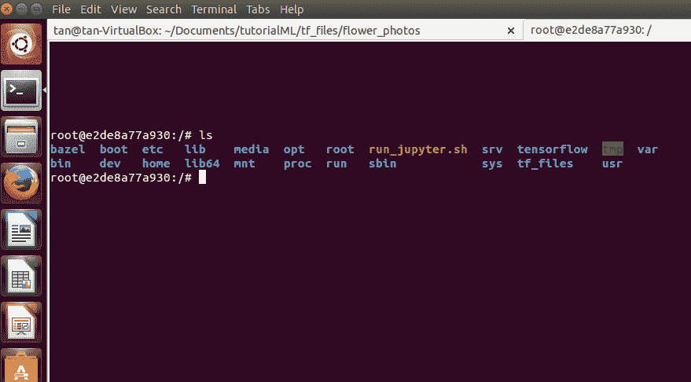
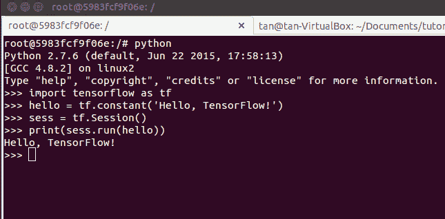
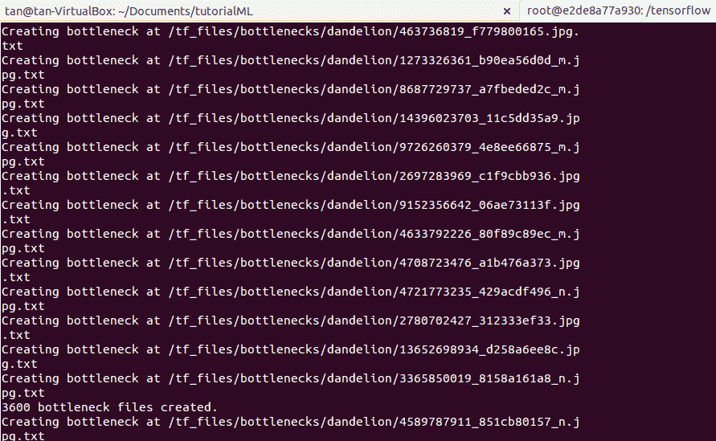
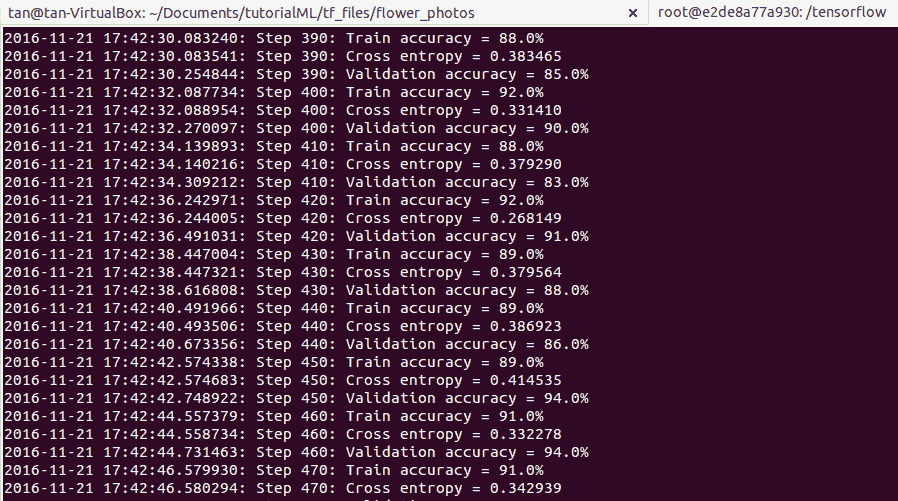
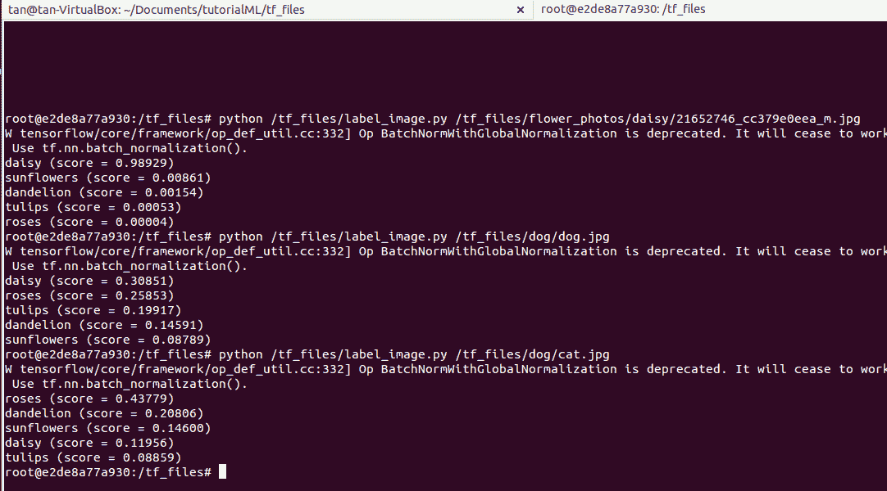

# 在 10 行代码中使用 TensorFlow 进行机器学习

> 原文：<https://thenewstack.io/machine-learning-10-lines-code/>

在之前的一篇帖子[中，我们看到了机器学习的不同组成部分，以及机器学习算法如何学习一个函数来做出决定。在本教程中，我们将看到这种学习的实际操作，并将见证不同的机器学习组件如何相互作用来执行给定的任务。我们将探索这一切，通过建立一个只有 10 行代码的图像分类器，使用机器学习库，由谷歌创建，称为](https://thenewstack.io/how-machine-learning-works-an-overview/) [TensorFlow](https://www.tensorflow.org/) 。

因此，让我们通过定义我们想要使用机器学习来解决的问题来抢占先机。

## 定义问题陈述

这是我们希望机器学习算法做的事情:给定一幅输入图像，它应该找出图像中是否存在花朵。并且，如果一朵花出现在图像中，那么它应该确定该花属于哪一组类别，以及它对其选择有多大的信心。输入数据集中出现的花卉种类有雏菊、蒲公英、玫瑰、向日葵和郁金香。

根据训练机器学习算法的输入数据集的类型，该过程也可以应用于任何图像对象。例如，如果您想要建立一个图像分类器来对来自其他动物的猫图像进行分类，那么可以使用由几个猫图像组成的输入数据集进行训练，并在机器学习之前没有训练过的图像上进行测试。

先决条件

* 64 位 Linux 操作系统的快慢机。
* Unix 命令的基本知识和 CLI(命令行界面)的使用。
*基本了解容器和虚拟机。
*Tensorflow 库。
*使用 Python 编程知识。
* git 基础知识

在这个探索中，我们不会从头开始构建图像分类器。相反，我们将使用预先构建的机器学习模型在我们自己的输入花卉数据集上进行训练。预构建训练模型被称为 *Inception v3 网络，*用于 [ImageNet 大规模视觉识别竞赛](http://www.image-net.org/challenges/LSVRC/) (ILSVRC)，之前已经针对不同类别的对象进行了训练，用于图像分类目的。

对于本教程，我使用 Ubuntu 14.04 虚拟机来构建使用 TensorFlow 的图像分类器。对于 OS X 操作系统，所有步骤都是相似的。对于 Windows，也有在线资源。

## 设置工具

首先，我们将使用 TensorFlow 提供的 Docker 容器包。使用容器最好的一点是，运行 TensorFlow 所需的所有依赖项都已经存在于容器中，不需要设置几个软件、库等。，我们自己(虽然 TensorFlow 库可以原生安装在电脑上)。要在计算机上安装 Docker toolbox，请遵循以下[链接](https://docs.docker.com/engine/installation/linux/ubuntulinux/)中提供的说明。

容器的作用就像一台独立于主机的小型计算机。它有自己的文件系统，这个小机器在成功安装到主机上后会被分配一个 IP 地址。要检查 Docker 是否安装正确，请在主机终端上键入以下命令启动 Docker 守护程序。

```
sudo service docker start

```

## 运行 TensorFlow Docker 映像

通过在主机终端
上键入以下命令来获取 TensorFlow Docker 图像

```
docker run  -it gcr.io/tensorflow/tensorflow:latest-devel

```

输入这个之后，会出现一个新的带有`root user@ `一些长数字的，如下图截图所示。注意，Docker 文件系统将包含一个名为 tensorflow 的文件夹，如下图所示。



要验证 TensorFlow 是否正常工作，您可以通过在 Docker 终端上键入 python 三行代码来打印`hello TensorFlow`来进行验证。



## 为培训准备输入数据

为了使 Inception V3 模型能够识别花，必须准备好输入数据，机器学习模型将在该输入数据上进行训练。为此，首先，在您的主机上创建一个目录，并将其命名为`tf_files`。

在我的例子中，我选择了这个作为`~/Documents/tutorial_ML/tf_files`。如果您仍然在 Docker 终端中，您可以按`Ctrl+D`退出 Docker 并返回到您的主机终端或打开一个新的终端。要下载花卉数据集，首先转到您的`tf_files`目录，然后在主机终端上键入以下命令来下载输入数据集。

```
curl  -O  http://download.tensorflow.org/example_images/flower_photos.tgz

```

通过键入
将其解压缩

```
tar xzf flower_photos.tgz

```

你会在`flower_photos`目录中看到以下名为雏菊、蒲公英、玫瑰、向日葵、郁金香的子目录。

## 将数据集链接到 TensorFlow Docker 图像

由于 TensorFlow Docker 图像不包含图像数据集，我们需要通过在主机终端上键入以下命令来虚拟地链接这些文件。它会带你到码头码头与`root@xxxx`。

```
docker run  -it  -v  $HOME/tf_files:/tf_files gcr.io/tensorflow/tensorflow:latest-devel

```

在我这里`$HOME`等于`~/Documents/tutorial_ML/`。为了验证图片链接是否正确，您可以在终端上键入`ls /tf_files` this，将会看到名为 flower_photos 的文件夹

## 获取示例代码

转到 Docker 文件系统中的 tensorflow 目录，键入`git pull`从 git TensorFlow repo 获取最新的示例代码。示例代码将在`/tensorflow/tensorflow/examples/image_retraining/`.`` 中

对于训练，通过调用 python 键入以下命令:

```
# python tensorflow/examples/image_retraining/retrain.py \
</code>  <code>&gt;  --bottleneck_dir=/tf_files/bottlenecks  \
</code>  <code>&gt;  --how_many_training_steps  500  \
</code>  <code>&gt;  --model_dir=/tf_files/inception  \
</code>  <code>&gt;  --output_graph=/tf_files/retrained_graph.pb  \
</code>  <code>&gt;  --output_labels=/tf_files/retrained_labels.txt  \
</code>  <code>&gt;  --image_dir  /tf_files/flower_photos

```

当初始模型被重新训练时，你将会看到一些瓶颈被创建，类似于下面的截图。瓶颈是初始模型的最后一层之前的最后一层，它将对花图像进行分类。



瓶颈训练结束后，最后一层得到训练，在模型被训练时，您将在 Docker 终端上看到一些术语，如训练准确性、验证准确性，类似于下面的屏幕截图。最后，您将看到一个介于 85%到 99%之间的准确度值。



## 测试图像分类器

转到 Docker `/tf_files/`中的主目录，创建一个名为`label_image.py`的文件。键入下面几行代码并保存。

```
import tensorflow as tf
import systems as sys</code>  <code>image_path  =  sys.argv[1]</code>  # Read in the image_data <code>image_data = tf.gfile.FastGFile(image_path, 'rb').read()</code> # Loads label file, strips off carriage return <code>label_lines = [line.rstrip() for line</code> <code>in tf.gfile.GFile("/tf_files/retrained_labels.txt")]</code> # Unpersists graph from file <code>with tf.gfile.FastGFile("/tf_files/retrained_graph.pb", 'rb') as f:
graph_def  =  tf.GraphDef()</code>  <code>graph_def.ParseFromString(f.read())_  =  tf.import_graph_def(graph_def,  name='')</code></code>  # Feed the image_data as input to the graph and get first prediction <code>with tf.Session() as sess:</code> <code>softmax_tensor = sess.graph.get_tensor_by_name('final_result:0')</code> <code>predictions = sess.run(softmax_tensor, \
</code>  <code>'DecodeJpeg/contents:0':  image_data})
</code>  # Sort to show labels of first prediction in order of confidence <code>top_k = predictions[0].argsort()[-len(predictions[0]):][::-1]
</code>  <code>for node_id in top_k:
</code>  <code>human_string  =  label_lines[node_id]
</code>  <code>score  =  predictions[0][node_id]</code>  <code>print('%s (score = %.5f)'  %  (human_string,  score))

```

如果您退出了 Docker，请键入以下命令来重新启动 Docker 映像:

```
docker run  -it  -v  $HOME/tf_files:/tf_files gcr.io/tensorflow/tensorflow:latest-devel

```

在您的 Docker 终端中运行以下命令来测试，例如，包含雏菊花的图像:

```
# python /tf_files/label_image.py /tf_files/flower_photos/daisy/21652746_cc379e0eea_m.jpg

```

如果你在下面的截图中看到，我对测试图像的评分是`0.98929`。这表明分类器 98%确定图像包含雏菊花。同样，我测试了狗和猫的图片，我在所有的花卉类别中得了一个很低的分数。这表明花出现在测试图像中的可能性非常小。


您可以通过训练不同的数据集来建立自己的图像分类器！快乐学习，敬请期待接下来的探索！

<svg xmlns:xlink="http://www.w3.org/1999/xlink" viewBox="0 0 68 31" version="1.1"><title>Group</title> <desc>Created with Sketch.</desc></svg>