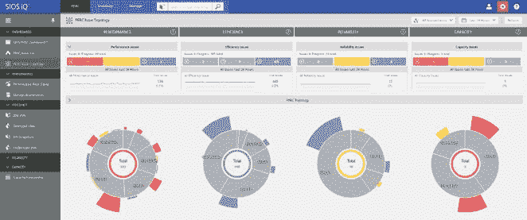
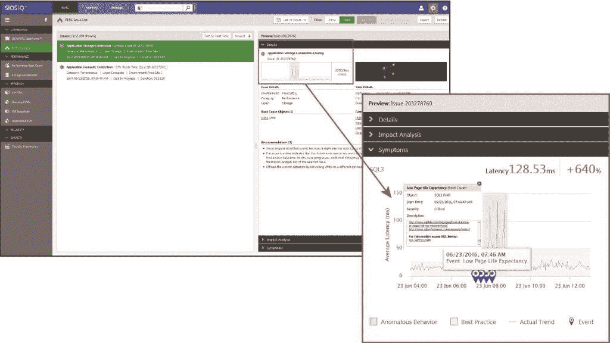

# 机器学习如何解决数据库性能问题

> 原文：<https://thenewstack.io/machine-learning-attacks-problems-database-performance/>

数据中心存储了大量的日志，有些人会说这很荒谬。对于最聪明的管理员来说，数据太多了，无法立即理解。为了让分析继续发挥作用，它需要比现在更聪明。如果这种细粒度的日志记录对任何人都有用——在网络事件之前、期间或之后——逻辑需要能够在事件发生时确定原因和结果。

机器学习可以提供这样的智能。

## 婴儿学步

两年前，市场分析师认为，像阿尔卡特朗讯这样的通信服务提供商收购 T1，而不仅仅是购买 Motive 这种客户体验管理工具的许可，这似乎有点奇怪。贝尔实验室的母公司突然想和 Salesforce 一起进入 CRM 软件领域了吗？当 A-L 被直接询问时，它直接回应道:它希望将 Motive 的分析工具用于推理全球范围内网络故障的根本原因。

这是许多人视为科幻小说的科幻小说中的一个想法，他们没有意识到它已经成为科学事实:机器学习可以用于诊断数据中心故障和性能下降的原因，此外，变得如此熟悉流量模式及其潜在来源，以至于它可以预测未来何时可能发生故障。

> 可以说，只有有知识的人才能理解人工智能系统诊断。

去年，一家名为 SIOS 科技的公司已经在这方面取得了一些进展，在[推出了一款名为 SIOS 智商](http://www.cmswire.com/information-management/can-machine-learning-help-you-manage-vsphere/)(小“我”，大“Q”)的分析工具。它测量 vSphere 环境的行为模式，以确定虚拟机性能问题的原因。补救是这项业务的一部分，SIOS 智商公司正在慢慢进入这项业务。将诊断与补救捆绑在一起仍有工作要做——特别是当能够应用补救的自动化与 CI/CD 打包在一起时。

要实现这种联系，可能需要引入更多具备更广泛技能的 DevOps 专业人员。周二，SIOS 宣布扩大 iQ，旨在检测 SQL Server 在 VMware 环境中运行时的问题，包括新发布的 SQL Server 2016。目前，这一扩展的目标是通知数据库和 IT 管理员性能问题何时会发生。

“我们的目标是成为 IT 管理员的第一站，努力了解环境的状况，问题在哪里，首先从哪里着手，并立即确定如何解决这些问题，”SIOS 首席执行官 [Jerry Melnick](https://www.linkedin.com/in/jerrymelnick) 解释道，“而不是在房间里跑来跑去，召集所有了解情况的人，收集所有信息，并试图解决问题。我们总结、分析、找出问题所在，然后告诉你该怎么做。”

【T2

SIOS 将智商可视化，至少现在，主要是作为一种可视化工具。在过去的一年中，许多产品的改进都集中在使诊断更加图形化，更容易被人类观察者理解。可以说，只有有知识的人才能理解人工智能系统诊断。更重要的是，它是向企业中通常负责采购的人出售分析包的仪表板，正如最近的软件开发分析师调查所证明的那样。虽然人工智能功能被认为是“酷”，但运营经理希望首先看到结果。因此，SIOS 目前专注于结果。

但是梅尔尼克承认，下一步还需要一段时间。虽然下一轮 SIOS 智商提升已经普遍可用，但 SIOS 将在今年下半年开始处理自动化问题。目前，SIOS 智商可以提供补救建议——再一次，视觉上。但这里存在人工智能和机器学习与 CI/CD 框架和部署管道集成的机会，这些框架和部署管道在今天大规模运行数据中心。

## 妥协

这位 SIOS CEO(去年 10 月从首席运营官升任此职)向我们展示了一个例子，在这个例子中，iQ 当前的仪表板突出显示了一个明显超出正常范围的 SQL Server 行为。在一个标有“症状”的框中，它用粉色半色调自动显示问题，并预测该问题给当前工作负载增加了多少超出正常水平的延迟。

与任何机器学习平台一样，“规范”是系统必须经过训练才能学习的东西。从历史上看，机器学习系统作为网络性能分析师的问题是，它们通常是在“规范”已经成为问题的情况下安装的。在某些情况下，当某些系统的行为改善到更理想的状态时，ML 算法可以发出警报。

我们了解到，在过去的一年里，SIOS 一直在努力纠正这种状况。正如首席执行官 Melnick 告诉新堆栈的那样，其当前的 iQ 算法现在播种了来自现实世界客户的匿名行为模式，因此 iQ 至少对“正常”应该如何表现有更好的想法，而不是在完全空白的状态下打开数据中心的视图。

“我们监控整个应用堆栈和基础设施，”Melnick 说。“即使没有特定于应用程序的意识，我们也可以从我们拥有的数据(存储、网络、计算、CPU 和内存利用率)中查看虚拟机并监控其活动。这些都是重要的指标，所以今天的模式将所有这些东西联系起来。”他说，可以想象，如果应用程序性能监视器能够呈现更深层次的指标，也有办法训练智商接受它们。

首席执行官说，考虑到所有这些因素，SIOS 的学习周期大约需要 7 天——这比我们去年听到的要短得多。

“我们实际上引入了我们所谓的‘标准操作模式’，”他说。“随着时间的推移，这些会被我们在您的环境中了解到的内容所取代。所以你会得到更多的“问题”——我不想称之为“事件”或“警报”——它们是我们在最初七天的标准系统之外的模式中发现的问题。第七天结束时，我们将会习惯我们记录和学习的行为模式。”

在每个月底，iQ 执行一个严格的循环模式来更新其知识库，并加强其关于正常和异常行为的训练。对于半监督学习，系统操作员或 DevOps 专业人员可能会亲自参与此过程。

## 结束游戏

梅尔尼克知道开发人员对事件有着特殊的期望，而不是“问题”就像面向对象编程一样，事件是过程的触发器。Melnick 告诉我们，最终将提供一种自动化程序的机制确实存在。但是，将这种机制激活成一些人所谓的“虚拟机器人”——一种基于软件的自动化系统分析师和操作员——是他所描述的产品路线图的一部分，其起点将在 2016 年下半年的某个时候。

他向我们保证，这不仅仅是一个“某个时间”的事情，而是一个突如其来的日期。他说，SIOS 现在以六周冲刺的方式进行产品更新，因此 7 月 29 日发布的 3.8 版本将包括超越线性回归的改进预测。到那时，该产品将能够在四个类别中呈现预测的一般行为状态:性能、效率、可靠性和容量。

“你每天都会看到这些问题的严重程度，”梅尔尼克说。“通过使用机器学习技术，我们的预测基于实际学习到的行为模式，即您的环境随着时间的推移在所有计算层中的模式，并预测它们如何随着时间的推移而变化，以及在特定的一天该环境将如何受到影响。”

可以想象，如果这些事件发生时，不仅手头有这样的预测，而且记录为数据，可以改变补救自动化处理这些事件的方式。例如，预测数据可以用作参数，通知自动化例程在缺少实时数据的情况下，由于正在经历的问题，它们应该如何响应。

目前，SIOS iQ 的 ML 功能是为 VMware 环境开发的。集装箱化的环境是该公司的一个考虑因素，但还没有明确的计划。我们可以合理地假设，SIOS 未来是否会在容器化平台或 Mesos 或 Kubernetes 等管弦乐队上取得成功，取决于它在第一代虚拟化领域的实验进展如何。

与许多科学事实提供者所说的相反，人工智能需要很长时间才能孕育出来。但是越多的开发者社区参与到这个过程中，就越有利于孕育的进行。

特色图片:大约在 1967 年，一个[印刷的杂志广告，为 Mattel](https://www.flickr.com/photos/91591049@N00/12521467433/in/photolist-azJzaa-k5tN2x-duQQ84-bTdVNX-6B1QNY-asF3X1-e4w2bJ-dzYWvD-cs6BwA-6FiPhE-Mo7JU-oHiMW9-e8cPG8-d2Jqi7-dzYWGB-i7v34W-e1bfNN-e4qq3R-drysk1-axPL2b-bEjVGq-ooNqYk-doTknB-eyRRin-5tDCdT-fdkHLi-ieXqcD-5tViQ5-eyTnqB-gELvgV-doTkBX-dzYWyt-8BwLYe-duQQda-5LWHGM-bAfYqA-q1Qss8-fk9YyA-2saPB2-62WDMu-doTk9K-gXVD1a-doTtTb-duWpWm-doTu91-2RKR9G-27bLUq-9Cfq1u-fCMRqT-e1bfPQ/) 的“会说话的学习机器”做的，在知识共享许可下。

<svg xmlns:xlink="http://www.w3.org/1999/xlink" viewBox="0 0 68 31" version="1.1"><title>Group</title> <desc>Created with Sketch.</desc></svg>