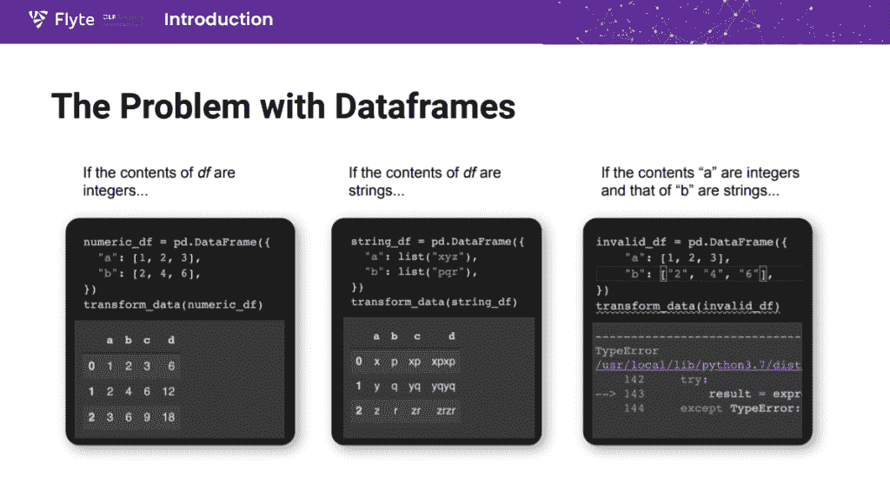
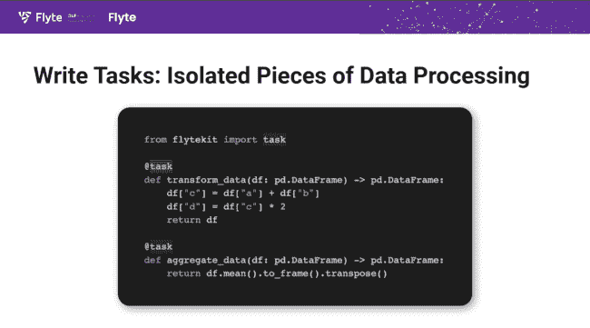
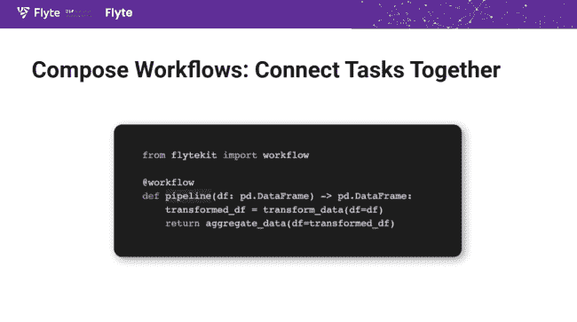
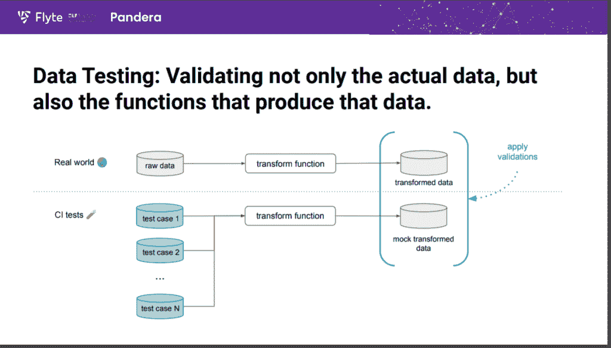

# 机器学习数据通过 Flyte 和 Pandera 进行类型检查和验证

> 原文：<https://thenewstack.io/machine-learning-data-gets-type-checking-validation-with-flyte-pandera/>

机器学习有一个数据质量问题。在有人可能注意到它有问题之前，一组坏数据可能会通过整个建模过程，迫使一个费力的调试过程。虽然有各种工具来检查进入 ML 操作的数据，但几乎没有框架来标准化整个系统或公司的数据验证。

ML 软件提供商 [union.ai](https://union.ai/) 的机器学习软件工程师 [Niels Bantilan](https://twitter.com/cosmicBboy) 在本周于西雅图举行的 [Linux 基金会](https://training.linuxfoundation.org/training/course-catalog/?utm_content=inline-mention)的[开源峰会](https://events.linuxfoundation.org/open-source-summit-north-america/program/schedule/)的一次演讲中谈到 ML 数据验证时说:“在真正的 Python 精神中，这是蛮荒的西部，所以你只需要自己做事情。

Bantilan 介绍了他创建的两个开源程序，这两个程序可以帮助在生产中使用坏数据之前将其根除，并使数据验证过程标准化。

在 Union.ai 的商业支持下， [Flyte](https://github.com/flyteorg/flyte) 是一个对 Kubernetes 友好的[基于 DAG 的](https://medium.com/hashmapinc/building-ml-pipelines-8e27344a42d2)数据流水线框架，它可以对以 Python [Pandas 格式](https://pandas.pydata.org/)作为数据帧接收的材料进行类型检查。Pandera 在此框架的基础上，还提供了额外的统计和验证数据检查，允许组织构建一个数据架构，其中嵌入了可接受的数据范围和类型的一些领域知识。

当一起使用时，这些程序可以验证数据是正确的，当它们被验证时，在运行时抛出警告。在机器学习中，类型安全非常重要，因为它可以节省大量的时间和资源。

一个组织可以基于错误的数据做出商业决策，并且通过一个未标注的 ML 过程来学习找出错误是一件很麻烦的事情。

## 超越熊猫

如今 ML 中使用的许多数据都是在 Python 数据框中编码的，这些数据框基本上是导入数据的表格，很少或没有额外的上下文。然而，Python 是一种动态类型语言，因为它不检查作为变量输入的数据类型。

就其本身而言，Python 无法标记某个字符串数据无意中被输入为一个值而不是一个整数。这种错误会导致运行时出错。Bantilan 说，即使所有的值都是字符串，Python 的数学运算符应用于字符串时也可能导致不希望的结果。

在 Python 中将字符串和整数相加会导致运行时错误。

作为一个强类型的“数据沿袭跟踪平台”，Flyte 可以执行类型检查、生产前检查，以确保 integer 列中只有 integer。

使用 Flyte，ML 工程师编写可以预处理数据的任务。每个任务实际上都是运行在自己容器中的 Python 装饰函数。任务可以作为工作负载链接在一起，每个任务的输入和输出都有明确的定义。

使用 Flyte 模式，您可以构建一个完全类型安全的 DAG ML 工作流，它可以确保使用的数据是正确的。

在 Flyte 中，您可以构建数据处理任务…

Flyte 任务可以链接成函数。

“这是一个非常好的特性。因为现在有了类型信息，基本上就有了函数的函数类型。现在可以分析你的函数，看看什么是有效的操作集。因此，您可以根据允许的输入和输出类型来评估工作流的有效性，”Bantilan 解释道。

生成的 Python 代码可以在本地运行，并部署到生产环境中。Flyte 可以通过 Python pip 安装。

## 超越类型安全

Pandera 是一个统计类型和数据测试工具，可以集成到 Flyte 中来验证数据类型以外的其他属性，实际上是给数据处理管道添加了防护栏。

统计类型指定数据点集合的属性。例如，如果您已经知道输入值的范围，您可以检查以确保数据在此范围内。您可以匹配正则表达式，或者不要多次输入空值。您可以检查列的唯一性，或者它的“单调性”(值是增加还是减少？)

通过数据测试，Pandera 既可以验证传入的实时数据，也可以验证处理这些数据的函数。您可以将关于数据框的假设编码为模式，该模式可用作 Python 类型的注释，并通过函数调用进行检查。

Pandera 可以检查以确保您的 ML 工作流程的数据处理功能正常运行。

“你可以很容易地将数据帧类型与管道集成，如果出现问题，就会得到信息性的格式错误，”Bantilan 说。

<svg xmlns:xlink="http://www.w3.org/1999/xlink" viewBox="0 0 68 31" version="1.1"><title>Group</title> <desc>Created with Sketch.</desc></svg>