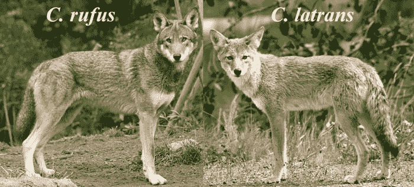

# 机器学习破译濒危狼的嚎叫“方言”

> 原文：<https://thenewstack.io/machine-learning-deciphers-howling-dialects-endangered-wolves/>

为了给濒危狼种群提供更好的保护和管理策略，一个国际研究小组正在使用机器学习算法来区分不同狼种中的 21 种不同的狼嗥“方言”，使用了超过 2000 个记录的数据库。

这是同类研究中规模最大的一项，也是第一次使用机器学习来发现狼语中这些明显的细微差别。

## 声音指纹

那么，学会区分嚎叫如何帮助科学家拯救狼群呢？首先，狼很难被追踪到，所以嚎叫作为一种远距离交流的方式是一种更好地识别哪个物种居住在这个地区的方法。

在发表在期刊 *[行为过程](http://www.sciencedirect.com/science/article/pii/S0376635716300067)* 的研究中，研究人员描述了他们如何使用算法来比较 13 种不同狼种之间调制模式的差异。他们发现，不同的变调是经过深思熟虑的，截然不同的，这意味着嚎叫曲目可以被用作一种识别标记——一种“声音指纹”。

例如，科学家发现灰狼倾向于用低平的声音交流，与红狼高而起伏的嚎叫形成对比。

这些发现对于像[红狼](https://en.wikipedia.org/wiki/Red_wolf) ( *大狗*)这样的极度濒危物种来说尤为重要，它们已经因为栖息地丧失、疾病和上世纪上半叶实施的过度热衷的捕食者根除计划而大量灭绝。它们曾经遍布美国东南部，现在几乎灭绝了。由于 20 世纪 80 年代的圈养繁殖和再引入计划，现在大约有 200 只红狼生活在圈养环境中，但估计只有 75 只红狼留在野外。

## 咆哮

但是，一个新的威胁正在出现，可能会进一步破坏这一不稳定的局势。

“红狼在野外的生存受到与郊狼杂交的威胁，我们发现这两个物种的嚎叫行为非常相似，”这项研究的首席研究员，剑桥大学的 Arik Kershenbaum 在科学日报中解释道。“这可能是它们如此可能相互交配的一个原因，也许我们可以利用我们现在发现的嚎叫行为的微妙差异来区分种群。”

左图:红狼。右图:郊狼。

研究人员认为，通过播放录音样本，吓跑任何潜在的掠食者，可以避免农民之间试图保护他们的牲畜免受狼袭击的冲突。该团队现在正致力于进一步完善他们的发现，并为更有效的保护寻找新的应用。然而，该团队承认，要真正翻译某些嚎叫的意思，还有很多工作要做。

“我们目前正在美国黄石国家公园进行研究，使用多种记录设备和三角测量技术，试图捕捉嚎叫声并定位。例如，通过这种方式，我们也许能够分辨出某些叫声是与远距离通讯有关还是与狼群警告有关，”Kershenbaum 说。

但是除了狼语言的微妙之处，研究人员认为，使用机器学习来破译狼和海豚等聪明的社会性动物的声音模式，对于解开人类语言发展背后的进化之谜可能有更大的意义。

“在分类学上，狼可能与我们不太接近，但在生态学上，它们在社会结构中的行为与人类非常接近。这就是为什么我们驯养狗——它们和我们非常相似，”Kershenbaum 说。“在为了生存而必须交流的物种中，复杂的指称交流的存在可能是语言进化的关键一步。我认为，通过研究在社会和行为上与我们相似的动物的发声，我们可以对我们自己使用语言的早期进化有很多了解，如果在分类学上不一定密切相关的话。”

事实证明，在帮助计算机做出智能决策的过程中，机器学习是不可或缺的，它能够做任何平凡的事情，如翻译不同的语言或充当个人数字助理，以及其他更重要的事情，如可以阅读情绪的机器，或在 T4 发明的最复杂的游戏中击败人类的机器。

机器学习也有可能拯救地球，科学家们使用机器学习来跟踪和分析新兴领域“[气候信息学](http://www.planetforward.org/2014/05/12/what-machine-learning-can-do-for-climate-science)中的复杂气候模型，目的是更好地预测全球气候将如何变化，并开发有针对性的解决方案。

那么，想象机器学习也可以用于野生动物保护就不是什么难事了。

图片:狼天堂国际/ [红狼](https://www.flickr.com/photos/trackthepack/ "Go to Red Wolf's photostream")和 [Jitze Couperus](https://www.flickr.com/photos/jitze1942/ "Go to Jitze Couperus's photostream")

<svg xmlns:xlink="http://www.w3.org/1999/xlink" viewBox="0 0 68 31" version="1.1"><title>Group</title> <desc>Created with Sketch.</desc></svg>