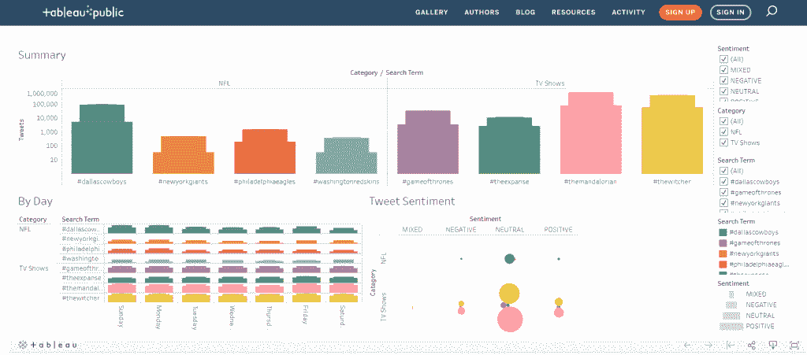

# 用于推特情感分析的机器学习

> 原文：<https://thenewstack.io/machine-learning-for-twitter-sentiment-analysis/>

通过将分析工作负载迁移到云中，组织已经实现了商业智能架构的现代化，为利用其他云服务从数据中获得更深入的见解打开了大门。新云服务的定期推出使机器学习成为热门话题。在企业的数据管道中采用复杂的流程(如机器学习)从未如此简单。这里有一种基于云的方法，组织可以利用机器学习将情感分析应用于 Twitter。

### 将机器学习与基于云的商业智能架构相集成

组织渴望采用基于云的现代商业智能(BI)架构来实现速度、简单性和规模。利用新的云服务进行复杂的操作，如机器学习，可以产生所有这些好处。

为了方便起见，人们可能会选择来自 BI 栈当前所在的相同云提供商的机器学习服务。例如，如果那是 AWS，那么 Amazon understand 是一个很好的选择。如果在谷歌云平台上，谷歌自然语言是一个很棒的选择。同样需要注意的是，您并不局限于您的 BI 堆栈所在的云平台中的服务。这些类型的服务大多易于设置和集成到公司的架构中，并有助于更快地从数据中收集见解。

### 异步集成

 [阿拉万·加亚吉瓦

Arawan Gajajiva 是一名经验丰富的数据和云技术专家，拥有 20 多年的专业技术知识。Arawan 已经帮助不同行业和垂直行业的各种公司建立和维护他们的数据架构。目前，Arawan 是 Matillion 的首席架构师，这是一个专门为云数据仓库构建的 ETL 解决方案。](https://www.linkedin.com/in/arawan-gajajiva-7673925/) 

云数据仓库(CDW)非常适合大规模数据工作负载，尤其是在一次处理大量数据时。CDW 可以处理如此大量的数据，使其成为执行大型数据转换工作负载的绝佳平台，并且性能可以随着企业数据集的增长而扩展。

当使用[Amazon understand](https://aws.amazon.com/comprehend/)进行情感分析时，企业可以实现同步或异步集成。同步集成的工作方式是向 Amazon understand 发送单独的 tweet，然后等待包含 tweet 派生情感的响应。同步集成的一个常见用例是在交易系统中进行实时情感分析，比如网站的推荐引擎。异步集成的工作方式是发送一组 tweets 供 Amazon intensive 处理。完成后，结果将在一个或多个平面文件中提供，然后可以使用这些文件。在这种情况下，与 Amazon understand 的异步集成最有意义，因为处理大量数据的可伸缩性和速度至关重要。

### 从 Twitter 获取推文进行情感分析

第一步是将 Twitter 上的推文加载到 CDW 中。一些提取、转换和加载(ETL)工具具有使用 Twitter 作为数据源的本地组件，这使得这一步骤非常容易实现。

### Twitter API 限制

通常，Twitter 的 API 被用作从 Twitter 获取数据的主要集成点。具有 Twitter 本地连接器的 ETL 工具通常会使用 Twitter APIs。ETL 工具提供的连接器有助于简化这种 API 集成。在设计获取推文的自动化过程时，需要考虑 Twitter 的标准 API 端点速率限制。当从 ETL 工具中使用原生 Twitter 连接器时，检查是否可以考虑这个速率限制。这通常是一个可以在 ETL 工具的 Twitter 连接器中设置的属性。

### 准备和发送用于情绪分析的推文

在本练习中，企业可以使用 Amazon understand 对捕获的推文进行情感分析。如前所述，为了确保可伸缩性和速度，使用异步方法与 Amazon understand 集成是有意义的，特别是使用 StartSentimentDetectionJob。要使用这种方法向 Amazon intensive 获取数据，将一个文件放在 S3 桶中，然后执行 Amazon intensive 作业来处理它。当 Amazon understand 分析完数据集后，它会将一个输出文件放入一个指定的 S3 桶中。

在为 Amazon understand 创建输入文件时，可以定义两种输入格式。一个企业可以使用 **ONE_DOC_PER_LINE** 格式，这意味着输入文件中的每一行都将是一个完整的文档，亚马逊理解将对该文档的整体情感进行评分。在我们的例子中，文件的每一行都是一条 tweet。额外的数据(如 tweet id 或搜索词)不包括在输入文件中，但企业可以使用文件名来帮助传递一些关于正在分析的 tweet 的元数据。

考虑如何可视化分析的数据，并希望保持分析的匿名性，一个组织将准备 Amazon understand 输入文件，其中每个输入文件都代表按日期搜索特定搜索词所捕获的 tweets。使用标准的云数据仓库特性，可以非常容易地以这种方式分割数据。每一段推文都可以用来创建一个推文输出文件，供 Amazon understand 分析。

一旦创建了所有的 Amazon understand 输入文件，就可以触发 Amazon understand 作业来分析生成文件的内容。

这里有一个 AWS CLI intensive 命令的文档链接，该命令可用于以编程方式触发 Amazon intensive 作业，即开始-情绪-检测-作业。请注意 AWS 文档，它概述了执行 Amazon understand 作业所需的 IAM(权限)。

### 接收和加载情感分析输出

当 Amazon understand 作业完成时，需要执行一个单独的 ETL 作业来加载和转换接收到的数据。通常，当与异步流程集成时，用户通常会选择一种“轮询”机制来确定何时可以加载结果，或者选择一种“事件驱动”机制来在结果可用时执行。一些云原生 ETL 工具可以直接与其他云服务集成，如 AWS [简单队列服务](https://aws.amazon.com/sqs/) (SQS)以实现事件驱动模式，在这种情况下，事件将是 Amazon Comprehend 将输出文件放入 S3 桶。这可能是触发作业接收和处理 Amazon understand 输出文件的事件。

吸收和转换亚马逊理解输出数据的工作将被设计为一个简单的 3 步过程。

*   **第一步**:准备要加载到云数据仓库的文件
*   **第二步**:将数据加载到云数据仓库
*   **第 3 步**:将数据转换为分析就绪状态

亚马逊理解输出文件中的数据是 [JSON 格式](https://www.json.org/json-en.html)。每个 JSON 元素都代表一个来自 Amazon understand 输入文件的经过分析的 tweet。输入文件的文件名和情感分析分数等细节都嵌入在 JSON 信息中。使用您最喜欢的 ETL 工具，将来自 Amazon understand 的 JSON 输出数据解析到您的 CDW 中的目标表中。这些目标表代表可用于分析的数据，您现在可以根据这些数据使用您最喜欢的报告工具。

### Twitter 情绪分析仪表板

下面是一个简单的交互式 Tableau 仪表板示例，它有助于展示企业通过遵循此流程可以获得的洞察力类型！这个 Tableau 仪表板显示了与一些 NFL 球队的提及相关的推文趋势(go Birds！)和一些热门电视节目。这可以很容易地用来跟踪一个组织自己的业务相关的标签，并总结人们对其品牌的评论趋势。

云数据仓库的能力和性能有助于企业使用数据转换软件将数据连接在一起，从大量数据中收集有价值的见解。数据转换支持机器学习、人工智能、建模等用例，因此您可以更快地获得洞察力，并为您的业务做出更快的数据驱动型决策。

通过 Pixabay 的特征图像。

<svg xmlns:xlink="http://www.w3.org/1999/xlink" viewBox="0 0 68 31" version="1.1"><title>Group</title> <desc>Created with Sketch.</desc></svg>