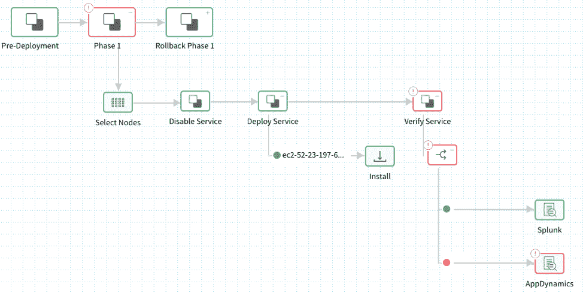

# 机器学习可以帮助您避免连续的交付错误

> 原文：<https://thenewstack.io/machine-learning-is-ready-to-help-you-avoid-continuous-delivery-errors/>

[驾驭](https://harness.io/build-pipelines-in-minutes/)赞助本帖。

 [史蒂夫·伯顿

Steve 是 Harness.io 的 CI/CD 和 DevOps 布道者。在 Harness 之前，他在 AppDynamics、Moogsoft 和 Glassdoor 工作。Steve 于 2004 年在 Sapient 开始了他的 Java 开发职业生涯。当他不玩技术的时候，他通常看 F1 或者在网上研究汽车。](https://harness.io/build-pipelines-in-minutes/) 

机器学习和持续交付(CD):这是一个很棒的概念，还是最新的营销术语？华而不实的行话背后确实潜伏着实质，可以用来解决实际问题。

从熟悉的典型部署管道入手会有所帮助。通常看起来是这样的:

1.写代码；
2。提交代码；
3。打造神器；
4。测试工件；
5。部署工件；
6。验证工件；
7。回滚工件。

目前，大多数组织都在使用他们的 CD 流程或平台(通常由 Jenkins 和一组脚本组成)来自动化步骤一到五。对于大多数 DevOps 团队来说，CD 停止在部署阶段——这意味着一个新的工件投入生产的时刻。

但是，在上述第六和第七步中，关于这些生产部署的实际业务影响，还缺少一些东西。一个可能的解决方案是使用机器学习(ML)来真正理解这种影响——正如我们下面所描述的，ML 过程已经能够胜任这项任务。

## 了解部署的业务影响

信不信由你，部署速度并不是成功的真正晴雨表(尽管它感觉很好)。我总是惊讶于有多少与会者声称每天有数千个部署，但很少有人对他们的更改/修复/补丁的影响有任何了解。您如何知道您是否正在向客户部署大量好的或坏的想法或变更？

考虑将第六和第七步称为“连续验证(CV)”——然后使用无监督的机器学习来自动化这些步骤。

## 机器学习入门

在我深入研究如何应用机器学习来实现 CV 之前，让我们了解一些 ML 基础知识。

机器学习是人工智能(AI)的一种形式，有两种风格:

1.  被监督；
2.  无人监管。

监督通常需要人类通过提供参数、反馈或标签来训练 ML 算法和模型。例如，阈值、评级、规则、设置和配置等都是参数/反馈的类型，算法可以使用它们来随着时间的推移变得更加准确。你可能还会听到像“神经反馈”这样的流行词，简单地说就是征求人类的反馈。

在无监督的情况下，ML 算法及其模型可以自行从数据中推断出意义和关系，而不需要人类的帮助或干预。这是即插即用的——你提供数据，ML 会自己解决问题。

代价是有监督的机器学习更准确，但通常需要大量的培训和维护。相比之下，无监督的机器学习不太准确，但也不需要干预。因此，在应用的使用案例和数据集方面，有监督和无监督的优势和价值有很大不同。

## 将人工智能和机器学习应用于连续交付

为了验证任何生产部署的影响，我们首先需要理解(并测量)与应用程序相关的几个关键性能指标(KPI)。

以下是一些 KPI 示例:

●业务:营收、订单量、订单吞吐量；
●性能&可用性:响应时间、吞吐量、停顿、正常运行时间；
●资源:CPU、内存、I/O；
●质量:事件、例外和错误。

幸运的是，几乎所有这些数据都可供 CD 平台利用，例如:

●应用性能监控(APM): AppDynamics、New Relic、Dynatrace
●基础设施监控:Datadog、CloudWatch、Nagios
●日志监控:Splunk、ELK、Sumo 逻辑；
● AIOps/ITOA: Moogsoft 和 BigPanda
●人工合成:硒。

如今，大多数应用程序都有自己的健康检查页面，其中一些简单的 HTTP 断言可以返回各种 KPI。

所需要的是构建连接器和 webhooks，这些连接器和 web hooks 集成了许多上述工具集，以观察每个生产部署之后的所有应用 KPI、数据和指标。然后，可以使用无监督的机器学习来自动分析来自这些来源的所有时序指标和事件数据。这样做使您能够自动验证生产部署，并识别可能引入的任何倒退、异常或故障。

这是它可能看起来的样子:

在这个视图中，您可以使用一个或多个验证源来验证生产部署，而不管数据是时序指标、非结构化事件还是简单的 HTTP 断言。在上面的示例中，Splunk 和 AppDynamics 都用于验证部署。

## 检测性能退化

没有什么比运行缓慢的应用程序更令人恼火的了，所以在部署后验证性能是显而易见的。下面是一个屏幕截图，显示了将无监督机器学习(SAX 和 Markov)应用于监视应用程序的 AppDynamics 数据集的输出。您可以看到，ML 确定了与关键业务交易相关的三个绩效回归:

如果我们将鼠标悬停在这些回归上，我们可以看到为什么 ML 算法会标记这些异常:

如您所见，请求登录的响应时间将 5X 从 31 毫秒增加到了 165 毫秒。机器学习的伟大之处在于算法是实时执行的，所以你获得的洞察力几乎是即时的。ML 没有内脏的感觉；一切都是可以测量和量化的。在这种情况下，ML 可以量化每个生产部署的确切业务影响。

## 检测质量退化

没有可靠性的性能什么都不是，在部署后关注应用程序事件、异常和错误是至关重要的。目前的一个主要挑战是大多数应用程序控制台和日志都充满了垃圾，比如类路径异常。更糟糕的是，这些异常中的大多数已经存在多年，并且是噪声的主要来源。

实际上，您可以将 ML 应用于这个问题，以了解对于您的应用程序和业务来说，哪些事件是良性的，哪些事件是新的、独特的和异常的。为此，您需要对日志工具中的事件数据进行标记，并应用几种无监督的机器 ML 算法(如熵、Kmeans 聚类、Jacard 和余弦)来了解应用程序在部署后生成的事件的相关性、唯一性和频率。

在以下示例中，Splunk 用于通过分析应用程序的日志事件数据来持续验证应用程序质量。这是通过使用 Kmeans 算法来完成的，该算法构建相关事件数据的“集群”。灰点代表算法认为是“正常”事件的基线事件，即每个生产部署都会发生的事件。红点代表未知的或第一次遇到的新事件，或者它们代表不寻常频率的事件。

在这种特殊情况下，开发人员意外地使用了分号而不是冒号。如您所见，部署引入了数十个新的异常回归。现在这个错误可以很容易地修复。

## 速度的需求

底线是，使用 ML 来帮助和验证生产部署可以大大减少识别和消除部署错误所需的时间。是的，一个由 100 名工程师组成的团队可以花时间手动研究日志和监控工具，以发现部署后发生了什么——但是他们为什么要这样做呢？过去需要几个人花 60 分钟才能完成的工作，现在用机器一两分钟就能完成。

当然，这并不意味着开发运维变得无关紧要，只是他们开始关注更多有趣的问题，而不是解决部署问题，或者被视为生产版本的瓶颈。这是庆祝机器崛起的一个理由。

通过 Pixabay 的特征图像。

<svg xmlns:xlink="http://www.w3.org/1999/xlink" viewBox="0 0 68 31" version="1.1"><title>Group</title> <desc>Created with Sketch.</desc></svg>