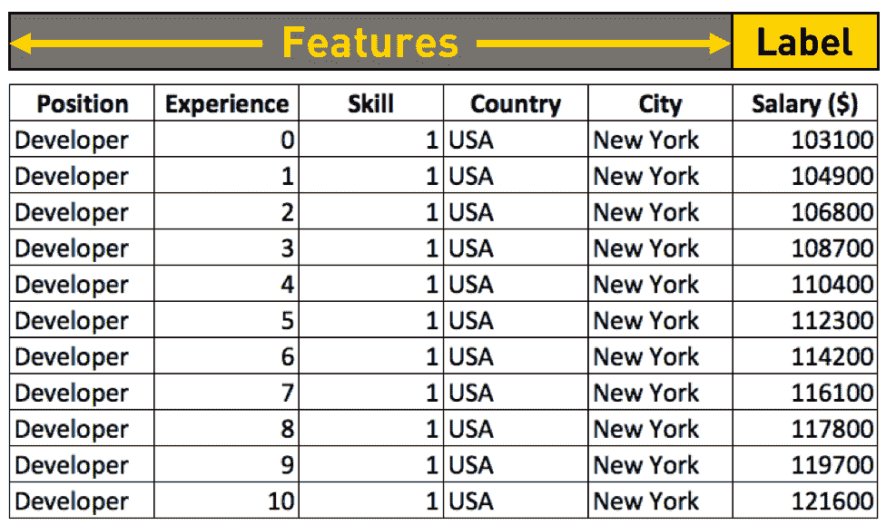
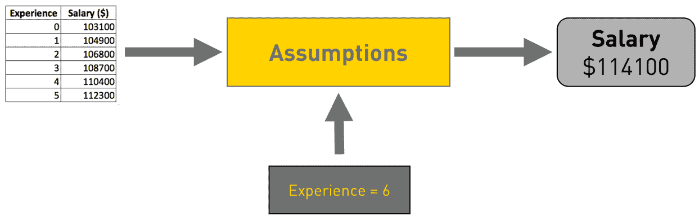
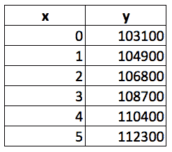
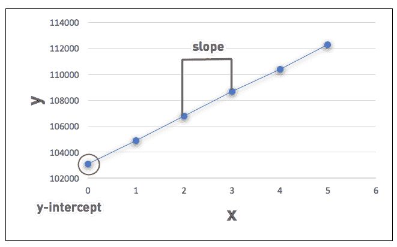
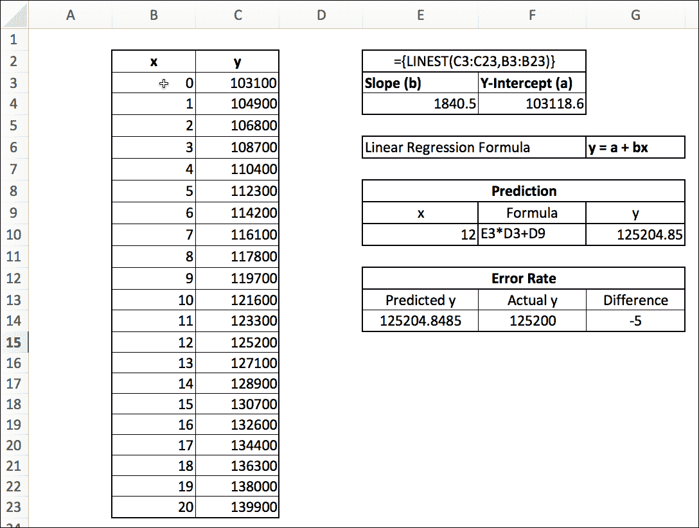

# 面向普通人的机器学习和线性回归

> 原文：<https://thenewstack.io/machine-learning-linear-regression-mere-mortals/>

这篇文章是一系列文章中的最新一篇，名为“机器学习不是魔法”，涵盖了如何开始机器学习，使用熟悉的工具，如 Excel，Python，Jupyter 笔记本以及 Azure 和 Amazon Web Services 的云服务。请每周五回来查看未来的文章。

在本系列的[前一部分](https://thenewstack.io/gentle-introduction-machine-learning/)中，我们试图基于从现有数据集中提取的一些假设来解决一个问题。我们现在将通过在 Microsoft Excel 中测试来验证这些假设。我也该用官方的[机器学习](/category/machine-learning/)术语来映射我们迄今为止讨论的概念了。

[美国著名计算机科学家、卡内基梅隆大学教授 Tom M. Mitchell](http://www.cs.cmu.edu/~tom/) 对机器学习的定义被广泛引用:*“如果一个计算机程序在 T 类任务中的性能(由 P 衡量)随着经验 E 的增加而提高，那么就可以说它从经验 E 中学习了一些任务 T 和性能指标 P。”*

让我们试着翻译一下上面的定义。机器学习是在不需要显式编程的情况下，基于现有数据构建逻辑的能力。基于某些算法，机器学习程序可以在没有程序员显式编写代码的情况下推导出它们的逻辑。

ML 算法可以处理具有合理定义的结构的数据。[我们的 Stack Overflow salary 数据集](https://thenewstack.io/gentle-introduction-machine-learning/)有多个列，比如类别、位置、经验和薪水。尽管它是一个较小的数据集，但几乎所有的行都有完整的数据，算法可以从中进行推断。

从已被充分标记的现有数据以及已知结果中学习的方法被称为监督机器学习。在我们正在处理的数据集中，几乎所有的行都已经填充了已知的结果——薪水。当这些数据用于训练算法时，它可以从员工的位置、经验和工资之间的现有关系中学习。然后，我们可以预测数据集中可能没有的数据的工资。

另一方面，当 ML 用于基于现有数据集识别和分组新数据时，它被称为无监督机器学习。例如，当我们将许多技术专业人员的简历输入到一个算法中时，它可能会创建一个集群，将具有相似档案的个人分组为架构师、开发人员和管理员。在这种情况下，我们不用结构化数据来训练算法。同样重要的是要明白，除了相似数据点的逻辑分组之外，没有具体的预测(比如薪水)。

虽然还有其他形式的 ML，这些是最广泛使用的。根据我的个人经验，我建议从监督式 ML 开始。

为了简单起见，这个介绍性系列的范围仅限于监督式 ML。

在监督 ML 中，有多种技术可以应用于现有数据集，以预测或分类数据。每种技术被称为一种算法。像任何其他计算机科学算法一样，最大似然算法基于数学和统计公式。有趣的是，这些等式和公式存在了一个多世纪，在金融和会计领域大量使用。

当我们将大型数据集应用于这些传统公式时，我们最终会得到有趣的结果。机器学习帮助我们调整和优化每个独特数据集的公式。

因此，可以安全地假设机器学习是计算机科学的一个领域，它结合了数据和数学，以进化出可以预测和分类新数据的程序。机器学习的学习部分意味着调整公式以创建特定于输入数据集的假设。正如我们前面看到的，假设随每个数据集而变化。

让我们回到我们开始的用例。在堆栈溢出数据集中，我们有多个影响一个键值——salary 的列。在 ML 的官方术语中，这些列被称为特性。我们最终预测的价值(工资)被称为标签。

从堆栈溢出数据集中获取要素和标注。

[在上一课](https://thenewstack.io/gentle-introduction-machine-learning/)中，我们从现有数据集中推导出一些假设来猜测工资:

这一假设是基于一个简单的事实，即起薪为 103，100 美元，每增加一年的经验大约增加 1，800 美元。然后我们开始应用这个假设来预测一个有六年工作经验的人的工资。

**预计薪资=起薪+ 1800 *年**

所以，当我们想找出六年工作经验的工资时，计算方法是:

**$113900 = $103100 + $1800 * 6**

我们现在可以开始寻找任何工作年限的薪水，我们会得到不错的结果。您可以用不同的值测试这个假设，并检查输出。

这个公式不知道你是在寻找工资、房价还是降雨量。它只适用于任何特征和标签的组合。我们可以安全地用 x 和 y 替换标题、经验和薪水。

让我们把起始工资称为 a，把增加的工资称为 b，得出一个公式，看起来像 y = a + bx

恭喜你！你学会了你的第一个 ML 算法。上面的公式正式名称为**线性回归**。当我们只用一个特征(多年的经验)去求一个标签(工资)的值时，就叫做**简单线性回归**。请记住，技能水平、地点和职位等其他特征也会对标签(薪水)产生影响。当我们考虑所有这些来预测标签时，我们使用一种叫做**多元线性回归**的算法。现在，让我们专注于理解只有一个特征的简单线性回归。

让我们将这些数据绘制成一个简单的图表，以便更好地可视化。

技术上，上图中 y 的起点叫做 y 截距。x 值每增加一次，y 值的变化称为斜率。根据线性回归，可以通过将 x 乘以斜率并将其添加到 y 截距来找到新的 y 值。

是时候通过一个简单的验证让我们的算法更上一层楼了。

你知道微软 Excel 做线性回归吗？这个公式在 Excel 中已经存在了十多年。让我们试着在我们经常使用的最熟悉的工具中实现我们的新算法。

在上面的电子表格中，x 代表经验，y 代表薪水。使用名为 [LINEST](https://support.office.com/en-us/article/LINEST-function-84d7d0d9-6e50-4101-977a-fa7abf772b6d) 的 Excel 公式，我们可以找到数据集的 y 轴截距和斜率。LINEST 是一个返回数组的函数，该数组对应于 y 轴截距和斜率值。我们选择两个单元格，键入公式{=LINEST(C3: C23，B3:B23)}，然后按 Shift+Control+Enter，用值填充所选单元格。

基于前 20 行，Excel 报告斜率为 1840.5，y 轴截距为 103118.6。有趣的是，这些值与我们从假设中发现的并没有太大的不同。

有了斜率(b)和 y 截距(a ),我们就可以继续计算给定工作年限的工资了。

我建议您在 Excel 中用数据集试验 LINEST。这将验证和澄清你对线性回归的理解。您可以从 [GitHub](https://github.com/janakiramm/ML-is-not-magic) 访问电子表格。

在本教程的下一部分，我们将更仔细地研究线性回归，并了解使预测更准确的技术。敬请期待！

<svg xmlns:xlink="http://www.w3.org/1999/xlink" viewBox="0 0 68 31" version="1.1"><title>Group</title> <desc>Created with Sketch.</desc></svg>