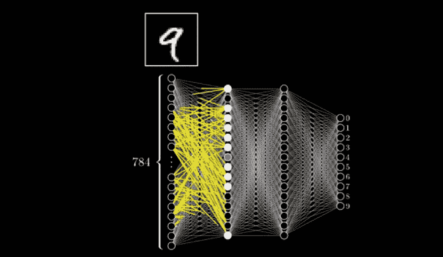

# 机器学习变得简单

> 原文：<https://thenewstack.io/machine-learning-made-easy/>

[Melissa Ng](https://www.holbertonschool.com/)

[Melissa Ng 拥有哥伦比亚大学的教育学硕士学位，她对教室中技术爆炸的好奇心使她进入了软件工程领域。在霍尔伯顿学校学习，她学会了如何在没有任何老师的情况下自学这个领域。](https://www.holbertonschool.com/)

还记得电影《模仿游戏》吗？一个才华横溢的人解密了秘密的德国恩尼格玛电报，间接缩短了二战，拯救了数百万人的生命，后来被控同性恋，被迫接受化学治疗，不久后结束了生命的悲惨故事？

真正的艾伦·图灵完成了许多比这更辉煌的奇迹。他还发表了关于人工智能(AI)理论的论文。事实上，《模仿游戏》这个片名和这部电影没什么关系。他在他的一篇论文中提到了一个游戏，在这个游戏中，人类有一天会设计一个机器来模仿人类，模仿得如此之好，以至于房间另一边的人会被愚弄，以为他在与另一个人交流。图灵是计算机科学领域的先驱。只有在他死后，他才被称为艾的父亲。

在电影中，他创造了一台机器，试图穷尽字母和单词组合的所有可能性，试图将秘密的英格玛密码匹配成有意义的单词。这台机器日夜不停地运转着。想象一下，一个人要花多长时间来查看所有可能的模式，并试图破译加密的秘密战争信息。如果没有图灵给它做什么和如何做的指令，机器不可能破译密码，图灵也不可能独自破解密码。这是人脑和机器的速度和准确性的完美结合。

## 人工智能、机器学习和深度学习之间的关系

ML 是 AI 的一个子领域。DL 是 ML 的一个子领域(来源:Nvidia)

人工智能(AI)是寻求研究和设计具有人类智能和决策能力的机器的领域。[机器学习](https://thenewstack.io/category/machine-learning/) (ML)是人工智能的[子领域，它使用统计数学方法试图实现人工智能。](https://blogs.nvidia.com/blog/2016/07/29/whats-difference-artificial-intelligence-machine-learning-deep-learning-ai/)

斯坦福大学将 ML 定义为“让计算机在没有明确编程的情况下行动的科学。”深度学习(DL)是 ML 的一个子领域，它实现了类似于我们大脑生物学的机器学习，接受多维度的数据，并通过几个网络和神经网络层对它们进行处理。

那很难消化！别担心，我会解释的。要理解 ML，我们先从更大范围的事物来理解，从 AI 开始。

### 为什么我们有这个领域，为什么它很重要？

在 20 世纪 50 年代，现代的计算器和 ATM 银行机将被认为是人工智能，因为计算、取款和存钱的行为可以被认为是人类的智能。快进到今天，这些工具只是“人工智能效果”,因为人工智能的定义已经从仅仅是人类的智能发展到也展示决策

想象一下，你想去最近的一家现在在早上 5 点营业的咖啡店，而不是查看一系列营业时间的菜单，看看哪家商店最近，现在我们可以问语音助手 Alexa、谷歌助手、Siri 或 Cortana，“最近的咖啡店是哪家？”

现在想象一下，你看了一部喜剧，笑个不停。我们现在可以依靠网飞或 YouTube 在电影播放结束后立即显示推荐列表，而不是手动搜索电影名称，试图确定电影类型是否是喜剧，然后收集接下来要观看的潜在喜剧列表。鉴于有如此多不同主题的视频，自动播放的下一个 YouTube 视频总是与您之前观看的视频主题相似，这难道不是非常方便吗？

这些都是现代人工智能发展的例子。当我按下取款按钮时，ATM 机可以完成给我 100 美元的任务，而自动驾驶汽车可以完成它认为正确的多项自发任务:在绿灯时直行、减速、转弯、停在目的地。概括地说，人工智能执行一系列任务。它能完成的任务越多，看起来就越聪明。

> “人工智能是新的电力”——吴恩达

怀着赋予人类权力的宏伟目标，人工智能被分成了更小、更专业的子领域。机器学习是最重要的子领域。作为实现人工智能的一种方法，我们向机器传授我们所有的人类知识，并训练它们采取适当的行动。了解世界并弄清楚如何行动是人类行为的基础，因此，机器学习是人工智能的基石。

### 一种通过教机器学习来实现人工智能的方法

在对人工智能的探索中，IBM 的亚瑟·塞缪尔在 1959 年创造了“机器学习”这个术语。机器学习涉及大量的数学知识，稍后你会看到，但这只是数据科学的一个很小的部分。这个领域也非常类似于统计学，因为它是应用统计学。

信不信由你，“智能”的人类决策和行动可以被归结为仅仅是模式，并可以利用数学进行再造。还记得你第一次学习如何过马路吗？你一直等到灯亮了，你左右两边的车都停在了合适的位置。如果一辆车突然启动，你重新评估过马路是否安全。你能认出这些模式吗？如果灯是红色的，停下来。如果灯不是红色的，走。我们的决定是如何涉及到数学的就稍微微妙一些。如果我们在走路的时候发现一辆车向我们驶来，我们会预测我们需要停下来或者离开的可能性。赛车的角度越靠近我们，速度越快，我们需要跑的百分比就越高。

当人类从**经历**中学习时，机器从**数据**中学习(当我们在我们的脸书照片、我们的短信和我们提供的任何数据集上标记自己时)。)人类的经验越多，机器的数据越多，我们/它就越准确。我们教机器的三种方式是**监督**、**非监督**和**强化学习**。有一长串的算法来完成每一种类型的学习。我们只看一些。**算法**在机器学习的上下文中，是我们给机器运行的一系列逐步的数学指令。一台机器通过这个算法运行后，就变成了一个“**模型**”(它认为世界如何运转的一种假设。)这些模型经历了不断的改进，因此机器完善了技术。我们来看例子。

### 这是一只猫吗？

人类学习的一种方式是通过训练。我们可以给猫分类，因为我们已经被告知什么是猫，我们已经看到太多的猫了。我们可以分类一封邮件是否是垃圾邮件，因为我们知道垃圾邮件是什么样的。根据液体的颜色和酒精含量，我们可以推断我们只是被招待了酒。我们可以通过观察房子的位置、大小和设施来预测房子的价格。我们可以通过观察以前癌症的模式来预测癌症是否是恶性的。为了训练机器以这种方式学习，我们给它一组“**训练数据**”和“**期望输出**”

为了“训练”机器对猫这样的物体进行分类，我们在互联网上找到数百万张猫的照片。我们给机器的数据越多，就越准确。所以我们收录了不同颜色、不同大小、不同角度、打哈欠、跳跃、拉伸以及任何我们能想到的猫的图片。我们通过用“cat”标记照片，为机器提供这个训练数据集的“期望输出”在机器经历了一种称为“分类算法”的流行算法后，它已经学习了猫的世界如何工作的“模型”。

现在为了测试模型，看看它是否学会了，我们给它一张照片，问它是不是一只猫。机器开始运行模型。查看照片中的每个**特征**，它会给它一个**权重**在我们指示它做更多的计算后，它会计算出百分比(例如，50%的椅子，70%的毛绒地毯，30%的猫)。最后，它将返回数值最高的类——fluffy rug。如果模型告诉我们它是一只猫，我们必须用更多的照片来训练它。也许更多白猫的照片。这是一个机器如何**识别/分类**物体的例子。

为了训练机器预测“是”或“否”的可能性，我们可能会给它以前垃圾邮件的训练数据。假设在这个训练数据中，40%的带有短语“最后机会”的电子邮件被标记为垃圾邮件，85%的带有短语“立即行动”的电子邮件被标记为垃圾邮件。在机器获得这些训练数据后，它就有了一个它认为垃圾邮件是如何工作的模型。

现在我们用一封新邮件来测试我们的模型。在我们的模型中，我们可以指示它对任何高于 80%的百分比说是，对任何低于 80%的百分比说否。当它收到一封新邮件，搜索并检测到短语“立即行动”，它会将这封邮件标记为垃圾邮件的可能性为 85%。因为这个百分比超过了我们设置的 80 %,所以它将返回 yes。这就是“**朴素贝叶斯算法。**”

为了教会机器如何预测和返回房价等数字，我们可能会给它现有房价的训练数据。它通过一个“**线性回归算法”**运行，得到一个如下图所示的模型。它的模型假设了房子的平方英尺大小和价格之间的线性关系。有了这个模型，它会根据房子的位置自信地预测出一个数字。

使用线性相关性来教机器如何预测房价(视频来源: [Luis Serrano](https://www.youtube.com/watch?v=IpGxLWOIZy4)

## 无监督学习

人类学习的另一种方式是**发现模式**。当我们发现异常高的消费时，我们才知道我们的信用卡被盗了。我们知道，在炎热的夏天，喝一杯冰啤酒或冰桑格利亚汽酒比喝室温红酒更令人满足。我们了解到，如果我们已经看了一些恐怖电影，但仍然不喜欢它，我们可能不想再看任何恐怖电影。这种学习的例子是，当我们有很多经验和数据，但不是有一个答案来匹配或比较新的经验，我们要求机器处理一些数字，以寻找和发现导致我们可能没有想到的全新结论的模式。

为了查看银行交易中是否有什么有趣的东西，我们可以向机器输入客户交易数据。它会查看这些特征，并比较它们与任何模式的一致性。如果有一笔购买是**显著异常值**(与其余数据相比，支出异常高或异常低)，机器就发现了潜在的信用卡欺诈。现在你明白了大通银行是如何想出如何给你发电子邮件来确认可疑交易的。

## 关联发现

当我们向机器输入我们睡眠模式的数据时，它可能会学习**关联变量**。它可能会将人类的睡眠时间通常关联到晚上 11 点至早上 5 点。当然，我们提供的数据越多，就越准确(对于那些声称自己从不睡觉的人来说！)目前，机器已经了解到策划人类毁灭的最佳时间是晚上 11 点至凌晨 5 点。开玩笑。

为了在娱乐世界中找到有意义的数据，我们可以向机器输入客户习惯的数据。它可能会注意到顾客购买婴儿尿布和婴儿床的频率很高。机器可能不知道什么是尿布或婴儿床，但基于对它们被放在一起的次数与尿布和香蕉被一起购买的次数的计算，它知道有事情发生。它现在开始把类似的产品放在一起。电影和看视频也是如此。现在你可以一瞥亚马逊、Youtube 和网飞的“推荐系统”是如何工作的。

机器根据数据将相似的产品聚集在一起。因为你看了一部电影，它会向你推荐它归类到这个类别的所有其他电影。(图片来自网飞)

## 强化学习

我们学习的最后一种方法是通过发现步骤和策略，并一遍又一遍地训练自己，这样我们就有更高的机会得到我们想要的东西。

游戏就是一个经典的例子。想象一个游戏，你已经玩了一遍又一遍，直到你学会了获胜所需的步骤顺序。现在，想象发挥出所有的可能性，并能够在你的头脑中储存所有让你获胜的步骤。下次玩的时候，无论对手下什么棋，你都很清楚自己应该下什么棋。还是你？人类很难储存和回忆起所有这些记忆，但机器可以。

理解了这一点，机器在游戏中成功击败人类就不足为奇了。 [*IBM 的深蓝机器*](https://www.ibm.com/blogs/think/2017/05/deep-blue/) 在 1997 年的国际象棋比赛中击败了世界级象棋冠军加里·卡斯帕罗夫 [*谷歌的 AlphaGo*](https://deepmind.com/blog/alphago-zero-learning-scratch/) 在 2016 年的围棋比赛中击败了世界级冠军李·塞多尔(据说是最难的一场比赛。)

井字游戏是一个相当简单的游戏，每个玩家要么是“X”要么是“O ”,轮流将一个棋子放在棋盘上的一个空方格中，直到找到三个连续的棋子。机器学习专家称玩家为"**智能体**，"连续三枚棋子获胜的最终目标"**奖励**，"井字游戏为"**环境**，"当前游戏状态为"**状态**，"移动所采取的动作为"**动作**"值得注意的重要一点是，机器如何在复杂不确定的环境中学习做什么，而不知道它的行为会如何影响它获得奖励。像人类一样，它只能通过重新评估每一个动作如何让它更接近或远离奖励来感知环境。

每次人类玩游戏，我们都会选择策略(例如，先开始有优势，或者将您的棋子放在中间会限制您的对手获胜的机会。)当机器采用这些策略时，它们在数学上更加精确。

利用数学(我会编的)，他们可能记得先开始有 75%的机会赢，因为在 2000 次游戏中，它赢了 1000 次，在 1000 次游戏中，它有 750 次先走一步。它走的每一步，我们都告诉它去处理数字，并把它们与不同的变量联系起来。为了决定下一个放游戏棋子的盒子，我们已经指示它处理更多的数字，以计算出哪个盒子将增加与奖励相关的数字。每次机器移动后，它都会重新评估自己的状态，并重新计算奖励。如果它的行为让它更接近胜利，与奖励相关的数字就会增加，反之亦然。

我们指示机器一遍又一遍地重复这些数学步骤；存储其移动的数据，重新计算其每次移动的获胜机会，更新与其奖励相关联的数字，并通过计算出哪一次移动将使奖励损失最小化来决定下一次最佳可能的移动。我们可能会指示机器一遍又一遍地与不同版本的自己玩游戏，也许只有当它在最近玩的 100 场游戏中 100%获胜时才会停止。这就是“ [**极小极大算法**](https://en.wikipedia.org/wiki/Minimax) **”**

机器可以在内存中存储像 TicTacToe 这样的游戏的所有可能性(图片由[偶尔发烧友](http://www.occasionalenthusiast.com/tag/tic-tac-toe/)提供)

深度学习是机器学习的一个分支。虽然机器学习是实现 AI 的一种方式，但深度学习是在给定多维度数据的情况下实现机器学习的一种方式。类似于我们人类大脑的生物学，我们把数据，**输入**，通过多个**神经网络，**进入**神经层，**，得到**输出**每个功能(任务)是一个“**神经元**，每个神经元是一个“**层**”网络越多，越复杂。因此得名“深度”学习。面部识别(识别看到的是谁的脸)、计算机视觉(对图像中发生的事情进行分类和识别)和语音识别(将你的口语翻译成机器可理解的文本)都使用深度学习。我们来看例子。

## 神经网络

### 文本识别

深度学习是许多神经网络的子集。但是什么是单一神经网络呢？你认为计算机如何识别一个潦草书写的“9”？让我们看看机器可能经历的几层，直到它得出结论，数字“9”已经写好。

“9”在 28×28 像素的画布中表示。一层(神经元)可能是识别形成圆形的文本部分或形成线条的部分。可能会有特殊的“**权重**”(一个特殊的数值)赋予特殊的特征，这意味着我们最重视该特征(如圆形)。这个神经元现在保存一个数字并影响下一个神经元。第二层可能是放在一起，找到一个圆，找到一条直线。

我们可能会添加一个“**偏差**”因素，因为可能很容易找到直线，而直线是有偏差的，所以需要更多的数学运算。最后一层可能会遍历所有的数字，看看哪个是由一个圆和一条线组成的。想象一下，以数字、字母和特殊字符("？, "."、“{}”等。)

正如机器学习中的一切一样，模型需要测试和完善。如果“9”没有被识别，我们将调整我们给它的参数，例如权重和偏差因子。为了精确和微妙地不完全翻转输出，专家将使用一个“ **sigmoid 函数**”，该函数使用数学导数来调整参数。我们总是完善模型。

这是一个神经网络。给定文本，机器遍历隐藏层并检测“9”(视频[源](https://www.youtube.com/watch?v=aircAruvnKk))

这种方法可以用于许多任务。一个是人脸识别。为了检测人脸是否存在，需要许多机器学习算法来组合和识别人脸。因此，这个深度学习过程中的一个神经层可能是分类和识别特定特征(牙齿、瞳孔、鼻孔。)另一层可能决定概括(如果是嘴、眼睛、鼻子。)另一层可以确定这实际上是否是人脸。

语音识别是另一项任务。从你说话到像 Alexa 这样的语音助手回复你的这段时间，想想你传递给它的数据的多维度。多个神经网络正在评估它接收到的输入:你在说哪些单词，你在说什么语言，如果你在问一个问题。

## 如何完善每个 ML、DL 模型

现在你已经看到了三种类型的机器学习(监督、非监督和强化)和深度学习，[学习有三个步骤](http://ocdevel.com/podcasts/machine-learning)。基于我们从经验/数据中所知道的，我们可以“**预测/推断**某事。每次我们预测/推断错误，我们都从我们的**错误/损失**中吸取教训每次经历之后，我们都会“T6”改进/再培训“T7”自己。这与我们在机器接受这些**算法**(一套逐步的数学指令)训练并创建一个**模型**(关于世界如何运转的假设)后完善我们的机器的方式相同。)在模型预测/推断之后，它们的答案进入另一组指令，检查它是否出错。每当它出现时，我们就改进和调整我们的“**超参数”**(我们提供的像猫照片这样的数据)，直到我们对模型的性能感到满意。

## 如何知道为每个任务选择哪个模型

有许多算法可以回答相同的问题或完成相同的任务。我们如何知道选择哪一个？我们可以使用无监督学习的关联发现算法或有监督学习的线性回归算法来预测房子的价格。为了找到最好的算法，我们通过收集这些模型给出的结果，然后查看它们每次有多精确，以及它们失败的频率有多高，来测试这些模型愿最好的算法胜出。

太多了！但希望你已经看到了什么是机器学习的冰山一角，以及机器学习方法与神经网络和深度学习的结合如何能够为人工智能提供人类智能和决策。在训练和提炼模型之后，我们基本上得到了“**预测模型**”，它可以帮助回答我们应该从数据中了解的问题(例如，这是恶性癌症吗？)或者帮助我们预测未知(例如人类行为有哪些趋势？)为了对机器学习和/或深度学习做出贡献，我们只需要提高我们的数学技能，学习一些**编程语言**，学习一些**框架**，并走上为 AI 做出贡献的道路。

<svg xmlns:xlink="http://www.w3.org/1999/xlink" viewBox="0 0 68 31" version="1.1"><title>Group</title> <desc>Created with Sketch.</desc></svg>