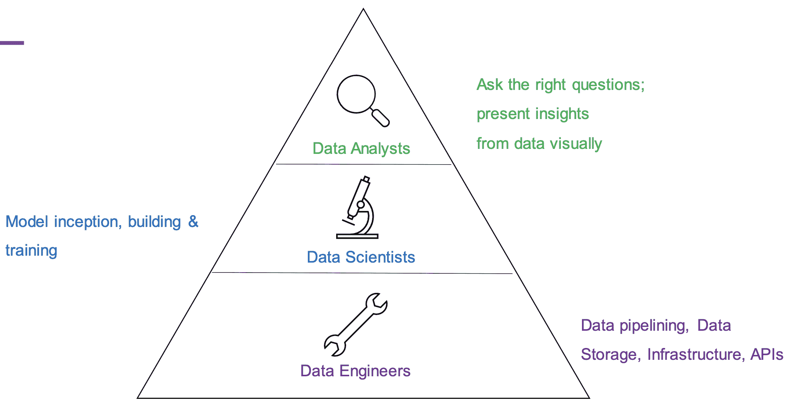
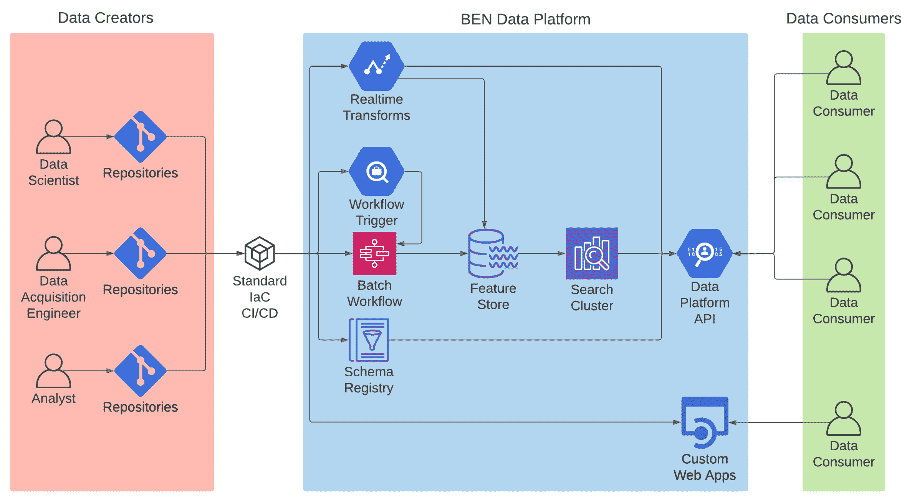
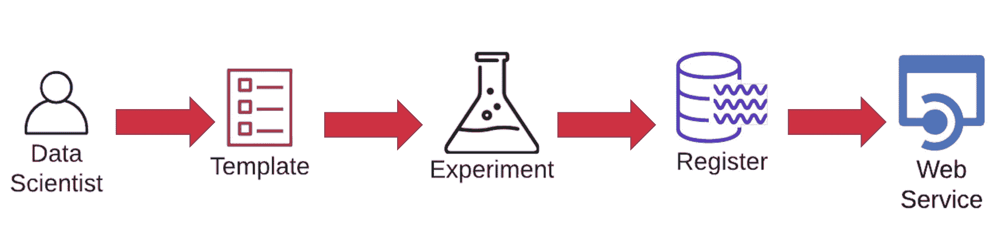
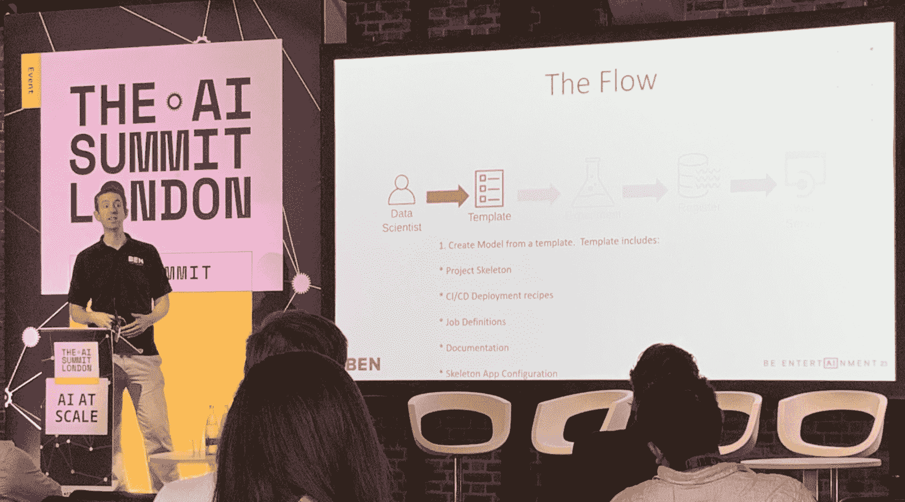
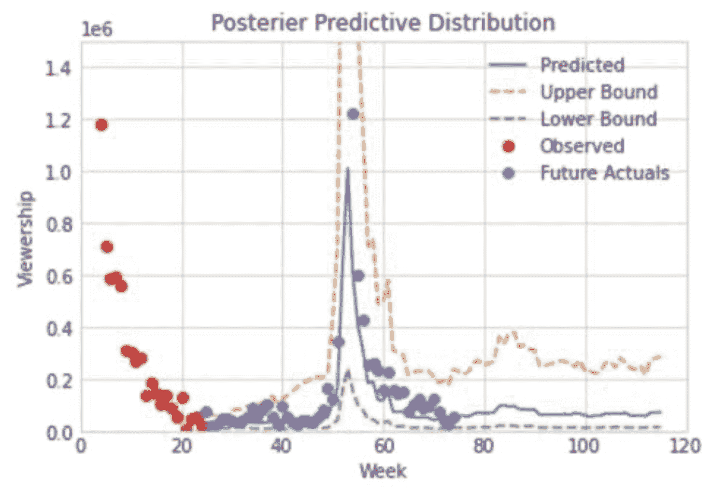

# 预测下一个“陌生事物”的机器学习模型

> 原文：<https://thenewstack.io/machine-learning-models-to-predict-the-next-stranger-things/>

上周，我参加了在伦敦举行的人工智能峰会，在那里我发现了公司如何使用机器学习(ML)和其他形式的人工智能技术。我喜欢的一次会议是由[品牌娱乐网络](https://ben.productplacement.com/) (BEN)主持的，这是一家全球性的产品植入和影响者营销公司。通常我会避开任何与“影响者”有关的事情，但这被证明是现代 ML 最佳实践中一个有趣的案例研究。

顺便说一句，我后来发现，本是比尔·盖茨在 1989 年创办的。他想为家庭建立一个数字艺术系统(最初的公司名称是“互动家庭系统”)。现在它是一家非常不同的公司，但本仍然大量使用软件——“定制的人工智能”一词在其主页上被使用了四次。

[本集团工程副总裁杰夫·巴洛](https://www.linkedin.com/in/barlowjeff/)在会议开始时讨论了数据工程的“工程师金字塔”(见下图)。他的观点是，数据工程师用“数据管道”和其他后端任务奠定基础，数据科学家通过添加他们的模型和 ML 训练来建立基础，最后，数据分析师查询数据并可视化地呈现见解。

工程师金字塔

巴洛随后解释说，BEN 在基础设施即代码方面投入了大量资金，并且在管理其人工智能软件时“非常重视模板”。他说，这种方法使他们能够帮助数据科学家“快速为我们的组织增加价值。”

本的 ML 平台的组件。

巴洛解释了更多关于数据科学家如何在 BEN 工作的“流程”。数据科学家将从现有模板创建一个新模型，包括项目框架、CI/CD 部署方案、工作定义、文档和“框架应用配置”

流动

Barlow 说，模板化过程的好处是，数据工程师不必担心“AWS IAM 策略(身份和访问管理)、安全组等细节——我们已经将其融入模板中。”

然后，数据科学家使用这些模板对他们的数据进行实验。“一旦他们有了他们认为可行的东西，”巴洛继续说道，“他们就会进入下一步，注册他们的模型。注册他们的模型需要存储任何适用的二进制文件，以便于访问。”然后，他们注册数据存储模式，以确保一致性。工作流中的下一步是设置自动监控，如果需要的话。

杰夫·巴洛(左)解释本的流程。

BEN 的“流程”的最后一部分是将模型的结果部署到 web 服务中。Barlow 解释说，部署管道“读取我们的配置中适当的 Dockerfile 信息，这是我们之前设置的，然后可以将 web 服务发布到生产中”。

然后是“冲洗和重复”，他继续说道。“你现在已经开始收集一些关于你的模型表现如何、用户如何与该模型互动的数据。”得到这个反馈后，数据科学家可能会选择对模型做更多的实验，再次注册它，然后部署另一个 web 服务。

Barlow 随后谈到了扩展 ML 模型，将它部署为最终用户的应用程序，或者创建一个 API 供开发人员使用。根据他的一张幻灯片，这使得数据科学家能够“快速实验，找出哪些类型的信息对我们的最终用户有用”。同一张幻灯片还提到“数据科学家不是前端开发人员”，因此巴洛说，模板化再次被用来使他们能够快速发布应用程序或 API。

## 用例

所以现在我们知道 BEN 是如何运行它的 ML 模型并将其转化为应用程序的。但是 BEN 的“定制人工智能”软件有什么样的用例呢？

BEN Group 的首席技术和人工智能官泰勒·福克曼(Tyler Folkman)谈到了几个涉及抖音和 YouTube 等应用程序影响者的用例。福克曼声称，本的分析是促使游戏玩家采用抖音作为平台的重要因素。“我们带到抖音的最优秀的游戏玩家之一被人工智能识别出来了，”他说。“这不是与品牌的对话，也不是与我们内部专家的对话。是人工智能带来了一些建议。”

另一个有趣的用例是让人工智能“每周预测电视节目过去 30 天的收视率。”他举了《奇异事物》第一季的例子，在它成为文化轰动之前。当它第一次发布时，没有人知道它会是一个热门节目——但 AI 能预测到吗？

BEN 的数据科学家建立了一个贝叶斯模型，“考虑了包括新一季发行在内的多种因素。”该模型使用“MMM 数据的长尾预测”(MMM 代表“媒体混合建模”)，帮助 BEN 的客户(大多数是大品牌)在电视节目中进行产品植入。

根据 Folkman 展示的图表，他们的 ML 预测与节目播出后的实际收视率密切相关。

本的预测收视率图表

福克曼解释说:“你必须在他们拍摄之前把你的产品推出去，所以在你真正知道它会做什么之前，你必须做出承诺。”因此，在这个用例中，ML 模型帮助 BEN 说服其客户，在新的电视节目中植入产品可能会产生效果。

## ML 正在影响影响者

你通常不会认为影响者营销是由机器主导的，但在本的案例中，数据似乎表明，ML 模型有助于预测建模和发现抖音等非显而易见的人才。

更多的证据表明，人工智能不仅仅关乎工作的未来——它已经在影响现在。

<svg xmlns:xlink="http://www.w3.org/1999/xlink" viewBox="0 0 68 31" version="1.1"><title>Group</title> <desc>Created with Sketch.</desc></svg>