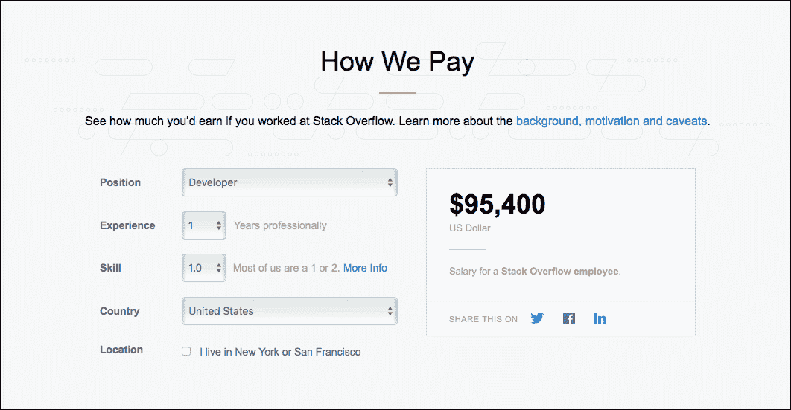

# 机器学习不是魔术:它是关于数学、统计、数据和编程的

> 原文：<https://thenewstack.io/machine-learning-not-magic-guide-get-started/>

这篇文章是一个系列的第一篇，名为“机器学习不是魔术”，涵盖了如何开始机器学习，使用熟悉的工具，如 Excel，Python，Jupyter 笔记本和 Azure 和 Amazon Web Services 的机器学习云服务。请每周五回来查看未来的文章。

回到 2010 年，当我第一次遇到[机器学习](/category/machine-learning/) (ML)的概念时，我告诉自己，它只适用于计算机科学的博士，这意味着我可能永远没有机会从事它。

作为一名前微软和 Azure 爱好者，当微软开始向 Azure 添加[机器学习组件时，我决定仔细研究一下 ML。即便如此，我还是被围绕它的大量技术和术语弄得不知所措、不知所措。随着谷歌宣布 TensorFlow 和](https://azure.microsoft.com/en-us/services/machine-learning/) [Cloud ML](https://cloud.google.com/ml-engine/docs/concepts/technical-overview) 以及亚马逊推出自己的[机器学习](https://aws.amazon.com/machine-learning/)服务，ML 将成为云中的下一个大事件已经变得非常明显。

看着围绕 ML 的讨论和炒作，我决定写我的第一个相当于机器学习的“Hello World”。每一次尝试，我只剩下更多的困惑和失望。关于 ML 的大量文章、博客、自学课程、教程和样本增加了我的焦虑。尽管有这么多可用的资源，我甚至无法创建一个有意义的完整的 ML 实现。

我不断掉头的一个主要原因是我收藏的几乎每个 ML 资源中都有大量的数学知识。尽管我有决心和承诺，但我需要学习高等数学的想法一直在推着我。让我承认——我害怕和数学打交道。我在高中勉强通过我的数学试卷。当我十几岁的时候，当我发现没有数学硕士学位也可以在 it 行业发展时，我欣喜若狂。一些高等数学成为 ML 的先决条件这一事实令我失望，从许多方面来说，让我想起了学生时代的噩梦。

但是，随着我继续与我的客户在物联网和以数据为中心的项目上合作，ML 的可能用法不断回到我们身边。与此同时，围绕 ML 的炒作也达到了顶峰。以至于云提供商开始推动 ML 超过核心 IaaS 组件，如虚拟机、存储和网络。同样非常明显的是，ML 正在成为许多新兴技术的前沿和中心，包括认知计算、人工智能、聊天机器人、个人助理和预测性维护。

## 点击电子表格

2017 年初，我决定每天花两个小时学习 ML。我学习道路的前几周与编程无关，只是在温习我的数学技能。在列出了一系列数学概念之后，我意识到对我来说最好的资源是我儿子的高中数学课本。我用书签标记了几章，坚持不懈地学习概念，直到我能解决问题。我还必须对[可汗学院](https://www.khanacademy.org/)给予应有的信任，因为它收集了涵盖先决条件的优秀教程。

在掌握了基础数学和统计学之后，我开始在 Microsoft Excel 中试验这些公式。看到 ML 的基本假设在 Excel 中工作是很有趣的。了解了如何将现代数据集应用于传统的统计公式后，我渴望用 Python 来尝试它们。虽然我不是 Python 的专家，但我对用它写代码还是很在行的。

基于我过去的 Python 经验，我安装了所需的模块并配置了我的基于 Python 的 ML 测试床。利用 Excel 中的工作公式和基本的 Python 环境，我成功创建了我的第一个机器学习模型，该模型根据我用于训练的数据集准确预测了一个值。对我来说，这是一个“啊哈”的时刻。

在我接触 ML 程序的工作模型之前，我阅读了大量的文章，并在 YouTube 上观看了数小时的视频教程。但是只有在我设法写了我的第一个程序之后，一切才开始有意义。

## 前进的道路

本指南的目的是帮助您为机器学习创建个性化的学习路径。如果你苦于数学，你会发现这个计划更有用。我会告诉你需要学习多少数学知识，需要配置什么环境，需要使用什么工具，最后，如何编写你的第一个 ML 程序。

在我们深入研究细节之前，我想做一个免责声明。绝不是说，这将是最完整或详尽的 ML 指南。就术语和官方术语而言，它可能不是最准确的。但是我可以肯定地告诉你，这一定会让你离学习 ML 的目标更近一步。我保证我会远离那些阻碍你学习能力的行话和复杂的数学公式。

在接下来的几周里，我们将解决一个现实世界中的问题，首先用我们大多数人都熟悉的最简单的工具——Microsoft Excel 进行实验。我们将以 Excel 为工具，探讨 ML 的核心前提。在那之后，我们将转向用 Python 编码，在这里我将尽力去揭开涉及 [Numpy](http://www.numpy.org/) 、[熊猫](http://pandas.pydata.org/)、 [Jupyter 笔记本](http://jupyter.org/)、 [Matplotlib](http://matplotlib.org/) 和 [Seaborn](https://seaborn.pydata.org/) 的概念。

我还将向您展示如何将我们创建的最终模型移动到 [Node.js](/tag/node.js/) 并在 web 应用程序中使用它。有了这些核心概念之后，我将最终向您展示如何在公共云中使用 ML。我们将把我们试图用 Excel 和 Python 解决的相同问题带到 Azure ML，并使用 interactive ML Studio 来创建预测分析 web 服务。我们还将尝试向 AWS 提出同样的问题，并使用 Amazon ML 解决它。

目标是让你具备启动你的 ML 学习过程的基本弹药。

为了吊你的胃口，我想介绍一下我们要解决的问题:根据经验的年数，我们将预测 Stack Overflow 的一个开发人员的工资。

堆栈溢出的薪金计算器

遵循开放的传统，Stack Overflow 的员工为各种工作和资历级别创建了一个工资计算器。我们将使用来自堆栈溢出的真实数据，而不是使用复杂的数据集或虚构的数据集。这个想法是使用一个每个开发人员都能很容易联系起来的场景。还有什么比堆栈溢出的数据更好？因为结果是可用的，所以也很容易验证我们将通过多种工具创建的假设。

下一期，我将用通俗易懂的语言介绍机器学习。我们将采用一个基于堆栈溢出工资计算器的简单数据集，并对其进行分析，以了解如何从中创建预测模型。你将带着对所谓的监督机器学习和简单线性回归的清晰理解离开。请继续关注，我正在准备您可以从 GitHub 回购中获得的资产。

<svg xmlns:xlink="http://www.w3.org/1999/xlink" viewBox="0 0 68 31" version="1.1"><title>Group</title> <desc>Created with Sketch.</desc></svg>