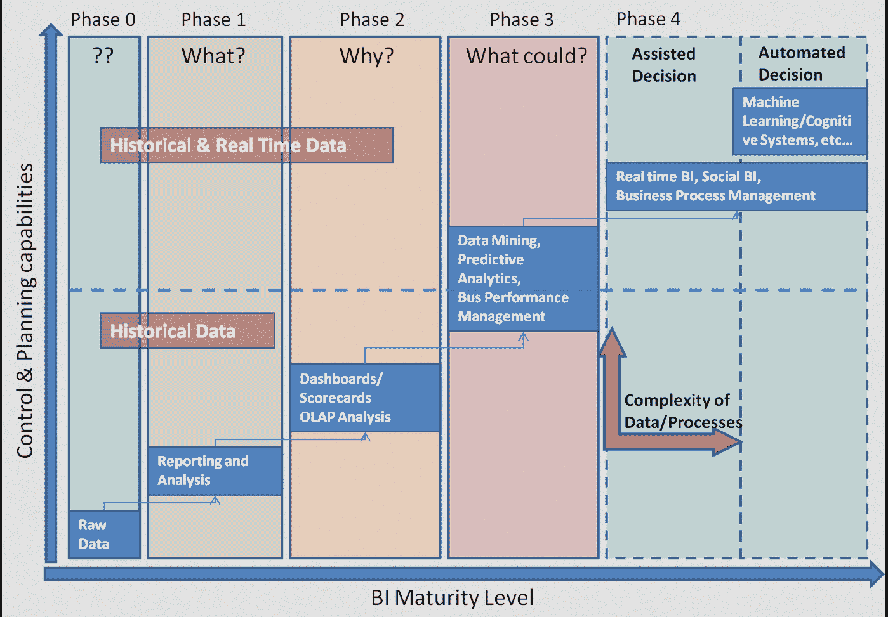

# 机器学习将在 2017 年影响商业分析

> 原文：<https://thenewstack.io/machine-learning-poised-impact-business-analytics-2017/>

 [布莱恩·惠勒

布莱恩·惠勒在 Morpheus Data 监管技术团队。在 Morpheus 之前，Brian 创办了一家软件开发咨询公司，为各种行业设计和开发解决方案，包括电网管理、票务系统、在线交易、社交网络和游戏、SOX 合规性和电子商务。Brian 拥有波莫纳学院的化学学士学位。](https://www.morpheusdata.com/) 

*我们距离“人工智能同事”可能还有几年时间，但机器学习能力的第一次实现正在进入各种类型企业使用的日常数据分析工具。认知辅助有望重塑业务流程，但前提是应用开发和部署工具要适应支持机器学习。*

虽然将人工智能宣传为下一个改变游戏规则的技术已经成为时尚，有望产生比移动或云更大的影响，但现实是，机器学习将需要很长时间才能进入日常商业分析。正如任何巨变一样，认知可能会一点一滴地潜入应用程序和流程中。看起来 2017 年可能是许多企业获得认知学习商务应用第一手经验的一年。

例如， [IBM 的沃森](https://www.ibm.com/watson/?lnk=mpr_buwa&lnk2=learn)在击败 Jeopardy champions 时引发了大量的“ooh”和“aah ”,但正如 NewsFactor [指出的那样，这个基于人工智能的平台在最近的沃森世界活动中引入了商业解决方案，从而赢得了另一种赞誉](http://www.newsfactor.com/news/IBM-Debuts-New-Enterprise-AI-Tech/story.xhtml?story_id=0030008ZH126)。沃森专业系列将认知学习应用于大数据集的分析；它与 IBM DB2 的增强协同工作，用于分析数据库中的事务处理。

在竞相将机器学习能力引入业务流程的供应商领域，IBM 可能已经取得了一些进展，但竞争才刚刚开始。真正的赢家是生产线经理，他们将从人工智能商业应用中受益最多。

## 企业应对认知实施挑战

认知技术的三大基石是[机器学习](/category/machine-learning/)、自然语言处理(NLP)和语音识别。在[的一篇关于 U 开源的文章](http://opensourceforu.com/2016/11/open-source-solutions-accelerate-adoption-cognitive-automation/)中，系统架构师 [Sanghamitra Mitra](https://www.linkedin.com/in/sanghamitra-mitra-5a529b9) 写道，机器认知旨在模仿人类推理，以自动化基于判断的业务流程组件。目标是增加人类活动，让人们有更多的时间关注真正棘手的问题，比如在哪里举行节日派对。

机器学习扩展了标准的商业智能成熟度模型，以包含实时和社交数据，以及业务流程管理。来源:乔治·加西亚，来自《连线创新观察》

实现认知系统的主要障碍是处理它们固有的复杂性。这一事实反映在供应商出售的打包机器学习系统的成本上，也反映在支持这些系统所需的大量基础设施上。一些开源替代方案已经浮出水面，为企业提供了一种快速、简单且廉价的方式来涉足认知计算领域。

让我们快速浏览一下流行的开源认知学习工具:

*   用于统计分析的 [**R 语言和环境**](https://www.r-project.org/) 具有高度可扩展性，除了图形特性之外，还提供线性和非线性回归、传统统计测试、时间序列分析、分类、聚类和其他统计功能。
*   **Python** 是一种深受科学家欢迎的高级语言，其特点是机器学习实现非常适合该语言的敏捷和迭代方法。
*   [**Apache Mahout**](https://mahout.apache.org/) 作为快速创建可伸缩机器学习应用的有用环境。
*   **[H2O](http://www.h2o.ai/) 并行处理引擎**由需要快速、可扩展的机器学习应用的数据科学家和开发人员使用。
*   **[RapidMiner](https://rapidminer.com/) 平台**通过向导界面为实现机器学习预测分析模型提供了端到端的环境。

## 厂商在人工智能最佳实践上合作

一项新技术被大肆宣传的程度与潜在从业者对该技术的理解程度之间似乎存在反比关系。为了消除围绕机器学习的一些问号，并鼓励采用该技术，亚马逊、脸书、谷歌、IBM 和微软已经联合创建了人工智能计划的[合作伙伴关系。该倡议的目标是支持最佳实践，教育公众人工智能的潜在收益和成本，并“创建一个讨论和参与的开放平台。”](https://www.partnershiponai.org/)

最佳实践建议包括伦理(公平和包容性)、透明度、互操作性、隐私、可信度、可靠性以及人与人工智能系统之间的协作。 [RedMonk](http://redmonk.com/) 分析师 [Rachel Stephens](http://redmonk.com/rstephens/2016/11/03/artificial-intelligence-and-the-world-of-watson/) [描述了](http://redmonk.com/rstephens/2016/11/03/artificial-intelligence-and-the-world-of-watson/)几家知名科技公司目前正在进行的人工智能研究:

*   [脸书人工智能研究院](https://research.facebook.com/ai)承诺“通过出版物、开源软件、参加技术会议和研讨会，以及通过与学术界同事的合作，为研究社区做出贡献。”
*   谷歌的 [AlphaGo](https://deepmind.com/research/alphago/) 基于神经网络的系统在 2016 年早些时候击败了世界最佳围棋选手；谷歌撰写的一篇论文描述了该项目，这篇论文发表在 2016 年 1 月的《自然》杂志上。
*   亚马逊设立了 250 万美元的奖金，用于开发一个能够交谈 20 分钟的 Alexa 社交机器人。
*   微软最近成立了由计算机视觉研究员 Harry Shum 领导的人工智能和研究小组，旨在协调该公司 5000 多名科学家和工程师的研究。
*   Salesforce 正在进行一个名为 [Einstein](https://www.salesforce.com/blog/2016/09/introducing-salesforce-einstein.html) 的项目，该项目将人工智能与面向所有类型和规模的公司的 CRM 系统相集成。

## 着眼于机器学习的“人的一面”

数据科学家花费大部分时间收集和清理数据，因此机器学习系统的早期重点是“简化和加快”这些任务，正如企业分析顾问[托马斯·丁斯莫尔](https://thomaswdinsmore.com/author/thomaswdinsmore/) [指出的](https://www.nextplatform.com/2016/11/01/mainstreaming-machine-learning-emerging-solutions/)。不幸的是，现有的数据仓库工作流与机器学习系统的数据需求相冲突。这使得数据科学家为单个项目创建了一次性的“实时”提取-转换-加载(ETL)工作流。

机器学习的熟练程度与四类用户的更积极成果相关:商业管理、创意、开发和研究人员。资料来源:鲍勃·海斯，百老汇商业

机器学习算法并不以其并行性而闻名，因此像 [Apache Spark](http://spark.apache.org/) 这样的开源工具需要重建算法，以便在集群服务器之间分配工作负载。尽管 Apache Spark 支持可伸缩的数据处理和连接到一系列数据平台的能力。实现认知系统的另一个障碍是语音识别、图像分类和其他深度学习应用所需的高水平处理能力。

然而，有待克服的最大障碍与硬件或软件无关:根本没有足够的数据科学家来满足需求。为了解决这一短缺，人们提出了公民数据科学家的概念，通过提供图形化的“拖放”工具，将任何业务分析师转变为数据专家。这种方法的支持者包括机器学习供应商 [Alteryx](http://www.alteryx.com/) 、 [Angoss](http://www.angoss.com/) 、 [RapidMiner](https://rapidminer.com/) 和 [Statistica](http://www.statsoft.com/Products/STATISTICA/Product-Index) 。

## 管理者手中的复杂分析能力

通过仪表板界面进行数据管理的强大功能由 [Morpheus](https://www.morpheusdata.com/) 云应用管理平台展示，该平台允许您在内部或私有、公共或混合云中配置数据库、应用和应用堆栈组件。异步配置允许同时配置多个 IT 系统。可以通过 web 界面或使用命令行界面或 API 调用将节点添加到数据库和应用程序中；随着节点的添加，数据库和应用程序会自动重新配置。

对于数据分析师来说，特别值得注意的是 Morpheus 内置的复杂的日志记录、监控和分析工具，可以通过相同的直观界面进行访问。除了自动监控正常运行时间之外，还会自动收集应用程序日志，以便进行自检和故障排除。最后但同样重要的是，open REST APIs 确保了与异构系统的平滑、无缝集成。

IBM 是新堆栈的赞助商。

由[约书亚·厄尔](https://unsplash.com/@joshuaearle)通过 [Unsplash](https://unsplash.com/?photo=p2TQ-3Bh3Oo) 拍摄的特写图片。

<svg xmlns:xlink="http://www.w3.org/1999/xlink" viewBox="0 0 68 31" version="1.1"><title>Group</title> <desc>Created with Sketch.</desc></svg>