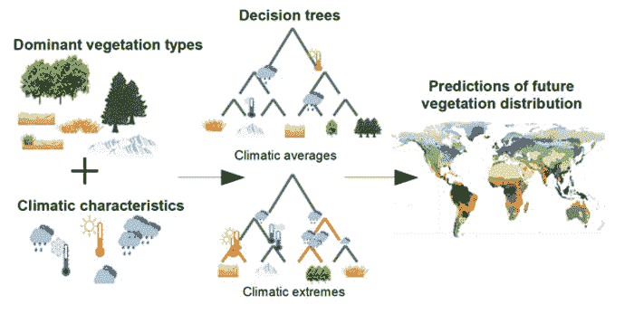

# 机器学习显示极端气候如何改变全球植被

> 原文：<https://thenewstack.io/machine-learning-shows-how-climate-extremes-change-global-vegetation/>

多年来，专家们一直在研究气候模式的变化是如何导致全球植被发生重大变化的。这是因为随着各个地区经历前所未有的温度和降水变化，[植物将逐渐迁移](https://e360.yale.edu/features/as-climate-warms-a-rearrangement-of-worlds-plant-life-looms)到它们之前无法生长的地方，或者[甚至完全消失](https://www.theguardian.com/environment/2020/sep/30/world-plant-species-risk-extinction-fungi-earth)，导致对[野生动物和人类的严重影响](https://www.theguardian.com/environment/2017/mar/30/climate-change-global-reshuffle-of-wildlife-will-have-huge-impacts-on-humanity)，此外还为[系统性反馈循环](https://www.climaterealityproject.org/blog/how-feedback-loops-are-making-climate-crisis-worse)创造了条件，这将进一步加速和恶化气候危机。

通常，科学家现在收集关于这些植被模式的数据，并使用所谓的动态全球植被模型(DGVM)进行分析，这是一种计算机模拟模型，可以帮助他们预测未来可能发生的变化。

但是植物和气候之间的相互作用——特别是在如此大的范围内——可能非常复杂，现有的技术，如动态全球植被模型，有着[的局限性](https://nph.onlinelibrary.wiley.com/doi/10.1111/nph.12210),可能会阻止它们准确预测未来的结果。

为了解决这一差距，来自奥斯陆大学、赫尔辛基大学和挪威自然研究所的一组研究人员提议使用机器学习作为改进这些计算机模拟的一种方法，特别关注调查极端气候如何影响未来预测。

“气候变化是决定全球植被分布的主要因素，”研究人员在他们的论文中解释道，该论文最近发表在*全球变化生物学*杂志上。“由于世界正面临气候变化，预计未来植被分布将出现大规模动态，这反过来可能会对气候产生强烈的生物物理和生物化学反馈。然而，预测未来植被分布以应对气候变化尤其具有挑战性，需要详细了解大规模植被分布如何与气候相关联。”

该团队还指出，在科学领域使用机器学习并不是什么新鲜事。[机器学习](https://thenewstack.io/category/machine-learning/)在生物地球科学中变得越来越受欢迎，这是一个研究生物和地质过程之间相互作用的跨学科领域，这种建立在观察数据基础上的模型提供了一种同时粒度和全局的方法。

“建立在观察数据基础上的模型提供了结合更高分辨率的潜力，同时保持尽可能大的调查规模，”该小组说。“在这项研究中，我们采用了来自机器学习的决策树方法来探索可用的气候和植被数据，并系统地重新检查关于气候-植被关系的长期和重现的科学问题。这种方法使我们能够分析是否可以检测到任何影响植被类型大规模分布的新气候阈值，特别是在以前的研究中被忽略的气候极端阈值。”

该团队选择关注极端气候，因为由于气候变化，这些类型的条件现在变得越来越频繁和严重。这些极端情况在统计上偏离了平均气候记录，现在发生得更频繁了，这对植被模式的动态变化最终会产生巨大影响。例如，极度缺乏降水或极度寒冷对稀树草原和落叶针叶林的扩散至关重要。

“当平均气候预测因子被极端气候所补充时，物种分布模型的预测性能会提高，”研究小组指出。“不断变化的气候会影响极端气候的持续时间、频率、强度、时间和空间范围。例如，据观察，由于全球变暖，日极端温度和降水的频率和强度都有所增加，与平均气候变化的空间模式截然不同。”

该团队的方法涉及使用[决策树模型](https://towardsdatascience.com/a-guide-to-decision-trees-for-machine-learning-and-data-science-fe2607241956)，也称为分类树或回归树，这是一种机器学习形式，其特征是一系列分层结构的查询或测试。在一个级别的查询或测试上做出的决定将影响接下来进行的测试，这些渐进的测试系列将影响最终的结果。

因为人工智能驱动的预测背后的机制和推理往往不清楚，研究人员选择使用决策树模型，因为它们是[容易解释的](https://thenewstack.io/researchers-build-an-interpretable-ai-that-shows-how-it-thinks/)，这意味着很容易确定为什么会进行某种分类。然后，该团队用公开可用的当前全球气候和植被数据训练他们的决策树模型，并测试他们在给定气候变量的情况下预测某个地区主要植被类型的能力。

有趣的是，该团队的工作发现，他们的人工智能辅助方法对未来植被分布的预测比基线模型要精确得多。此外，该小组强调了基线模型通常依赖的“硬编码气候阈值”的局限性。

“据我们所知，还没有人试图使用机器学习来理解在全球范围内控制和分离主要植被类型的阈值条件，”该团队说。“然而，我们的决策树结果强调了在定义不同植被类型的气候阈值时，使用极端气候，尤其是日尺度极端气候的重要性。”

最终，该团队的研究结果表明，下一代 DGVMs 将从平均气候条件中收集不同的气候阈值，而不是像现在这样为全球设定静态阈值，这一点至关重要。这种转变将有助于专家们改进他们的工具，这样，人类将更好地了解——因此也更好地准备——来面对气候变化的严峻挑战。

*阅读团队[论文](https://onlinelibrary.wiley.com/doi/10.1111/gcb.16110)中的更多内容。*

<svg xmlns:xlink="http://www.w3.org/1999/xlink" viewBox="0 0 68 31" version="1.1"><title>Group</title> <desc>Created with Sketch.</desc></svg>