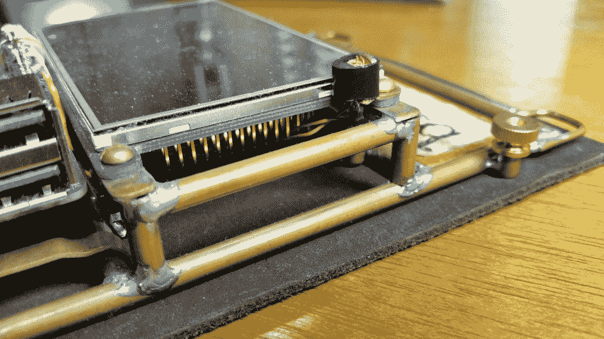
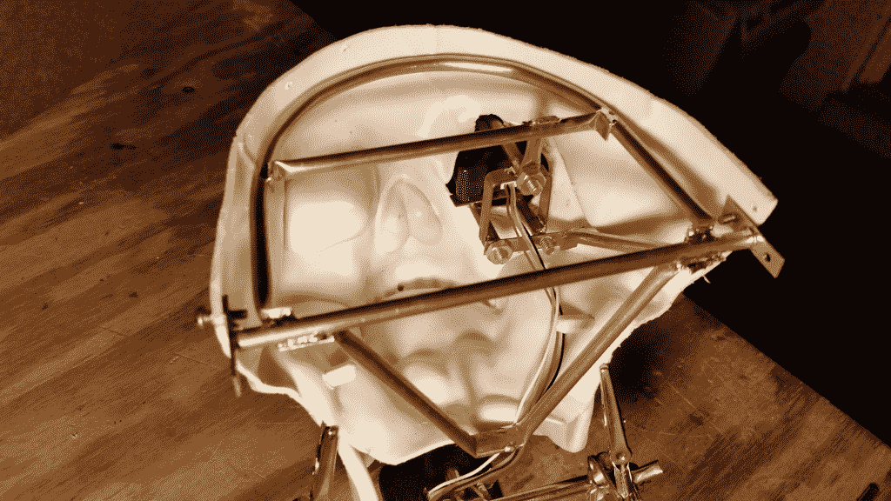
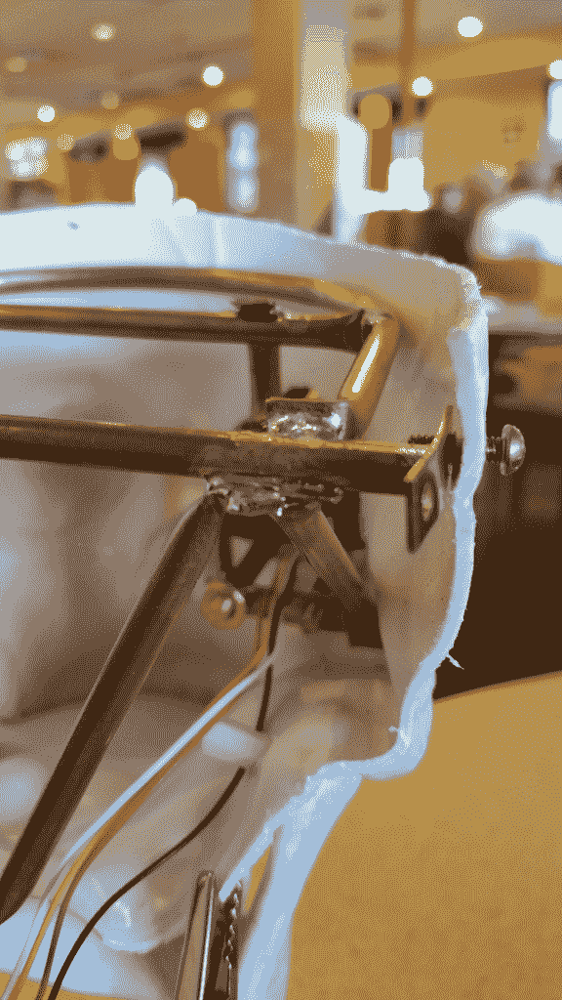
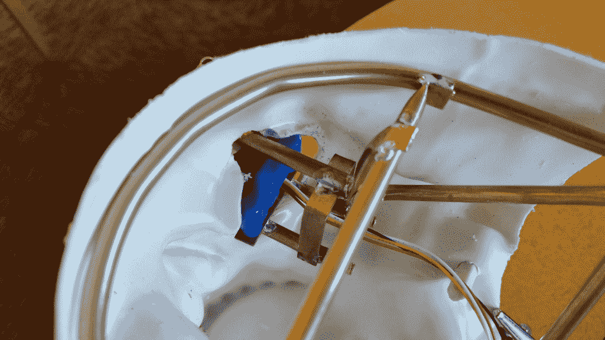
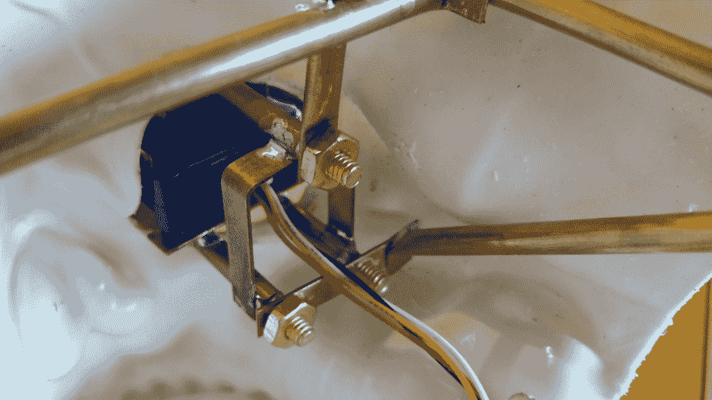

# 想象机器人头骨机器视觉相机的可能性

> 原文：<https://thenewstack.io/machine-vision-camera-meets-robot-skull/>

我的最新项目[建造一个机器人头骨](https://thenewstack.io/off-shelf-hacker-machine-vision-meets-robotic-skull2/)的更新:当灯泡闪烁，我开始将 JeVois 机器视觉相机与廉价塑料万圣节头骨结合起来时，添加语音合成、头部平移、下颌运动和其他一系列酷功能的想法充斥了我的意识。

事情总是这样。提出想法，去商店制作一个最小的功能原型(MFP)，然后通过“实践”你的项目，你会得到大量的新想法。

作为[Torq](https://thenewstack.io/author/rob-reilly/)博士，我演示并解释物理计算技术的最新进展。我鼓励读者以身作则，我们可以用尖端的现成部件做出令人惊叹的事情。将 JeVois 相机安装在一个毫不起眼的小桌子支架上，与将其放入一个疯狂的蒸汽朋克机器人头骨中没有相同的效果，这立即引起了某人的注意，并迫使他们说“这到底是什么？”

这就是我们想要的反应。但这不可能是肤浅的。有趣也需要深入内心。

今天，我们将继续讨论头骨的内部结构。它将把相机固定在适当的位置，充当树莓派“大脑”的支架，以及为下巴提供动力的伺服系统。头骨需要足够坚固，这样它才能在往返于我的科技活动(有时包括国内和国际旅行)的途中存活下来。

## 压平、弯曲，然后焊接

简单地将摄像头安装在塑料头骨的外部是没有意义的。一旦你做了脑叶切除术，头骨就不再有任何强度，很容易变形。在摇摄过程中或者当你拿起相机时，相机会到处移动。内部框架是必需的。

过去，我只是简单地将铜管的两端切割并焊接在一起。对于方形徽章非常有用。它有很好的干净的棱角，非常适合可见的部分。但是制作过程既费事又费时。

蒸汽朋克会议徽章框架上的方形接头

头骨面板将隐藏大部分框架，所以尝试一些不同的技术来加快建设是有意义的。

面部、后部和顶部颅骨板

将铜管的两端弄平，将接头弯成直角，然后焊接到位，这被证明是一种快速可行的方法。技术出来相当干净，没有什么不能用 Dremel 和打磨辊更像样。

看看下面这些头骨内部的图片:

内部铜管头骨框架

内部框架的另一种观点

多管连接点

请注意，将几个相交的端点绑在一起，可以在焊接时方便地用鳄鱼夹和夹子夹住连接。我的老爷车 100/140 瓦韦勒枪在一个地方处理三到四个标签没有任何问题。

当然，你必须花些时间弄清楚管子应该放在哪里，才能最好地利用颅骨内的空间。使用三角测量来增加刚性。在业余爱好商店可以买到的 3/16″铜管很容易焊接，并用小型管道工的切管器切割。

## 把你的拇指放进去

请注意，框架的前部与头骨的内部形状吻合。

你可以弯曲薄壁铜管，而不用你的拇指扭结。如果你看下面的图片，只有一个小点，就在相机的正上方，它没有像我希望的那样顺利出来。

照片显示相机上方有轻微的管道扭结

实际上，几乎看不出来。这是我第一次使用这种技术。

我读过一些人用弹簧或用沙子填充管子来帮助它保持形状。当然，我们不想搞砸这个弯曲处，因为一根 3 英尺长的 3/16 英寸油管大约需要 4 美元。

3”或 4”弯曲当然是可行的。慢慢来，用你的拇指一次弯曲一点，经常检查是否合适。通过实践，我可能会在即将到来的项目中尝试可视框架的弯曲技术。

## 下一步是什么

我用了几根管子和平板来安装相机组件。有更多的相机支架支撑和一个将头骨安装到支架上的支架。

摄像机支架

该立场将纳入泛伺服，我认为这可能是有趣的头骨水平躺在一个盒子里储存。然后，当我打开盖子时，一个齿轮马达会把它提升到工作的垂直方向。

点子，点子，太多点子了！

不，这个头脑风暴真的很有趣，肯定会引发一堆现成的黑客话题。

一旦硬件相当稳定，我们就可以开始使用 JeVois 软件，远程控制，也许是一点自动化，让头骨真正做事情。下周请继续收看！

<svg xmlns:xlink="http://www.w3.org/1999/xlink" viewBox="0 0 68 31" version="1.1"><title>Group</title> <desc>Created with Sketch.</desc></svg>