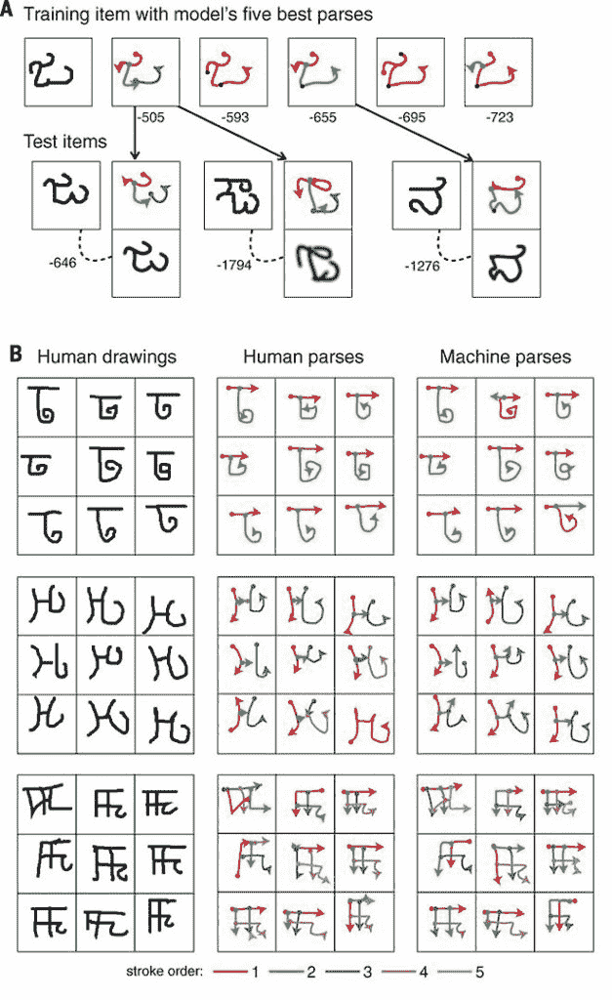
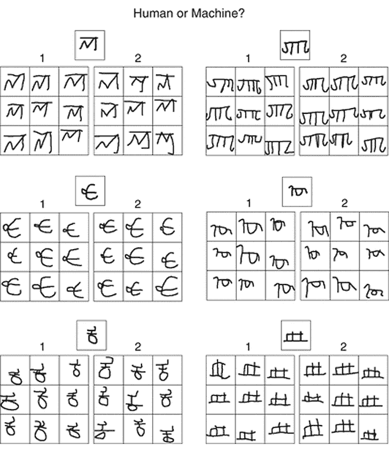

# 机器通过新算法“学会学习”

> 原文：<https://thenewstack.io/machines-learn-learn-like-humans-new-breakthrough-algorithm/>

从你的智能手机的智能个人助理，到可以随着时间的推移适应你的偏好的[个性化搜索引擎](https://thenewstack.io/linkedin-finalizes-its-new-search-architecture-galene/)和[音乐推荐服务](https://thenewstack.io/40-something-dude-asks-for-music-recommendation-redditors-point-to-the-algorithms/)，许多初级形式的人工智能现在渗透到我们的日常生活中。

然而，这些应用背后的机器学习算法往往需要大量数据——从几十到几百甚至几千个例子——来学习一个新概念。相比之下，一个五岁的人类儿童，只要看几个例子，就可以毫不费力地学会像“鸟”或字母“A”一般是什么样子的概念。

说到像人类一样快速灵活地学习，机器还有一段路要走。但是，在当前深度学习模型的一项重大突破中，来自麻省理工学院、纽约大学和多伦多大学的科学家最近推出了一种新的算法，帮助机器模仿类似人类的学习能力，使它们能够在只看到有限数量的例子后，识别、绘制甚至创建新的手写视觉概念。

https://youtu.be/shT-dFKU2WA

## 概率程序学习

这是人类的概括能力，现在机器有了这种能力。在他们发表在期刊 [*科学*](http://www.sciencemag.org/content/350/6266/1332) 上的论文中，研究人员描述了他们的“贝叶斯程序学习”(BPL)框架，其中广泛的概念被简化为简单的概率程序。这些简单的程序成为构建新程序的基本构件或“原语”，能够表达更复杂的表示，但与标准的机器学习模型相比，需要更少的数据。这篇论文把它描述为一个“生成模型，可以对新类型的概念(一个“A”、“B”等)进行采样。)通过以新的方式组合部件和子部件”，并且还可以解析这些部件之间的关系。本质上，机器可以通过这种算法“学习学习”，通过建立在以前的知识上来加速新概念的学习。

这项研究的作者之一，多伦多大学计算机科学和统计科学系的助理教授 Ruslan Salakhutdinov 说:“制造像人类学习新概念时需要那么少数据的机器是非常困难的。“复制这些能力是一个令人兴奋的研究领域，它连接了机器学习、统计学、计算机视觉和认知科学。”

## 是机器写的还是人写的？

研究人员从世界各地的 50 个字母中挑选了 1600 个手写字符，作为视觉概念来测试他们的模型。一台使用 BPL 算法的计算机不需要几十个例子来训练它，在只给它看一个例子后，它就能够再现这些字符的相对忠实的版本。这里，数据被分解为组成部分，以更简单的程序表示，允许模型模仿人类绘制这些符号的方式，如笔画顺序和方向，而不是将视觉概念呈现为像素或特征的集合。该算法还允许计算机进行足够的“归纳”,以创建与它之前学习的字母风格相似的新例子。

结果是惊人的:对于视觉上比较人类和计算机生成的字形的人类法官来说，该算法对这些手写版本的字母模仿得如此之好，以至于它们与人类样本“几乎无法区分”。

“从图像推断运动程序”:人类和机器模仿手写字符，重点是找到正确的笔画顺序。

你能猜出哪些是人类画的还是机器画的吗？给人类和机器一个新的手写字符的图像(顶部方框),并要求它们产生新的例子。由机器制成的每对中的九个字符网格是(按行):1，2；二，一和一，一。

**新算法与其他机器学习算法的不同之处在于，它不需要人类程序员在训练过程中进行干预。**该算法对自己进行编程，以重现它所看到的新的视觉概念。与其他标准模型不同，它使用这些简单的概率程序，每次执行代码都会产生新的输出，使机器能够快速学习、识别和重建概念，就像人类的孩子一样。

“在他们进入幼儿园之前，孩子们学会从一个单一的例子中识别新概念，甚至可以想象他们没有见过的新例子，”研究作者、麻省理工学院认知科学教授约书亚·特南鲍姆说。“我们还远远没有制造出像人类孩子一样聪明的机器，但这是我们第一次拥有一台能够学习和使用大量现实世界概念的机器，甚至是简单的视觉概念，如手写字符，其方式很难与人类区分开来。”

尽管该算法目前仅限于手写字符，但研究人员相信，有一天它可以应用于学习口语、手势甚至抽象知识，目的是开发人类似乎非常擅长的“一次性学习”的机器版本。这将意味着以不同的方式向模型呈现数据，并背离使用[大量数据来训练神经网络](https://thenewstack.io/deep-learning-neural-networks-google-deep-dream/)的流行做法。该研究的主要作者布伦丹·莱克说:“关键是我们需要学习正确的表示形式，而不仅仅是从更大的数据集学习，以便建立更强大、更像人类的学习模式。”

在多伦多[大学](http://news.utoronto.ca/researchers-nyu-u-t-and-mit-teach-machines-learn-humans)和*理科阅读更多。*

图片:王丹青，布伦丹莱克 ， 鲁斯兰萨拉赫丁诺夫，约书亚特南鲍姆

<svg xmlns:xlink="http://www.w3.org/1999/xlink" viewBox="0 0 68 31" version="1.1"><title>Group</title> <desc>Created with Sketch.</desc></svg>