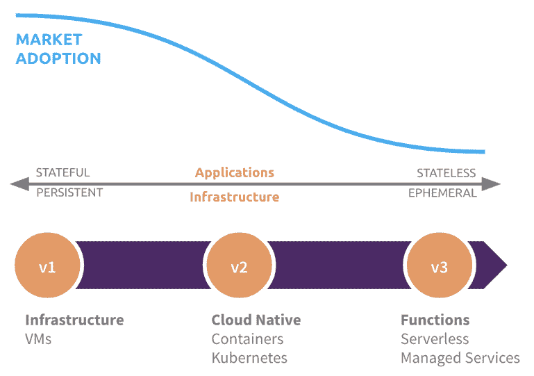

# Madrona 投资 Pulumi，开启云原生工程

> 原文：<https://thenewstack.io/madrona-invests-in-pulumi-to-unlock-cloud-native-engineering/>

索马是马德罗纳公司的总经理。在 2015 年加入 Madrona 之前，Soma 在微软公司拥有成功的 27 年职业生涯，包括担任开发部门的高级副总裁。Soma 长期以来一直是天使投资者，在美国和国际上广泛的技术领域进行投资。在 Madrona，他专注于机器学习/人工智能、智能应用、以开发人员为中心的下一代云平台和工具以及多感知用户界面。

[普鲁米](https://www.pulumi.com/)赞助本帖。

对于首席信息官来说，云迁移是实现数字化转型的重要途径:通过软件以高速度、高质量交付创新，从而赢得竞争。

但这并不是一段轻松的旅程。抛开仍在本地的大型数据中心(Kubernetes 和 containers 正在帮助实现现代化)，云本身仍然是一个移动的目标。在短短几年内，我们已经从主要运行虚拟机发展到使用 Kubernetes 领导的编排引擎的容器，成为云计算的第二波浪潮。我们正朝着无服务器计算的世界前进，这是云计算的下一个重大进步和第三次主要浪潮。

这些根本性的进步清楚地表明了这样一个事实:云基础设施正变得越来越短暂，应用程序正变得越来越无状态。无服务器计算的商业模式可以定义为“按使用付费”，而不是预先的、静态的和昂贵的供应。

> 云基础设施变得越来越短暂，应用程序变得越来越无状态。

这些新的可能性将使团队能够以最佳和有效的方式启动和关闭基础架构，以满足应用程序的需求。由于托管服务和 API 的使用越来越多，基础设施和应用程序代码之间的界限开始变得模糊。基础设施和应用程序代码的这种协调意味着基础设施是短暂的:随着应用程序的发展而不断“运动”，而不是“静止”和不满足开发人员的需求。在这个新兴世界中，供应比配置更重要，持续交付比集成更重要。

随着工程师获得更强大、适应性更强的基础设施来满足他们的应用需求(性能和规模)，同时又不会带来沉重的运营复杂性，团队将面临巨大的机遇。这也为业务领导者服务，他们只希望他们的团队快速发布代码以创新和保持竞争优势。谁不想利用这一点呢？

不幸的现实是，今天的做法往往达不到承诺。这些发展增加了开发人员和运营团队的复杂性，可以总结为:

1.  **瞄准多云和混合云**。这并不是说每个应用程序每天都会运行在不同的云上。这是能够在任何云上运行的灵活性(无论是私有云还是公共云，也无论是 AWS、Azure 还是谷歌云等)。)并且知道自己没有被局限在某个特定的云环境中。如果业务需要，团队希望设计应用程序在不同的云环境之间无缝迁移。
2.  **通过领域特定语言(DSL)的配置蔓延**。不同的云环境和不同的供应商有不同的 DSL 来定义配置信息。这已经变成了一个巨大而丑陋的 DSL 世界，你需要在其中导航。工程师不仅要学习这些数不胜数的 DSL，而且维护、理解它们真的是一件非常痛苦的事情，更糟糕的是，如果你不得不试图找出你表达配置的方式中有什么错误。
3.  **云基础设施是“动态的”，而不是“静止的”**当您希望为您的应用程序优化和有效地使用基础架构时，您最不需要的就是您的基础架构是静态的、不灵活的和昂贵的。这确实意味着基础设施的供应和取消供应变得比配置更重要(通常是更快)。

普鲁米的方法很独特。他们通过为真正进行云原生开发、交付和管理应用的团队重新设想端到端体验来解决这些问题。我们从客户那里听说，由此产生的工作流程更简单、更好、更快。现有的“以运营为中心”的云基础架构方法的局限性是显而易见的，并且明显损害了各种规模的团队在云中的创新速度，并且随着时间的推移将会过时。Pulumi 在尽可能全面的意义上实现了以工程为中心的“配置即代码”的承诺，这是开发人员一直在鼓噪的，并将使他们具有巨大的生产力。

鉴于领导团队的血统，Pulumi 采用这种方法来提供平台、服务和一套工具，以使开发人员能够更无缝地拥抱、支持和实现云原生开发，这并不奇怪。在[乔·达菲](https://www.linkedin.com/in/joejduffy/)(首席执行官)[埃里克·鲁德尔](https://www.linkedin.com/in/ericrudder/)(执行主席)[卢克·霍班](https://www.linkedin.com/in/lukejhoban/)(首席技术官)和[马克·霍尔姆斯](https://www.linkedin.com/in/marcholmes/) (CMO)之间，这是一个世界级的团队，他们了解开发人员，以及随着世界转向云原生开发，开发人员需要什么。

我们非常高兴[投资 Pulumi](https://blog.pulumi.com/building-a-future-of-cloud-engineering) ，因为我们坚信开发者处于世界正在经历的大规模平台和技术变革的前沿和中心。拥有一个世界级的团队来解决一个问题，这个问题对于每一个在云上构建、部署和管理应用和服务的开发人员来说都是至关重要的，这是一个惊人的机会，我们很高兴能够成为其中的一员。

在我们生活的世界中，每个企业都在优先考虑和推动数字化转型，每个开发团队都在努力实现高度敏捷，每个开发人员和 DevOps 工程师都在优化提交和交付之间的最短时间。Pulumi 在各个方面都有所贡献，并在如何为云工程师带来最佳工具方面实现了转型，让他们不仅爱上了云原生开发，而且比以往任何时候都更快地进行创新。

通过 Pixabay 的特征图像。

<svg xmlns:xlink="http://www.w3.org/1999/xlink" viewBox="0 0 68 31" version="1.1"><title>Group</title> <desc>Created with Sketch.</desc></svg>