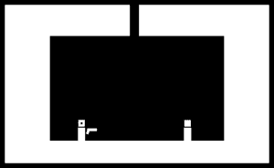
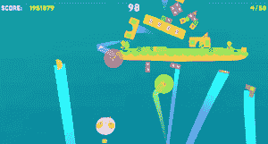
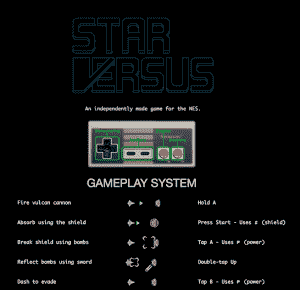

# MAGFest 2017 最令人上瘾的五款独立游戏

> 原文：<https://thenewstack.io/magfest-indie-game-paradise-players-developers/>

所以，你是一名独立游戏开发者，倾注了全部的心血和毕生的积蓄来打造你所希望的下一个应用商店奇迹。你的游戏是快速和激烈的，你的图形咝咝作响，你的应用程序内的商业排队，并准备开始拉在那些 phat 栈。你肯定你已经沿着 OG 大型游戏 [Candy Crush](https://king.com/game/candycrush) (仍然每月带来微不足道的 500 万美元以上的全球收入)或[Clash of Clans](https://play.google.com/store/apps/details?id=com.supercell.clashofclans&hl=en)(2016 年 12 月的分类杀手游戏，全球收入为 1230 万美元)的路线打造了一个失控的热门游戏。

唯一的问题是:让人们注意到——即购买——你的巨著。这不是一件容易的事，当苹果应用商店目前有超过 6000 款游戏可供下载时，或者当你的创意必须与目前在 [Steam](http://store.steampowered.com/) 上提供的近 9000 款其他游戏竞争时。

问:一个雄心勃勃的独立开发者要做什么？

**答:**头对[头](http://magfest.org/)。

MAGFest 是一年一度的游戏和音乐节，由游戏玩家举办，面向游戏玩家。该聚会于每年 1 月在 DC 的华盛顿州举行，超过 2 万名与会者热情地参加了为期四天的不间断视频游戏、音乐会和极客文化。

MAGFest 由一个非营利组织运营，其唯一目的是促进对所有游戏的欣赏——这意味着它绝对不是一个行业事件。没有企业赞助商，没有超级拥挤的“博览会”大厅，在那里，你赎回你的最后一张信用卡来支付的超昂贵的微型摊位在数以千计的竞争产品中迷失了。粉丝们涌向 MAGFest，尽可能多地玩游戏，尽可能地融入红牛引发的 96 小时疯狂。

简而言之，这是让你的作品出现在成千上万热切的眼球前的理想环境。MAGFest 2017 提供了 MAGFest 独立视频游戏展示。今年，通过评审提交程序，超过 50 家独立游戏工作室受邀正式展示他们的产品。甚至是错过 2016 年 8 月申请窗口的开发者——可能你的游戏去年夏天根本就不存在，amirite？！—正式展示槽可以展示他们的创作。MAGFest 为开发者提供了“QuickPlay”表，在两个小时的演示时间里展示他们的 warez，弹出式风格。

游戏玩家喜欢新游戏。尽管有一个 500 个终端的局域网房间 24/7 开放，供竞争性视频游戏锦标赛玩(包括现金奖励)，有数百个老式游戏免费运行的终极复古街机(所以你不必一直问你妈妈要硬币来玩更多的 [Galaga](http://arcadegamesclassic.net/galaga/#.WHe5JPkrLIU) )，还有一个满是各种主机游戏的舞厅，哦，永远，供渴望得到他们的 Atari 2600 Asteroids 的玩家使用——尽管有这种壮观的建立游戏选择的大杂烩，但未尝试选项的独立房间也吸引了整个周末稳定的人群。

你卑微的记者尽她最大的努力播放每一个独立电影。我没有达到那个目标——一些游戏系统崩溃或损坏，有些只是愚蠢的——但我设法在至少几分钟内得到了大多数系统(艰难的工作，但总得有人去做)。这里有几个我周末最喜欢的游戏，都是我个人最喜欢的，也有吸引了大量观众的游戏，尽管要等很长时间才能玩。

**1:这不会有什么好结果的，**侧手翻游戏

看似简单，但绝非易事，[这款](http://www.cartwheelgames.com/nothing-good-can-come-of-this)游戏不会有什么好结果，可能只是一款终极玩家对玩家射击游戏。制造商的描述是:

两个玩家被困在一个几乎毫无特色的房间里。在近乎沉默的等待了几个小时后，一把枪从天花板的一个洞里掉了出来，落在他们之间。这是什么意思？他们下一步会做什么？“好吧，老实说，你的棍子家伙拼命地在另一个棍子家伙拿到枪之前抓住它——然后努力抓住它，同时等待子弹最终也掉下来。如果你设法得到子弹和枪，你有一次机会干掉你的对手。如果你击中，游戏结束。在你错过的可能性更大的事件中，游戏重新开始。再一次。再一次。

极简主义的图形完全背离了当前游戏美学中拥挤、繁忙的屏幕和多彩的颜色。有白色的房间，两条黑线代表玩家，一个基本的 L 形代表枪。玩家可以在房间的任何地方移动，跳跃，飞行和旋转以避开伤害——或者直接进入伤害，因为从其他玩家手中打掉枪是获得武器控制权的唯一方法。

NGCCOT 鲜明的美学强调了这款游戏的重点:它完全是关于纯粹的一对一战斗。这是一个非常令人上瘾的游戏体验。我看着铁杆游戏玩家第一次走近游戏设置，明显对 NGCCOT 简单的视觉效果嗤之以鼻——然后一遍又一遍地排队玩，一遍又一遍地玩…

**2:哈斯迪利特星际战斗联盟，**由幽灵蟹游戏

https://www.youtube.com/watch?v=v7Ljt30ndF4

术语“ [hastilude](https://www.merriam-webster.com/dictionary/hastilude) ”来自中世纪。它指的是不同类型的战斗游戏，其中最著名的是比武——你知道，骑士骑在马背上拿着长矛。[取消了视频游戏](https://ghost-crab-games.itch.io/hastilude)中骑士骑马的内容，并增加了许多曲折。玩家进入游戏竞技场时已经坐在飞龙上，目标是将其他玩家从他们自己的坐骑上撞下来，同时试图得分。

然而，下马骑士远非无助；玩家有武器，技巧和物品可以帮助他们偷另一个玩家的飞龙。

明亮的卡通图形很有趣，虽然没有什么开创性的。这里吸引人的是多人对战，从简单有趣的近战到策略丰富的“长期游戏”比赛。例如，玩家可以建造和隐藏陷阱，或者反弹射弹来打击射手，甚至可以在竞技场地形上击球。多变的多人动态意味着，随着联盟的形成、变异和瓦解，最强的可能会突然变成最弱的。哈斯特德不结束就不会结束。

可悲的是，Hastilude 仍处于 alpha 阶段——基于 MAGFest 玩家反馈的游戏调整将被纳入 beta 版本。Hastilude 将于 2017 年秋季全面推出。感兴趣的玩家可以在 Steam 上愿望列表。

**3:太空动物园博士，或我如何学会停止拍摄，并拯救动物，**Smashriot LLC 著

[https://www.youtube.com/embed/PKltkDvIjww?feature=oembed](https://www.youtube.com/embed/PKltkDvIjww?feature=oembed)

视频

所以当你在这个动物园里闲逛的时候，它突然被一个邪恶的人工智能实体接管了(当那发生的时候，你不讨厌它吗？).有人必须拯救所有的动物和消灭老板之前，他消灭所有的动物园居民。看来只能是你了，Ace。欢迎来到[太空动物园博士的世界，或者说我是如何学会停止拍摄并拯救动物的。](http://drspacezoo.com/)

Spacezoo 博士最多可以同时供四个玩家玩，不过根据我的经验，一个人玩会更有趣。最多两个。这是一个非常混乱的设定，所以更多的玩家试图射击老板就相当于极有可能不小心射中了一个盟友，或者一只可爱的小动物，然后你会感觉很糟糕。外观是复古的 8 位图形，其简单性适合敏捷，反应灵敏的游戏。这里没有深入的故事发展；只拍摄正确的东西，更重要的是，不拍摄错误的东西。这需要惊人的技巧和自我克制，因为当你终于从好的 ol' photon blaster 发出致命一击时，一只块状的太空狮子似乎总是在大坏 AI boss 面前跳跃。此外，还有一个真正撕裂的配乐，进一步推动疯狂的游戏行动。

Spacezoo 博士适用于 Mac、Windows 或 Linux，并包括设备映射，因此您可以使用 Xbox、Playstation 或其他游戏控制台控制器进行游戏。我强烈推荐。在 [Steam](http://store.steampowered.com/app/371380) 或 [Itch.io](https://smashriot.itch.io/dr-spacezoo) 上售价 9.99 美元。

4:**Slam City Oracle**，Riot Grrrl Gaming
5:**Star vs**，Studio Dustmop
由死神通过音频呈现。

[音频死亡](http://deathbyaudioarcade.com/)不是游戏，本身也不是游戏开发工作室。它更像是独立游戏的价值倍增器，是一个技术与艺术碰撞并产生极客乐趣的地方。音频之死是布鲁克林威廉斯堡区的一个传奇音乐和创客空间，在 2014 年成为中产阶级化的受害者，这是一个老故事。楼主一脚踢开 DIY 音乐空间，为 Vice Media 新总部扫清道路。

生活和工作在音乐领域的艺术家们，尤其是电子修理工马克·克莱贝克，已经制作了一系列手工制作的视频游戏控制台，在音乐背景下娱乐观众。这些基于经典街机外壳的游戏机展示了纽约新兴独立游戏开发商的作品。DBA arcade 的公共根源反映在其产品的游戏性上:这些是多人游戏体验，意味着与朋友一起享受，而不是独自征服。它不那么疯狂地敲击按钮，而更多的是朋友之间的合作。

这些天来，[死亡的音频街机](http://deathbyaudioarcade.com/)在像 MAGFest 这样的地方巡回演出。大约 12 个定制主机游戏的弹出安装包括万花筒般狂热的**等游戏。充满了混乱和爆炸，由 Riot Grrrl Gaming 制作的 Slam City 的要点是让两个玩家一遍又一遍地撞击一切，在两分钟内创造尽可能多的破坏。泻药，奇怪的有益健康的好乐趣。**

 **

由 Dustmop 工作室制作的[**Star vs**](http://starversus.com/)，是基于久负盛名的任天堂娱乐系统。《星球大战》首先是在任天堂的盒式磁带上自制的，然后移植到它的 DIY 游戏室。事实上，玩《星际大战》的唯一方法是在一台原始的 NES 游戏机上或者在 DBA 街机上。这既非常酷，又有点令人沮丧，因为星际大战的超动力一对一太空战斗行动就是要战胜和智取你的对手。我发现它相当上瘾，就像 DBA 街机里的其他玩家一样。这很好地说明了这个游戏，不是像大多数 MAGFest 队列那样静静地站在那里盯着我们的智能手机，而是等待的玩家聚集在一起欢呼(有时嘲笑)这个动作。

最后，非常感谢 DBA，因为它没有把任何好的东西放到一个独立的街机控制台中。我向排在我后面的人道歉，让你们久等了。就再玩一局。就再来一局…

<svg xmlns:xlink="http://www.w3.org/1999/xlink" viewBox="0 0 68 31" version="1.1"><title>Group</title> <desc>Created with Sketch.</desc></svg>**