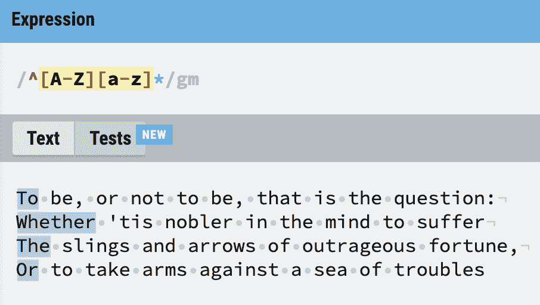
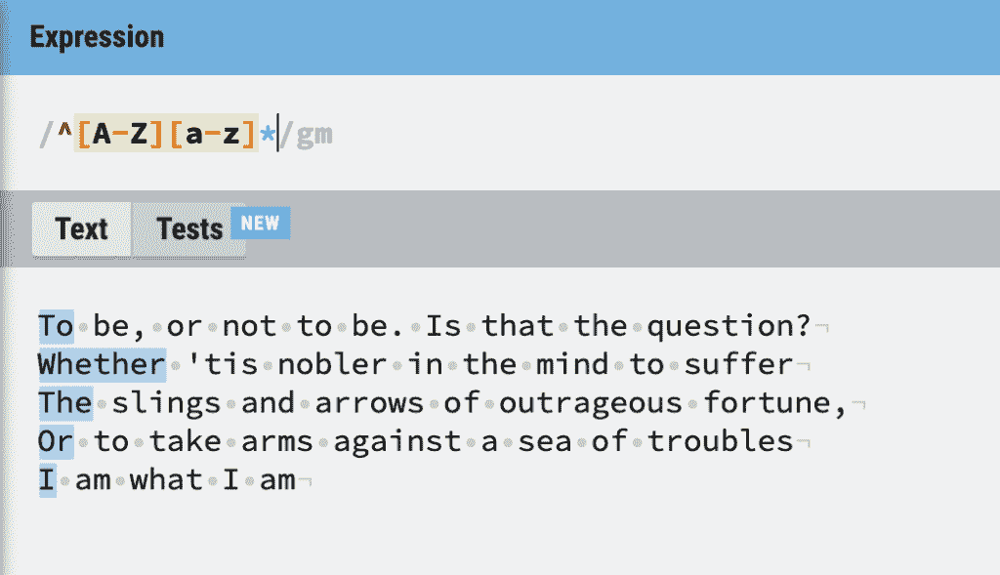
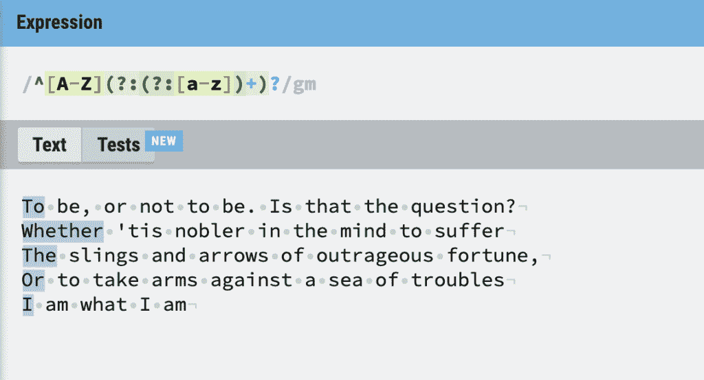

# Magic-RegExp:正则表达式的 JavaScript 包

> 原文：<https://thenewstack.io/magic-regexp-a-javascript-package-for-regular-expressions/>

尽管我很喜欢正则表达式，但它们的长寿部分是因为它们是从主流语言中独立发展出来的。正则表达式是一种使用模式匹配的方法，正则表达式语言使用标准键盘符号作为特殊的“元”字符。这让它乍一看很奇怪。

构建一个正则表达式可能有点麻烦——我看到有人建议很多开发人员使用 Copilot 来帮助他们。现在，我不把 JavaScript 作为我的日常语言，但是由于我已经谈论了 regex 很多次，所以看一下 [magic-regexp](https://regexp.dev/) 似乎是很自然的，这是一个 JavaScript 包，它使用了一种更加英语友好的表示。

现在，我们差不多可以猜到使用包来表示正则表达式的原因了:

*   如果用方法和代码替换模式，它将是类型安全的。JavaScript 已经有了正则表达式的概念。
*   预编译方法应该比实时解释更有效。
*   理论上看，会更容易读懂。
*   正则表达式模式在末尾包含元规则来指导行为，这是不实用的。

所以它可以为你的箭袋提供一个有价值的新箭。

似乎有十亿种方法可以开始一个 JavaScript 项目，但是我将保持它的简单性。在命令行上做了各种各样的升级程序，使我的本地环境得到了模糊的更新之后:

```
>  Now using node v16.13.0  (npm v8.1.0)

```

然后

```
>  touch testmagicregex.js  
>  npm install magic-regexp  
>  npm init  -y

```

让我们回到[上一篇关于 regex](https://thenewstack.io/regular-expressions-and-solving-the-food-taster-dilemma/) 的文章，看看一个简单地捕捉到一个句子的第一个单词的表达式，以及它在一些莎士比亚文本样本上的操作:



现在，为了确保上面的测试捕获单个字母的单词，并且我们不捕获中间行的句子，我将故意破坏莎士比亚([再一次](https://thenewstack.io/beware-chatgpt-a-language-model-in-the-shape-of-shakespeare/))并添加 Gaynor 女士的一行，从而扩展测试文本:



就像《黑客帝国》中的那个人一样，我很乐意直接阅读正则表达式模式，但是如果我真的想转录上面的模式呢？

那么我该如何在电话中描述它的操作呢？

> “从开头开始，寻找一个大写字母，然后是任何数量的小写字母。将它应用于整个多行文本。”

查看 Magic-regexp [用法](https://regexp.dev/getting-started/usage):

“从头开始”= at.linestart()

“寻找大写字母”= letter .大写

"任意数量的小写字母" = oneOrMore(letter.lowercase)。随意地

“直到一个空格”=。和空白

所以实际上我们需要“*”来表示零或更多，但是我们可以使用**一个或多个**，然后可选地添加**。**

 **下面是代码为
的 **testmagicregex.js** 文件

```
import  {
  createRegExp,
  letter,
  oneOrMore
}  from  "magic-regexp";
const regExp  =  createRegExp(
  letter.uppercase
    .at.lineStart()
    .and(oneOrMore(letter.lowercase).optionally()),
  ["g",  "m"]
);
console.log(regExp);

```

这将在命令行中返回一个正则表达式:

```
TheNewStack&gt;  node testmagicregex.js
/^[A-Z](?:(?:[a-z])+)?/gm

```

这很有效:



但是额外的好处是什么呢？问号冒号对"？:”用于将括号内的部分标记为*非捕获组*。这只是意味着圆括号是用来分组的，就像你通常想把一个函数应用到里面的所有东西一样。恰好正则表达式中括号的默认用法是标记一个*捕获组。*

令我吃惊的是，Magic-regexp 包只实现了部分目标。你还是要用正则表达式来思考。(我想起了 1982 年克林特·伊斯特伍德(Clint Eastwood)的电影《火狐》(Firefox)，在这部电影中，我们的主人公必须从苏联人那里偷一架飞机，但要驾驶它，他必须用俄语思考。)

我们的莎士比亚例子很好，但是在实际的 JavaScript 项目中不太可能有用。更实际的例子是检查有效的电子邮件地址。

同样，我们如何通过电话定义一个有效的电子邮件方案？

> “它以名称开头，名称中可以有点、破折号或下划线，只要名称以单词字符开头和结尾。然后必须有一个 at 字符(@)，后跟由冒号分隔的两串字母。现在别再给我打电话了！”

现在我们都知道有专门的软件包来做这件事，我们不想自己动手制作。但是快速一点不会有坏处。

因此，从对话中，我们至少需要:

*   oneOrMore(wordChar)
*   和(anyOf(" . ", "_", "-"))
*   和(oneOrMore(wordChar))
*   完全正确(“@”)
*   和(oneOrMore(wordChar))
*   和(确切地说(“.”))
*   和(oneOrMore(wordChar))

这一次，我使用 **assert** 添加了一些有效性测试，并不是所有的测试都通过了上面的代码，但是我们做了一些工作:

```
import assert from  'node:assert';

import  {
  createRegExp,
  exactly,
  wordChar,
  oneOrMore,
  anyOf,
}  from  "magic-regexp";

const regExp  =  createRegExp(
  oneOrMore(wordChar).at.lineStart()
  .and(anyOf('.',  '_','-').optionally())
  .and(oneOrMore(wordChar))
  .and(exactly('@'))
  .and(oneOrMore(wordChar))
  .and(exactly('-').optionally())
  .and(oneOrMore(wordChar))
  .and(exactly('.'))
  .and(oneOrMore(wordChar).times.atLeast(2)),
  ["i"]
);
console.log(regExp);

assert.equal(regExp.test('abc-@mail.com'),  false);
assert.equal(regExp.test('abc..def@mail.com'),  false);
assert.equal(regExp.test('.abc@mail.com'),  false);
assert.equal(regExp.test('abc#def@mail.com'),  false);

assert.equal(regExp.test('abc-d@mail.com'),  true);
assert.equal(regExp.test('abc.def@mail.com'),  true);
assert.equal(regExp.test('abc@mail.com'),  true);
assert.equal(regExp.test('abc_def@mail.com '),  true);

assert.equal(regExp.test('abc.def@mail.c'),  false);
assert.equal(regExp.test('abc.def@mail#archive.com '),  false);
assert.equal(regExp.test('abc.def@mail'),  false);
assert.equal(regExp.test('abc.def@mail..com'),  false);

assert.equal(regExp.test('abc.def@mail.cc'),  true);
assert.equal(regExp.test('abc.def@mail-archive.com'),  true);
assert.equal(regExp.test('abc.def@mail.org'),  true);

```

所以一个专业开发人员最后关心的是:哪个更容易维护？一个简单的正则表达式模式，或者上面有代表性的方法？正如我所说的，我觉得这有点太接近“现在你有两个问题”的迷因，这已经被扔在 regex 您现在必须处理另一个包的突发奇想以及 regex 的突发奇想。

然而，只要稍加发展，这可能是避免盯着矩阵看的可靠方法。

<svg xmlns:xlink="http://www.w3.org/1999/xlink" viewBox="0 0 68 31" version="1.1"><title>Group</title> <desc>Created with Sketch.</desc></svg>**