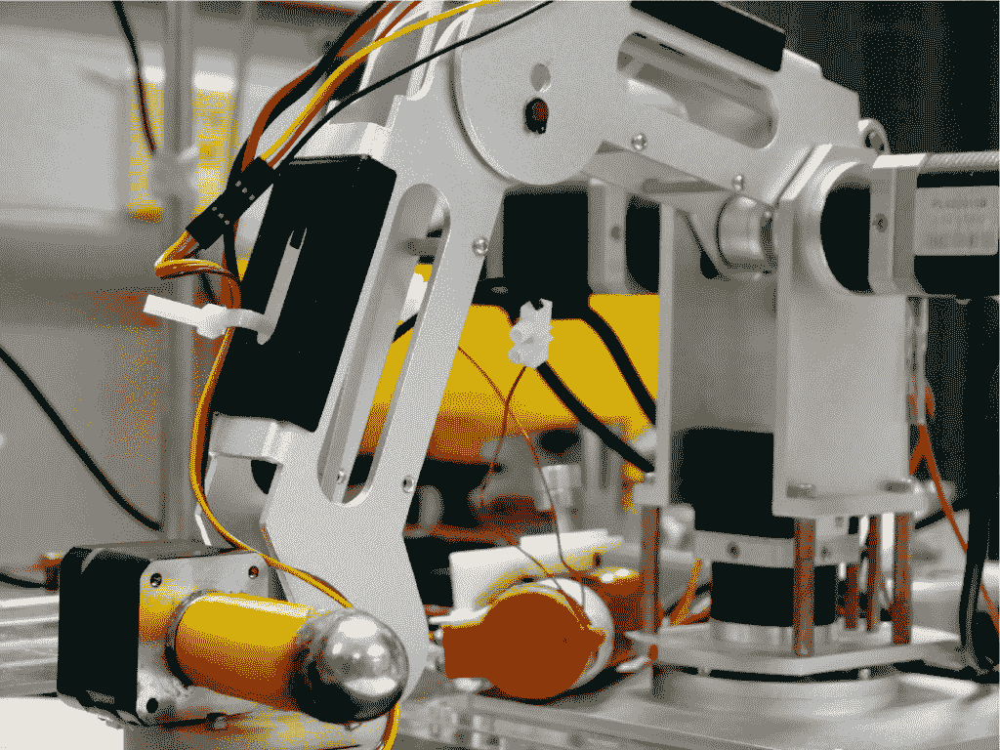

# “磁性粘液机器人”可能滑入难以到达的地方

> 原文：<https://thenewstack.io/magnetic-slime-robot-could-slip-into-hard-to-reach-places/>

上个月底，香港科学家发表了一篇关于“磁性粘液机器人”的论文，在生物医学、电子和其他领域有潜在的应用，这在互联网上引起了小小的轰动。

受商业粘液产品的启发，这种粘性材料含有磁性颗粒，可以通过外部磁铁控制。它可以很容易地滑过狭窄(1.5 毫米)的通道(例如，在体内)，在空气和液体环境中保持形状，封装甚至“抓取”物体，在被切断后自我愈合并导电(见下面的视频)。

[https://www.youtube.com/embed/uxYJiXhT7Rc?feature=oembed](https://www.youtube.com/embed/uxYJiXhT7Rc?feature=oembed)

视频

然而，许多网上评论转向科幻电影，如《T4》毒液、《终结者》系列电影以及或许最具娱乐性的 1968 年外太空恐怖电影 *[、绿色黏液](https://www.youtube.com/watch?v=urtZ2zV8NLE)* 中的变形杀手。

“我可以看到它成为超级武器的潜力。想象一个巨大的粘液怪物，它不会受到物理伤害，”一位评论者在 YouTube 上说。

## **“有趣”的评论在现实中几乎没有依据**

当被问及将他参与创造的黏液武器化的可能性时，[香港中文大学微机器人和纳米机器人专家张丽](https://aims.cuhk.edu.hk/converis/portal/detail/Person/5966559?lang=en_GB)教授给出了肯定的回答。首先，他确保告诉新的堆栈，他发现网上的评论“有趣”，甚至“鼓舞人心”

然后他指出磁力随着距离的增加衰减得非常快。“如果你想把它武器化，你必须考虑远距离的磁力驱动。但是磁铁只在很小的距离上有很强的相互作用。”

在人体中，磁驱动是可能的，例如，使用机械臂(见照片)。但是，除非你能创造一个巨大的傀儡主臂直接悬停在头顶上，否则一个斑点接近你附近城市的可能性微乎其微。

用于操纵磁性粘液的机械臂。

这让我们想到了另一个在线非专业人士经常提出的常见问题。因为张和他的合著者称之为磁性粘液机器人，它不能移动，更不用说自己“思考”(也不像 R2-D2)，它怎么会是机器人呢？

## **任何其他名称的机器人**

“一百个研究人员可能有一百种不同的定义”机器人是什么，张说。根据他自己的定义，机器人应该能够与环境互动，感知环境并具有某种智能——它应该“知道如何表现”

目前，磁性粘液需要人类干预才能移动并识别其环境，因为它没有“眼睛”然而，张说，通过使用机械臂和照相机，这两种特性很容易结合起来。然而，他承认，将智能植入粘液可能需要“努力”。

不过，他说，重要的不是名称，而是粘液的潜力:造福病人。

## **狭小、难以到达的区域**

这种磁性粘液有可能通过封装物体来保护吞咽了电池或尖锐物体的人——儿童或成人。虽然在这种情况下可以在胃中使用内窥镜，但是例如，该器械太笨重而不能进入弯曲的小肠。这就是一点点粘液有用的地方。

张和他的同事们目前正在进行一项试验，将粘液作为一种机器人手，在胃肠道内进行外科手术。它还可以用于电气设备，修复难以焊接的难以触及位置的断路。

它甚至可以用于修复外层空间的电路，在那里部署一个人可能是困难和危险的。

“太空中的磁力仍然存在，所以我们仍然可以驱动机器人，”张说。但是仍然需要做大量的研究。“我们必须确保(粘液的)材料属性在外太空不会改变，”他说。

<svg xmlns:xlink="http://www.w3.org/1999/xlink" viewBox="0 0 68 31" version="1.1"><title>Group</title> <desc>Created with Sketch.</desc></svg>