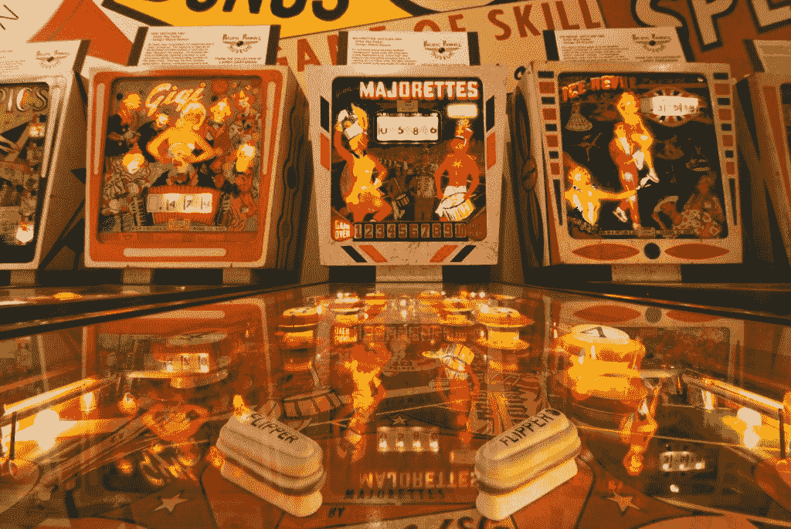
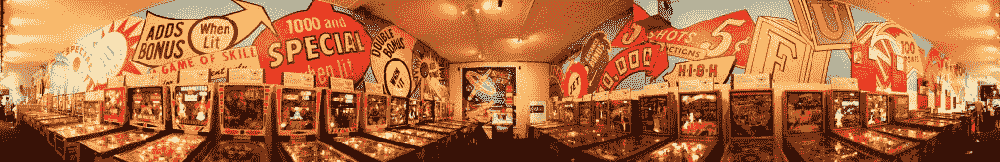
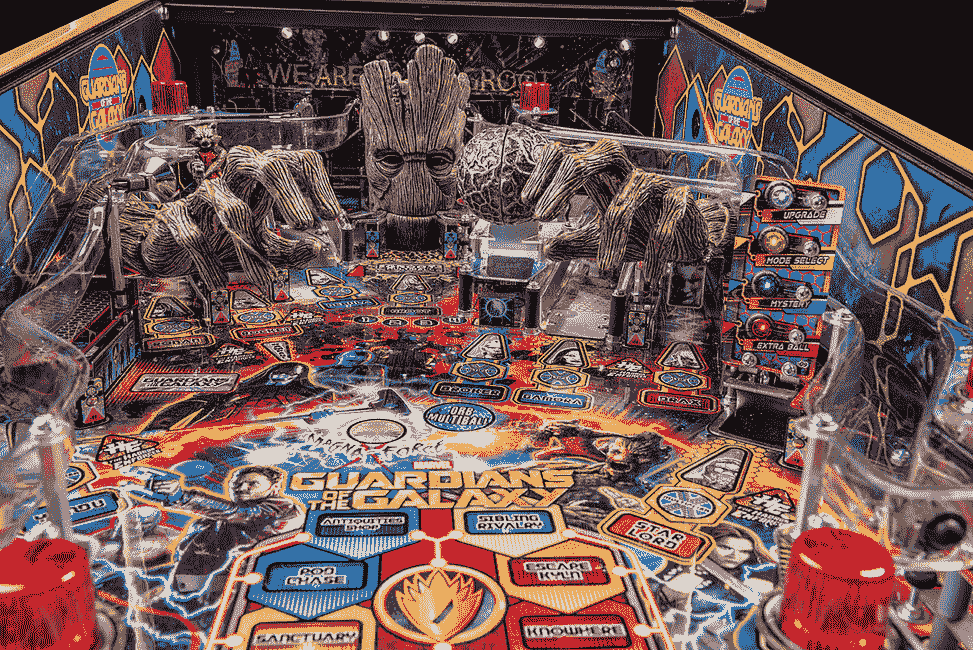

# 维护遗产:谁将修理我们的弹球机？

> 原文：<https://thenewstack.io/maintaining-legacy-will-repair-pinball-machines/>

维护一个遗留技术是困难的——但是它通常从相同的方法开始:决心、承诺和一些喜欢修理东西的专注的人。

最好的例子之一可能是那些默默无闻的维修技术人员，他们让世界上的弹球机保持活力。

"你认为让修理工来修理你洗衣机上的旋钮很痛苦吗？"[2010 年《华尔街日报》撰文](https://www.wsj.com/articles/SB10001424052748703882304575465613526210330)。"试着找一个人来替换你弹球机上的鳍状部件."

克莱·哈勒尔是《弹球修理技巧》杂志的撰稿人，他告诉他们“没有人会卖一台可以正常工作的弹球机。如果有用，他们不会卖的。如果你买了一个，它总是坏的。”据一位接受《华尔街日报》采访的弹球技术人员说，更大的问题是维护。“我总是听到人们说，‘我买了一台机器，却找不到一个修理工。’“当时，一份弹球修理技师名录列出了所有 50 个州的 750 名技师，每小时收费高达 150 美元。

那是八年前的事了…

我们现在在哪里？本周，科技网站 Motherboard 采访了两名男子，他们诗意地称之为“[最后的弹球医生](https://video.vice.com/en_us/video/motherboard-pinball-doctors-the-last-arcade-technicians-in-nyc/591cb310fa4cebe203f20f5a?ref=motherboard)”在一个新的在线视频系列中，他们采访了酒吧老板乔恩·埃利希，他在布鲁克林的[杰克酒吧](https://www.facebook.com/jackbar/)修理自己的弹球机。埃利希坚持认为“弹球机每天都会出故障。”所以，除了自己修理，埃利希还有自己的仓库，里面有价值数千美元的替换零件。他说，有备用的螺丝、脚蹼带、灯泡和保险丝——但这些都成了必需品，因为在整个三州地区，他能想到的维修人员总共有三个。

迈克·胡克就是其中之一，他说问题的一部分是弹球机实际上只能使用五年。"它们是用来从人们的口袋里吸出 25 美分硬币，然后扔掉的."人们希望看到新的机器，“所以他们没有让它们持续下去。令人惊讶的是他们能坚持这么久。"

## 在天启中幸存

据我在加州采访的一位弹球技术人员说，视频游戏的出现几乎“颠覆”了整个弹球产业。“弹球机很贵，它们占据了很大的空间，而且当它们坏掉时，修理起来也有点复杂。”此外，视频游戏有更多的新鲜感。

因此，到 2010 年，该杂志正在调查还剩下什么。“从尼亚加拉大瀑布到卡拉马祖，成千上万的二手物品在互联网上和弹球秀上被拍卖。买家大多是中年男性，他们把球运回家，希望重温玩银球的青春奇迹。

据我在加州采访的维修技术人员说，这种情况仍在发生。自称为“弹球海盗”的克里斯多佛·昆茨说:“很多这样的游戏直接进入了人们的家庭。”8 月份，他甚至接到了弹球制造商 Stern 的电话，问他是否想成为一名经销商。

“我知道很多人在家都有 10 场比赛，”凯尔·斯皮特里说，这位 28 岁的弹球爱好者已经成为昆茨的助手。“我家里有四个。很多人都有这些家庭收藏。这就是弹球的结局。”

## 还活着

今天，就在硅谷旁边，加州阿拉米达市有自己的弹球博物馆，这是一个 501c 非营利机构。[太平洋弹球博物馆](https://www.pacificpinball.org/)致力于保存和推广美国文化的这一独特部分为了让它继续运行，每周它都会关闭一天，让一组志愿者施展他们的魔法。

照片由迈克尔·摩尔为太平洋弹球博物馆拍摄

“每周一，我们都来，我们修理游戏，”吃比萨饼，昆茨说，他已经专业修理弹球机 30 年了。

昆茨也认为弹球运动“正在复苏”。但弹球修复技术人员的渠道一直在收缩。”大多数修理工为运营商工作，运营商购买机器，把它们放在 7-11 或比萨饼店，并希望人们放在 25 美分的硬币里。所以你很有经验。现在有更少的商场和更少的经营者，他说。他们会从哪里来？基本上，他们必须边走边学。"

当我问昆茨现在有多少技术人员时，他提出了一个很好的观点:“你如何计算他们？谁是技术人员，谁不是？”如今，一些技术人员甚至通过口口相传来获得客户。“没有正式训练什么的。有了承包商，你必须通过笔试…有了弹球，任何人都可以说‘我能修好它们。’"

照片由迈克尔·摩尔为太平洋弹球博物馆拍摄。

昆茨说这就像修理其他任何东西一样。“你把手册拿出来，先读一读，然后你就可以解决问题了。这和汽车没什么区别。它有很多输入和输出。”但即使这样，也有问题，因为昆茨说，你不能总是相信制造商为他们的弹球机创建的示意图。“工厂拥有的东西总是在事实发生之前就写好的……他们在创建系统之前就写好了文件。”但幸运的是，现在有了一个巨大的额外资源——在线信息。

昆茨有他的助手斯皮特里。“我简直惊呆了，”斯皮特里谈到与弹球海盗的相遇。“这家伙是我见过的最聪明的人。我刚开始跟踪他。我每周都会去他的店里和他一起工作一到两次……克里斯在弹球修复上投入的时间和我活着的时候一样多。凯尔在博物馆做志愿者——“我从观察和志愿者工作中学习”——最终学到了足够的知识去做昆茨的助手。

斯皮特里形容弹球是“我永远热爱的东西。当我还是个孩子的时候，我住的地方附近有一个保龄球馆，我和我的朋友们总是骑着自行车去那里……弹球真的很神奇。”

漫威银河护卫队弹球机。照片来自斯特恩。

那么斯皮特里是否担心弹球维修技师的未来？“我感觉总有一天会有人不知道如何*修理*部件。但是我们可以用 T2 取代 T3。”他指出，现在有公司重新制造你需要的替换零件——即使是 70 岁的机器。“他们制造新的投掷目标，他们为比赛场地制造新的旋转器和插入物…这是一个非常小众的行业，但仍然有人在制造这些东西”

而这仅仅是开始。“现在可以对运动场进行超高清扫描，在 Photoshop 中润色艺术作品，然后通过正确的方法重现整个运动场。”

这是一个利用新技术保护旧技术的惊人例子。

一些人把它带到了一个新的水平，通过创造他们自己的“自制”机器，用新的现代主题重新利用旧的坏掉的游戏。例如，有人拿了一台 1979 年的“闪光”弹球机，为后玻璃和操场创造了新的艺术作品，并将其改造成网飞系列“陌生人事物”的弹球机

也许这里有一个适用于*每一项*技术的教训:它可以继续生存——只要还有人想要它。

或者，正如斯皮特里所说，“只要爱还在，它就会继续。”

* * *

## WebReduce

<svg xmlns:xlink="http://www.w3.org/1999/xlink" viewBox="0 0 68 31" version="1.1"><title>Group</title> <desc>Created with Sketch.</desc></svg>