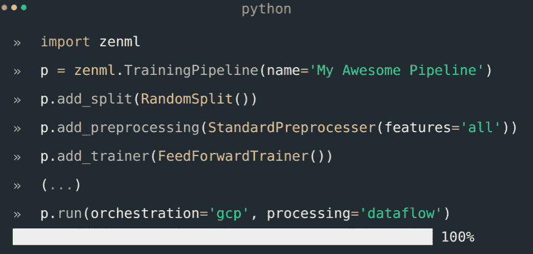

# Maiot:通向 ML 生产的桥梁

> 原文：<https://thenewstack.io/maiot-bridging-the-path-to-ml-production/>

哈姆扎·塔希尔(Hamza Tahir)认为，机器学习和人工智能生态系统在神经网络、自然语言处理和其他领域产生惊人能力的突破性研究和公司将这项研究实际应用于生产的能力之间产生了分歧。

他说，对于像 [OpenAI](https://openai.com/) 或 [GPT3](https://www.technologyreview.com/2020/07/20/1005454/openai-machine-learning-language-generator-gpt-3-nlp/) 这样的项目，尽管那里有如此大的潜力，但生产需求只在谷歌或其他主要科技公司的范围内，而有大量的机器学习操作(MLOps)问题有待解决。这就是他的公司慕尼黑 Maiot 的用武之地。

他说，创建模型背后的算法需要对机器学习有严格的数学理解，而部署和运行这些模型需要工程知识。这种技能的交叉非常罕见。

“我担心教授这些东西的课程有点中庸。他们学过数学，也学过工程学，但他们都不太懂。他们进入工业或研究领域，他们面临巨大的冲击或对如何做理解上的巨大差距，”他说。

“因此，我们在 Maiot 的最大动机是试图让工具成为这些人实际进入工程方向的拐杖，在我们的情况下，就像框架本身可以在某种程度上具有教育意义，但也像是进入这个运营世界的门户，以一种对他们来说更容易消费和消化的方式。”

## 开源 ZenML 框架

[塔希尔](https://www.linkedin.com/in/hamzatahirofficial/?originalSubdomain=de)，现任该公司人工智能首席技术官，在慕尼黑工业大学的一个创业项目中，遇见了联合创始人[亚当·普罗布斯特](https://www.linkedin.com/in/adam-probst/)。最初，他们将工作重点放在交通运输的预测性维护上，首先关注卡车，然后监控 100 辆公共汽车的维护需求。

“我们实际上分析了很多数据，这是一件非常酷的事情。但那确实是我们第一次遇到 MLOps 问题的地方。…我们第一次意识到在概念验证或研究中做某事与在生产中做完全不同。正如你所想象的，使模型可扩展、可用、可复制……”他说，并补充说，在 DevOps 中，有代码和数据标准可遵循，以确保应用程序在生产中是可复制的和健壮的。他说，在这样一个快速增长但仍有些年轻的领域，这些标准仍在 MLOps 中开发。

作为回应，创建了基于 Python 的 [ZenML](https://github.com/maiot-io/zenml) ，一个用于创建机器学习管道的可扩展开源工具。

它旨在解决诸如版本数据、代码、配置和模型等问题；跨环境复制实验；在培训和部署之间建立一个可靠的链接，并跟踪产生的元数据和工件。

用户将单个任务分解成多个步骤，这些步骤一起按顺序创建一个管道。每个管道都包含一个数据源，该数据源随着表示某个时间点的版本化数据集的快照而增长。

同时，定义每个步骤在哪里运行以及如何运行。后端有三种类型:管弦乐队；处理定义所需环境的后端；和培训，仅用于培训管道。

通过在管道中开发，ML 从业者从一开始就给自己一个从研究过渡到生产的平台，并在研究阶段得到 ZenML 引入的强大自动化的帮助。

该公司坚持认为，通过将后端与管道逻辑分离，ZenML 为其所有管道实现了类似 Terraform 的可伸缩性、可扩展性和可再现性。

【T2

## 关注数据科学家

作为一个自以为是的 MLOps 工具，像任何其他框架如 [Ruby on Rails](https://rubyonrails.org/) 或 [Gatsby](https://www.gatsbyjs.com/) 一样，用户从他们解决的一些问题中受益 Tahir 称之为“包含电池的东西”——而不是试图将 ML 管道构建为 Jupyter 笔记本、脚本或开发机器。

Bootstrapped Maiot 与“同类最佳”产品集成，如 [Seldon Core](https://github.com/SeldonIO/seldon-core) 或 [Tecton](https://www.tecton.ai/) ，同时与 Databricks’[ml flow](https://mlflow.org/)、 [Kubeflow](https://www.kubeflow.org/) 和 [Valohai](https://valohai.com/) 等竞争。

其核心引擎可自动执行任务，如跟踪预处理以及模型训练的输入参数、管道可比性和管道步骤缓存，并提供从分布式预处理到训练和服务、版本控制、云集成和可扩展性的原生模块化后端。

“但我认为我们在这里带来的特别之处是我们从数据科学家的角度构建的界面。我们在 MLOps 领域的旅程中注意到的一件事是，尽管有其他 MLOps 工具，但有些是为 ML 人员构建的 ML 工具，有些是为 Ops 人员构建的 Ops 工具。但是没有真正为 ML 人员建立的操作工具。这就是我们想要达到的最佳状态，”他说。

例如，数据科学家可能拥有物理学博士学位，但没有丰富的编码经验。

“他们更像是习惯于编写脚本的人，而我们习惯于做木星的事情……但这不是他们的错。数据科学就是这么教的。这就是他们的背景和技能，”他说。“他们没有真正做好准备来处理 Kubernetes 集群、Docker 或部署，或者加速流量和 A/B 测试。因此，当这两者之间出现脱节时，工具必须填补这一空白，因为你不能只组成两个团队，然后说，“好吧，数据科学的人制作模型，然后把它交给生产人员，运营人员，他们对机器学习一无所知，他们只是部署模型。”那是永远不会成功的。…所以最终，它们必须融合在一起，”他说，并将其等同于 DevOps 的进化。

“因为你最了解你的模型，对吗？因此，我们正在尝试这样做，我们正在尝试跨强大的 ops 工具建立这些更高级别的抽象，以便普通的数据科学家可以使用这个框架，并集成到强大的机器学习和 ops 工具中，但不会有做他们根本不舒服的事情的感觉。那是我们的最佳位置。这也是我们看到社区最感兴趣的地方，”他说。

<svg xmlns:xlink="http://www.w3.org/1999/xlink" viewBox="0 0 68 31" version="1.1"><title>Group</title> <desc>Created with Sketch.</desc></svg>