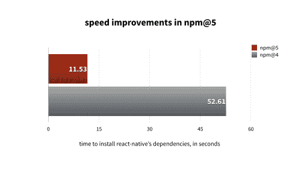
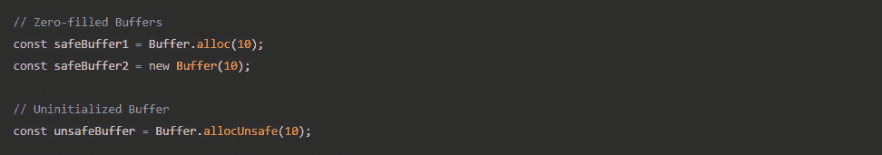

# Node.js 和 Npm 的重大更新带来了巨大的性能优势

> 原文：<https://thenewstack.io/major-node-js-npm-updates-bring-big-performance-wins/>

JavaScript 开发者在 5 月的最后一天得到了一份夏季礼物:一个双重版本的 [Node.js 8.0.0](https://nodejs.org/en/blog/release/v8.0.0/) 和 [npm 5.0.0](https://github.com/npm/npm/releases) 。这两个项目结合在一起，对双方都产生了一些重大的性能增强。

对于 Node.js 8.0.0，速度的大幅提升来自于包含了[谷歌的 V8](https://developers.google.com/v8/) JavaScript 引擎、[版本 5.8](https://v8project.blogspot.com/2017/03/v8-release-58.html) 。更新的引擎于 3 月份发布，包括性能增强、任意堆大小和与最终计划的 6.0 版本兼容的 [API 变化](https://docs.google.com/document/d/1g8JFi8T_oAE_7uAri7Njtig7fKaPDfotU6huOa1alds/edit)。

计划是将 Node.js 8 分支迁移到 V8 5.9 和 6.0 中，最终，当这些版本发布并被认为稳定时。这包括计划在 V8 5.9 中过渡到[涡扇+点火](https://v8project.blogspot.com/2017/05/launching-ignition-and-turbofan.html)编译器管道，届时新管道将最终默认开启。这意味着一些最大的性能提升可能还在进行中。

这将忽略 npm 5 中现有的优势，然而，它本身在此版本中增加了主要的性能增益。npm 公司的首席执行官和 NPM(节点包管理器)的创建者艾萨克·施鲁特说，大多数用户将立即看到 20%的性能提升。

“安装 React 要快五倍，”Schlueter 说。"更大的封装提供更多的性能优势."

“npm 5 最大的变化之一是新的缓存层，”Schlueter 说。“该团队淘汰了自 npm 版本 1 之前就已存在的缓存系统，并将其替换为可抵御损坏的内容可寻址缓存。它内置于缓存层的数据层中。如果文件损坏，在安装时，它会将损坏的数据视为缓存未命中，并从注册表中获取新的数据。”

## 等等，npm 离线？

这有一个额外的好处，即允许离线使用 npm。例如，在这种情况下，打包系统将无法访问存储库来获取依赖项，但是它可以安装一个本地缓存的副本。

Schlueter 说，许多性能提升来自于 npm 缓存层的改进。

在其他地方，npm 现在默认安装 Package-Lock.json 文件。这用于提供对依赖性的优选版本的参考。将这个文件包含在您的版本控制中可以确保您的开发人员在他们的堆栈中使用相同的版本。对于分发，这采用了提供基本相同信息的[包膜](https://github.com/npm/npm/pull/16441)文件的形式。

【T2

“在某种程度上，这就像开发时间包膜文件。他们对文件结构、包膜对象的格式进行了全新的审视，并使其更加通用。现在，默认情况下会保存依赖关系。自从 save 推出以来，人们就一直希望如此，”Schlueter 说。

“人们绝对应该考虑一些有趣创新的最大变化是人们如何处理 package-lock.json 文件。我们建议将该文件签入源代码，这样所有开发人员都有相同的最新和最大的锁文件，并且可以在一致的状态下工作，”Schlueter 说。

## 基于浏览器的节点故障排除

但这一系列更新中最大的变化无疑是 Node.js 8.0.0。其中许多变化已经进行了一段时间，比如引入 Inspector 协议作为调试 Node.js 应用程序的默认路径。现在，节点开发人员将使用相同的工具在浏览器和 Node.js 实例中对应用程序进行故障排除:Inspector 是一种新协议，用于取代现有的 V8 调试器。这是在节点 6.0.0 中引入的，但在版本 8 中被提升为默认值。

Node.js 8 的发布经理詹姆斯·斯内尔(James Snell)和使用 [nearForm](http://www.nearform.com/) 的开源架构师说，节点模块开发者现在可以开始尝试第 8 版中包含的一个新的实验代码:原生 API。

“在拥有 N-API 之前，这些本机模块是专门为 V8 APIss 编写的，而 V8 API 往往变化相当频繁。当时的情况是，每次我们将 Node 升级到新的主要版本时，任何使用本机插件的人都必须重新编译。开发人员必须仔细检查，确保一切都正常，并在新版本中测试一切。消费者将不得不重新安装所有这些本机模块，并再次经历一个构建过程。Snell 说:“使用 N-API，我们的想法是尽可能消除这些问题。

"当您安装 N-API 本机附加组件时，您可以更新 Node.js 版本，而无需重新构建。我们还没有达到 100%的目标，但我们昨天发布的内容是达到目标的第一个重要里程碑。

微软高级项目经理阿鲁内什·钱德拉负责 N-API 项目。“我们想呼吁的一件事是，今天的原生插件开发人员应该来检查和使用它，并提供反馈。这是一个实验性的项目，我们希望更广泛的社区参与来发展和改进这些 API。

他补充说，微软将很快推出一个更新的 Node.js 包，其中包括[的 Chakra-Core JavaScript 引擎](https://github.com/Microsoft/ChakraCore)，而不是谷歌的 V8。Snell 表示，Chakra-Core 引擎更适合受限环境中的应用，如物联网设备。

在这个版本的其他地方，有更新的 async_hooks 模块，以前称为 async_wrap。Snell 说这是“更适合为 Node 开发诊断软件的开发人员。API 的作用是让你稍微拉开帷幕，窥视节点事件列表中发生的事情。我们有资源句柄和那些句柄上的请求；这就是 Node 如何通过所有这些异步操作来维护它的视图。Async_hooks 允许您在创建请求时进入生命周期并安装钩子(用户代码)。它可以在某些生命周期事件发生时触发。这个想法是，有人能够创建一些诊断软件，用于调试节点中发生的一些异步操作。”

然后是缓冲区的[变化](https://nodejs.org/en/blog/release/v8.0.0/)。以前，创建新的缓冲区给了开发人员他们想要的内存块，但没有初始化该内存，导致应用程序可能会暴露敏感信息或损坏他们的数据。

“缓冲区的变化已经来了很长时间，”斯内尔说。“回到 6.0 时间框架，我们对 buffer 进行了许多添加，使其使用起来更加安全。我们在 6 中完成了，并添加了一些创建缓冲区的新方法，使它更加可靠。这一次，我们做了下一步。现在，当您使用旧方法分配缓冲区并传入 10 或 20 个字节时，它会自动执行零填充并初始化该缓冲区。”

在旧方法中，这种安全性的代价是缓冲区的初始化较慢。使用新方法消除了这些速度下降。

Snell 说，虽然 Node.js 8.0.0 中有许多其他的变化，但对承诺的支持可能会得到改善，从而给社区带来很多它一直在要求的东西。

“Node 用户已经要求 Node 本身包含跨越所有 Node 核心 API 的承诺 API 支持很长时间了。现在，如果您查看文件系统模块来打开一个文件，Node 有一种非常特殊的处理异步操作的方式，称为回调模式。这是 ECMAScript 6 承诺的完全不同的做事方式。许多用户更喜欢承诺的方式，并希望节点切换到这种方式。完全切换会太麻烦，所以我们做了一个折中的方法:util.promisify 接受 Node 中的任何回调样式 API，并将其转换为一个函数，该函数将返回一个承诺并使用承诺模型。在幕后，它仍然在使用 Node 的回调模式。它只是被包装在一个支持承诺的 API 中。

通过 Pixabay 的特征图像。

<svg xmlns:xlink="http://www.w3.org/1999/xlink" viewBox="0 0 68 31" version="1.1"><title>Group</title> <desc>Created with Sketch.</desc></svg>